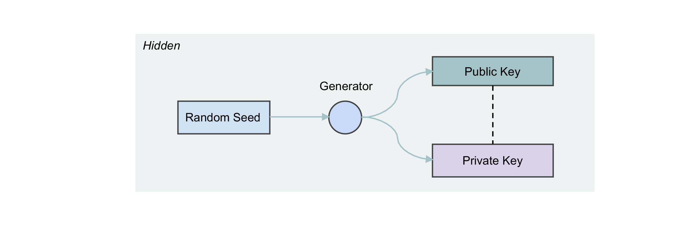
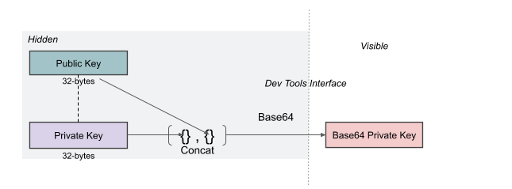
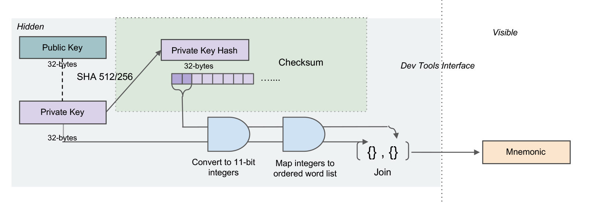
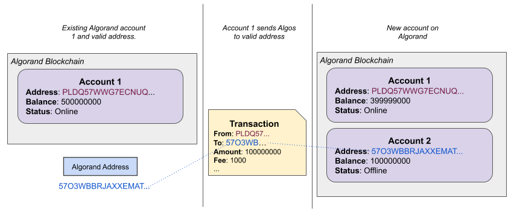

title: Creating Accounts

This section is an overview of **Accounts** on Algorand, beginning with core terminology and a guide on how to interpret these terms in different contexts. It then elaborates on the different methods for creating accounts on Algorand using the available developer tools, including the SDKs, `goal`, kmd, and `algokey`.


# Terminology
## Keys and Addresses

Algorand keys use Ed25519 high-speed, high security elliptic-curve signatures. They are produced through standard, open-source cryptographic libraries packaged with each of the SDKs. The creation algorithm takes a random value as input and outputs two 32-byte arrays, representing a public key and its associated private key. These are also referred to as a public/private key pair. These keys perform the important cryptographic functions like signing data and verifying signatures. 

<center>  </center>
<center>*Public/Private Key Generation* </center>

For reasons that include the need to make the keys human-readable and robust to human error when transferred, both the public and private keys undergo transformations. The output of these transformations is what the majority of developers, and usually all end-users, see. In fact, the Algorand developer tools actively seek to mask the complexity involved in these transformations. So unless you are a protocol-level developer modifying cryptographic-related source code, you may never actually encounter the true public/private key pair. 


### Transformation: Public Key to Algorand Address

The **public key** is transformed into a public Algorand address<LINK TO GLOSSARY>, by adding a 4-byte checksum to the end of the public key and then encoding it in base32. The result is what both the developer and end user recognize as an **Algorand address**. The address is 58 characters long.

<center>  </center>
<center>*Public Key to Algorand Address* </center>

!!! info
	Since users almost never see the true public key, and the Algorand address is a unique mapping back to the public key, the use of the term **public key** is frequently (and inaccurately) used to mean **address**. 

### Transformation: Private Key to base64 private key

A base64 encoded concatenation of the private and public keys is a representation of the private key most commonly used by developers interfacing with the SDKs. It is likely not a representation familiar to end users.

<center>  </center>
<center>*Base64 Private Key* </center>

### Transformation: Private Key to 25-word mnemonic

The 25-word mnemonic is the most user-friendly representation of the private key. It is generated by converting the private key bytes into 11-bit integers and then mapping those integers to the [bip-0039 English word list](https://raw.githubusercontent.com/bitcoin/bips/master/bip-0039/english.txt), where integer _n_ maps to the word in the _nth_ position in the list. By itself, this creates a 24-word mnemonic. A checksum is added by taking the first two bytes of the hash of the private key and converting them to 11-bit integers and then to their corresponding word in the word list. This word is added to the end of the 24 words to create a 25-word mnemonic.

This representation is called the private key **mnemonic**. You may also see it referred to as a **passphrase**. 

<center>  </center>
<center>*Private Key Mnemonic* </center>

!!! info
	Both the base64 representation of a private key, and the private key mnemonic are considered **private keys**. It is important to disambiguate in contexts where the representation is important. 

## Wallets

Wallets, in the context of Algorand developer tools, refer to wallets generated and managed by the Key Management Daemon (kmd) process. A wallet stores a collection of keys. kmd stores collections of wallets and allows users to perform operations using the keys stored within these wallets. Wallets are associated with a master key, represented as a 25-word mnemonic, from which all accounts in that wallet are derived. This allows the owner of the wallet to only need to remember a single passphrase for all of their accounts. Wallets are stored encrypted on disk. 

See [Wallet-derived (kmd)](#wallet-derived-kmd) accounts in the [Creation Methods](#creation-methods) section for more details.

## Accounts
Accounts are entities on the Algorand blockchain associated with specific onchain data, like a balance. An Algorand Address is the identifier for an Algorand account. 

After generating a private key and corresponding address, sending Algos to the address on Algorand will initialize its state on the Algorand blockchain and turn it into a true account. 

<center>  </center>
<center>*Initializing an Account* </center>

### Attributes
#### Minimum Balance
Every account on Algorand must have a minimum balance of 100,000 microAlgos. If ever a transaction is sent that would result in a balance lower than the minimum, the transaction will fail. The minimum balance increases with each asset holding the account has. Read more about assets and changes to the minimum balance requirement in the [Algorand Standard Assets](asa.md) section.

#### Online/Offline
By default, Algorand accounts are set to **offline**. An **online** account is one that participates in Algorand consensus. For an account to go online, it must generate a participation key and send a special key registration transaction. Read more about how to register an account online in the [Network Participation](../network-participation/participate-in-consensus/overview.md) section.

### Other Account Types
Creating an Algorand address from a public key, is not the only way. A valid address can also be produced from a compiled TEAL contract and through multisignature accounts. These accounts differ in how they authorize spends, but they look like any other account on Algorand. Read more about contract accounts in the [Algorand Smart Contracts](asc1/modes.md) section. Multisignature accounts are described [below](#multisignature).

### Special Accounts

There are two accounts that carry special meaning on the Algorand blockchain. They are the **FeeSink** and the **RewardsPool**. The FeeSink is where all fees from transactions are sent. The FeeSink can only spend to the RewardsPool account. The RewardsPool holds the Algos that are distributed as rewards to Algorand accounts as defined by the protocol. 

_MainNet [FeeSink](../algorand-networks/mainnet.md#feesink-address) and [RewardsPool](../algorand-networks/mainnet.md#rewardspool-address) addresses_

_TestNet [FeeSink](../algorand-networks/testnet.md#feesink-address) and [RewardsPool](../algorand-networks/testnet.md#rewardspool-address) addresses_

## A note about term usage in these docs
Even in these docs, use of these terms may be inconsistent. At times this is a deliberate style choice to ensure clarity around a broader concept. Sometimes it is to emphasize the inherent pairing of the public and private portions of a key. (e.g. In code examples, it is sometimes clearer to name variables as such to emphasize the connection between these two entities). Other times it is to abstract away from complexity related to generating an account on Algorand. For example, code samples may use terms like "generateAccount" to generate a private key and Algorand address. There is an underlying assumption that this pair will be used as an Algorand account even though on generation it is not yet represented on the blockchain and therefore is not yet technically an Algorand account.


??? tip "Interpretation Guide"
	Here are a few examples of the way these terms appear in the wild and suggestions on how to interpret them. It is always best to ask for clarification when the terms are ambiguous.

	1. A developer says they are looking to create a wallet for Algorand and are asking about kmd. - _In this situation, it is probably best to direct them to this page so they understand all the ways to create accounts on Algorand. They may want to support more than one generation method, including kmd._
	2. A consumer says: "I have 5 accounts in my wallet." - _Consumers are likely referring to mobile or web wallets, and probably not the underlying kmd wallet mechanism._
	3. A protocol developer wants to explore the signature validation mechanism in the Algorand protocol. - _This developer will most definitely encounter the true public/private key pairs as well as many of the concepts detailed above._


# Creation Methods

## Wallet-derived (kmd)

The Key Management Daemon is a process that runs on [Algorand nodes](../reference-docs/node_files.md#kmd), so if you are using a [third-party API service](../getting-started/setup.md#1-use-a-third-party-service), this process likely will not be available to you. kmd is the underlying key storage mechanism used with `goal`.  The SDKs also connect to kmd through a REST endpoint and access token. 

**Reasons you might want to use kmd**

Public/private key pairs are generated from a single master derivation key. You only need to remember the single mnemonic that represents this master derivation key (i.e. the wallet passphrase/mnemonic) to regenerate all of the accounts in that wallet. 

There is no way for someone else to determine that two addresses are generated from the same master derivation key. This provides a potential avenue for applications to implement anonymous spending for end users without requiring users to store multiple passphrases.

**Reasons you might not want to use kmd**

Using kmd requires running a process and storing keys on disk. If you do not have access to a node or you require a more lightweight solution, [Standalone Accounts](#standalone) may be a better suited option.


### How-to use kmd
#### Start the kmd process

To initiate the kmd process and generate the required `kmd.net` and `kmd.token` files use [`goal kmd`](../reference-docs/goal/kmd/kmd.md) or [`kmd`](../reference-docs/kmd.md) command line utilities. 

Start kmd with a 3600 second timeout.

```zsh tab="goal"
$ goal kmd start -t 3600
Successfully started kmd
```

```zsh tab="kmd"
$ kmd -d data/kmd-v<version>/ -t 3600
```

Retrieve the kmd IP address and access token:

```zsh
$ echo "kmd IP address: " `cat $ALGORAND_DATA/kmd-v<version>/kmd.net`
kmd IP address:  [ip-address]:[port]

$ echo "kmd token: " `cat $ALGORAND_DATA/kmd-v<version>/kmd.token`
kmd token:  [token]
```
#### Create a wallet and generate an account

Create a new wallet and generate an account. In the SDKs, connect to kmd through a kmd client then create a new wallet. With the wallet handle generate an account. 

```javascript tab="JavaScript"
const algosdk = require('algosdk');

const kmdtoken = <kmd-token>;
const kmdserver = "http://" + <kmd-address>;
const kmdport = <kmd-port>;

const kmdclient = new algosdk.Kmd(kmdtoken, kmdserver, kmdport);

var walletid = null;
var wallethandle = null;

(async () => {
    let walletid = (await kmdclient.createWallet("MyTestWallet1", "testpassword", "", "sqlite")).wallet.id;
    console.log("Created wallet:", walletid);

    let wallethandle = (await kmdclient.initWalletHandle(walletid, "testpassword")).wallet_handle_token;
    console.log("Got wallet handle:", wallethandle);

    let address1 = (await kmdclient.generateKey(wallethandle)).address;
    console.log("Created new account:", address1);
})().catch(e => {
    console.log(e);
});
```

```python tab="Python"
from algosdk import kmd
from algosdk.wallet import Wallet

kmd_token = <kmd-token>
kmd_address = "http://" + <kmd-address>
# create a kmd client
kcl = kmd.KMDClient(kmd_token, kmd_address)

# create a wallet object
wallet = Wallet("MyTestWallet1", "testpassword", kcl)

# get wallet information
info = wallet.info()
print("Wallet name:", info["wallet"]["name"])

# create an account
address = wallet.generate_key()
print("New account:", address)
```

```java tab="Java"
package com.algorand.algosdk.example;

import com.algorand.algosdk.kmd.client.ApiException;
import com.algorand.algosdk.kmd.client.KmdClient;
import com.algorand.algosdk.kmd.client.api.KmdApi;
import com.algorand.algosdk.kmd.client.auth.ApiKeyAuth;
import com.algorand.algosdk.kmd.client.model.APIV1POSTWalletResponse;
import com.algorand.algosdk.kmd.client.model.CreateWalletRequest;
import com.algorand.algosdk.kmd.client.model.GenerateKeyRequest;
import com.algorand.algosdk.kmd.client.model.InitWalletHandleTokenRequest;

public class GenWalletGenAcct 
{
    public static void main(String args[]) throws Exception {
        //Get the values for the following two settings in the
        //kmd.net and kmd.token files within the data directory 
        //of your node.        
        final String KMD_API_ADDR = "https://" + "<kmd-address>";
        final String KMD_API_TOKEN = "<kmd-token>";

        // Create a wallet with kmd rest api
        KmdClient client = new KmdClient();
        client.setBasePath(KMD_API_ADDR);
        // Configure API key authorization: api_key
        ApiKeyAuth api_key = (ApiKeyAuth) client.getAuthentication("api_key");
        api_key.setApiKey(KMD_API_TOKEN);
        KmdApi kmdApiInstance = new KmdApi(client);

        APIV1POSTWalletResponse wallet;
        try {
            //create the REST request
            CreateWalletRequest req = new CreateWalletRequest()
                    .walletName("MyTestWallet1")
                    .walletPassword("testpassword")
                    .walletDriverName("sqlite");
            //create the wallet        
            wallet = kmdApiInstance.createWallet(req);
            String wallId = wallet.getWallet().getId();
            //create REST request to get wallet token
            InitWalletHandleTokenRequest walletHandleRequest = new InitWalletHandleTokenRequest();
            walletHandleRequest.setWalletId(wallId);
            walletHandleRequest.setWalletPassword("test");
            //execute request to get the wallet token
            String token = kmdApiInstance.initWalletHandleToken(walletHandleRequest).getWalletHandleToken();
            //create REST request to create new key with wallet token
            GenerateKeyRequest genAcc = new GenerateKeyRequest();
            genAcc.setWalletHandleToken(token);
            //execute request to generate new key(account)
            String newAccount = kmdApiInstance.generateKey(genAcc).getAddress();
            System.out.println("New Account: " + newAccount);

        } catch (ApiException e) {
            e.printStackTrace();
        }
    }

}
```

```go tab="Go"
package main

import (
	"fmt"

	"github.com/algorand/go-algorand-sdk/client/kmd"
	"github.com/algorand/go-algorand-sdk/types"
)

const kmdAddress = "https://" + "<kmd-address>"
const kmdToken = "<kmd-token>"

func main() {
	// Create a kmd client
	kmdClient, err := kmd.MakeClient(kmdAddress, kmdToken)
	if err != nil {
		fmt.Printf("failed to make kmd client: %s\n", err)
		return
	}
	fmt.Println("Made a kmd client")

	// Create the example wallet, if it doesn't already exist
	cwResponse, err := kmdClient.CreateWallet("MyTestWallet1", "testpassword", kmd.DefaultWalletDriver, types.MasterDerivationKey{})
	if err != nil {
		fmt.Printf("error creating wallet: %s\n", err)
		return
	}

	// We need the wallet ID in order to get a wallet handle, so we can add accounts
	exampleWalletID := cwResponse.Wallet.ID
	fmt.Printf("Created wallet '%s' with ID: %s\n", cwResponse.Wallet.Name, exampleWalletID)

	// Get a wallet handle. The wallet handle is used for things like signing transactions
	// and creating accounts. Wallet handles do expire, but they can be renewed
	initResponse, err := kmdClient.InitWalletHandle(exampleWalletID, "testpassword")
	if err != nil {
		fmt.Printf("Error initializing wallet handle: %s\n", err)
		return
	}

	// Extract the wallet handle
	exampleWalletHandleToken := initResponse.WalletHandleToken

	// Generate a new address from the wallet handle
	genResponse, err := kmdClient.GenerateKey(exampleWalletHandleToken)
	if err != nil {
		fmt.Printf("Error generating key: %s\n", err)
		return
	}
	fmt.Printf("New Account: %s\n", genResponse.Address)
}
```


```zsh tab="goal"
$ goal wallet new testwallet
Please choose a password for wallet 'testwallet': 
Please confirm the password: 
Creating wallet...
Created wallet 'testwallet'
Your new wallet has a backup phrase that can be used for recovery.
Keeping this backup phrase safe is extremely important.
Would you like to see it now? (Y/n): y
Your backup phrase is printed below.
Keep this information safe -- never share it with anyone!

[25-word mnemonic]

$ goal account new
Created new account with address [address]
```

#### Recover wallet and regenerate account
To recover a wallet and any previously generated accounts, use the wallet backup phrase (also called the wallet mnemonic or passphrase). The master derivation key for the wallet will always generate the same addresses in the same order. Therefore the process of recovering an account within the wallet looks exactly like generating a new account. 

!!! info
	An offline wallet may not accurately reflect account balances, but the state for those accounts (e.g. its balance, online status) are safely stored on the blockchain. kmd will repopulate those balances when connected to a node.

```javascript tab="JavaScript"
const algosdk = require('algosdk');

const kmdtoken = <kmd-token>;
const kmdserver = "http://" + <kmd-address>;
const kmdport = <kmd-port>;

const kmdclient = new algosdk.Kmd(kmdtoken, kmdserver, kmdport);

var walletid = null;
var wallethandle = null;

(async () => {
    let mn = <wallet-menmonic>
    let mdk =  (await algosdk.mnemonicToMasterDerivationKey(mn));
    console.log(mdk);
    let walletid = (await kmdclient.createWallet("MyTestWallet2", "testpassword", mdk)).wallet.id;
    console.log("Created wallet: ", walletid);

    let wallethandle = (await kmdclient.initWalletHandle(walletid, "testpassword")).wallet_handle_token;
    console.log("Got wallet handle: ", wallethandle);

    let rec_addr = (await kmdclient.generateKey(wallethandle)).address;
    console.log("Recovered account: ", rec_addr);
})().catch(e => {
    console.log(e);
});
```

```python tab="Python"
from algosdk import kmd, mnemonic

kmd_token = <kmd-token>
kmd_address = "http://" + <kmd-address>

# create a kmd client
kcl = kmd.KMDClient(kmd_token, kmd_address)

# get the master derivation key from the mnemonic
backup = <wallet-mnemonic>
mdk = mnemonic.to_master_derivation_key(backup)

# recover the wallet by passing mdk when creating a wallet
new_wallet = kcl.create_wallet("MyTestWallet2", "testpassword", master_deriv_key=mdk)

walletid = new_wallet.get("id")
print("Created Wallet: ", walletid)

wallethandle = kcl.init_wallet_handle(walletid, "testpassword")
print("Got wallet handle:", wallethandle)

rec_addr = kcl.generate_key(wallethandle)
print("Recovered account:", rec_addr)
```

```java tab="Java"
package com.algorand.algosdk.example;

import com.algorand.algosdk.kmd.client.ApiException;
import com.algorand.algosdk.kmd.client.KmdClient;
import com.algorand.algosdk.kmd.client.api.KmdApi;
import com.algorand.algosdk.kmd.client.auth.ApiKeyAuth;
import com.algorand.algosdk.kmd.client.model.APIV1POSTWalletResponse;
import com.algorand.algosdk.kmd.client.model.CreateWalletRequest;
import com.algorand.algosdk.kmd.client.model.GenerateKeyRequest;
import com.algorand.algosdk.kmd.client.model.InitWalletHandleTokenRequest;
import com.algorand.algosdk.mnemonic.Mnemonic;

public class RecoverWalletAcct {
    public static void main(String args[]) throws Exception {
        //Get the values for the following two settings in the
        //kmd.net and kmd.token files within the data directory 
        //of your node.        
        final String KMD_API_ADDR = "https://" + "<kmd-address>";
        final String KMD_API_TOKEN = "<kmd-token>";
        final String BACKUP_PHRASE = <wallet-mnemonic>;
        // Create a wallet with kmd rest api
        KmdClient client = new KmdClient();
        client.setBasePath(KMD_API_ADDR);
        // Configure API key authorization: api_key
        ApiKeyAuth api_key = (ApiKeyAuth) client.getAuthentication("api_key");
        api_key.setApiKey(KMD_API_TOKEN);
        KmdApi kmdApiInstance = new KmdApi(client);
        byte[] mkd = Mnemonic.toKey(BACKUP_PHRASE);
        APIV1POSTWalletResponse wallet;
        try {
            //create the REST request
            CreateWalletRequest req = new CreateWalletRequest()
                    .walletName("MyTestWallet2")
                    .walletPassword("testpassword")
                    .masterDerivationKey(mkd)
                    .walletDriverName("sqlite");
            //create the wallet        
            wallet = kmdApiInstance.createWallet(req);
            // begin process to generate account
            String wallId = wallet.getWallet().getId();
            System.out.println("Created Wallet: " + wallId);
            //create REST request to get wallet token
            InitWalletHandleTokenRequest walletHandleRequest = new InitWalletHandleTokenRequest();
            walletHandleRequest.setWalletId(wallId);
            walletHandleRequest.setWalletPassword("testpassword");
            //execute request to get the wallet token
            String token = kmdApiInstance.initWalletHandleToken(walletHandleRequest).getWalletHandleToken();
            System.out.println("Got wallet handle: " + token);
            //create REST request to create new key with wallet token
            GenerateKeyRequest genAcc = new GenerateKeyRequest();
            genAcc.setWalletHandleToken(token);
            //execute request to generate new key(account)
            String recAccount = kmdApiInstance.generateKey(genAcc).getAddress();
            System.out.println("Recovered Account: " + recAccount);

        } catch (ApiException e) {
            e.printStackTrace();
        }
    }
}
```

```go tab="Go"
package main

import (
	"fmt"

	"github.com/algorand/go-algorand-sdk/client/kmd"
	"github.com/algorand/go-algorand-sdk/mnemonic"
	"github.com/algorand/go-algorand-sdk/types"
)

const kmdAddress = "https://" + "<kmd-address>"
const kmdToken = "<kmd-token>"

func main() {
	// Create a kmd client
	kmdClient, err := kmd.MakeClient(kmdAddress, kmdToken)
	if err != nil {
		fmt.Printf("failed to make kmd client: %s\n", err)
		return
	}
	backupPhrase := <wallet-menmonic>
	keyBytes, err := mnemonic.ToKey(backupPhrase)
	if err != nil {
		fmt.Printf("failed to get key: %s\n", err)
		return
	}

	var mdk types.MasterDerivationKey
	copy(mdk[:], keyBytes)
	cwResponse, err := kmdClient.CreateWallet("MyTestWallet2", "testpassword", kmd.DefaultWalletDriver, mdk)
	if err != nil {
		fmt.Printf("error creating wallet: %s\n", err)
		return
	}

	// We need the wallet ID in order to get a wallet handle, so we can add accounts
	exampleWalletID := cwResponse.Wallet.ID
	fmt.Printf("Created wallet '%s' with ID: %s\n", cwResponse.Wallet.Name, exampleWalletID)

	// Get a wallet handle. The wallet handle is used for things like signing transactions
	// and creating accounts. Wallet handles do expire, but they can be renewed
	initResponse, err := kmdClient.InitWalletHandle(exampleWalletID, "testpassword")
	if err != nil {
		fmt.Printf("Error initializing wallet handle: %s\n", err)
		return
	}

	// Extract the wallet handle
	exampleWalletHandleToken := initResponse.WalletHandleToken
	fmt.Printf("Got wallet handle: '%s'\n", exampleWalletHandleToken)

	// Generate a new address from the wallet handle
	genResponse, err := kmdClient.GenerateKey(exampleWalletHandleToken)
	if err != nil {
		fmt.Printf("Error generating key: %s\n", err)
		return
	}
	fmt.Printf("Recovered address %s\n", genResponse.Address)
}
```


```zsh tab="goal"
$ goal wallet new -r <recovered-wallet-name>
Please type your recovery mnemonic below, and hit return when you are done: 
[25-word wallet mnemonic]
Please choose a password for wallet [RECOVERED_WALLET_NAME]: 
Please confirm the password: 
Creating wallet...
Created wallet [RECOVERED_WALLET_NAME]

$ goal account new -w <recovered-wallet-name>
Created new account with address [RECOVERED_ADDRESS]
```

#### Export an account
Use this to retrieve the 25-word mnemonic for the account.

[NEED CODE]

#### Import an account
Use these methods to import a 25-word account-level mnemonic.

!!! warning
	For compatibility with other developer tools, `goal` provides functions to import and export accounts into kmd wallets, however keep in mind that an imported account can **not** be recovered/derived from the wallet-level mnemonic. You must always keep track of the account-level mnemonics that you import into kmd wallets.

[NEED CODE]

## Standalone 

A standalone account is an Algorand address and private key pair that is _not_ stored on disk. The private key is most often in the [25-word mnemonic form](#transformation-private-key-to-25-word-mnemonic).


**Reasons you might want to use standalone accounts**

Standalone accounts have a low setup cost as you do not need to connect to a separate client that depends on separate hardware. All you need is the 25-word human-readable mnemonic of the relevant account. 

Since keys are not stored on disk, standalone accounts can be used in [secure offline signing procedures](./offline_transactions.md) where hardware constraints may make using kmd more difficult.

Standalone account mnemonics are widely used across developer tools and services within the Algorand ecosystem. However, this should not limit developers who prefer to use kmd since [import](#import-account) and [export](#export-account) functions exist with kmd to ensure compatibility.

!!! info
	Algorand's mobile wallet (Android, iOS) uses standalone accounts. Use the 25-word mnemonic to import accounts into the mobile wallet.

**Reasons you might _not_ want to use standalone accounts**

If you prefer storing your keys encrypted on disk instead of storing human-readable 25-word mnemonics, kmd may be a better option. 

### How to generate a standalone account

```javascript tab="JavaScript"
const algosdk = require('algosdk');

function generateAlgorandKeyPair() {
	var account = algosdk.generateAccount();
	var passphrase = algosdk.secretKeyToMnemonic(account.sk);
	console.log( "My address: " + account.addr );
	console.log( "My passphrase: " + passphrase );
}
```

```python tab="Python"
from algosdk import account, mnemonic

def generate_algorand_keypair():
	private_key, address = account.generate_account()
	print("My address: {}".format(address))
	print("My passphrase: {}".format(mnemonic.from_private_key(private_key)))
```

```java tab="Java"
import com.algorand.algosdk.account.Account;	

public class GenerateAlgorandKeyPair {
	public static void main(String args[]) {
		Account myAccount = new Account();
        System.out.println("My Address: " + myAccount.getAddress());
		System.out.println("My Passphrase: " + myAccount.toMnemonic());
	}
}
```

```go tab="Go"
import (
	"fmt"

	"github.com/algorand/go-algorand-sdk/crypto"
	"github.com/algorand/go-algorand-sdk/mnemonic"
)

func main() {
	account := crypto.GenerateAccount()
	passphrase, err := mnemonic.FromPrivateKey(account.PrivateKey)

	if err != nil {
		fmt.Printf("Error creating transaction: %s\n", err)
	} else {
		fmt.Printf("My address: %s\n", account.Address)
		fmt.Printf("My passphrase: %s\n", passphrase)
	}
}
```

```text tab="goal"
$ goal account new
Created new account with address [ADDRESS]

$ goal account export -a address<PLACEHOLDER>
Exported key for account [ADDRESS]: [PASSPHRASE]
```

```bash tab="algokey"
$ algokey generate
Private key mnemonic: [PASSPHRASE]
Public key: [ADDRESS]
```

## Multisignature

Multisignature accounts are a logical representation of an ordered set of addresses with a threshold and version. Multisignature accounts can perform the same operations as other accounts, including sending transactions and participating in consensus. The address for a multisignature account is essentially a hash of the _ordered_ list of accounts, the threshold and version values. The threshold determines how many signatures are required to process any transaction from this multisignature account. 

Multisignature accounts cannot nest other multisignature accounts. 

When creating a multisignature account with Address A, Address B, and Address C will not produce the same address as one with Address B, Address A, and Address C, however signing a multisignature transaction does not require any specific order. 

!!! tip
	You can use the fact that order matters to generate multiple addresses that can be signed by the same set of keys.

Send Algos to the address to [initialize its state on the blockchain](#accounts) as you would any other address.


**Reasons you might want to use multisignature accounts**

Since every transaction requires a threshold of signatures you can create an extra layer of security on an account by requiring multiple signatures to authorize spending. The total accounts and threshold can be tailored to fit your security model.

The keys that can sign for the multisignature account can be stored in separate locations and they can be generated with kmd, as standalone accounts, or with a mixture of both.

Multisignature accounts can also be used to create cryptographically secure governance structures for an account, where keys can be owned by multiple users and spending is authorized by a subset of those users. Pair this with Algorand Smart Contract functionality for the potential to realize even more complex governance structures such as authorizing spending from an account given a _specific_ subset of signatures. Read more about [TEAL](./asc1/teal_overview.md) and [Algorand Smart Contracts](./asc1/index.md).

**Reasons you might _not_ want to use multisignature accounts**

Multisignature accounts trade off convenience for security. Every transaction requires multiple signatures which can be overly complex for a scenario where security or governance is not critical. 

### How to generate a multisignature account
The following code shows how to generate a multisignature account composed of three Algorand addresses, with a signing threshold of 2, and using version 1 of the software (currently the only version). Hardcode the addresses in the code samples below to recreate a specific multisignature address.

!!! tip
	Since multisignature accounts are just logical representations of the data defined above, anyone can "create" the same Algorand address if they know how it is composed. This information is public and included in a signed transaction from a multisignature account. See [how multisignatures look in a signed transaction](signatures.md#multisignatures).

```javascript tab="JavaScript"
const algosdk = require('algosdk');

(async() => {
    //create an account
    var account1 = algosdk.generateAccount();
    console.log(account1.addr);
    //create an account
    var account2 = algosdk.generateAccount();
    console.log(account2.addr);
    //create an account
    var account3 = algosdk.generateAccount();
    console.log(account3.addr);

    //Setup teh parameters for the multisig account
    const mparams = {
        version: 1,
        threshold: 2,
        addrs: [
            account1.addr,
            account2.addr,
            account3.addr,
        ],
    };

    var multsigaddr = algosdk.multisigAddress(mparams);
    console.log("Multisig Address: " + multsigaddr);

```

```python tab="Python"
from algosdk import account, transaction

# generate three accounts
private_key_1, account_1 = account.generate_account()
private_key_2, account_2 = account.generate_account()
private_key_3, account_3 = account.generate_account()
print("Account 1:", account_1)
print("Account 2", account_2)
print("Account 3:", account_3)

# create a multisig account
version = 1  # multisig version
threshold = 2  # how many signatures are necessary
msig = transaction.Multisig(version, threshold, [account_1, account_2])
print("Multisig Address: ", msig.address())
```

```java tab="Java"
package com.algorand.algosdk.example;

import com.algorand.algosdk.account.Account;
import com.algorand.algosdk.crypto.Digest;
import com.algorand.algosdk.crypto.Ed25519PublicKey;
import com.algorand.algosdk.crypto.MultisigAddress;

import java.util.ArrayList;
import java.util.List;

public class MultisigAccount {

    public static void main(String args[]) throws Exception {

        Account acct1 = new Account();
        Account acct2 = new Account();
        Account acct3 = new Account();
        System.out.println("Account 1 Address: " + acct1.getAddress());
        System.out.println("Account 2 Address: " + acct2.getAddress());
        System.out.println("Account 3 Address: " + acct3.getAddress());
        
        List<Ed25519PublicKey> publicKeys = new ArrayList<>();
        publicKeys.add(acct1.getEd25519PublicKey());
        publicKeys.add(acct2.getEd25519PublicKey());
        publicKeys.add(acct3.getEd25519PublicKey());
         
        MultisigAddress msig = new MultisigAddress(1, 2, publicKeys);

        System.out.println("Multisig Address: " + msig.toString());

    }
}
```

```go tab="Go"
package main

import (
	"fmt"

	"github.com/algorand/go-algorand-sdk/crypto"
	"github.com/algorand/go-algorand-sdk/types"
)

func main() {
	// Generate Accounts
	acct1 := crypto.GenerateAccount()
	acct2 := crypto.GenerateAccount()
	acct3 := crypto.GenerateAccount()

	// Decode the account addresses
	addr1, _ := types.DecodeAddress(acct1.Address.String())
	addr2, _ := types.DecodeAddress(acct2.Address.String())
	addr3, _ := types.DecodeAddress(acct3.Address.String())

	ma, err := crypto.MultisigAccountWithParams(1, 2, []types.Address{
		addr1,
		addr2,
		addr3,
	})
	if err != nil {
		panic("invalid multisig parameters")
	}

	fmt.Printf("Multisig address %s \n", ma.Address())

```

```zsh tab="goal"
$ ADDRESS1=$(goal account new | awk '{ print $6 }')
$ ADDRESS2=$(goal account new | awk '{ print $6 }')
$ ADDRESS3=$(goal account new | awk '{ print $6 }')

$ goal account multisig new $ADDRESS1 $ADDRESS2 $ADDRESS3 -T 2
Created new account with address [MULTISIG_ADDRESS]
```

Multisignature accounts may also be referred to as multisig accounts and a multisig account composed of 3 addresses with a threshold of 2 is often referred to as a 2 out of 3 (i.e. 2/3) multisig account.