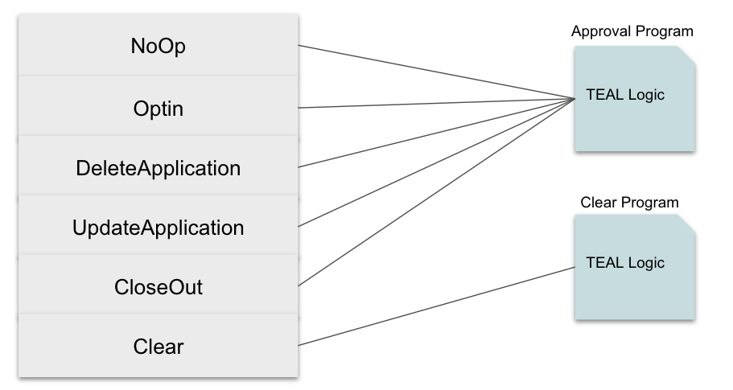

title: Overview

Algorand Smart Contracts can be written in either a stateless or stateful manner. To be stateful means that some amount of storage on the chain is used to store values. This storage can be either global or local. Local storage refers to storing values in an accounts balance record if that account participates in the contract. Global storage is data that is specifically stored on the blockchain for the contract globally. Like stateless smart contracts, stateful contracts are written in TEAL and can be deployed to the blockchain using either the `goal` command-line tool or the SDKs. Stateless smart contracts’ primary purpose is to approve or reject spending transactions. Stateful contracts do not approve spending transactions but provide logic that allows the state (globally or locally) of the contract to be manipulated. Most often, these contracts will be paired with other Algorand capabilities or each other using atomic transfers to form a complete application.

See the [*TEAL Reference Guide*](../../../reference/teal/specification.md) to understand how to write TEAL and the [*TEAL Opcodes*](../../../reference/teal/opcodes.md) documentation that describes the opcodes available. This guide assumes that the reader is familiar with [TEAL](../teal/index.md).

# The Lifecycle of a Stateful Smart Contract
Stateful smart contracts are implemented using two TEAL programs:

* The `ApprovalProgram` is responsible for processing all application calls to the contract, with the exception of the clear call (described in the next bullet). This program is responsible for implementing most of the logic of an application. Like stateless contracts, this program will succeed only if one nonzero value is left on the stack upon program completion.
* The `ClearStateProgram` is used to handle accounts using the clear call to remove the smart contract from their balance record. This program will pass or fail the same way the `ApprovalProgram` does.

In either program, if a global or local state variable is modified and the program fails, the state changes will not be applied. 

Having two programs allows an account to clear the contract from its state, whether the logic passes or not. When the clear call is made to the contract, whether the logic passes or fails, the contract will still be removed from the balance record for the specified account. Note the similarity to the CloseOut transaction call which can fail to remove the contract from the account, which is described below.

Calls to stateful smart contracts are implemented using `ApplicationCall` transactions. These transactions types are as follows:

* NoOp - Generic application calls to execute the `ApprovalProgram`
* OptIn - Accounts use this transaction to opt in to the smart contract to participate (local storage usage).
* DeleteApplication - Transaction to delete the application.
* UpdateApplication - Transaction to update TEAL Programs for a contract.
* CloseOut - Accounts use this transaction to close out their participation in the contract. This call can fail based on the TEAL logic, preventing the account from removing the contract from its balance record.
* ClearState - Similar to CloseOut, but the transaction will always clear a contract from the account’s balance record whether the program succeeds or fails.

The `ClearStateProgram` handles the `ClearState` transaction and the `ApprovalProgam` handles all other `ApplicationCall` transactions. These transaction types can be created with either `goal` or the SDKs. The overall architecture of a stateful TEAL program is shown below. In the following sections, details on the individual capabilities of a stateful smart contract will be explained.

<center></center>
<center>*Stateful Smart Contract*</center>

The `goal` calls shown above in the orange boxes represent all the specific calls that can be made against a stateful smart contract and are described later in this document. These calls are also available in the SDKs. The teal-colored boxes represent the two required TEAL programs, the blue boxes are the state variables (local and global), and the yellow boxes represent the TEAL opcodes used to modify state. Modifying state is detailed in the next section.

# Modifying State in Smart Contract
Stateful smart contracts can create, update, and delete values in global or local state. The number of values that can be written is limited based on how the contract was first created. See [Creating the Smart Contract](#creating-the-smart-contract) for details on configuring the initial global and local storage. State is represented with key-value pairs. The key and value are limited to 64 bytes of storage each for both global and local storage. These values are stored as byte slices. The TEAL language provides several opcodes for facilitating reading and writing to state.

## Reading Local State from other Accounts
Local storage values are stored in the accounts balance record. Any account that sends a transaction to the smart contract can have its local storage modified by the smart contract as long as the account has opted in to the smart contract. In addition, any call to the smart contract can also reference up to four additional accounts which can also have their local storage manipulated for the current smart contract. These five accounts can also have their storage values for any smart contract on Algorand read by specifying the application id of the smart contract. This is a read-only operation and does not allow one smart contract to modify the local state of another smart contract. The additionally referenced accounts can be changed per smart contract call (transaction). The process for reading local state from another account is described in the following sections.

## Reading Global State from other Smart Contracts
Global storage for the current contract can also be modified by the smart contract code. In addition, the global storage of up to two additional contracts can be read. This is a read-only operation. The global state can not be changed for other smart contracts. The two external smart contracts can be changed per smart contract call (transaction). The process for reading global state from another smart contract is described in the following sections.


## Write to State
To write to either local or global state, the opcodes `app_global_put` and `app_local_put` should be used. These calls are similar but with local storage, you provide an additional account parameter. This determines what account should have its local storage modified. In addition to the sender of the transaction, any call to the smart contract can reference up to four additional accounts. Below is an example of doing a global write with TEAL.

```
byte "Mykey"
int 50
app_global_put
```

To store a value in local storage, the following TEAL can be used.

```
int 0
byte "MyLocalKey"
int 50
app_local_put
```

In this example, the `int 0` represents the sender of the transaction. This is a reference into the accounts array that is passed with the transaction. With `goal` you can pass additional accounts using the `--app-account` option. 

```
$ goal app call --app-account account1 --app-account account2
```

To store a value into account2, the TEAL would be as follows.

```
int 2
byte “MyLocalKey”
int 50
app_local_put
```

Where 0 is the sender, 1 is the first additional account passed in and 2 is the second additional account passed with the application call.

!!! info
    Local storage writes are only allowed if the account has opted in to the smart contract.

## Read From State
TEAL provides calls to read global and local state values for the current smart contract.  To read from local or global state TEAL provides the `app_local_get`, `app_global_get`, `app_local_get_ex` , and `app_global_get_ex` opcodes. The following TEAL code reads a value from global state for the current smart contract.

```
byte “MyGlobalKey”
app_global_get
```

The following TEAL code reads the local state of the sender account for the specific call to the current smart contract.

```
int 0
byte “MyLocalKey”
app_local_get
```

In this example, the `int 0` represents the sender of the transaction. This is a reference into the accounts array that is passed with the transaction. With `goal` you can pass additional accounts using the `--app-account` option. 

`int 0` represents the sender, 1 is the first additional account passed in and 2 is the second additional account passed with the application call. 

The `_ex` opcodes return two values to the stack. The first value is a 0 or a 1 indicating the value was returned successfully or not, and the second value on the stack contains the actual value. These calls allow local and global states to be read from other accounts and applications (stateful smart contracts). To read a local storage value with the `app_local_get_ex` opcode the following TEAL should be used.

```
int 0 //sender
txn ApplicationID //current smart contract
byte "MyAmountGiven"
app_local_get_ex
```

The `txn ApplicationID` line refers to the current application, but could be any application that exists on Algorand. The top value on the stack will either return 0 or 1 depending on if the variable was found.  Most likely branching logic will be used after a call to the `_ex` opcode. The following example illustrates this concept.

```
int 0 //sender
txn ApplicationID
byte "MyAmountGiven"
app_local_get_ex
bz new-giver
//logic deal with an existing giver
//stored value is on the top of the stack
//return
new-giver:
//logic to deal with a new giver
```

The `app_global_get_ex` is used to read not only the global state of the current contract but up to two additional foreign contract applications. To access these foreign apps, they must be passed in with the application using the `--foreign-app` option. 

```
$ goal app call --foreign-app app1ID --foreign-app app2ID
```

To read from the global state with the `app_global_get_ex` opcode, use the following TEAL.

```
int 0
byte “MyGlobalKey”
app_global_get_ex
bnz increment_existing //found value
```

The `int 0` represents the current application and `int 1` would reference the first passed in foreign app. Likewise `int 2` would represent the second passed in foreign application. Similar to the `app_local_get_ex` opcode, generally there will be branching logic testing whether the value was found or not. 

# Checking the Transaction Type in a Smart Contract
The `ApplicationCall` transaction types defined in [The Lifecycle of a Stateful Smart Contract](#the-lifecycle-of-a-stateful-smart-contract) can be checked within the TEAL code by examining the `OnCompletion` transaction property. 

```
int NoOp 
//or OptIn, UpdateApplication, DeleteApplication, CloseOut, ClearState 
txn OnCompletion
==
```

# Passing Arguments To Stateful Smart Contracts
Arguments can be passed to any of the supported application transaction calls, including create. The number and type can also be different for any subsequent calls to the stateful smart contract. The `goal` CLI supports passing strings, ints, base64 encoded data, and addresses as parameters. To pass a parameter supply the `--app-arg` option to the call and supply the value according to the format shown below.

Argument Type | Example
------------ | ------------- 
String | `goal app call --app-arg "str:mystring".....` 
Integer | `goal app create --app-arg "int:5".....` 
Address | `goal app call --app-arg "addr:address-string".....`
Base64 | `goal app call --app-arg "b64:A==".....`

These parameters are loaded into the argument array. TEAL opcodes are available to get the values within the array. The primary argument opcode is the `ApplicationArgs` opcode and can be used as shown below.

```
txna ApplicationArgs 1
byte "claim" 
==
```

This call gets the second passed in argument and compares it to the string "claim".

A global variable is also available to check the size of the transaction argument array. This size can be checked with a simple TEAL call.

```
txn NumAppArgs
int 4
==
```

The above TEAL code will push a 0 on the top of the stack if the number of parameters in this specific transaction is anything other than 4, else it will push a 1 on the top of the stack. Internally all transaction parameters are stored as byte slices. Integers can be converted using the `btoi` opcode.

```
txna ApplicationArgs 0
btoi
```

!!! info
    Argument passing for stateful smart contracts is very different from passing arguments to stateless smart contracts. 

The total size of all parameters is limited to 2kb in size.


# Creating the Smart Contract
Before creating a stateful smart contract, the code for the `ApprovalProgram` and the `ClearStateProgram` program should be written. The SDKs and the `goal` CLI tool can be used to create a smart contract application. To create the application with `goal` use a command similar to the following.

```
$ goal app create --creator [address]  --approval-prog [approval_program.teal] --clear-prog [clear_state_program.teal] --global-byteslices [number-of-global-byteslices] --global-ints [number-of-global-ints] --local-byteslices [number-of-local-byteslices] --local-ints [number-local-ints] 
```

The creator is the account that is creating the application and this transaction is signed by this account. The approval program and the clear state program should also be provided. The number of global and local byte slices and integers also needs to be specified. These represent the absolute on-chain amount of space that the smart contract will use. Once set, these values can never be changed. Each key-value pair is allowed up to 64 bytes each (64-byte key and 64-byte value). When the smart contract is created the network will return a unique ApplicationID. This ID can then be used to make `ApplicationCall` transactions to the smart contract. 

When creating a stateful smart contract, there is a limit of 64 key-value pairs that can be used by the contract for global storage and 16 key-value pairs that can be used for local storage. When creating the smart contract the amount of storage can never be changed once the contract is created. Additionally, the minimum balance is raised for any account that participates in the contract. See [Minimum Balance Requirement for Smart Contracts](#minimum-balance-requirement-for-a-smart-contract) described below for more detail.

!!! info    
    Accounts can only participate or create up to 10 stateful smart contracts.

# Opt in to the Smart Contract
Before any account, including the creator of the smart contract, can begin to make Application Transaction calls that use local state, it must first opt in to the smart contract. This prevents accounts from being spammed with smart contracts. To opt in, an `ApplicationCall` transaction of type `OptIn` needs to be signed and submitted by the account desiring to opt in to the smart contract. This can be done with the `goal` CLI or the SDKs.

```
$ goal app app optin  --app-id [ID-of-Contract] --from [ADDRESS]
```

When this transaction is submitted, the `ApprovalProgram` of the smart contract is called and if the call succeeds the account will be opted into the smart contract. The simplest TEAL program to handle this call would just put 1 on the stack and return. 

```
int OptIn
txn OnCompletion
==
bz notoptingin
int 1
Return
notoptingin:
.
.
```

Other contracts may have much more complex opt in logic. TEAL also provides an opcode to check whether an account has already opted in to the contract.

```
int 0 
txn ApplicationID
app_opted_in
```

In the above example, the int 0 is a reference index into the accounts array, where 0 is the sender. A 1 would be the first account passed into the call and so on. The `txn ApplicationID` refers to the current application ID, but technically any application ID could be used.

!!! info
    Accounts can only opt in to or create up to 10 stateful smart contracts

!!! info
    Applications that only use global state do not require accounts to opt in.

# Call the Stateful Smart Contract
Once an account has opted in to a stateful smart contract it can begin to make calls to the contract. These calls will be in the form of `ApplicationCall` transactions that can be submitted with `goal` or the SDKs. Depending on the individual type of transaction as described in [The Lifecycle of a Stateful Smart Contract](#the-lifecycle-of-a-stateful-smart-contract), either the `ApprovalProgram` or the `ClearStateProgram` will be called. Generally, individual calls will supply application arguments. See [Passing Arguments to a Smart Contract](#passing-arguments-to-stateful-smart-contracts) for details on passing arguments.

```
$ goal app call --app-id 1 --app-arg "str:myparam"  --from [ADDRESS]
```

The call must specify the intended contract using the `--app-id` option. Additionally, the `--from` option specifies the sender’s address. In this example, a string parameter is passed with this call. TEAL can use these parameters to make decisions on how to handle the call.

```
byte "myparm" 
txna ApplicationArgs 0
==
bz not_my_parm
//handle my_parm
return
not_my_parm:
//handle not_my_parm
```

# Update Stateful Smart Contract
A stateful smart contract’s programs can be updated at any time. This is done by an `ApplicationCall` transaction type of `UpdateApplication`. This operation can be done with `goal` or the SDKs and requires passing the new programs and specifying the application ID.

```
goal app update --app-id=[AppID] --from [ADDRESS]  --approval-prog [new_approval_program.teal]   --clear-prog [new_clear_state_program.teal]
```

The one caveat to this operation is that global or local state requirements for the smart contract can never be updated.

As stated earlier anyone can update the program. If this is not desired and you want only the original creator to be able to update the programs, code must be added to your `ApprovalProgram` and to handle this situation. This can be done by first checking the application id. If the value is 0, then the smart contract is just being created. At this point, the sender can be stored as the creator in the global storage to be checked later in subsequent calls.

```
int 0
txn ApplicationID
==
bz not_creation
byte "Creator"
txn Sender
app_global_put
not_creation:
```

TEAL can then be used to catch an update operation by someone other than the original creator.

```
int UpdateApplication
txn OnCompletion
==
bz not_update
byte "Creator"
app_global_get
txn Sender
==
bz not_valid_user
int 1
return
not_valid_user:
int 0
return
not_upate:
.
.
```

Or alternatively, the TEAL code can always return a 0 when an `UpdateApplication` application call is made to prevent anyone from ever updating the application code.

```
int UpdateApplication
txn OnCompletion
==
bz not_update
int 0
return
```

# Delete Stateful Smart Contract
To delete a smart contract, an `ApplicationCall` transaction of type `DeleteApplication` must be submitted to the blockchain. The `ApprovalProgram` handles this transaction type and if the call returns true the application will be deleted. This can be done using `goal` or the SDKs. 

```
$ goal app delete --app-id=[AppID] --from [ADDRESS]
```

When making this call the `--app-id` and the `--from` options are required. Anyone can delete a smart contract. If this is not desired, logic in the program must reject the call. Using a method described in [Update Stateful Smart Contract](#update-stateful-smart-contract) must be supplied. 

First store the creator on creation.

```
int 0
txn ApplicationID
==
bz not_creation
byte "Creator"
txn Sender
app_global_put
not_creation:
```

TEAL can then be used to catch a delete operation by someone other than the original creator.

```
int DeleteApplication
txn OnCompletion
==
bz not_delete
byte "Creator"
app_global_get
txn Sender
==
bz not_valid_user
int 1
return
not_valid_user:
int 0
return
not_delete:
.
.
```

# Atomic Transfers and Transaction Properties
The [TEAL opcodes](../../../reference/teal/opcodes.md) documentation describes all transaction properties that are available within a TEAL program. These properties can be retrieved using TEAL.

```
txn Amount
```

In many common patterns, the stateful TEAL contract will be combined with other Algorand technologies such as Algorand Assets, Atomic Transfers, or Stateless Smart Contracts to build a complete application. In the case of Atomic transfers, more than one transaction’s properties can be checked within the stateful smart contract. The number of transactions can be checked using the `GroupSize` global property. If the value is greater than 0, then the call to the stateful smart contract is grouped with more than one transaction.

```
global GroupSize
int 2
==
```

The above TEAL will be true if there are two transactions submitted at once using an Atomic transfer. To access the properties of a specific transaction in the atomic group use the `gtxn` opcode.

```teal
gtxn 1 TypeEnum
int pay
==
```

In the above example, the second transaction’s type is checked, where the `int pay` references a payment transaction. See the [opcodes](../../../reference/teal/opcodes.md) documentation for all transaction types. Note that the `gtxn` call is a zero-based index into the atomic group of transactions. If the TEAL program fails, all transactions in the group will fail.

# Using Assets in Smart Contracts
Stateful contract applications can work in conjunction with Algorand Assets. In addition to normal asset transaction properties, such as asset amount, sender, and receiver, TEAL provides an opcode to interrogate an account’s asset balance and whether the asset is frozen. This opcode `asset_holding_get` can be used to retrieve an asset balance or check whether the asset is frozen for any account in the transaction accounts array.

```
int 0
int 2
asset_holding_get AssetBalance
bnz has_balance
int 0 
return
has_balance:
//balance value is now on top of the stack
```

This opcode takes two parameters. The first represents an index into the accounts array where `int 0` is the sender of the transaction’s address. If additional accounts are passed in using the `--app-account` `goal` option then higher index numbers would be used to retrieve values. The second parameter is the Asset ID of the asset to examine. In this example, the asset ID is 2. This opcode supports getting the asset balance and the frozen state of the asset for the specific account. To get the frozen state, replace `AssetBalance` above with `AssetFrozen`. This opcode also returns two values to the top of the stack. The first is a 0 or  1, where 0 means the asset balance was not found and 1 means an asset balance was found in the accounts balance record.

It is also possible to get an Asset’s configuration information within a smart contract, if the asset ID is passed with the transaction. This can be done with `goal` by supplying the `--foreign-asset` parameter. The value of the parameter should be the asset ID. Up to two assets can be supplied per transaction. To read the configuration, the `asset_params_get` opcode must be used. This opcode should be supplied with one parameter, which is the index into the foreign assets array.

```
int 0
asset_params_get AssetTotal
```

This call returns two values. The first is a 0 or 1 indicating if the parameter was found and the second contains the value of the parameter. See the [opcodes](../../../reference/teal/opcodes.md) documentation for more details on what additional parameters can be read.


# Global Values in Smart Contracts
Smart contracts have access to nine global variables. These variables are set for the blockchain, like the minimum transaction fee (MinTxnFee). As another example of Global variable use, in the [Atomic Transfers and Transaction Properties](#atomic-transfers-and-transaction-properties) section of this guide, `GroupSize` is used to show how to get the number of transactions that are grouped within a smart contract call. Stateful smart contracts also have access to the `LatestTimestamp` global which represents the latest confirmed block's Unix timestamp. This is not the current time but the time when the last block was confirmed. This can be used to set times on when the contract is allowed to do certain things. For example, you may want a contract to only allow accounts to opt in after a start date, which is set when the contract is created and stored in global storage.

```
global LatestTimestamp
byte "StartDate"
app_global_get
>=
```

# Reading a Smart Contracts State
In addition to being able to read the state of a smart contract using TEAL, these global and local values can be read externally with the SDKs and `goal`. These reads are not transactions and just query the current state of the contract. 

```
$ goal app read --app-id 1 --guess-format --global --from [ADDRESS]
```

In the above example, the global state of the smart contract with the application ID of 1 is returned. The `--guess-format` opt in the above example tries programmatically to display the properly formatted values of the state variables. To get the local state, replace `--global` with `--local` and note that this call will only return the local state of the `--from` account.

# Differences Between Stateful and Stateless Smart Contracts
Smart Contracts in Algorand are either stateful or stateless, where stateful contracts actually store values on blockchain and stateless are used to approve spending transactions. In addition to this primary difference, several of the TEAL opcodes are restricted to only be used with specific smart contract types. For example, the `ed25519verify` opcode can only be used in stateless smart contracts, and the `app_opted_in` opcode can only be used in stateful smart contracts. To easily determine where an opcode is valid, the [TEAL opcodes](../../../reference/teal/opcodes.md) documentation supplies a `Mode` field that will either designate `Signature ` or `Application`. The `Signature` mode refers to only stateless smart contracts and the `Application` mode refers to the stateful smart contracts. If the `Mode` attribute is not present on the opcode reference, the call can be used in either smart contract type.

# Boilerplate Stateful Smart Contract
As a way of getting started writing stateful smart contracts the following boilerplate template is supplied. The code provides labels or handling different `ApplicationCall` transactions and also prevents updating and deleting the smart contract.

```
#pragma version 2

// Handle each possible OnCompletion type. We don't have to worry about
// handling ClearState, because the ClearStateProgram will execute in that
// case, not the ApprovalProgram.

txn OnCompletion
int NoOp
==
bnz handle_noop

txn OnCompletion
int OptIn
==
bnz handle_optin

txn OnCompletion
int CloseOut
==
bnz handle_closeout

txn OnCompletion
int UpdateApplication
==
bnz handle_updateapp

txn OnCompletion
int DeleteApplication
==
bnz handle_deleteapp

// Unexpected OnCompletion value. Should be unreachable.
err

handle_noop:
// Handle NoOp

handle_optin:
// Handle OptIn

handle_closeout:
// Handle CloseOut

// By default, disallow updating or deleting the app. Add custom authorization
// logic below to allow updating or deletion in certain circumstances.
handle_updateapp:
handle_deleteapp:
err
```

# Minimum Balance Requirement for a Smart Contract
When creating or opt in to a stateful smart contract your minimum balance will be raised. The amount at which it is raised will depend on the amount of on-chain storage that is used. The calculation for this amount is as follows.

100000 + (25000+3500)*schema.NumUint + (25000+25000)*schema.NumByteSlice

100000 microAlgo base fee for opting in or creating. 25000 microAlgos for each key byte-slice, and either 3500 microAlgos for an integer value or 25000 microAlgos for a bytes value.

Note that global storage is actually stored in the creator account, so that account is responsible for the global storage minimum balance and when a user options in (including the creator) that account is responsible for the minimum balance of local storage. As an example, suppose a smart contract has one 1 global key-value-pair of type byteslice and one 1 local storage key-value pair of type integer. The creator would need an additional 150000 microAlgos in its balance.

100000 to create the contract +  50000 for the global byte slice.

Any account that opts in to the contract would have its balance requirement raised 128500 microAlgos.

100000 to opt in to the contract + 28500 for the locally stored integer.

