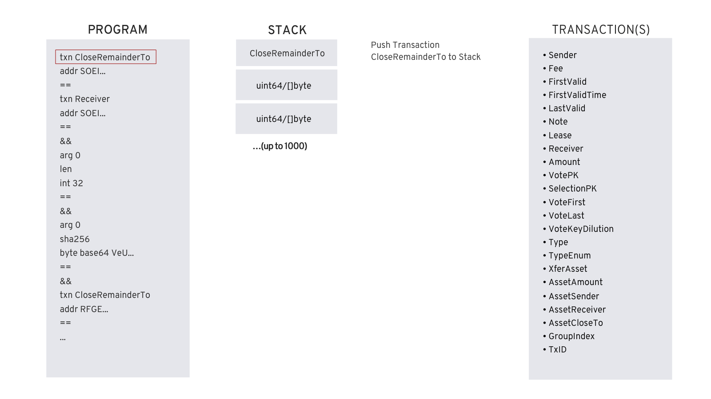
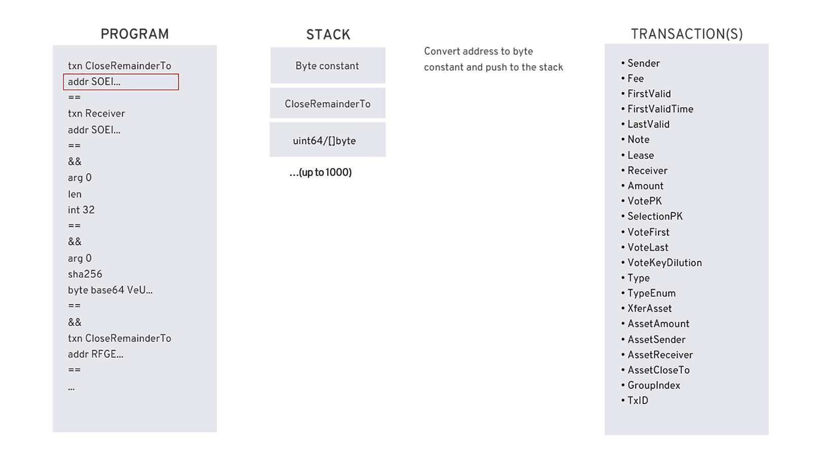
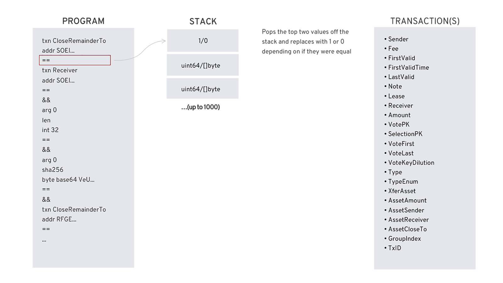
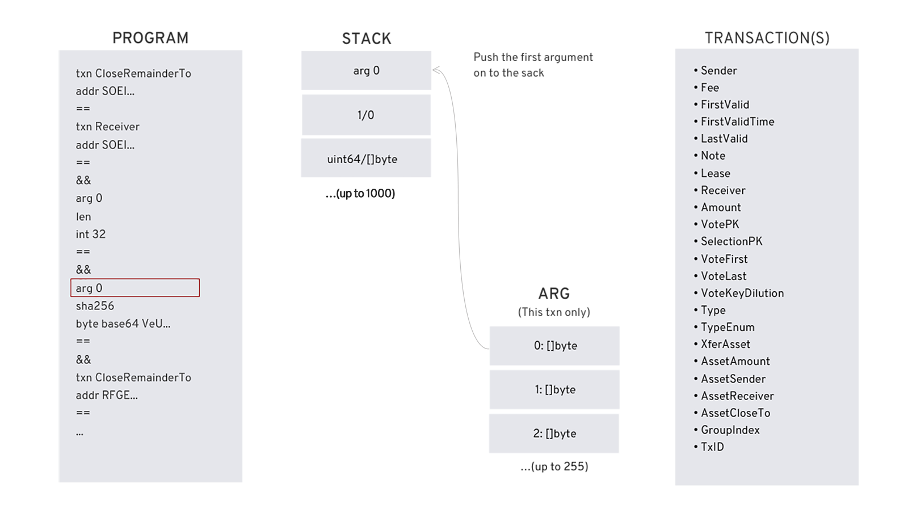
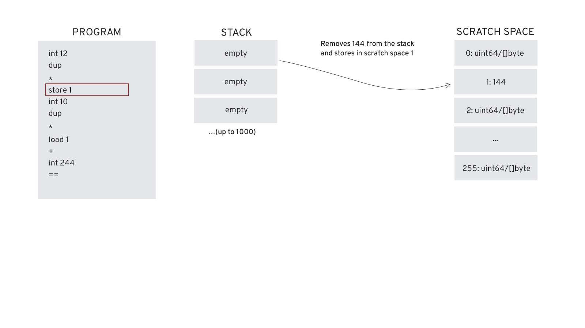
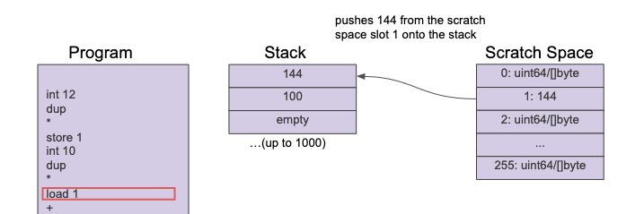

title: The Smart Contract Language

Stateless and stateful smart contracts are written in Transaction Execution Approval Langauge (TEAL). These contracts can be written directly or with Python using the [PyTeal library](pyteal.md).

TEAL is an assembly-like language and is processed by the Algorand Virtual Machine (AVM). The language is a Turing-complete language that supports looping and subroutines, but limits the amount of time the contract has to execute using a dynamic opcode cost evaluation algorithm.  TEAL programs are processed one line at a time pushing and popping values on and off the stack. These stack values are either unsigned 64 bit integers or byte strings. TEAL provides a set of operators that operate on the values within the stack. TEAL also allows arguments to be passed into the program from a transaction, a scratch space to temporarily store values for use later in the program, access to grouped or single transaction properties, global values, a couple of pseudo operators, constants and flow control functions like `bnz` for branching and `callsub` for calling subroutines. In addition, stateful smart contracts can read and write global storage for the contract and local storage for accounts that opt-in to the contract. See [TEAL Specification Reference](../../../reference/teal/specification.md) for more details.

Some of the opcodes in TEAL are only valid for a specific contract type. These are denoted in the [TEAL Opcodes](../../../reference/teal/opcodes.md) documentation with a `Mode` attribute. This attribute will be set to `Signature` for stateless smart contracts and `Application` for stateful smart contracts. For example, reading account assets or Algo balances is only available in stateful smart contracts. Using the `ed25519verify` opcode for signature verification is only available in stateless smart contracts. 

<center></center>
<center>*TEAL Architecture Overview*</center>

!!! warning
    When writing smart contracts, make sure to follow [TEAL guidelines](../../../reference/teal/guidelines.md). This is very important in order to prevent smart contracts from being compromised.

# TEAL Versions
Currently, Algorand supports versions 1 through 4 of TEAL. When writing contracts with TEAL version 2 or higher, make sure to add `#pragma version #` where # should be replaced by the specific number, as the first line of the program. If this line does not exist, the protocol will treat the contract as a version 1 contract. If upgrading a contract to version 2 or higher, it is important to verify you are checking the `RekeyTo` property of all transactions that are attached to the contract. See the [TEAL guidelines](../../../reference/teal/guidelines.md) for more suggestions to help prevent a contract from being compromised. 

# Getting Transaction Properties
The primary purpose of a TEAL program is to return either true or false. When the program completes, if there is a non-zero value on the stack then it returns true. If there is a zero value or the stack is empty, it will return false. If the stack has more than one value the program also returns false unless the `return` opcode is used. The following diagram illustrates how the stack machine processes the program.

Program line number 1:

<center></center>
<center>*Getting Transaction Properties*</center>

The program uses the `txn` to reference the current transaction's list of properties. Grouped transaction properties are referenced using `gtxn` and `gtxns`. The number of transactions in a grouped transaction is available in the global variable `GroupSize`. To get the first transaction's receiver use `gtxn 0 Receiver`. See [TEAL Specification Reference](../../../reference/teal/specification.md) for more transaction properties.

# Pseudo Opcodes
The TEAL specification provides several pseudo opcodes for convenience.  For example, the second line in the program below uses the `addr` pseudo opcode.

<center></center>
<center>*Pseudo Opcodes*</center>

The `addr` pseudo opcode converts Algorand addresses to a byte constant and pushes the result to the stack. See [TEAL Specification Reference](../../../reference/teal/specification.md) for additional pseudo opcodes.

# Operators
TEAL provides operators to work with data that is on the stack. For example, the `==` operator evaluates if the last two values on the stack are equal and pushes either a 1 or 0 depending on the result. The number of values used by an operator will depend on the operator. The [TEAL Opcodes](../../../reference/teal/opcodes.md) documentation explains arguments and return values. See [TEAL Specification Reference](../../../reference/teal/specification.md) for a list of all operators.

<center></center>
<center>*Operators*</center>

# Argument Passing
TEAL supports program arguments. Stateless and stateful smart contracts handle these parameters with different opcodes. For information on passing parameters to stateful smart contracts, see the stateful smart contract [Overview](../stateful/index.md) documentation. Passing parameters to a stateless smart contract is explained in the stateless smart contract [SDK Usage](../stateless/sdks/#passing-parameters-using-the-sdks) documentation. The [Goal Teal Walkthrough](../stateless/walkthrough.md) documentation explains a simple example of passing a parameter to a stateless smart contract with the `goal` command-line tool. 

The diagram below shows an example of logic that is loading a parameter onto the stack within a stateless smart contract. 

<center></center>
<center>*Arguments*</center>

All argument parameters to a TEAL program are byte arrays. The order that parameters are passed is specific. In the diagram above, The first parameter is pushed onto the stack. The SDKs provide standard language functions that allow you to convert parameters to a byte array. 

# Storing and Loading from Scratchspace
TEAL provides a scratch space as a way of temporarily storing values for use later in your code. The diagram below illustrates a small TEAL program that loads 12 onto the stack and then duplicates it. These values are multiplied together and result (144) is pushed to the top of the stack. The store command stores the value in the scratch space 1 slot.

<center></center>
<center>*Storing Values*</center>

The load command is used to retrieve a value from the scratch space as illustrated in the diagram below. Note that this operation does not clear the scratch space slot, which allows a stored value to be loaded many times if necessary.

<center></center>
<center>*Loading Values*</center>

# Looping and Subroutines
TEAL contracts written in version 4 or higher can use loops and subroutines. Loops can be performed using any of the branching opcodes `b`, `bz`, and `bnz`. For example the TEAL below loops ten times.

```tab="TEAL"
#pragma version 4
// loop 1 - 10
// init loop var
int 0 
loop:
int 1
+
// implement loop code
// ...
// check upper bound
int 10
<=
bnz loop
```

Subroutines can be implemented using labels and the `callsub` and `retsub` opcodes. The sample below illustrates a sample subroutine call.

```tab="TEAL"
#pragma version 4
// jump to main loop
b main

// subroutine
my_subroutine:
// implement subroutine code
// with the two args
retsub

main:
int 1
int 5
callsub my_suboutine
return
```

# Dynamic Operational Cost of TEAL Opcodes
Stateless TEAL programs are limited to 1000 bytes in size. Size encompasses the compiled program plus arguments. Stateful smart contracts are limited to 2KB total for the compiled approval and clear programs. This size can be increased in 2KB increments, up to an 8KB limit for both programs. For optimal performance, TEAL programs are also limited in opcode cost. This cost is evaluated when a smart contract runs. This cost is representative of a TEAL program's computational expense. Every opcode within TEAL has a numeric value that represents its opcode cost. Most opcodes have an opcode cost of 1. Some operators such as the `SHA256` (cost 35) operator or the `ed25519verify` (cost 1900) operator have substantially larger opcode costs. Stateless TEAL programs are limited to 20000 for total opcode cost of all program operators. Stateful TEAL programs are limited to 700 for each of the programs associated with the contract. The [TEAL Opcodes](../../../reference/teal/opcodes.md) reference lists the opcode cost for every operator.

# Example Walkthrough of a TEAL Program
The example covered in this tutorial is for a stateless contract account TEAL program. The account is set up where all tokens are removed from the account with one successful transaction and delivered to one of two accounts. Unsuccessful transactions leave the funds in the contract account.

The example uses two addresses (addr1 and addr2). The variables have the values of addr1 = `RFGEHKTFSLPIEGZYNVYALM6J4LJX4RPWERDWYS2PFKNVDWW3NG7MECQTJY` and addr2 = `SOEI4UA72A7ZL5P25GNISSVWW724YABSGZ7GHW5ERV4QKK2XSXLXGXPG5Y`.  The variable addr1 represents the creator of the contact account. The addr1 account funds the contract account after creation. The variable addr2 is the intended recipient of the funds, but only if addr2 supplies a proper secret key and the transaction must be submitted within a time limit (represented with a number of blocks). If addr2 does not submit the transaction in time or can’t supply the proper secret key, addr1 can submit the transaction and retrieve all the tokens. The transaction fee for the transaction is limited to no more than 1 Algo and this must not be a rekey transaction. The pseudo-code for this example is represented with the following logic:

``` go
((addr2 and secret) || (addr1 and timeout)) && (ok fee and !rekey)
```

The example uses the `CloseRemainderTo` field to close out the account and move all funds to either addr1 or addr2 on a successful transaction.

The first clause of the pseudo logic is implemented with the following TEAL.

``` text tab="TEAL"
// Are used to comment in TEAL
// htlc.teal
// Push the CloseRemainderTo property of the current transaction onto the stack
txn CloseRemainderTo

// Push addr2 onto the stack as the intended recipient
addr SOEI4UA72A7ZL5P25GNISSVWW724YABSGZ7GHW5ERV4QKK2XSXLXGXPG5Y

// The == operator is used to verify that both of these are the same
// This pops the two values off the stack and pushes the result 0 or 1
==

// Push the current transaction’s Receiver property onto the stack
// In this example it should be addr2
txn Receiver

// Push addr2 on the stack using the addr constant
addr SOEI4UA72A7ZL5P25GNISSVWW724YABSGZ7GHW5ERV4QKK2XSXLXGXPG5Y

// Use the == to verify that these are equal which pops off the top two values of the stack
// and returns 0 or 1
==

// The stack should currently have two values from the two top conditions
// These will be either 0s or 1s
// Push the && operator which will AND the two previous conditions and return
// either 0 or 1, which leaves one value on the stack either a 0 or a 1
&&

// Push the first argument to the transaction onto the stack
arg 0

// The len operator pops the arg off the stack and 
// pushes the length of the argument onto the stack
len

// Push a constant int of value 46 onto the stack
int 46

// The == operator verifies that the length of the argument
// is equal to 46. This pops the two values and returns a 0 or 1
// The stack now contains two values with a value of 0 or 1
==

// The && operator will AND the two values in the stack
// which pops both values off the stack and returns a 0 or 1
// The stack should now only have one value on the stack, 0 or 1
&&

// arg 0 is pushed back onto the stack
// This represents the hashed passcode
arg 0

// The sha256 operator pops the arg 0 off the stack
// and pushes the hash value of the argument onto the stack
sha256

// The constant byte array of the base64 version of our secret is pushed onto the stack
byte base64 QzYhq9JlYbn2QdOMrhyxVlNtNjeyvyJc/I8d8VAGfGc=

// The == operator pops the two values and pushes 0 or 1 onto the stack
// If arg0 is equal to the secret this value will be 1 and if not it will be 0
==

// Two values are now on the stack. The && operator is used 
// to pop the last two values and push either 0 or 1
// This will AND all previous conditions to this one.
// The stack should only have a 0 or 1 value now
&&

```

The second clause of the pseudo logic is implemented with the following TEAL.

``` text tab="TEAL"

// The following six lines of teal check if the 
// transaction is reciever is set to addr1 and that the CloseRemainderTo
// transaction property is also set to addr1.
// Once completed the stack will have the 0 or 1 
// from the previous clause and a 1 or 0 from the 
// the beginning of the second clause. 
txn CloseRemainderTo
addr RFGEHKTFSLPIEGZYNVYALM6J4LJX4RPWERDWYS2PFKNVDWW3NG7MECQTJY
==
txn Receiver
addr RFGEHKTFSLPIEGZYNVYALM6J4LJX4RPWERDWYS2PFKNVDWW3NG7MECQTJY
==
&&

// The FirstValid parameter from the transaction is pushed onto the stack
txn FirstValid

// The constant int value of 67240 is pushed onto the stack
// This is a hard coded round number and is only used here as an example
int 67240

// The > operator is used to check if First Valid is greater than 67240
// This is used to see if the transaction is timed out and if so addr1 can
// Submit the transaction to return the funds.
// This pops the last two values and returns a 0 or 1
// At the end of this operation, we should have 
// three values on the stack. One for the first clause, and two for the second clause
>

// The && operator is used to AND the last two options in the second clause which pops the
// last two values and pushes a 1 or 0. This will leave only two values on the stack
&&

```

This completes the second clause. Clause 1 and 2 are ORed together.

```text tab="TEAL"
// The || operator is pushed onto the stack which ORs
// the first two clauses
// and pops the two values and pushes a 0 or 1 
|| 
```

The third clause is responsible for verifying that the transaction fee is below 1 Algo and that no rekey operation is happening. This is an important check to prevent an account from being cleared by an errant transaction fee requirement or assigned to a new private key.

``` text tab="TEAL"

// The current transaction fee is pushed onto the stack
txn Fee

// The constant integer of value 1000000 is pushed
// onto the stack, which is specified in micro Algos
// In this example this equates to 1 Algo
int 1000000 

// The < operator is used to pop those last two values and replace with a 
// 0 or 1. This just verifies that the fee is not greater than 1 Algo 
<

// Next the transaction RekeyTo property is pushed onto the stack.
txn RekeyTo

// The global zero address is then pushed onto the stack. 
global ZeroAddress

// the == operator will replace the last two fields with a 0 or a 1. If the value is 1, this is not a rekey transaction. This is a very important check for stateless smart contracts.
==

// next the && operator is used to AND the two conditions in the third clause.
// At this point there will be two values on the stack
&&
```

The && is the final operator used in this example. This ANDs the third clause with the result of the OR operation between the first and second clauses.

``` text tab="TEAL"
// The && operator is used to pop those values by anding them and pushing either 
// a 1 or 0
// Since this is the end of the program this value represents the return value
// and determines if the transaction executed successfully 
&&
```

Full example is presented below.

``` text tab="TEAL"

txn CloseRemainderTo
addr SOEI4UA72A7ZL5P25GNISSVWW724YABSGZ7GHW5ERV4QKK2XSXLXGXPG5Y
==
txn Receiver
addr SOEI4UA72A7ZL5P25GNISSVWW724YABSGZ7GHW5ERV4QKK2XSXLXGXPG5Y
==
&&
arg 0
len
int 46
==
&&
arg 0
sha256
byte base64 QzYhq9JlYbn2QdOMrhyxVlNtNjeyvyJc/I8d8VAGfGc=
==
&&
txn CloseRemainderTo
addr RFGEHKTFSLPIEGZYNVYALM6J4LJX4RPWERDWYS2PFKNVDWW3NG7MECQTJY
==
txn Receiver
addr RFGEHKTFSLPIEGZYNVYALM6J4LJX4RPWERDWYS2PFKNVDWW3NG7MECQTJY
==
&&
txn FirstValid
int 67240
>
&&
||
txn Fee
int 1000000
<
txn RekeyTo
global ZeroAddress
==
&&
&&
```
