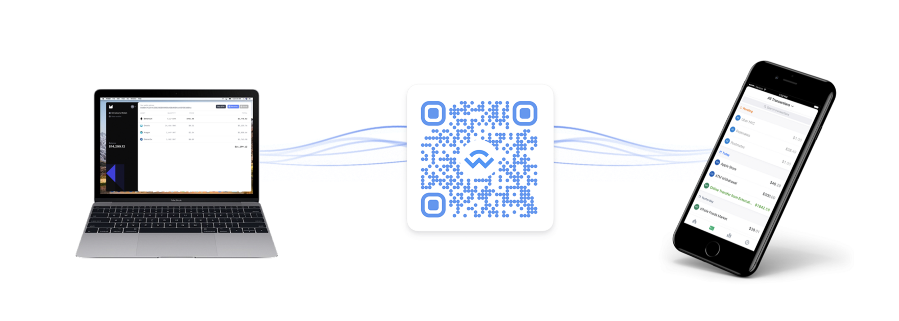

title: WalletConnect

## What is WalletConnect protocol?

WalletConnect is an open protocol to communicate securely between mobile wallets and decentralized applications (dApps) using QR code scanning (desktop) or deep linking (mobile); It’s not an app, not a blockchain and has no token. The protocol is implemented directly within the official Algorand Wallet and allows any dApp developer to add it to their application workflows.

## Why should I care?

From an enduser standpoint, they really don’t need to understand _how_ it works, but they will need to accept the _connection request_ initiated by the dApp within their mobile wallet. As a dApp developer you’ll want to understand some basics about the protocol for a successful integration and provide a seamless user experience. Algorand provide a [custom WalletConnect schema](../reference/walletconnect-schema.md) and a [quick start guide](#quick-start-for-dapp-devs) for accelerating integrations.

<center></center>

The official Algorand Wallet is among the leading crypto wallets supporting the WalletConnect protocol as the industry standard for secure payment prompts and application call transactions. Importantly, user's private keys never leave their mobile device and are never exposed to connected dApps. Adding a Ledger Nano device to the Algorand Wallet further extends the user's security profile while maintaining connection simplicity enabled by the WalletConnect integration.

## How it works

Communication between the dApp and the mobile wallet (_peers_) happens over a _bridge server_ that relays messages without access to their content. Message contents are symmetrically encrypted through a shared key between the two peers using session data. The connection is initiated by the dApp displaying a QR Code or deep link with a standard WalletConnect URI and is established when the user approves this connection request within their Algorand Wallet. Public bridge servers are maintained by WalletConnect and dApp developers may also deploy their own.

Information exchange between the peers typically consists of an unsigned atomic transaction group from the dApp to the mobile wallet, which is then inspected by the user, signed and returned back to the dApp. The dApp will submit the signed object for confirmation by the Algorand network which will effect balances and state accordingly.

<center></center>

## Quick start for dApp devs

The TypeScript sample code below should allow a dApp developer to establish a connection and request a simple payment transaction for signature. A [detailed example](https://github.com/jasonpaulos/algorand-walletconnect-example-dapp) is offered in React and a [live demo](https://jasonpaulos.github.io/algorand-walletconnect-example-dapp/) is available on TestNet.

### Install

```bash tab="yarn"
yarn add @walletconnect/client @walletconnect/qrcode-modal @algorand/js-algorand-sdk
```

```bash tab="npm"
npm install --save @walletconnect/client @walletconnect/qrcode-modal @algorand/js-algorand-sdk
```

### Initiate Connection

```typescript
import WalletConnect from "@walletconnect/client";
import QRCodeModal from "@walletconnect/qrcode-modal";
import algosdk from "@algorand/js-algorand-sdk";

// Create a connector
const connector = new WalletConnect({
  bridge: "https://bridge.walletconnect.org", // Required
  qrcodeModal: QRCodeModal,
});

// Check if connection is already established
if (!connector.connected) {
  // create new session
  connector.createSession();
}

// Subscribe to connection events
connector.on("connect", (error, payload) => {
  if (error) {
    throw error;
  }

  // Get provided accounts and chainId
  const { accounts, chainId } = payload.params[0];
});

connector.on("session_update", (error, payload) => {
  if (error) {
    throw error;
  }

  // Get updated accounts and chainId
  const { accounts, chainId } = payload.params[0];
});

connector.on("disconnect", (error, payload) => {
  if (error) {
    throw error;
  }

  // Delete connector
});
```

### Sign Transaction

```typescript
// Draft transaction
const txn = algosdk.makePaymentTxnWithSuggestedParamsFromObject({
    from: "ALICEU3WMO5XYJVSODKJSYLFILIXXBEXHKIVSMX7GMGXJAYGFCJKVSQTUE",
    to: "HZ57J3K46JIJXILONBBZOHX6BKPXEM2VVXNRFSUED6DKFD5ZD24PMJ3MVA",
    amount: 100000,
    suggestedParams,
});

// Sign transaction
connector
  .signTransaction(txn)
  .then((result) => {
    // Returns signed transaction
    console.log(result);
  })
  .catch((error) => {
    // Error returned when rejected
    console.error(error);
  });
```