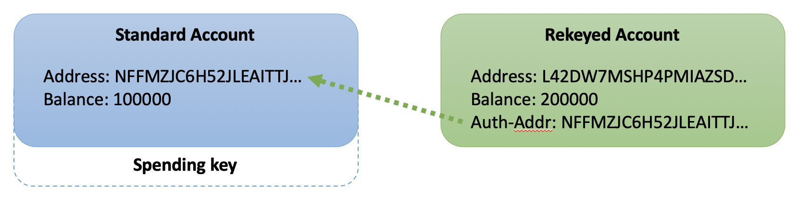
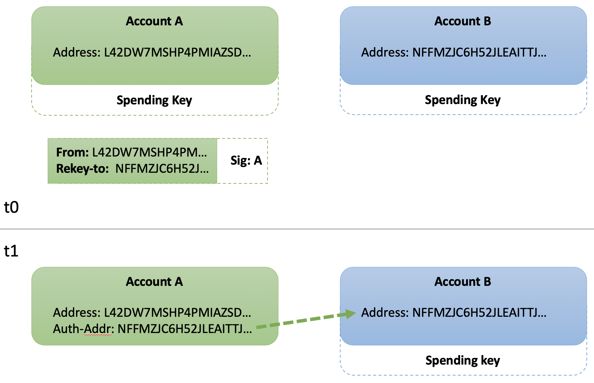
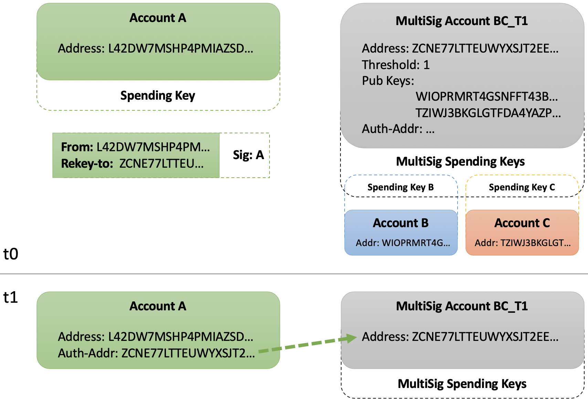

Title: Rekeying

## Overview

Rekeying is a powerful protocol feature which enables an Algorand account holder to maintain a static public address while dynamically rotating the authoritative private spending key(s). This is accomplished by issuing a "rekey-to transaction" which sets the _authorized address_ field within the account object. Future transaction authorization using the account's public address must be provided by the spending key(s) associated with the _authorized address_ which may be a single key address, MultiSig address or LogicSig program address. Key management is an important concept to understand and Algorand provides tools to accomplish relevant tasks securely. 

# Quick start videos

If you prefer videos, take a look at this 4 minute guide to Learn About Algorand Account Rekeying.

<iframe width="100%" style="aspect-ratio:16/9" src="https://www.youtube-nocookie.com/embed/7yffxc4Q_H0" title="YouTube video player" frameborder="0" allow="accelerometer; autoplay; clipboard-write; encrypted-media; gyroscope; picture-in-picture; web-share" allowfullscreen></iframe>

!!! Info
    The term "spending key(s)" is used throughout this document to signify that generally either a single key or a set of keys from a MultiSig account may authorize from a given public address. The address itself cannot distinguish how many spending keys are specifically required.

!!! warning
    Using the `--close-to` parameter on any transaction from a _rekeyed account_ will remove the **auth-addr** field, thus reverting signing authority to the original address. The `--close-to` parameter should be used with caution by keyholder(s) of **auth-addr** as the effects remove their authority to access this account thereafter.

!!! warning
	Rekeying an account affects the **authorizing address** for that account only. Note that an Account is distinct from an address so there are several important points that may not be obvious:

	**1)** If an account is closed (balance to 0) the rekey setting is lost (see previous warning).

  	**2)** Rekeys are not recursively resolved, that is, if A is rekeyed to B and B rekeyed to C, A will have it's transactions authorized by B not C.
	
  	**3)** Rekeying members of a Multisig has no effect on the Multisig authorization since it's composed of Addresses not accounts. If necessary the Multisig account would need to be rekeyed itself.
	

### Account Review

The [account overview](../#keys-and-addresses) page introduces _keys_, _addresses_ and _accounts_. During initial account generation, a public key and corresponding private spending key are created and used to derive the Algorand address. This public address is commonly displayed within wallet software and remains static for each account. When you receive Algos or other assets, they will be sent to your public Algorand address. When you send from your account, the transaction must be authorized using the appropriate private spending key(s).  

### Authorized Addresses

The _balance record_ of every account includes the "auth-addr" field which, when populated, defines the required _authorized address_ to be evaluated during transaction validation. Initially, the "auth-addr" field is implicitly set to the account's "address" field and the only valid _private spending key_ is the one created during account generation. To conserve resources, the "auth-addr" field is only stored and displayed after an authorized _rekey-to transaction_ is confirmed by the network. 

Conceptually illustrated in the image below, a "standard" account uses its _private spending key_ to authorize from its _public address_. A "rekeyed" account defines the _authorized address_ which references a distinct "foreign" address and thus requires the _private spending key(s)_ thereof to authorize future transactions.



#### Standard Account

Use the following code sample to view a _standard_ account on BetaNet:

=== "goal"
  ```bash
  goal account dump --address NFFMZJC6H52JLEAITTJ7OIML3XCJFKIRXYRJLO4WLWIJZB7N6CTWESRAZU
  ```

Response:

```json hl_lines="2"
{
  "addr": "NFFMZJC6H52JLEAITTJ7OIML3XCJFKIRXYRJLO4WLWIJZB7N6CTWESRAZU",
  "algo": 100000,
  [...]
}
```
Notice the response includes the "addr" field which is the public address. Implicitly, only the spending key associated with this address may authorize transactions for this account.

#### Rekeyed Account

Next, modify your command slightly to display results for this _rekeyed_ account: `L42DW7MSHP4PMIAZSDAXYTZVHTE756KGXCJYGFKCET5XHIAWLBYYNSMZQU`.

Response:

```json hl_lines="2 4"
{
  "addr": "L42DW7MSHP4PMIAZSDAXYTZVHTE756KGXCJYGFKCET5XHIAWLBYYNSMZQU",
  "algo": 100000,
  "spend": "NFFMZJC6H52JLEAITTJ7OIML3XCJFKIRXYRJLO4WLWIJZB7N6CTWESRAZU",
  [...]
}
```

This response includes the addition of the "spend" field. This is the "auth-addr" within the _account object_ and signifies any transactions from `L42DW7MSHP4PMIAZSDAXYTZVHTE756KGXCJYGFKCET5XHIAWLBYYNSMZQU` must now be authorized by `NFFMZJC6H52JLEAITTJ7OIML3XCJFKIRXYRJLO4WLWIJZB7N6CTWESRAZU` to be confirmed by the network. 

### Rekey-to Transaction

A _rekey-to transaction_ is a transaction which includes the `rekey-to` parameter set to a well-formed Algorand address. Authorization for this transaction must be provided by the existing _authorized address_. As shown in the first example account above, the _authorized address_ is implicitly the "addr" field of this account even though the "auth-addr" field is not explicitly defined. Only the private spending key of this "addr" address may be used to authorize a _rekey-to transaction_.

The _rekey-to transaction_ workflow is as follows: 

- Construct a transaction which specifies an _address_ for the `rekey-to` parameter
- Add required signature(s) from the **current** _authorized address_
- Send and confirm the transaction on the network

#### Construct Transaction

The following commands will construct an unsigned transaction file `rekey.txn` and inspect the contents:

=== "goal"
  ```bash
  goal clerk send --from L42DW7MSHP4PMIAZSDAXYTZVHTE756KGXCJYGFKCET5XHIAWLBYYNSMZQU \
                    --to L42DW7MSHP4PMIAZSDAXYTZVHTE756KGXCJYGFKCET5XHIAWLBYYNSMZQU \
                    --amount 0 \
                    --rekey-to NFFMZJC6H52JLEAITTJ7OIML3XCJFKIRXYRJLO4WLWIJZB7N6CTWESRAZU \
                    --out rekey.txn
  goal clerk inspect rekey.txn
  ```

Response:

```json hl_lines="11"
rekey.txn[0]
{
  "txn": {
    "fee": 1000,
    "fv": 4921687,
    "gen": "betanet-v1.0",
    "gh": "mFgazF+2uRS1tMiL9dsj01hJGySEmPN28B/TjjvpVW0=",
    "lv": 4922687,
    "note": "bbD6hjNZNdg=",
    "rcv": "L42DW7MSHP4PMIAZSDAXYTZVHTE756KGXCJYGFKCET5XHIAWLBYYNSMZQU",
    "rekey": "NFFMZJC6H52JLEAITTJ7OIML3XCJFKIRXYRJLO4WLWIJZB7N6CTWESRAZU",
    "snd": "L42DW7MSHP4PMIAZSDAXYTZVHTE756KGXCJYGFKCET5XHIAWLBYYNSMZQU",
    "type": "pay"
  }
}
```

Construction of the _rekey-to transaction_ includes the `rekey-to` parameter and the value `"NFFMZJC6H52JLEAITTJ7OIML3XCJFKIRXYRJLO4WLWIJZB7N6CTWESRAZU"`. Notice the resulting unsigned transaction output includes the "rekey" field and this value.

#### Add Authorized Signature(s) 

Adding the **current** authorized signature(s) to a _rekey-to transaction_ is required prior to sending to the network for confirmation. The "snd" field provides the address to the _account object_ where the "auth-addr" field is defined. 

!!! Info
    Examples provided below demonstrate the commands in detail and allow you to _rekey_ accounts in various scenarios. 

#### Send and Confirm

Once all of the required signatures are gathered into a single signed transaction, it may be sent to the network for confirmation. The result for the sample account is:

```json hl_lines="4"
{
  "addr": "L42DW7MSHP4PMIAZSDAXYTZVHTE756KGXCJYGFKCET5XHIAWLBYYNSMZQU",
  "algo": 100000,
  "spend": "NFFMZJC6H52JLEAITTJ7OIML3XCJFKIRXYRJLO4WLWIJZB7N6CTWESRAZU",
  [...]
}
```

### Conclusion

The result of a confirmed _rekey-to transaction_ will be the "auth-addr" field of the _account object_ is defined, modified or removed. Defining or modifying means only the _private spending key(s)_ of the corresponding _authorized address_ may authorize future transactions for this _public address_. Removing the "auth-addr" field is really an explicit assignment of the _authorized address_ back to the "addr" field of the _account object_ (observed implicitly because the field is not displayed). 

The "auth-addr" may be specified within a _rekey-to transaction_ as a distinct foreign address representing a single key address, MultiSig address or LogicSig program address to provide maximum flexibility in key management options. 

!!! Warning
    The protocol does not validate control of the required spending key(s) associated with the _authorized address_ defined by `--rekey-to` parameter when the _rekey-to transaction_ is sent. This is by design and affords additional privacy features to the new _authorized address_. It is incumbent upon the user to ensure proper key management practices and `--rekey-to` assignments.


## Use Case Scenarios

!!! Info
    Below are a series of potential use cases for rekeying various accounts. 

## 1 - Rekey to Single Address

The first scenario rekeys a single key account with address "A" to a distinct single key account with address "B". This requires two single key accounts at time _t0_. The result from time _t1_ is transactions for address "A" must be authorized by address "B". 



### Generate and Fund Accounts

Refer to the Getting Started guide to learn how to generate two accounts and fund their respective address from the Faucet. This example uses the following public addresses:

```bash
  ADDR_A="UGAGADYHIUGFGRBEPHXRFI6Z73HUFZ25QP32P5FV4H6B3H3DS2JII5ZF3Q"
  ADDR_B="LOWE5DE25WOXZB643JSNWPE6MGIJNBLRPU2RBAVUNI4ZU22E3N7PHYYHSY"
```

View the initial _authorized address_ for Account A using `goal`:

```bash
goal account dump --address $ADDR_A
```

Response:

```json hl_lines="2"
{
  "addr": "UGAGADYHIUGFGRBEPHXRFI6Z73HUFZ25QP32P5FV4H6B3H3DS2JII5ZF3Q",
  "algo": 100000,
  [...]
}
```

Implicitly, the _authorized address_ is the defined as the "addr" field displayed here.

### Rekey to Single Address

Account A intends to _rekey_ its _authorized address_ to `$ADDR_B` which is the public address of Account "B". This can be accomplished in a single `goal` command:

=== "goal"
  ```bash
  goal clerk send --from $ADDR_A --to $ADDR_A --amount 0 --rekey-to $ADDR_B
  ```

Results of `goal account dump --address $ADDR_A` will now display:

```json hl_lines="5"
{
  "addr": "UGAGADYHIUGFGRBEPHXRFI6Z73HUFZ25QP32P5FV4H6B3H3DS2JII5ZF3Q",
  "algo": 199000,
  [...]
  "spend": "LOWE5DE25WOXZB643JSNWPE6MGIJNBLRPU2RBAVUNI4ZU22E3N7PHYYHSY"
}
```

The populated "spend" field instructs the validation protocol to only approve transactions for this _account object_ when authorized by the _spending key(s)_ of that address. Validators will ignore all other attempted authorizations, including those from the _public address_ defined in the "addr" field. 

#### TEST: Send with Auth A

The following transaction will **fail** because, by default, `goal` attempts to add the authorization using the `--from` parameter. However, the protocol will reject this because it is expecting the authorization from `$ADDR_B` due to the confirmed _rekeying transaction_ above.

=== "goal"
  ```bash
  goal clerk send --from $ADDR_A --to $ADDR_B --amount 100000
  ```

### Send from Authorized Address

Sending from the _authorized address_ of Account "A" requires:

- Construct an unsigned transaction from `$ADDR_A`
- Sign using _authorized address_ `$ADDR_B`
- Send authorized transaction 

#### Construct Unsigned Transaction

First, construct an unsigned transaction using `goal` with the `--outfile` flag to write the unsigned transction to a file:

=== "goal"
  ```bash
  goal clerk send --from $ADDR_A --to $ADDR_B --amount 100000 --out send-single.txn
  ```

#### Sign Using Authorized Address

Next, locate the wallet containing the _private spending key_ for Account "B". The `goal clerk sign` command provides the flag `--signer` which allows specifying the proper required _authorized address_ `$ADDR_B`. Notice the `infile` flag reads in the unsigned transaction file from above and the `--outfile` flag writes the signed transaction to a separate file.

=== "goal"
  ```bash
  goal clerk sign --signer $ADDR_B --infile send-single.txn --outfile send-single.stxn
  ```

#### TEST: Send with Auth B

Finally, send the the signed transaction file using `goal`:

=== "goal"
  ```bash
  goal clerk rawsend --filename send-single.stxn
  ```

This will succeed, sending the 100000 microAlgos from `$ADDR_A` to `$ADDR_B` using the _private spending key_ of Account "B".

## 2 - Rekey to MultiSig Address

The second scenario _rekeys_ a single key account with _public address_ "A" to a MultiSig address "BC_T1". This scenario reuses both Accounts "A" and "B", adds a third Account "C" and creates a MultiSig Account "BC_T1" comprised of addresses "B" and "C" with a threshold of 1. The result will be the _private spending key_ for `$ADDR_B` or `$ADDR_C` may authorize transaction from `$ADDR_A`.



### Generate Additional Account

Follow the same procedure as above to generate a third account for use as "C".

### Generate New MultiSig Account

Reference the documentation to generate MultiSig account. Ensure it uses both `$ADDR_B` and the new `$ADDR_C` with a threshold of 1  (so either "B" or "C" may authorize). Set the resulting account address to the `$ADDR_BC_T1` environment variable for use below.

### Rekey to MultiSig Address

Recall from scenario 1 that Account "A" has already _rekeyed_ to `$ADDR_B`. 

### Construct Unsigned Transaction

The _rekey transaction_ constructed for this scenario requires authorize from `$ADDR_B`.

=== "goal"
  ```bash
  goal clerk send --from $ADDR_A --to $ADDR_A --amount 0 --rekey-to $ADDR_BC_T1 --out rekey-multisig.txn
  ```

### Sign Rekey Transaction

=== "goal"
  ```bash
  goal clerk sign --signer $ADDR_B --infile rekey-multisig.txn --outfile rekey-multisig.stxn
  ```

### Send and Confirm Rekey to MultiSig

=== "goal"
  ```bash
  goal clerk rawsend --filename rekey-multisig.stxn
  goal account dump --address $ADDR_A
  ```

The _rekey transaction_ will confirm, resulting in the "spend" field update within the _account object_:

```json hl_lines="5"
{
  "addr": "UGAGADYHIUGFGRBEPHXRFI6Z73HUFZ25QP32P5FV4H6B3H3DS2JII5ZF3Q",
  "algo": 199000,
  [...]
  "spend": "NEWMULTISIGADDRESSBCT1..."
}
```

#### TEST: Send with Auth BC_T1

Use the established pattern:

- Construct unsigned transaction
- Sign transaction
- Confirm transaction

=== "goal"
  ```bash
  goal clerk send --from $ADDR_A --to $ADDR_B --amount 100000 --msig-params="1 $ADDR_B $ADDR_C" --out send-multisig-bct1.txn
  goal clerk multisig sign --tx send-multisig-bct1.txn --address $ADDR_C
  goal clerk rawsend --filename send-multisig-bct1.txn
  ```

This transaction will succeed as _private spending key_ for `$ADDR_C` provided the authorization and meets the threshold requirement for the MultiSig account.

## SDK Example:
In the following example Account 1 is rekeyed to Account 2. The code then illustrates that signing a transaction from Account 1 will fail if signed with Account 1's private key and succeed if signed with Account 2's private key.

=== "Python"
	<!-- ===PYSDK_ACCOUNT_REKEY=== -->
	```python
	# Any kind of transaction can contain a rekey
	rekey_txn = transaction.PaymentTxn(
	    account_1.address, sp, account_1.address, 0, rekey_to=account_2.address
	)
	signed_rekey = rekey_txn.sign(account_1.private_key)
	txid = algod_client.send_transaction(signed_rekey)
	result = transaction.wait_for_confirmation(algod_client, txid, 4)
	print(f"rekey transaction confirmed in round {result['confirmed-round']}")
	
	# Now we should get an error if we try to submit a transaction
	# signed with account_1s private key
	expect_err_txn = transaction.PaymentTxn(
	    account_1.address, sp, account_1.address, 0
	)
	signed_expect_err_txn = expect_err_txn.sign(account_1.private_key)
	try:
	    txid = algod_client.send_transaction(signed_expect_err_txn)
	except Exception as e:
	    print("Expected error: ", e)
	
	# But its fine if we sign it with the account we rekeyed to
	signed_expect_err_txn = expect_err_txn.sign(account_2.private_key)
	txid = algod_client.send_transaction(signed_expect_err_txn)
	result = transaction.wait_for_confirmation(algod_client, txid, 4)
	print(f"transaction confirmed in round {result['confirmed-round']}")
	
	# rekey account1 back to itself so we can actually use it later
	rekey_txn = transaction.PaymentTxn(
	    account_1.address, sp, account_1.address, 0, rekey_to=account_1.address
	)
	signed_rekey = rekey_txn.sign(account_2.private_key)
	txid = algod_client.send_transaction(signed_rekey)
	result = transaction.wait_for_confirmation(algod_client, txid, 4)
	print(f"rekey transaction confirmed in round {result['confirmed-round']}")
	```
	[Snippet Source](https://github.com/algorand/py-algorand-sdk/blob/examples/examples/account.py#L65-L99)
	<!-- ===PYSDK_ACCOUNT_REKEY=== -->

=== "JavaScript"
	<!-- ===JSSDK_ACCOUNT_REKEY=== -->
	```javascript
	// rekey the original account to the new signer via a payment transaction
	// Note any transaction type can be used to rekey an account
	const rekeyTxn = algosdk.makePaymentTxnWithSuggestedParamsFromObject({
	  from: acct1.addr,
	  to: acct1.addr,
	  amount: 0,
	  suggestedParams,
	  rekeyTo: acct2.addr, // set the rekeyTo field to the new signer
	});
	
	await client.sendRawTransaction(rekeyTxn.signTxn(acct1.privateKey)).do();
	await algosdk.waitForConfirmation(client, rekeyTxn.txID().toString(), 3);
	
	const acctInfo = await client.accountInformation(acct1.addr).do();
	
	console.log(`Account Info: ${acctInfo} Auth Addr: ${acctInfo['auth-addr']}`);
	```
	[Snippet Source](https://github.com/algorand/js-algorand-sdk/blob/examples/examples/accounts.ts#L87-L103)
	<!-- ===JSSDK_ACCOUNT_REKEY=== -->


=== "Java"
	<!-- ===JAVASDK_ACCOUNT_REKEY=== -->
	```java
	
	// Any kind of transaction can contain a rekey, here we use a Payment
	// transaction
	Transaction rekeyTxn = Transaction.PaymentTransactionBuilder().sender(acct1.getAddress())
	                .receiver(acct1.getAddress()).suggestedParams(sp).rekey(acct2.getAddress()).build();
	SignedTransaction signedRekeyTxn = acct1.signTransaction(rekeyTxn);
	Response<PostTransactionsResponse> resp = algodClient.RawTransaction()
	                .rawtxn(Encoder.encodeToMsgPack(signedRekeyTxn)).execute();
	ExampleUtils.printTxnResults(algodClient, resp.body(), "rekey");
	
	// Create a transaction to rekey it back
	Transaction rekeyBack = Transaction.PaymentTransactionBuilder().sender(acct1.getAddress())
	                .receiver(acct1.getAddress()).suggestedParams(sp).rekey(acct1.getAddress()).build();
	
	// note we sign with acct2's key
	SignedTransaction signedRekeyBack = acct2.signTransaction(rekeyBack);
	Response<PostTransactionsResponse> rekeyBackResponse = algodClient.RawTransaction()
	                .rawtxn(Encoder.encodeToMsgPack(signedRekeyBack)).execute();
	ExampleUtils.printTxnResults(algodClient, rekeyBackResponse.body(), "rekey back");
	```
	[Snippet Source](https://github.com/algorand/java-algorand-sdk/blob/examples/examples/src/main/java/com/algorand/examples/AccountExamples.java#L96-L115)
	<!-- ===JAVASDK_ACCOUNT_REKEY=== -->

=== "Go"
	<!-- ===GOSDK_ACCOUNT_REKEY=== -->
	```go
	sp, err := algodClient.SuggestedParams().Do(context.Background())
	if err != nil {
		log.Fatalf("failed to get suggested params: %s", err)
	}
	
	addr := acct.Address.String()
	// here we create a payment transaction but rekey is valid
	// on any transaction type
	rktxn, err := transaction.MakePaymentTxn(addr, addr, 0, nil, "", sp)
	if err != nil {
		log.Fatalf("failed to creating transaction: %s\n", err)
	}
	// Set the rekey parameter
	rktxn.RekeyTo = rekeyTarget.Address
	
	_, stxn, err := crypto.SignTransaction(acct.PrivateKey, rktxn)
	if err != nil {
		fmt.Printf("Failed to sign transaction: %s\n", err)
	}
	
	txID, err := algodClient.SendRawTransaction(stxn).Do(context.Background())
	if err != nil {
		fmt.Printf("failed to send transaction: %s\n", err)
		return
	}
	
	result, err := transaction.WaitForConfirmation(algodClient, txID, 4, context.Background())
	if err != nil {
		fmt.Printf("Error waiting for confirmation on txID: %s\n", txID)
		return
	}
	
	fmt.Printf("Confirmed Transaction: %s in Round %d\n", txID, result.ConfirmedRound)
	```
	[Snippet Source](https://github.com/algorand/go-algorand-sdk/blob/examples/examples/account/main.go#L49-L82)
	<!-- ===GOSDK_ACCOUNT_REKEY=== -->