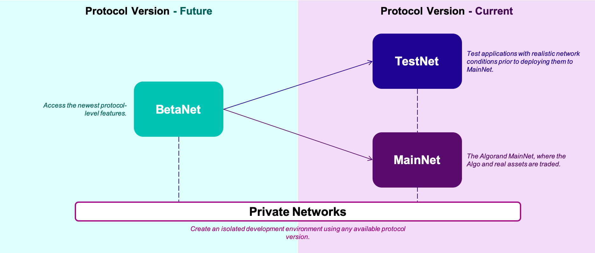

title: Overview

Algorand has three public networks: [**MainNet**](mainnet), [**TestNet**](testnet), and [**BetaNet**](betanet). This section provides details about each of these networks that will help you validate the integrity of your connection to them. 

**Diagram of the relationship between the three public networks.**

Each network page, contains the following information:

- **What's New** ([M](mainnet#whats-new), [T](testnet#whats-new), [B](betanet#whats-new))- An optional section where new features are highlighted with links to accompanying documentation.
- **Version** ([M](mainnet#version), [T](testnet#version), [B](betanet#version)) - The latest protocol software version.  Should match `goal -v` or `GET /versions` [build version](/docs/rest-apis/algod#buildversion).
- **Release Version** ([M](mainnet#release-version), [T](testnet#release-version), [B](betanet#release-version)) - A link to the official release notes where you can view all the latest changes.
- **Genesis ID** ([M](mainnet#genesis-id), [T](testnet#genesis-id), [B](betanet#genesis-id)) - A human-readable identifier for the network. This should not be used as a unique identifier.
- **Genesis Hash** ([M](mainnet#genesis-hash), [T](testnet#genesis-hash), [B](betanet#genesis-hash)) - The unique identifier for the network, present in every transaction. Validate that your transactions match the network you plan to submit them to.
- **FeeSink Address** ([M](mainnet#feesink-address), [T](testnet#feesink-address), [B](betanet#feesink-address)) - Read more about special accounts [here](/docs/get-details/accounts#special-accounts).
- **RewardsPool Address** ([M](mainnet#rewardspool-address), [T](testnet#rewardspool-address), [B](betanet#rewardspool-address)) - Read more about special accounts [here](../accounts#special-accounts).
- **Faucet** ([T](testnet#faucet), [B](betanet#faucet)) - Link to a faucet (TestNet and BetaNet only).

