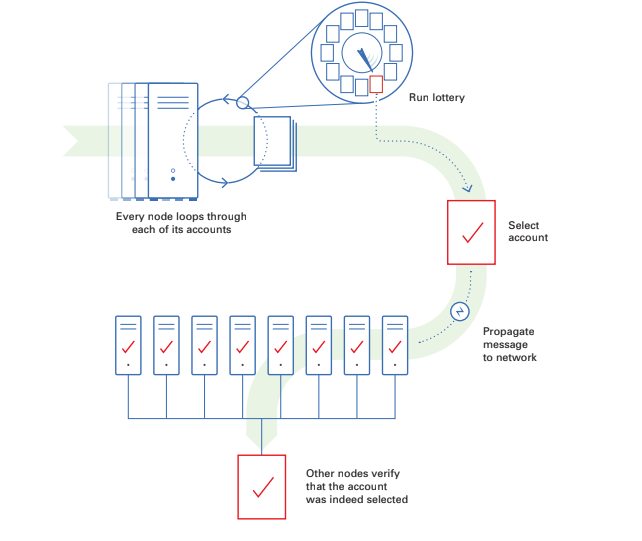
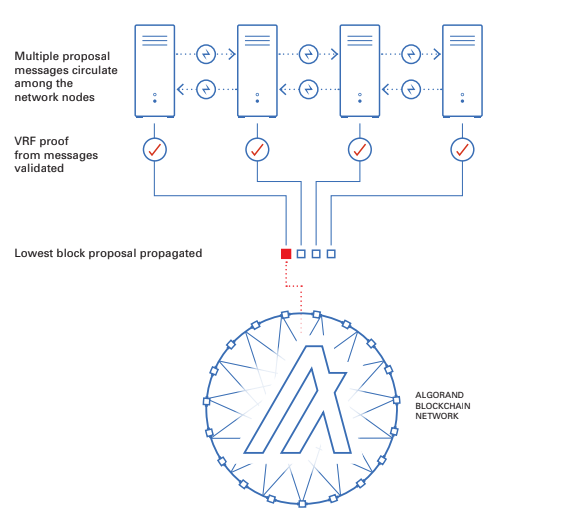
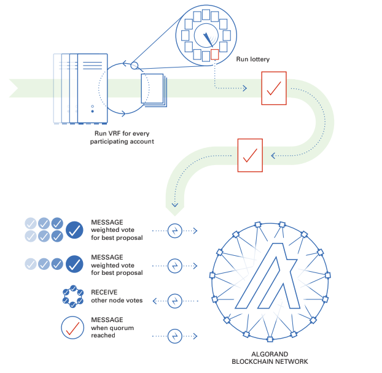
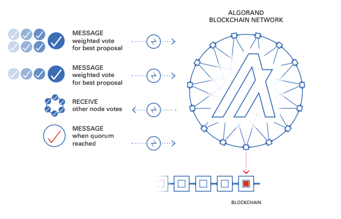

title: Algorand consensus

The Algorand blockchain uses a decentralized Byzantine Agreement protocol that leverages pure proof of stake (Pure POS). This means that it can tolerate malicious users, achieving consensus without a central authority, as long as a supermajority of the stake is in non-malicious hands. This protocol is very fast and requires minimal computational power per node, giving it the ability to finalize transactions efficiently. 

Before getting into detail on the protocol, we discuss two functional concepts that Algorand uses. This is a simplified version of the protocol that covers the ideal conditions. For all technical details see the white paper<LINK> or the source code<LINK>.

# Verifiable Random Function
Recently we released the source code<LINK> for our implementation of a Verifiable Random Function (VRF). The VRF takes a secret key and a value and produces a pseudorandom output, with a proof that anyone can use to verify the result. The VRF functions similar to a lottery and is used to choose leaders to propose a block and committee members to vote on a block. This VRF output, when executed for an account, is used to sample from a binomial distribution<LINK> to emulate a call for every algo in a user’s account. The more algos in an account, the greater chance the account has of being selected -- it’s as if every algo in an account participates in its own lottery. This method ensures that a user does not gain any advantage by creating multiple accounts.

# Participation Keys
A user account must be online to participate in the consensus protocol. To reduce exposure, online users do not use their spending keys (i.e., the keys they use to sign transactions) for consensus. Instead, a user generates and registers a participation key for a certain number of rounds.  It also generates a collection of ephemeral keys, one for each round, signs these keys with the participation key, and then deletes the participation key. Each ephemeral key is used to sign messages for the corresponding round, and is deleted after the round is over. Using participation keys ensures that a user's tokens are secure even if their participating node is compromised. Deleting the participation and ephemeral keys after they are used ensures that the blockchain is forward-secure and cannot be compromised by attacks on old blocks using old keys. 

# State Proof Keys
As of go-algorand 3.4.2 (released March 2022), users also generate a state proof key, with associated ephemeral keys, alongside their participation keys. State proof keys will be used to generate Post-Quantum secure state proofs that attest to the state of the blockchain at different points in time. These will be useful for applications that want a portable, lightweight way to cryptographically verify Algorand state without running a full participation node.

# The Algorand Consensus Protocol
Consensus refers to the way blocks are selected and written to the blockchain. Algorand uses the VRF described above to select leaders to propose blocks for a given round. When a block is proposed to the blockchain, a committee of voters is selected to vote on the block proposal.  If a super majority of the votes are from honest participants, the block can be certified. What makes this algorithm a Pure Proof of Stake is that users are chosen for committees based on the number of algos in their accounts. Committees are made up of pseudorandomly selected accounts with voting power dependent on their online stake. It is as if every token gets an execution of the VRF. Users with more tokens are likely to be selected more. For a committee membership this means higher stake accounts will most likely have more votes than a selected account with less tokens. Using randomly selected committees allows the protocol to still have good performance while allowing anyone in the network to participate.

Consensus requires three steps to propose, confirm and write the block to the blockchain. These steps are: 1) propose, 2) soft vote and 3) certify vote. Each is described below, assuming the ideal case when there are no malicious users and the network is not partitioned (i.e., none of the network is down due to technical issues or from DDoS attacks). Note that all messages are cryptographically signed with the user’s participation key and committee membership is verified using the VRF in these steps.

# Block Proposal
In the block proposal phase, accounts are selected to propose new blocks to the network. This phase starts with every node in the network looping through each online account for which it has valid participation keys, running Algorand’s VRF to determine if the account is selected to propose the block. The VRF acts similar to a weighted lottery where the number of Algos that the account has participating online determines the account’s chance of being selected. Once an account is selected by the VRF, the node propagates the proposed block along with the VRF output, which proves that the account is a valid proposer. We then move from the propose step to the soft vote step.

*Block Proposal*

# Soft Vote
The purpose of this phase is to filter the number of proposals down to one, guaranteeing that only one block gets certified. Each node in the network will get many proposal messages from other nodes. Nodes will verify the signature of the message and then validate the selection using the VRF proof. Next, the node will compare the hash from each validated winner’s VRF proof to determine which is the lowest and will only propagate the block proposal with the lowest VRF hash. This process continues for a fixed amount of time to allow votes to be propagated across the network. 

*Soft Vote Part 1*

Each node will then run the VRF for every participating account it manages to see if they have been chosen to participate in the soft vote committee. If any account is chosen it will have a weighted vote based on the number of Algos the account has, and these votes will be propagated to the network. These votes will be for the lowest VRF block proposal calculated at the timeout and will be sent out to the other nodes along with the VRF Proof.

*Soft Vote Part 2*

A new committee is selected for every step in the process and each step has a different committee size. This committee size is quantified in algos.  A quorum of votes is needed to move to the next step and must be a certain percentage of the expected committee size. These votes will be received from other nodes on the network and each node will validate the committee membership VRF proof before adding to the vote tally. Once a quorum is reached for the soft vote the process moves to the certify vote step.

# Certify Vote
A new committee checks the block proposal that was voted on in the soft vote stage for overspending, double-spending, or any other problems. If valid, the new committee votes again to certify the block. This is done in a similar manner as the soft vote where each node iterates through its managed accounts to select a committee and to send votes. These votes are collected and validated by each node until a quorum is reached, triggering an end to the round and prompting the node to create a certificate for the block and write it to the ledger. At that point, a new round is initiated and the process starts over.

*Certify Vote*

If a quorum is not reached in a certifying committee vote by a certain timeout then the network will enter recovery mode.
