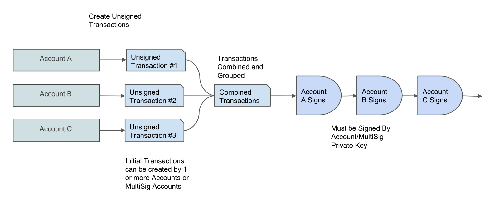

title: Atomic transfers

In traditional finance, trading assets generally requires a trusted intermediary, like a bank or an exchange, to make sure that both sides receive what they agreed to. On the Algorand blockchain, this type of trade is implemented within the protocol as an **Atomic Transfer**. This simply means that transactions that are part of the transfer either all succeed or all fail. Atomic transfers allow complete strangers to trade assets without the need for a trusted intermediary, all while guaranteeing that each party will receive what they agreed to. 

On Algorand, atomic transfers are implemented as irreducible batch operations, where a group of [transactions](../transactions) are submitted as a unit and all transactions in the batch either pass or fail. This also eliminates the need for more complex solutions like [hashed timelock contracts](https://en.bitcoinwiki.org/wiki/Hashed_Timelock_Contracts) that are implemented on other blockchains. An atomic transfer on Algorand is confirmed in less than 4 seconds, just like any other transaction. Transactions can contain Algos or Algorand Standard Assets and may also be governed by Algorand Smart Contracts. 

# Quick start videos

If you prefer videos, take a look at this 10 minute guide to learn about Atomic Transactions.

<iframe width="100%" style="aspect-ratio:16/9" src="https://www.youtube-nocookie.com/embed/65I0wyq7XoI" title="YouTube video player" frameborder="0" allow="accelerometer; autoplay; clipboard-write; encrypted-media; gyroscope; picture-in-picture; web-share" allowfullscreen></iframe>

# Use cases

Atomic transfers enable use cases such as:

**Circular trades** - Alice pays Bob if and only if Bob pays Claire if and only if Claire pays Alice.

**Group payments** - Everyone pays or no one pays.

**Decentralized exchanges** - Trade one asset for another without going through a centralized exchange. 

**Distributed payments** - Payments to multiple recipients. 

**Pooled transaction fees** - One transaction pays the fees of others. 

# Process overview

To implement an atomic transfer, generate all of the transactions that will be involved in the transfer and then group those transactions together. The result of grouping is that each transaction is assigned the same group ID. Once all transactions contain this group ID, the transactions can be split up and sent to their respective senders to be authorized. A single party can then collect all the authorized transactions and submit them to the network together. 

!!! info
    An individual account involved in an atomic transfer can verify that all the correct transfers are involved by creating the same set of [unsigned] transactions and grouping them in the same order. The group ID is a hash of the group of transactions and should match if the configuration is the same.

<center></center>
<center>*Atomic Transfer Flow*</center>

Below you will find examples for creating and sending group transactions to the network in each of the available SDKs and with `goal`. 

!!! tip
    The following processes may be simplified with the SDKs use of the [atomic transaction composer (ATC)](atc.md). The ATC supports ABI compliant smart contract calls with Argument and Return Value encoding/decoding.

# Step-by-step guide

## Create transactions
Create two or more (up to 16 total) unsigned transactions of any type. Read about transaction types in the [Transactions Overview](../transactions) section. 

This could be done by a service or by each party involved in the transaction. For example, an asset exchange application can create the entire atomic transfer and allow individual parties to sign from their location.

The example below illustrates creating, grouping, and signing transactions atomically and submitting to the network.


=== "JavaScript"
    <!-- ===JSSDK_ATOMIC_CREATE_TXNS=== -->
	```javascript
	const suggestedParams = await client.getTransactionParams().do();
	
	const alicesTxn = algosdk.makePaymentTxnWithSuggestedParamsFromObject({
	  from: acct1.addr,
	  to: acct2.addr,
	  amount: 1e6,
	  suggestedParams,
	});
	
	const bobsTxn = algosdk.makePaymentTxnWithSuggestedParamsFromObject({
	  from: acct2.addr,
	  to: acct1.addr,
	  amount: 1e6,
	  suggestedParams,
	});
	```
	[Snippet Source](https://github.com/algorand/js-algorand-sdk/blob/examples/examples/atomics.ts#L15-L30)
    <!-- ===JSSDK_ATOMIC_CREATE_TXNS=== -->

=== "Python"
    <!-- ===PYSDK_ATOMIC_CREATE_TXNS=== -->
	```python
	# payment from account 1 to account 2
	txn_1 = transaction.PaymentTxn(addr1, suggested_params, addr2, 100000)
	# payment from account 2 to account 1
	txn_2 = transaction.PaymentTxn(addr2, suggested_params, addr1, 200000)
	```
	[Snippet Source](https://github.com/algorand/py-algorand-sdk/blob/examples/examples/atomic_transfers.py#L16-L20)
    <!-- ===PYSDK_ATOMIC_CREATE_TXNS=== -->

=== "Java"
    <!-- ===JAVASDK_ATOMIC_CREATE_TXNS=== -->
	```java
	Response<TransactionParametersResponse> rsp = algodClient.TransactionParams().execute();
	
	// payment from account 1 to account 2
	Transaction ptxn1 = Transaction.PaymentTransactionBuilder().sender(acct1.getAddress())
	                .amount(1000000).receiver(acct2.getAddress()).suggestedParams(rsp.body()).build();
	// txn_1 = transaction.PaymentTxn(addr1, suggested_params, addr2, 100000)
	
	// payment from account 2 to account 1
	Transaction ptxn2 = Transaction.PaymentTransactionBuilder().sender(acct2.getAddress())
	                .amount(2000000).receiver(acct1.getAddress()).suggestedParams(rsp.body()).build();
	```
	[Snippet Source](https://github.com/algorand/java-algorand-sdk/blob/examples/examples/src/main/java/com/algorand/examples/AtomicTransfers.java#L26-L36)
    <!-- ===JAVASDK_ATOMIC_CREATE_TXNS=== -->

=== "Go"
    <!-- ===GOSDK_ATOMIC_CREATE_TXNS=== -->
	```go
	sp, err := algodClient.SuggestedParams().Do(context.Background())
	if err != nil {
		log.Fatalf("failed to get suggested params: %s", err)
	}
	
	tx1, err := transaction.MakePaymentTxn(acct1.Address.String(), acct2.Address.String(), 100000, nil, "", sp)
	if err != nil {
		log.Fatalf("failed creating transaction: %s", err)
	}
	
	// from account 2 to account 1
	tx2, err := transaction.MakePaymentTxn(acct2.Address.String(), acct1.Address.String(), 100000, nil, "", sp)
	if err != nil {
		log.Fatalf("failed creating transaction: %s", err)
	}
	```
	[Snippet Source](https://github.com/algorand/go-algorand-sdk/blob/examples/examples/atomic_transactions/main.go#L24-L39)
    <!-- ===GOSDK_ATOMIC_CREATE_TXNS=== -->

=== "goal"
    <!-- ===GOAL_ATOMIC_CREATE_TXNS=== -->
	``` goal
    $ goal clerk send --from=my-account-a<PLACEHOLDER> --to=my-account-c<PLACEHOLDER> --fee=1000 --amount=100000 --out=unsginedtransaction1.txn"

    $ goal clerk send --from=my-account-b<PLACEHOLDER> --to=my-account-a<PLACEHOLDER> --fee=1000 --amount=200000 --out=unsginedtransaction2.txn"
    ```
    <!-- ===GOAL_ATOMIC_CREATE_TXNS=== -->

At this point, these are just individual transactions. The next critical step is to combine them and then calculate the group ID.

See [Authorizing Transactions Offline](../transactions/offline_transactions#saving-unsigned-transactions-to-file) to learn how to create and save individual **unsigned** transactions to a file. This method can be used to distribute group transactions for signing.

## Group transactions

The result of this step is what ultimately guarantees that a particular transaction belongs to a group and is not valid if sent alone (even if properly signed). A group-id is calculated by hashing the concatenation of a set of related transactions. The resulting hash is assigned to the [Group](../transactions/transactions#group) field within each transaction. This mechanism allows anyone to recreate all transactions and recalculate the group ID to verify that the contents are as agreed upon by all parties. Ordering of the transaction set must be maintained.

=== "JavaScript"
    <!-- ===JSSDK_ATOMIC_GROUP_TXNS=== --->
	```javascript
	const txnArray = [alicesTxn, bobsTxn];
	// assignGroupID returns the same txns with the group ID set
	const txnGroup = algosdk.assignGroupID(txnArray);
	```
	[Snippet Source](https://github.com/algorand/js-algorand-sdk/blob/examples/examples/atomics.ts#L33-L36)
    <!-- ===JSSDK_ATOMIC_GROUP_TXNS=== --->

=== "Python"
    <!-- ===PYSDK_ATOMIC_GROUP_TXNS=== --->
	```python
	# Assign group id to the transactions (order matters!)
	transaction.assign_group_id([txn_1, txn_2])
	# Or, equivalently
	# get group id and assign it to transactions
	# gid = transaction.calculate_group_id([txn_1, txn_2])
	# txn_1.group = gid
	# txn_2.group = gid
	```
	[Snippet Source](https://github.com/algorand/py-algorand-sdk/blob/examples/examples/atomic_transfers.py#L24-L31)
    <!-- ===PYSDK_ATOMIC_GROUP_TXNS=== --->

=== "Java"
    <!-- ===JAVASDK_ATOMIC_GROUP_TXNS=== --->
	```java
	// Assign group id to the transactions (order matters!)
	Transaction[] txs = TxGroup.assignGroupID(ptxn1, ptxn2);
	
	// Or, equivalently
	// compute group id and assign it to transactions
	Digest gid = TxGroup.computeGroupID(txs);
	ptxn1.group = gid;
	ptxn2.group = gid;
	```
	[Snippet Source](https://github.com/algorand/java-algorand-sdk/blob/examples/examples/src/main/java/com/algorand/examples/AtomicTransfers.java#L39-L47)
    <!-- ===JAVASDK_ATOMIC_GROUP_TXNS=== --->

=== "Go"
    <!-- ===GOSDK_ATOMIC_GROUP_TXNS=== --->
	```go
	// compute group id and put it into each transaction
	gid, _ := crypto.ComputeGroupID([]types.Transaction{tx1, tx2})
	tx1.Group = gid
	tx2.Group = gid
	```
	[Snippet Source](https://github.com/algorand/go-algorand-sdk/blob/examples/examples/atomic_transactions/main.go#L42-L46)
    <!-- ===GOSDK_ATOMIC_GROUP_TXNS=== --->

=== "goal"
    <!-- ===GOAL_ATOMIC_GROUP_TXNS=== --->
	```goal
    $ cat unsignedtransaction1.tx unsignedtransaction2.tx > combinedtransactions.tx
    $ goal clerk group -i combinedtransactions.tx -o groupedtransactions.tx -d data -w yourwallet 
    ```
    <!-- ===GOAL_ATOMIC_GROUP_TXNS=== --->

## Split transactions (Goal only)

At this point the transaction set must be split to allow distributing each component transaction to the appropriate wallet for authorization. 

=== "goal"
    <!-- ===GOAL_ATOMIC_GROUP_SPLIT=== -->
	```goal
    # keys in distinct wallets
    $ goal clerk split -i groupedtransactions.tx -o splitfiles -d data -w yourwallet 

    Wrote transaction 0 to splitfiles-0
    Wrote transaction 1 to splitfiles-1

    # distribute files for authorization
    ```
    <!-- ===GOAL_ATOMIC_GROUP_SPLIT=== -->

## Sign transactions
With a group ID assigned, each transaction sender must authorize their respective transaction. 

=== "JavaScript"
    <!-- ===JSSDK_ATOMIC_GROUP_SIGN=== -->
	```javascript
	const alicesSignedTxn = txnGroup[0].signTxn(acct1.privateKey);
	const bobsSignedTxn = txnGroup[1].signTxn(acct2.privateKey);
	```
	[Snippet Source](https://github.com/algorand/js-algorand-sdk/blob/examples/examples/atomics.ts#L39-L41)
    <!-- ===JSSDK_ATOMIC_GROUP_SIGN=== -->

=== "Python"
    <!-- ===PYSDK_ATOMIC_GROUP_SIGN=== -->
	```python
	# sign transactions
	stxn_1 = txn_1.sign(sk1)
	stxn_2 = txn_2.sign(sk2)
	```
	[Snippet Source](https://github.com/algorand/py-algorand-sdk/blob/examples/examples/atomic_transfers.py#L34-L37)
    <!-- ===PYSDK_ATOMIC_GROUP_SIGN=== -->

=== "Java"
    <!-- ===JAVASDK_ATOMIC_GROUP_SIGN=== -->
	```java
	// sign transactions
	SignedTransaction signedPtxn1 = acct1.signTransaction(ptxn1);
	SignedTransaction signedPtxn2 = acct2.signTransaction(ptxn2);
	```
	[Snippet Source](https://github.com/algorand/java-algorand-sdk/blob/examples/examples/src/main/java/com/algorand/examples/AtomicTransfers.java#L50-L53)
    <!-- ===JAVASDK_ATOMIC_GROUP_SIGN=== -->

=== "Go"
    <!-- ===GOSDK_ATOMIC_GROUP_SIGN=== -->
	```go
	_, stx1, err := crypto.SignTransaction(acct1.PrivateKey, tx1)
	if err != nil {
		fmt.Printf("Failed to sign transaction: %s\n", err)
		return
	}
	_, stx2, err := crypto.SignTransaction(acct2.PrivateKey, tx2)
	if err != nil {
		fmt.Printf("Failed to sign transaction: %s\n", err)
	}
	```
	[Snippet Source](https://github.com/algorand/go-algorand-sdk/blob/examples/examples/atomic_transactions/main.go#L49-L58)
    <!-- ===GOSDK_ATOMIC_GROUP_SIGN=== -->

=== "goal"
    <!-- ===GOAL_ATOMIC_GROUP_SIGN=== -->
	```goal
    # sign from single wallet containing all keys
    $ goal clerk sign -i groupedtransactions.tx -o signout.tx -d data -w yourwallet

    # -- OR --

    # sign from distinct wallets
    $ goal clerk sign -i splitfiles-0 -o splitfiles-0.sig -d data -w my_wallet_1
    $ goal clerk sign -i splitfiles-1 -o splitfiles-1.sig -d data -w my_wallet_2
    ```
    <!-- ===GOAL_ATOMIC_GROUP_SIGN=== -->

## Assemble transaction group

All authorized transactions are now assembled into an array, maintaining the original transaction ordering, which represents the transaction group.

=== "JavaScript"
    <!-- ===JSSDK_ATOMIC_GROUP_ASSEMBLE=== -->
	```javascript
	const signedTxns = [alicesSignedTxn, bobsSignedTxn];
	```
	[Snippet Source](https://github.com/algorand/js-algorand-sdk/blob/examples/examples/atomics.ts#L44-L45)
    <!-- ===JSSDK_ATOMIC_GROUP_ASSEMBLE=== -->

=== "Python"
    <!-- ===PYSDK_ATOMIC_GROUP_ASSEMBLE=== -->
	```python
	# combine the signed transactions into a single list
	signed_group = [stxn_1, stxn_2]
	```
	[Snippet Source](https://github.com/algorand/py-algorand-sdk/blob/examples/examples/atomic_transfers.py#L40-L42)
    <!-- ===PYSDK_ATOMIC_GROUP_ASSEMBLE=== -->

=== "Java"
    <!-- ===JAVASDK_ATOMIC_GROUP_ASSEMBLE=== -->
	```java
	// combine the signed transactions into a single list
	SignedTransaction[] stxns = new SignedTransaction[] { signedPtxn1, signedPtxn2 };
	```
	[Snippet Source](https://github.com/algorand/java-algorand-sdk/blob/examples/examples/src/main/java/com/algorand/examples/AtomicTransfers.java#L56-L58)
    <!-- ===JAVASDK_ATOMIC_GROUP_ASSEMBLE=== -->

=== "Go"
    <!-- ===GOSDK_ATOMIC_GROUP_ASSEMBLE=== -->
	```go
	var signedGroup []byte
	signedGroup = append(signedGroup, stx1...)
	signedGroup = append(signedGroup, stx2...)
	
	```
	[Snippet Source](https://github.com/algorand/go-algorand-sdk/blob/examples/examples/atomic_transactions/main.go#L61-L65)
    <!-- ===GOSDK_ATOMIC_GROUP_ASSEMBLE=== -->

=== "goal"
    <!-- ===GOAL_ATOMIC_GROUP_ASSEMBLE=== -->
	``` goal
    # combine signed transactions files
    cat splitfiles-0.sig splitfiles-1.sig > signout.tx
    ```
    <!-- ===GOAL_ATOMIC_GROUP_ASSEMBLE=== -->

## Send transaction group
The transaction group is now broadcast to the network. 

=== "JavaScript"
    <!-- ===JSSDK_ATOMIC_GROUP_SEND=== -->
	```javascript
	await client.sendRawTransaction(signedTxns).do();
	await algosdk.waitForConfirmation(client, alicesTxn.txID().toString(), 3);
	```
	[Snippet Source](https://github.com/algorand/js-algorand-sdk/blob/examples/examples/atomics.ts#L48-L50)
    <!-- ===JSSDK_ATOMIC_GROUP_SEND=== -->

=== "Python"
    <!-- ===PYSDK_ATOMIC_GROUP_SEND=== -->
	```python
	
	# Only the first transaction id is returned
	tx_id = algod_client.send_transactions(signed_group)
	
	# wait for confirmation
	result: Dict[str, Any] = transaction.wait_for_confirmation(
	    algod_client, tx_id, 4
	)
	print(f"txID: {tx_id} confirmed in round: {result.get('confirmed-round', 0)}")
	```
	[Snippet Source](https://github.com/algorand/py-algorand-sdk/blob/examples/examples/atomic_transfers.py#L45-L54)
    <!-- ===PYSDK_ATOMIC_GROUP_SEND=== -->

=== "Java"
    <!-- ===JAVASDK_ATOMIC_GROUP_SEND=== -->
	```java
	// Only the first transaction id is returned
	Response<PostTransactionsResponse> txResponse = algodClient.RawTransaction()
	                .rawtxn(Encoder.encodeToMsgPack(stxns)).execute();
	String txid = txResponse.body().txId;
	
	// Wait for the transaction id to be confirmed
	// If the results from other transactions are needed, grab the txid from those
	// directly and
	// call waitForConfirmation on each
	PendingTransactionResponse txResult = Utils.waitForConfirmation(algodClient, txid, 4);
	System.out.printf("Transaction %s confirmed in round %d\n", txid, txResult.confirmedRound);
	```
	[Snippet Source](https://github.com/algorand/java-algorand-sdk/blob/examples/examples/src/main/java/com/algorand/examples/AtomicTransfers.java#L61-L72)
    <!-- ===JAVASDK_ATOMIC_GROUP_SEND=== -->

=== "Go"
    <!-- ===GOSDK_ATOMIC_GROUP_SEND=== -->
	```go
	pendingTxID, err := algodClient.SendRawTransaction(signedGroup).Do(context.Background())
	if err != nil {
		fmt.Printf("failed to send transaction: %s\n", err)
		return
	}
	confirmedTxn, err := transaction.WaitForConfirmation(algodClient, pendingTxID, 4, context.Background())
	if err != nil {
		fmt.Printf("Error waiting for confirmation on txID: %s\n", pendingTxID)
		return
	}
	fmt.Printf("Confirmed Transaction: %s in Round %d\n", pendingTxID, confirmedTxn.ConfirmedRound)
	```
	[Snippet Source](https://github.com/algorand/go-algorand-sdk/blob/examples/examples/atomic_transactions/main.go#L68-L79)
    <!-- ===GOSDK_ATOMIC_GROUP_SEND=== -->

=== "goal"
    <!-- ===GOAL_ATOMIC_GROUP_SEND=== -->
	```goal
    goal clerk rawsend -f signout.tx -d data -w yourwallet
    ```
    <!-- ===GOAL_ATOMIC_GROUP_SEND=== -->