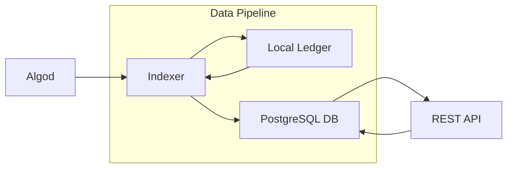
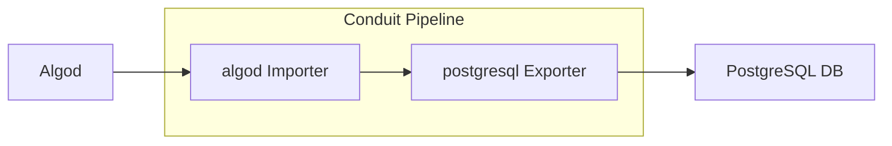
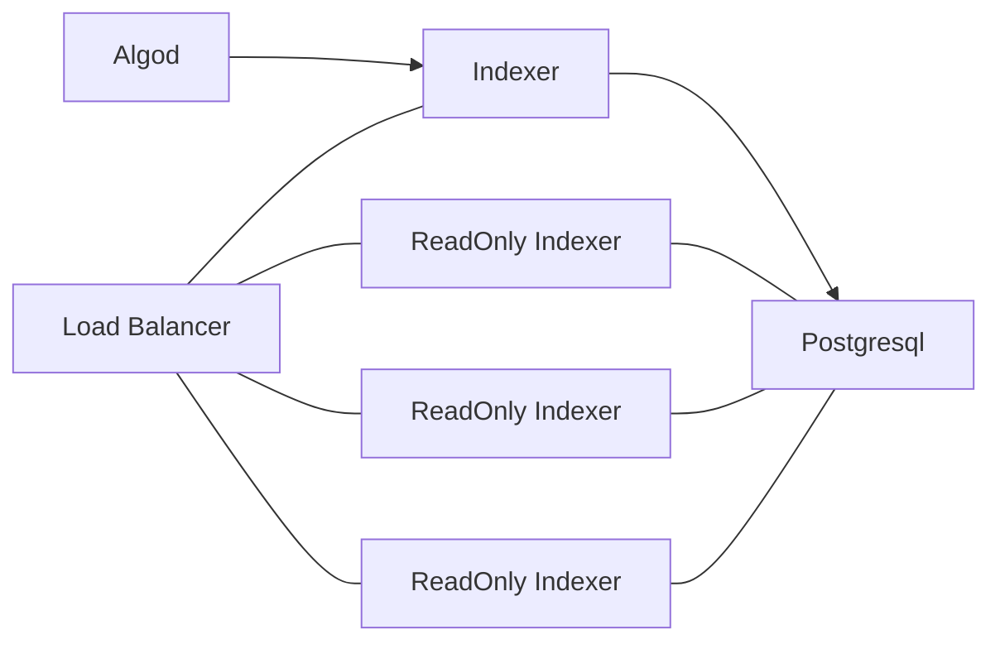
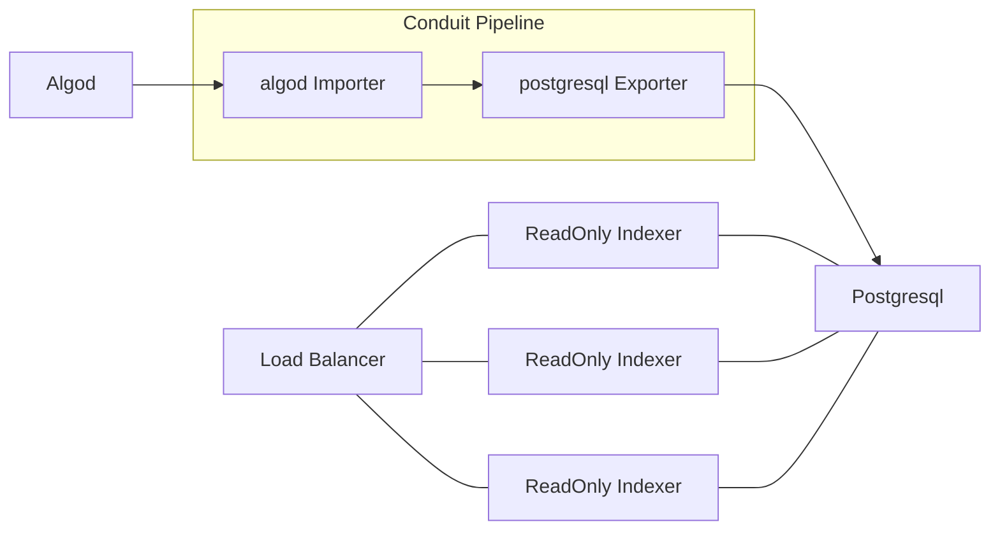
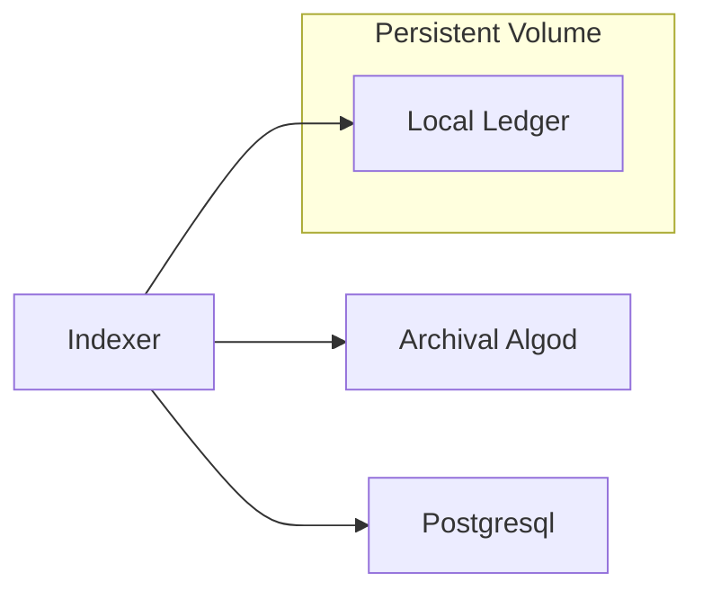

# Migrating from Indexer to Conduit

The first part of this document gives an overview and background on Indexer and Conduit architectures. To skip directly
to the migration instructions, see [the overview on altering indexer applications.](#altering-architecture-of-indexer-applications)

The [Algorand Indexer](https://github.com/algorand/indexer) originally provided both a block processing pipeline to ingest block
data from an Algorand node into a Postgresql database, and a REST API which serves that data. However, the block
processing pipeline functionality from Indexer has been moved into, and will be maintained in, Conduit.

The [Conduit](https://github.com/algorand/conduit) project provides a modular pipeline
system allowing users to construct block processing pipelines for a variety of use cases as opposed to the single,
bespoke pipeline from the original Indexer.

## Migration
Talking about a migration from Indexer to Conduit is in some ways difficult because they only have partial overlap in
their applications. For example, Conduit does _not_ currently include a REST API either for checking pipeline health
or for serving data from the pipeline. So when we talk about migrating from Indexer to Conduit, what we'll focus on is
moving your postgresql block writing from the Indexer binary to Conduit.

Here is the Indexer architecture diagram at a high level. The raw block data is enriched by the account data retrieved
from the local ledger, and everything is written to Postgresql which can then be queried via the API.


However, Conduit was built to generalize and modularize a lot of the tasks which Indexer does when ingesting block data
into its database. For that reason you can swap out the core data pipeline in Indexer with an equivalent Conduit
pipeline--and that's just what we've done (with some caveats discussed below)!



## Adopting Conduit features in your Indexer pipeline

Since Indexer users will now use Conduit for its data pipeline, the continued development of the postgresql exporter
and the algod importer, will be done in the Conduit repository. You can even start using new features from Conduit,
or new plugins to customize, filter, or further enrich the block data which the Indexer API serves.
Or you can change the type of DB used in the backend and write your own API on top of that.

A common deployment of the Indexer might look something like this.

Because the database connection can only tolerate a single writer without having race conditions and/or deadlocks,
Indexer offers a read-only mode which does not run the data pipeline and has no write access to the database. It's
common to use the read only mode to scale out the REST API--running multiple web servers behind a load balancer as is
shown in the diagram.


Separating the data pipeline from the Indexer when using this setup was simple--take Indexer's data pipeline, and run
it using the Conduit binary. Take a look at the [getting started guide](../GettingStarted.md) for more information on
installing and running Conduit.

We still plan on supporting the Indexer API alongside Conduit--that means that any changes made to the Postgresql plugin
will either be backwards compatible with the Indexer API, and/or have corresponding fixes in Indexer.

Here is our architecture diagram with Conduit as our data pipeline.


With this architecture you're free to do things like use filter processors to limit the size of your database--though
doing this will affect how some Indexer APIs function.

## Differences Between Existing Indexer Writer and Conduit

Conduit fetches block data from algod just as Indexer did, but whereas Indexer required an Archival algod node so that
it could fetch any block it needed, Conduit's algod importer is not required to be Archival. Instead, we've implemented
what is called Follower mode in algod. You can take a look [here](https://github.com/algorand/go-algorand/blob/master/node/follower_node.go)
if you're interested in looking at the source code for the follower node.

To run algod in Follower mode, it must be launched with `EnableFollowMode` set to `true` in the algod config.  
Doing this will provide the new features listed below, but will remove the node's ability to participate in consensus
(propose new blocks), or broadcast transactions to be included in new blocks. It will only, as hinted by its name, follow the chain.

Follower mode algod provides 2 key features required by Conduit.

### Sync Rounds
In order to remove the requirement of algod being Archival, we needed a way to ensure that algod would have the data
available for the particular round that our Conduit pipeline was importing at any given time. We've done this through
the concept of a `sync` round. 

The sync round is a parameter which Conduit provides to algod. It specifies the particular round that we want algod to
ensure is kept in the cache until we've finished running it through our Conduit pipeline. When a sync round is set on a
Follower node, that node will no-op network fetches of new blocks for any block which would cause data on the sync round
to fall out of the cache.

Sync rounds operate via a set of APIs on algod.

#### [`GET    /v2/ledger/sync`](https://developer.algorand.org/docs/rest-apis/algod/#get-v2ledgersync)
Retrieves the sync round.

#### [`DELETE /v2/ledger/sync`](https://developer.algorand.org/docs/rest-apis/algod/#delete-v2ledgersync)
Removes the sync round constraint.

#### [`POST   /v2/ledger/sync/{round}`](https://developer.algorand.org/docs/rest-apis/algod/#post-v2ledgersyncround)
Sets the sync round to the provided parameter. The provided sync round cannot be lower than the current sync round.
If no sync round is currently set, the round must be within `MaxAcctLookback` of the ledger's current round at the time
of the API call.

### State Deltas
The algod `block/{round}` endpoint has always been available to retrieve the block header and the transactions which
were validated during a given round, but Indexer also needs to know the side effects of transaction execution--account
balance updates, app global and local state changes, etc.

Indexer currently uses a local ledger to get this information, which is a stripped down version of an algod node that stores
balance information locally, and evaluates transactions in order to determine changes made without having to do an
extra database roundtrip.

We've created a new API on algod, `GET v2/deltas/{round}`, which exposes per-round deltas. It is a direct serialization
of the data which is stored in the cache in algod, and it is backward compatible with the postgresql serialization that
the Indexer database currently uses.

Now instead of running a local ledger, all that is required to run an Indexer pipeline via Conduit is a Follower algod
node. Conduit's algod importer plugin will coordinate usage of both the sync round APIs and the deltas API in order to
fetch all required data directly from the algod node, and ensure that the node is kept in sync with the pipeline round.


## Altering Architecture of Indexer Applications

Let's take a look at a theoretical application more closely and see what in particular we need to do to alter it to use
Conduit. 

Here's a diagram of a containerized application (leaving out some details such as load balancers, and scaled out API
nodes).



### Step 1: Convert from Archival to Follower Node
In our hypothetical existing architecture, we likely have a persistent volume storing the algod data directory for our
Archival node. It is probably still a good idea to maintain the algod's data in a persistent volume, though the amount
of storage required will be minimal in comparison.


If you have an existing Archival node which is on the same round as your Indexer, you can simply stop algod, alter your
config as follows, and restart it. Interacting with algod is done primarily using the `goal` CLI. You can find more details
about installing and using `goal` in the [goal docs](https://developer.algorand.org/docs/clis/goal/goal/).
```bash
# Stop Algod
goal -d $ALGOD_DIR node stop
# Start Algod
goal -d $ALGOD_DIR node start
```
```yaml
Archival: false,
MaxAcctLookback: 256,
CatchupParallelBlocks: 32,
EnableFollowMode: true
```
Your node will then drop all but the last 1000 rounds from your database, and will have `2 * MaxAcctLookback`
rounds in its cache.

However, if your algod node's round is too far beyond your Indexer's you will need to catchup your node from scratch.
Follower nodes provide the same methods of catchup as regular algod nodes, but will have the sync round set to the most
recent ledger round upon startup. Thaht scenario will be covered in step 3.

### Step 2: Remove the Local Ledger
Because our Conduit pipeline will use the Follower node's state delta API, we no longer need our local ledger persistent 
volume. It can be removed.

### Step 3: Refactor our Indexer Writer to Conduit
You're free to capture any data you like using Conduit. I'd encourage you to take a look at the `filter processor` and see
if you can reduce the amount of data you store in your database by removing non-relevant data.

If you would like to maintain parity with the legacy Indexer, which stored all data, you can use the `conduit init` command to create
an initial Conduit config.
```
conduit init --importer algod --exporter postgresql --data new_data_dir
```
Here is an example of a basic config which runs the `algod` importer and `postgresql` exporter.
```yaml
retry-count: 10
retry-delay: "1s"
data-dir: $CONDUIT_DATA_DIR
next-round-override: $DB_ROUND
hide-banner: true
metrics:
  prefix: "conduit",
log-level: "INFO"
importer:
  name: "algod",
  config: 
    "netaddr": $ALGOD_ADDR,
    "token": $ALGOD_TOKEN,
    "mode": "follower",
    catchup-config:
        catchpoint: ""
        admin-token: ""
exporter:
  name: "postgresql",
  config:
    "connection-string": $PGSQL_CONNECTION_STRING,
```

If your algod node needs to run fast catchup, you can fill in the catchup-config section. You'll need to first look up your Indexer round from the postgres database. The Indexer stores the latest round in the database, and you can read it via the `/health` endpoint. The result is formatted in json
so you can use jq to more easily see your Indexer's round (if your Indexer is listening locally on port 8980).
```bash
curl http://localhost:8980/health | jq '.round'
```

Now that you can look up a catchpoint, conduit will run fast catchup on your node if a catchpoint is provided. Look up the closest catchpoint prior to the desired sync round. 
For a list of catchpoints, you can reference the following:
* [Mainnet](https://algorand-catchpoints.s3.us-east-2.amazonaws.com/consolidated/mainnet_catchpoints.txt)
* [Testnet](https://algorand-catchpoints.s3.us-east-2.amazonaws.com/consolidated/testnet_catchpoints.txt)
* [Betanet](https://algorand-catchpoints.s3.us-east-2.amazonaws.com/consolidated/betanet_catchpoints.txt)

For example, if your postgres database is on round 25001234, use the following configuration:
```yaml
    catchup-config:
        catchpoint: "25000000#EOX5UYQV4IXTGYQCIDR7ZLUK6WZGDC5EG6PYQGBG6PBYNAQUPN2Q"
        admin-token: "$ALGOD_ADMIN_TOKEN"
```

Then run Conduit, `conduit -d $CONDUIT_DATA_DIR`!

You can separately run your Indexer with `--no-algod` to connect your API to the database.

If you configured a catchpoint, Conduit will facilitate a fast catchup during initialization. Once the catchpoint has been reached the node will resume normal catchup to advance from the catchpoint round to target round defined in postgres. The fast-catchup and catchup process may take anywhere from 30 minutes to over an hour depending on hardware and disk configurations.
