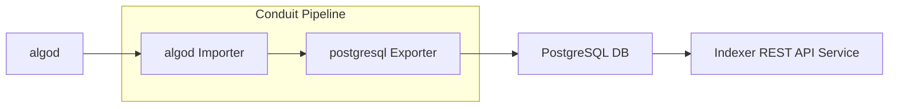

# Conduit Indexer Writer

This document explains how to configure and deploy Conduit to populate a
PostgreSLQ DB suitable to serve as a backend for the [Indexer](indexer-readme) API.  This is
not a production deployment. Treat this tutorial as an example configuration
or a development environment. Each of these components have their own
requirements for managing deployments, upgrades, scaling, and high
availability.

The components you will configure and deploy are:
* an algod node configured with follow mode.
* a PostgreSQL database.
* a Conduit pipeline configured to pull data from algod and push it to the PostgreSQL database.



## Pre-requisites

* Linux or Mac Operating System. At this time Windows is not supported by algod, so the bare metal installation described below will not work.
* Docker is used for the database, so the `docker` command is required.

## Algod

The blockchain data source. Algod is controlled by Conduit to ensure the two
services are always operating on the same block. In this way algod is able to
store a minimal subset of blockchain data required for streaming data through
Conduit.

We will cover a basic installation using `update.sh`, for [additional
information refer to the developer portal.](node-install-doc)

```bash
# Download update.sh script.
wget https://raw.githubusercontent.com/algorand/go-algorand/rel/stable/cmd/updater/update.sh

# Define which network to run on. This selects the correct genesis file.
# Options: mainnet, testnet, betanet, devnet
NETWORK=mainnet

# Download algod binaries and initialize data directory.
./update.sh -n -i -c stable -p bin -d algod_data -g $NETWORK

# Configure node to work with Conduit.
./bin/algocfg profile set conduit -d algod_data
```

At this stage you have all of the algod tools in `bin` and an `algod_data`
directory configured for Conduit with the desired network.

Start the node:
```bash
./bin/goal node start -d algod_data
```

## PostgreSQL

This document cannot go into the complete details for configuring your
database. PostgreSQL or a compatible database like Amazon Aurora are suitable
for the Indexer API. See the [Indexer](indexer-readme) documentation more details.

For this tutorial the process is simplified by using a local docker image. This will
launch a container:
```bash
docker run -d --name local-database -p 5555:5432 -e POSTGRES_PASSWORD=pgpass -e POSTGRES_USER=algorand -e POSTGRES_DB=conduit postgres
```

The credentials used are all required for the next step when configuring
Conduit:
* `PORT`: 5555
* `USER`: algorand
* `PASS`: pgpass
* `DB`: conduit

Note: shutdown and remove the database with the following commands:
```bash
~$ docker kill local-database
~$ docker rm local-database
```

## Conduit

Now configure Conduit to source data from `algod` and export to `PostgreSQL`.

Download the `conduit` command [from the releases page](conduit-release). Put
the binary in the current working directory, or install it to your path and use
normally.

Create Conduit data directory:
```bash
./conduit  init --importer algod --exporter postgresql --data conduit_data
```

This will set up a new Conduit data directory with a configuration template.
To finish the process, edit `conduit.yml` with the following changes. We'll
use dot notation to indicate a path in the config file. For example,
`importer.config.netaddr` refers to:
```yaml
importer:
  config:
    netaddr: "this field"
```

Configuration:
* `importer.config.netaddr`: the contents of `algod_data/algod.net`, with a `http://` prefix. Typically this defaults to `http://127.0.0.1:8080`.
* `importer.config.token`: the contents of `algod_data/algod.token`
* `exporter.config.connection-string`: `host=localhost port=5555 user=algorand password=pgpass dbname=conduit`

If you are connecting to an existing PostgreSQL database, you can also set a
catchpoint and the admin token. If those are set Conduit will automatically
initialize the node using fast catchup.

Review the inline documentation in `conduit.yml` and decide if there are any
other settings you would like to update.

At this point you may start Conduit with:
```bash
./conduit -d conduit_data
```

## Indexer API

With data in the PostgreSQL DB, you are now able to start a [read only Indexer API](indexer-read-only).

Download the `algorand-indexer` command [from the releases page](indexer-release). Put
the binary in the current working directory, or install it to your path and use
normally.

```bash
./algorand-indexer daemon -S ":8980" --data-dir /tmp --no-algod --postgres "host=localhost port=5555 user=algorand password=pgpass dbname=conduit"
```

And use it:
```bash
curl http://localhost:8980/v2/accounts
```

For details see the [Indexer README](indexer-readme) and the [Indexer API documentation](indexer-rest-api).

[node-install-doc]: https://developer.algorand.org/docs/run-a-node/setup/install/
[conduit-release]: https://github.com/algorand/conduit/releases
[indexer-readme]: https://github.com/algorand/indexer/#readme
[indexer-read-only]: https://github.com/algorand/indexer#read-only
[indexer-release]: https://github.com/algorand/indexer/releases
[indexer-rest-api]: https://developer.algorand.org/docs/rest-apis/indexer/
