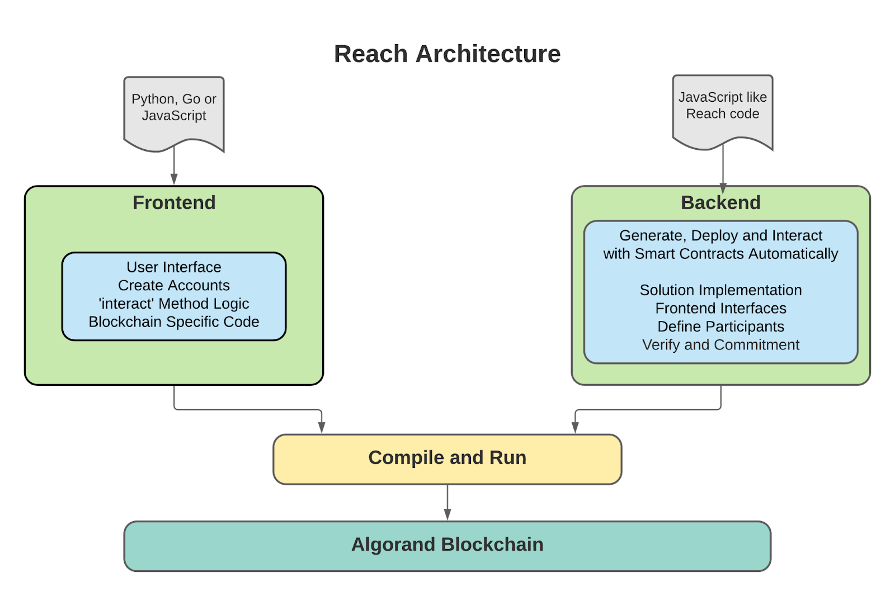

title: Reach

It’s all about the tools! Developers often need to pick and choose carefully which new technologies to learn when re-tooling or building dApps.  The desire is to use the best tools resulting in rapid development and quality of the solution. The challenge a developer typically has is spending resources to learn new tools while avoiding what many developer's fear most… investing time on a technology that becomes a white elephant. Ouch. Fear not, [Reach](https://reach.sh/) deploying to [Algorand](https://www.algorand.com/) is here to stay. Why?  With Reach, the automatic verification of a dApp, alone, is one great reason. This protects against blockchain attacks, guarantees contract balance is zero and prevents locked away tokens by the contract that are inaccessible. Reach facilitates blockchain properties, like token linearity. As such, auditing becomes very easy to accomplish. 

And there are more reasons to uese Reach. Using high level languages to build dApps instead of low level assembly language is attractive for many professional developers. A Reach dApp is blockchain agnostic. Frontends can be built in languages such as Python, Go, JavaScript and C#. The focus for a developer using Reach is the business logic. In other words, Reach takes care of the internals on contract storage, protocol diagrams, state validation and network details in general. 

This guide will cover a Reach overview, installation and Command Line Interface (CLI), environment variables, accounts, frontend and backend components. Also this document covers verification, auditing, mathematical proofs, cryptographic commitment scheme, timeouts and non-participation, logging, platform specific code, flow commands, Remote Procedure Calls (RPC) as well as debugging and how to deploy to TestNet and MainNet.


## Reach overview:

Reach is a Cross-Blockchain deployment and development tool.  The Reach frontend and backend provide a separation of concerns as a traditional Client / Server or N-tier architecture solution would do. This provides the ability to interact between the backend calling functions in the frontend. Reach deploys the dApp to the Algorand blockchain and provides verification via mathematical proofs and assertions. 

## Building the dApp, Backend and Frontend

The Backend provides the implementation of the dApp and determines what is published to the blockchain and how. The backend handles solution implementation, Frontend interfaces, Participant definitions, verification and commitment as well as dApp logic. The code for completed backend for the Morra solution below can be found in [index.rsh](https://github.com/algorand-devrel/Reach-Morra-Game/blob/main/morra2/index.rsh).

The Frontend provides a User Interface including prompts and a web and/or mobile app  frontend.  It provides functions on accounts such as creating accounts, interact method logic, dApp deployment and any blockchain-specific code. The frontend can be created in a variety of high level languages using RPC such as JavaScript, Python, Go and C# and deployed to platforms such as iOS, Android, websites and console apps. The code for the completed frontend for the Morra solution below can be found in [index.mjs](https://github.com/algorand-devrel/Reach-Morra-Game/blob/main/morra2/index.mjs).

The dApp is compiled and deployed to the Algorand Blockchain.  **Figure 1-1** below shows how all of the parts work together. 





**Figure 1-1** – Reach with Algorand

## Reach dApp Life Cycle:

The Application Life  Cycle for creating a dApp with Reach is done entirely within the product, unlike other blockchain development environments that typically include several different tools. 


* **Protocol Design** – Reach programming language
* **Smart Contract**– Reach compiler
* **Middleware** – Reach API
* **Frontend** – Build with JavaScript or RPC language support for Python, JavaScript, Go and C#
* **Testing** – Reach Run
* **Verification** – Every Reach compilation includes a thorough formal verification of the dApp using a SMT-based theorem prover.
* **Deployment** – Reach compiler configurations to deploy to Algorand Blockchain


## Install Reach and Command Line Interface

Reach can be installed on Windows or Mac OS. Docker install is a prerequisite. 

[Install Docker](https://www.docker.com/products/docker-desktop) 


For Windows: Enable the [Windows Subsystem for Linux ](https://docs.microsoft.com/en-us/windows/wsl/install)feature

In terminal run these commands:
```
mkdir -p ~/reach/project && cd ~/reach/project

curl https://docs.reach.sh/reach -o reach ; chmod +x reach
```

Detailed Reach install instructions can be found in the [reach docs](https://reach.sh/) or in the [getting started guide](..//..//..//get-started/dapps/reach.md).

Reach supports a [command line interface for development](https://docs.reach.sh/ref-usage.html). Reach Commands are as follows. 


| Command      | Description                                                                                                                                               |
| ------------ | ------------------------------------------------------------------------------------------------------------------------------------------------------------- |
| compile        | Compile an app.                                                                                                                                    |
| clean        | Delete compiled artifacts.                                                                                                                                    |
| init         | Set up source files for a simple app.                                                                                                                         |
| run          | Run a simple app.                                                                                                                                             |
| down         | Halt any Dockerized devnets for this app.                                                                                                                     |
| scaffold     | Set up Docker scaffolding for a simple app.                                                                                                                   |
| react        | Run a simple react app.                                                                                                                                       |
| rpc-server   | Run an RPC server + frontend with development configuration.                                                                                                  |
| devnet       | Run only the devnet                                                                                                                                           |
| upgrade      | Upgrade Reach                                                                                                                                                 |
| update       | Update Reach Docker images                                                                                                                                    |
| docket-reset | Docker kill and rm all images                                                                                                                                 |
| version      | Display version.                                                                                                                                              |
| hashes       | Display git hashes used to build each Docker image. The latest hashes can be confirmed in #releases Discord channel. All the hashes should be the same.|
| help         | Show this info.                                                                                                                                               |


**Note:** After installing reach, the images must be downloaded. This can be accomplished by running 

`./reach update`  

`./reach hashes` provides hashes of the individual components of Reach. The list of hashes should all be the same and the most recent can be verified in the #releases channel on the [Reach discord Server](https://discord.gg/WCDcMGSSPk). 

For more information on version mismatches click [here](https://zet.hashnode.dev/reach-version-mismatch). 


### Initialize dApp

The easiest way to get started is to use the `reach init` command to generate ‘Hello World’ backend `index.rsh` and frontend `index.mjs` files.  


```
$ ./reach init
writing index.rsh
writing index.mjs
```


The code generated can be found here for the **Backend** [index.rsh](https://github.com/algorand-devrel/Reach-Morra-Game/blob/main/morra0/index.mjs) and the **Frontend** [index.mjs](https://github.com/algorand-devrel/Reach-Morra-Game/blob/main/morra0/index.mjs)

Run the Hello World application

`$ ./reach run` 

Output should say something like this:

```
Hello, Alice and Bob!
Launching...
Starting backends...
Goodbye, Alice and Bob!
```
### Environment Variables

Environment variables are used by the Backend. This makes it easier to control the deployment and execution of your dApp. For example, to see debug messages, set the REACH_DEBUG  environment variable to any non-empty variable.  


| Variable                            | Description                                                                                                                                                                                                                                                                                                                                                                                                                       |
| ----------------------------------- | --------------------------------------------------------------------------------------------------------------------------------------------------------------------------------------------------------------------------------------------------------------------------------------------------------------------------------------------------------------------------------------------------------------------------------- |
| REACH_VERSION                      | Signifies what version of Reach                                                                                                                                                                                                                                                                                                                                                                                                   |
| REACH_CONNECTOR_MODE              | Specifies which context to run in and determines which blockchain to deploy to. **ALGO-live**, uses a live Algorand network node, specified by the environment variables documented in the Algorand connector section **ALGO-browser**, uses the Algorand Wallet Reach Browser Spec [ARC-0011](https://github.com/reach-sh/ARCs/blob/reach-wallet/ARCs/arc-0011.md). **ALGO-devnet**, which uses a Dockerized private Algorand network. |
| REACH_DEBUG                        | If set to any non-empty value, enables debug messages from the Reach standard library, which will appear in the console.  |                                                                                                                                                                                                                                                                                                        |
| REACH_RPC_KEY                     | Used to determine the RPC server key. If not defined, it defaults to opensesame, and a warning will appear in the console stating that the development key is being used.                                                                                                                                                                                                                                                         |
| REACH_RPC_PORT                    | Used to determine which port to bind to. It defaults to 3000.                                                                                                                                                                                                                                                                                                                                                                     |
| REACH_RPC_TLS_CRT                | Used to determine the path to the TLS crt file, which must be in the ./tls directory. It defaults to reach-server.crt.                                                                                                                                                                                                                                                                                                            |
| REACH_RPC_TLS_PASSPHRASE         | Used to determine the TLS passphrase. It defaults to rpc-demo.                                                                                                                                                                                                                                                                                                                                                                    |
| REACH_RPC_TLS_REJECT_UNVERIFIED | This value determines whether to verify the TLS certificate of the Reach RPC Server instance. If it is not present, the client library must default to the value of the environment variable REACH_RPC_TLS_REJECT_UNVERIFIED. If that is not present, it must default to true. To disable verification, set this value to the string: "0"; any other value will be considered to mean "enable".                               |
 

Backends must respect the following environment variables:

 
| Variable                 | Description                                                                                                      |
| ------------------------ | ---------------------------------------------------------------------------------------------------------------- |
| ALGO_TOKEN              | Used as the API token for your algod.                                                                            |
| ALGO_SERVER             | Used as the address of your algod.                                                                               |
| ALGO_PORT               | Used as the port of your algod.                                                                                  |
| ALGO_INDEXER_TOKEN     | Used as the API token for your indexer.                                                                          |
| ALGO_INDEXER_SERVER    | Used as the address of your indexer.                                                                             |
| ALGO_INDEXER_PORT      | Used as the port of your indexer.                                                                                |
| ALGO_FAUCET_PASSPHRASE | Used as the mnemonic for the faucet of your network. This is useful if you are running your own testing network. |


Sometimes it may be convenient to use the reach run command, preceded by setting the **REACH_CONNECTOR_MODE**, especially when testing multiple blockchain deployments.

```
$ REACH_CONNECTOR_MODE=ALGO ./reach run

$ REACH_CONNECTOR_MODE=ALGO-devnet ./reach run**
```
Environment variables can also be set like this:


```
`export REACH_CONNECTOR_MODE="ALGO-devnet"`
```


More information here in [Reach Docs](https://docs.reach.sh/ref-usage.html).


### Front End Support in JavaScript (local).

The Reach JavaScript standard library, [@reach-sh/stdlib](https://www.npmjs.com/package/@reach-sh/stdlib) can be included in your application by using the following code: 


```javascript
import { loadStdlib } from '@reach-sh/stdlib';
import * as backend from './build/index.main.mjs';
// const reach = loadStdlib(process.env);
(async () => {
 const stdlib = await loadStdlib();
...
```

## Accounts

Several functions are available for the JavaScript frontends. The dispenser faucet is built in when creating a new account with funds for dev/private networks. For example, to create a new test account, `newTestAccount(10)`, will send 10 Algos from the faucet to a new account. 

If deploying to TestNet, accounts could be funded from the [TestNet dispenser](https://dispenser.testnet.aws.algodev.network/). When creating a new account, it may be easier to create a faucet/escrow account of your own, populating it from the TestNet dispenser. Several methods are available to work with [accounts](https://docs.reach.sh/ref-frontends-js-acc.html) below. The **newAccountFromMnemonic **method can be used for testing purposes as well, but production use should use one of the Wallet technologies.

A few of the more used functions are below. See all [Account related functions here](https://docs.reach.sh/ref-frontends-js-acc.html).


* **getDefaultAccount()** The meaning of "default account" varies between contexts. When running in the browser, the default account will be connected to a wallet such as AlgoSigner. When running in node.js while connected to one of reach’s standard devnets, the default account will be connected to a faucet on the devnet. This promise will be rejected with an exception if no sensible default account can be accessed for the current context.
* **newAccountFromSecret(secret: string)** Returns a Promise for a Reach account abstraction for an account specified by the given secret.
* **newAccountFromMnemonic(phrase: string)** Returns a Promise for a Reach account abstraction for an account specified by the given mnemonic phrase.
* **newTestAccount(balance)** Returns a Promise for a Reach account abstraction for a new account with a given balance of network tokens. This can only be used in private testing scenarios, as it uses a private faucet to issue network tokens.
* **createAccount()** The new account will be generated having an empty balance of network tokens.
* **acc.getAddress()** Returns the account’s address as a string.
* **acc.setDebugLabel(string)** An account may set a distinguishing label to use in debug logs. If no label is provided, then the first four digits of the account address will be used. 
* **balanceOf(acc, token?) =>** Returns a Promise for the balance of network tokens (or non-network tokens if token is provided) held by the account provided by the acc argument.
* **transfer(from:acc, to:acc, amount, token?) =>** Performs a transfer between _from_ and _to_ accounts. If a token is not provided, then the transfer is of network tokens; otherwise, it is of the designated non-network token. The returned Promise will only be resolved after the transfer completes.


## Contracts

 
Reach contracts are accounts with three extra capacities:  
 
1) They persistently store values (called the consensus state).  
2) They may receive publications. 
3) When they receive publications, they systematically process them and may modify their consensus state, make publications, and may transfer network tokens and non-network tokens in response to the reception. 
 
In addition to values, consensus state may contain a fixed number of mappings between an address and a value. These mappings are referred to as "linear state" because their size is linear in the number of participants in the contract. The creation of a contract is called deployment. Furthermore, a contract may provide views of its consensus state, which are labeled functions and values which may be hierarchically organized, such as NFT.owner or scoreOfPlayer. These views are visible in sub-trees of the computation graph.

A participant is a logical actor which takes part in a DApp. It is associated with an account on the consensus network.

In order to interact with a deployed contract, one must construct a contract handle from an account. 

These functions create and interact with contract representations. See more information on contracts [here](https://docs.reach.sh/ref-frontends-js-ctc.html)


* **acc.contract(bin)** => ctc Returns a Reach contract abstraction based on the bin argument provided with access to the account acc.. This bin argument is the JavaScript `"input.main.mjs"` module which is located in the `build` folder when the backend `index.rsh` file is compiled. This file contains the TEAL code. This function does not block on the completion of deployment. To wait for deployment, see ctc.getInfo.
* **acc.contract(bin, ctcInfo)** => ctc Returns a Reach contract abstraction based on a deployed Reach DApp contract provided in the ctcInfo argument (or a Promise for ctcInfo) and the bin argument. This bin argument is the `"input.mjs"` module produced by the JavaScript backend.
* **ctc.getInfo()** => Promise&lt;ctcInfo> Returns a Promise for an object that may be given to attach to construct a Reach contract abstraction representing this contract. This object may be stringified with JSON.stringify for printing and parsed again with JSON.parse without any loss of information. The Promise will only be resolved after the contract is actually deployed on the network. If you are using {deployMode: 'firstMsg'}, avoid blocking on this Promise with await until after the first publish has occurred. Awaiting getInfo too early may cause your program to enter a state of deadlock.
* **ctc.getViews()** => Object Returns an object representing the views of the contract. This object mirrors the view hierarchy, so if `X.Y` is a view, then ctc.getViews().X.Y is a _view function_. A view function accepts the arguments of the view and returns a Promise that results in the value of the view wrapped in a Maybe type (because the view may not be bound.) For example, if `NFT.owner` is a view with no arguments that represents the Address that owns an NFT, then `await ctc.getViews().NFT.owner()` is either ['Some', Owner] or ['None', null].

See more information on [Network Utilities](https://docs.reach.sh/ref-frontends-js-network.html) , [Provider Info](https://docs.reach.sh/ref-frontends-js-provider.html), [Utilities](https://docs.reach.sh/ref-frontends-js-utils.html) and [Ask.mjs](https://docs.reach.sh/ref-frontends-js-ask.html)


## Sample dApp Solution

The following solution is for a game simulation called Morra. The object of the game is to throw fingers with an opponent and guess the total number of fingers shown.  
 
The backend [index.rsh](https://github.com/algorand-devrel/Reach-Morra-Game/blob/main/morra2/index.rsh) contains the logic for the rules of the game to determine a winner.    

```javascript
'reach 0.1';

const [ isFingers, ZERO, ONE, TWO, THREE, FOUR, FIVE ] = makeEnum(6);
const [ isGuess, ZEROG, ONEG, TWOG, THREEG, FOURG, FIVEG, SIXG, SEVENG, EIGHTG, NINEG, TENG ] = makeEnum(11);
const [ isOutcome, B_WINS, DRAW, A_WINS ] = makeEnum(3);

// game logic
const winner = (fingersA, fingersB, guessA, guessB) => {
 if ( guessA == guessB )
  {
   const myoutcome = DRAW; //tie
   return myoutcome;
} else {
 if ( ((fingersA + fingersB) == guessA ) ) {
   const myoutcome = A_WINS;
   return myoutcome;// player A wins
 }
   else {
     if (  ((fingersA + fingersB) == guessB)) {
       const myoutcome = B_WINS;
       return myoutcome;// player B wins
   }
     else {
       const myoutcome = DRAW; // tie
       return myoutcome;
     }
  
   }
 }
};
```

### Verification 


Writing smart contracts can seem really hard. Writing a fully decentralized, distributed, trustless system is super difficult but how can one be sure that the contract does what it is supposed to do? How does one know that the contract doesn’t lock away 1000 ALGO for its owners after a certain point of time. Also the smart contract should not spend more money than it has. It would be preferable to avoid a situation like the infamous [DAO hack](https://www.gemini.com/cryptopedia/the-dao-hack-makerdao).

Reach is a Domain Specific Language (DSL) which makes it easy to write and _verify_ smart contracts. Reach programs can be formally verified to _prove_ facts that the dApp  does not lock away funds or does not spend more than it has. One can even verify richer properties such as, all participants should have the same contribution in a pool. For more details see the Reach [documentation](https://docs.reach.sh/guide-assert.html).

The importance of verification for smart contract writers and businesses cannot be stressed enough. In the world where tools like Reach are available, having a formally verified contract with strong guarantees should be the baseline. This way every participant in the system can trust the code and thus one can safely usher in a new generation of dApps. 

Verification protects against some of the attacks in the blockchain world, such as guaranteeing that the balance in the contract at the end of the program is zero. Otherwise, tokens could be locked away by the contract and inaccessible. Verification also facilitates general blockchain properties, like token linearity.  In other words, any network tokens transferred into the account must be removed by the DApp’s completion. 

Verification protects against some of the attacks in the blockchain world, such as guaranteeing that the balance in the contract at the end of the program is zero. Otherwise, tokens could be locked away by the contract and inaccessible. Verification also facilitates general blockchain properties, like token linearity.  In other words, any network tokens transferred into the account must be removed by the DApp’s completion. 

How to do verification?

At a High level write down _every single assumption the developer has _into the program. IE, if a value, x is assumed to be smaller than 20, then the programmer should always include: 


```
assert(x < 20)
```


This gives the verification engine assumptions that it can attempt to falsify. 

At a low level, the programmer should see the verification engine as a tool to prevent test regressions by encoding tests directly into the program in the form of assertions. 

For example, suppose that during development and testing, a programmer observes an erroneous state where the variable y is assigned to the value 41, then the programmer should insert into the program:


```
 assert(y != 41);
```


The programmer should insert this check _before_ they fix the problem in the code. This will ensure that all future versions of the program will also be protected from these problems.

For example, if a programmer expects a unary function over integers, f, to always return a number between 0 and 50, then they should write in their program:


```
assert(f(forall(UInt)) <= 50); 
```


The following code is used for verification by using assert statements.


```javascript
// assert 
// Alice throws a 0, AND Bob throws a 2,
// and Alice guesses 0 and Bob guesses 2
// then Bob wins as the total thrown is 2
assert(winner(ZERO,TWO,ZEROG,TWOG)== B_WINS);
assert(winner(TWO,ZERO,TWOG,ZEROG)== A_WINS);
assert(winner(ZERO,ONE,ZEROG,TWOG)== DRAW);
assert(winner(ONE,ONE,ONEG,ONEG)== DRAW);

// assets for all combinations
forall(UInt, fingersA =>
 forall(UInt, fingersB =>
   forall(UInt, guessA =>
     forall(UInt, guessB =>
   assert(isOutcome(winner(fingersA, fingersB, guessA, guessB)))))));

//  asserts for a draw - each guesses the same
forall(UInt, (fingerA) =>
 forall(UInt, (fingerB) =>      
   forall(UInt, (guess) =>
     assert(winner(fingerA, fingerB, guess, guess) == DRAW))));   
```


Define the Interfaces for a Player and Bob and Alice.  The interface is simply a list of the methods and properties where the logic is provided in the frontend. Also, a deadline is defined for a timeout value. 


```javascript
// added a timeout function
const Player =
     { ...hasRandom,
       getFingers: Fun([], UInt),
       getGuess: Fun([UInt], UInt),
       seeWinning: Fun([UInt], Null),
       seeOutcome: Fun([UInt], Null) ,
       informTimeout: Fun([], Null)
      };
// added a wager function for Alice      
const Alice =
       { ...Player,
         wager: UInt,
         ...hasConsoleLogger
       };
// added a acceptWager function for Bob
const Bob =
       { ...Player,
         acceptWager: Fun([UInt], Null),
         ...hasConsoleLogger          
       };
const DEADLINE = 30;
```


Alice proposes a wager amount, Bob accepts the wager within the timeout period.  The interact statements in backend call functions defined in the frontend.


```javascript

export const main =
 Reach.App(
   {},
   [Participant('Alice', Alice), Participant('Bob', Bob)],
   (A, B) => {
       const informTimeout = () => {
         each([A, B], () => {
           interact.informTimeout(); }); };
     A.only(() => {
       const wager = declassify(interact.wager); });
     A.publish(wager)
       .pay(wager);
     commit();  

     B.only(() => {
       interact.acceptWager(wager); });
     B.pay(wager)
       .timeout(relativeTime(DEADLINE), () => closeTo(A, informTimeout));
```


Each round is played until a winner is declared via a while loop. Alice wants to be able to publish her fingers and her guess, but also keep it secret,  `makeCommitment` is used for this.   Bob does not know the values for Alice, but Alice does know the values using `unknowable`. 


```javascript
     var outcome = DRAW;     
     invariant(balance() == 2 * wager && isOutcome(outcome) );
     // loop until we have a winner
     while ( outcome == DRAW ) {
       commit();
       A.only(() => {   
         const _fingersA = interact.getFingers();
         const _guessA = interact.getGuess(_fingersA);        
         // interact.log(_fingersA); 
         // interact.log(_guessA); 
         // We need Alice to be able to publish her fingers and guess,
         // but also keep it secret.  makeCommitment does this.   
                    
         const [_commitA, _saltA] = makeCommitment(interact, _fingersA);
         const commitA = declassify(_commitA);       
         const [_guessCommitA, _guessSaltA] = makeCommitment(interact, _guessA);
         const guessCommitA = declassify(_guessCommitA);  
     });
   
       A.publish(commitA)
         .timeout(relativeTime(DEADLINE), () => closeTo(B, informTimeout));
       commit();   

       A.publish(guessCommitA)
         .timeout(relativeTime(DEADLINE), () => closeTo(B, informTimeout));
         ;
       commit();
       // Bob does not know the values for Alice, but Alice does know the values
       unknowable(B, A(_fingersA, _saltA));
       unknowable(B, A(_guessA, _guessSaltA));
```


Bob provides his fingers and his guess. Alice declassifies her secret information. The total on the fingers thrown between both players is calculated by adding the fingers thrown for Alice and Bob. Finally, a winner is determined.  
  


```javascript

       B.only(() => {

         const _fingersB = interact.getFingers();
     //    interact.log(_fingersB);
         const _guessB = interact.getGuess(_fingersB);
     //    interact.log(_guessB);
         const fingersB = declassify(_fingersB);
         const guessB = declassify(_guessB); 

         });

       B.publish(fingersB)
         .timeout(relativeTime(DEADLINE), () => closeTo(A, informTimeout));
       commit();
       B.publish(guessB)
         .timeout(relativeTime(DEADLINE), () => closeTo(A, informTimeout));
         ;
      
       commit();
       // Alice will declassify the secret information
       A.only(() => {
         const [saltA, fingersA] = declassify([_saltA, _fingersA]);
         const [guessSaltA, guessA] = declassify([_guessSaltA, _guessA]);

       });
       A.publish(saltA, fingersA)
         .timeout(relativeTime(DEADLINE), () => closeTo(B, informTimeout));
       // check that the published values match the original values.
       checkCommitment(commitA, saltA, fingersA);
       commit();

       A.publish(guessSaltA, guessA)
       .timeout(relativeTime(DEADLINE), () => closeTo(B, informTimeout));
       checkCommitment(guessCommitA, guessSaltA, guessA);

       commit();
    
       A.only(() => {       
         const WinningNumber = fingersA + fingersB;
         interact.seeWinning(WinningNumber);
       });
   
       A.publish(WinningNumber)
       .timeout(relativeTime(DEADLINE), () => closeTo(A, informTimeout));

       outcome = winner(fingersA, fingersB, guessA, guessB);
       continue;
     
     }

     assert(outcome == A_WINS || outcome == B_WINS);
     // send winnings to winner
     transfer(2 * wager).to(outcome == A_WINS ? A : B);
     commit();
     each([A, B], () => {
       interact.seeOutcome(outcome); })
     exit(); });
```


**Frontend** [index.mjs](https://github.com/algorand-devrel/Reach-Morra-Game/blob/main/morra2/index.mjs)

The frontend instantiates an instance of the Reach stdlib and funds Bob and Alice’s accounts. A getBalance call is used to show the balance on each account before they play. 

```javascript
import { loadStdlib } from '@reach-sh/stdlib';
import * as backend from './build/index.main.mjs';

(async () => {
 const stdlib = await loadStdlib(process.env);
 const startingBalance = stdlib.parseCurrency(10);

 const accAlice = await stdlib.newTestAccount(startingBalance);
 const accBob = await stdlib.newTestAccount(startingBalance);

 const fmt = (x) => stdlib.formatCurrency(x, 4);
 const getBalance = async (who) => fmt(await stdlib.balanceOf(who));
 const beforeAlice = await getBalance(accAlice);
 const beforeBob = await getBalance(accBob);
```


Alice deploys the contract and Bob attaches to it. 


```javascript
 const ctcAlice = accAlice.contract(backend);
 const ctcBob = accBob.contract(backend, ctcAlice.getInfo());
```


The Player has methods to getFingers, get Guess, seeWinning, seeOutcome, informTimout. 


```javascript
 const FINGERS = [0, 1, 2, 3, 4, 5];
 const GUESS = [0, 1, 2, 3, 4, 5, 6, 7, 8, 9, 10]; 
 const OUTCOME = ['Bob wins', 'Draw', 'Alice wins'];

 const Player = (Who) => ({
   ...stdlib.hasRandom,
   getFingers: async () => {
     const fingers = Math.floor(Math.random() * 6);
     console.log(`----------------------------`);         
     console.log(`${Who} shoots ${FINGERS[fingers]} fingers`);
     if ( Math.random() <= 0.01 ) {
       for ( let i = 0; i < 10; i++ ) {
         console.log(`  ${Who} takes their sweet time sending it back...`);
         await stdlib.wait(1);
       }
     }    
     return fingers;
   },
   getGuess:  async (fingers) => {
    // guess should be greater than or equal to number of fingers thrown
     const guess= Math.floor(Math.random() * 6) + FINGERS[fingers];
    // occasional timeout
     if ( Math.random() <= 0.01 ) {
       for ( let i = 0; i < 10; i++ ) {
         console.log(`  ${Who} takes their sweet time sending it back...`);
         await stdlib.wait(1);
       }
     }
     console.log(`${Who} guessed total of ${guess}`);  
     return guess;
   },
   seeWinning: (winningNumber) => {   
     console.log(`Actual total fingers thrown: ${winningNumber}`);
   },

   seeOutcome: (outcome) => {
     console.log(`${Who} saw outcome ${OUTCOME[outcome]}`);
   },
   informTimeout: () => {
     console.log(`${Who} observed a timeout`);
   },
 });
```


Backends are deployed for Alice and Bob with wager for Alice and acceptWager for Bob. 


```javascript
 await Promise.all([
   backend.Alice(ctcAlice, {
     ...Player('Alice'),
       wager: stdlib.parseCurrency(5),   
       ...stdlib.hasConsoleLogger,
   }),
   backend.Bob(ctcBob, {
     ...Player('Bob'),
     acceptWager: (amt) => {
       console.log(`----------------------------`);       
       console.log(`Bob accepts the wager of ${fmt(amt)}.`);
     },
     ...stdlib.hasConsoleLogger,     
   }),
 ]);
```


Balances are displayed at the end of the game. 


```javascript
 const afterAlice = await getBalance(accAlice);
 const afterBob = await getBalance(accBob);

 console.log(`Alice went from ${beforeAlice} to ${afterAlice}.`);
 console.log(`Bob went from ${beforeBob} to ${afterBob}.`);

})();
```


Run the application and the program logic will loop until a winner is determined.


```
$ ./reach run
```


Output should be similar to this:


```
----------------------------
Bob accepts the wager of 5.
----------------------------
Alice shoots 2 fingers
Alice guessed total of 6
----------------------------
Bob shoots 3 fingers
Bob guessed total of 7
Actual total fingers thrown: 5
----------------------------
Alice shoots 1 fingers
Alice guessed total of 6
----------------------------
Bob shoots 5 fingers
Bob guessed total of 9
Actual total fingers thrown: 6
Alice saw outcome Alice wins
Bob saw outcome Alice wins
Alice went from 10 to 14.9999.
Bob went from 10 to 4.9999.
```

### Auditing

Without Reach, an auditor looks at the blockchain program and proves that program is correct by doing their own analysis. They're actually doing the verification of a version of the program. So, what happens if a minor change to the program is added? The audit is useless as it was for a prior version. 

When auditing dApps written in Reach, the compiler verifies. An auditor would just need to verify if enough assertions are provided for the Reach compiler. On subsequent updates, the auditor would just need to check and make sure that the right assertions were included for the updates, rather than doing a complete new audit for the entire new version.

### Mathematical proofs

Reach performs a runtime check as well as compile-time check using mathematical proofs.

Verification shows that _no flaw_ exists, and _no attack_ is possible. Reach provides automatic verifications to ensure and guarantees that your applications are free from entire categories of errors. This ensures the program does not lose funds, lock away funds or overspend funds. 

### Cryptographic Commitment Scheme

Reach provides tools to add custom verifications to a program, like ensuring that information is known only to one party.  Or that the implementation of a sensitive algorithm is correct. In our sample app, Alice’s fingers and prediction guess needs to be protected until Bob reveals his hand. Otherwise Bob would have an unfair advantage.  We need Alice to be able to publish her hand, but also keep it secret. This is a job for a cryptographic commitment scheme. Reach’s standard library comes with makeCommitment to make this easier for you. Using this our implementation is now secure and doesn’t contain any exploits for either Alice or Bob to guarantee a win. When  publishing information that needs to be a  secret, the  makeCommitment and checkCommitment commands facilitate this by applying a salt value when committing.  


### Timeouts and non-participation.

Non-participation means one party ceases to continue playing their role in an application. In traditional client-server programs, there is typically no need to consider the consequences of non-participation. IE. Let a website sit idle, if logged in, it may log out or info entered is cached and it will be there upon return.  If after Alice has paid her wager, Bob never accepts and the application dosen’t continue. In this case, Alice’s network tokens would be locked inside of the contract and lost to her. 

Similarly, if after Bob accepted and paid his wager, Alice stopped participating and never submitted her hand, then both their funds would be locked away forever. In each of these cases, both parties would be greatly hurt and their fear of that outcome would introduce an additional cost to transacting, which would lower the value they got from participating in the application.

In Reach, non-participation is handled through a "timeout" mechanism whereby each consensus transfer can be paired with a step that occurs for all participants if the originator of the consensus transfer fails to make the required publication before a particular time. We’ll integrate this mechanism into our version Morra and deliberately insert non-participation into our JavaScript testing program to watch the consequences play out.

The time argument can be expressed in `absoluteTime(amt)`, `relativeTime(time)`, `relativeSecs(amt)` or `absoluteSecs(secs)`.  Also `timeremaining()` can be used in conjunction with the `makeDeadline(UInt)` function. 


### Logging on the backend

The **hasConsoleLogger** method is used to provide logging. First define logging in the participant interface in `index.rsh`: 


```javascript
// added a wager function for Alice      
const Alice =
       { ...Player,
         wager: UInt,
         ...hasConsoleLogger
       };
// added a acceptWager function for Bob
const Bob =
       { ...Player,
         acceptWager: Fun([UInt], Null),
         ...hasConsoleLogger          
       };
```


Then call the interact.log function to display a variable value … in the frontend.

In `index.mjs`

`...stdlib.hasConsoleLogger ` as shown below.


```javascript
 await Promise.all([
   backend.Alice(ctcAlice, {
     ...Player('Alice'),
       wager: stdlib.parseCurrency(5),   
       ...stdlib.hasConsoleLogger,
   }),
   backend.Bob(ctcBob, {
     ...Player('Bob'),
     acceptWager: (amt) => {     
       console.log(`Bob accepts the wager of ${fmt(amt)}.`);
     },
     ...stdlib.hasConsoleLogger,     
   }),
 ]);
```


Then on the backend use the following code to display the value. All backend numbers are BigNumbers, so the front end may need formatting functions. 

In `index.rsh`

`interact.log(_variable);`

When this is run, it will generate something similar to this:


```javascript
BigNumber { _hex: '0x03', _isBigNumber: true }
```


### Platform Specific code

Most of the time, platform specific code is not needed, as the abstractions have already been made for common functions across blockchains. However, blockchain-specific code may be needed for functions that are specific to a blockchain, such as the number of rounds to wait for a transaction. Code written in .rsh backend has no notion of which chain it is running on so Blockchain specific code would need to go in the frontend. Also,  env variables could be used to control your logic as well, or you can [branch on stdlib.connector](https://github.com/reach-sh/reach-lang/blob/c6b38366a16388126feb1b53579f8bcf9537ef4f/examples/chicken-race/index.mjs#L6) . In this example, if the stdlib.connector is ALGO, then the howManyRounds const will be set to 3, otherwise 10.


```javascript
import * as backend from './build/index.main.mjs';
(async () => {
const stdlib = await loadStdlib();
const howManyRounds = stdlib.connector === 'ALGO' ? 3 : 10;
```


### Flow commands

[Common reach app](https://docs.reach.sh/guide-ctransfers.html) flow commands include: 


* Each - Used for loops for each participant.
* Only - Used for just 1 participant. 
* Forks - Used for many participants that result in different outcomes.
* Parallel reduce - Used for while loops with a  fork. 
* Race - Used when First one to end wins.
* Publish or Pay - Publish to blockchain, or Pay from one account to another.

**Pay** and **Publish** without a **Race** are for when **one participant** wants to do **one thing**.

**Race**, and participant classes are for when **many participants **want to do **one thing**.

A **Fork** is for when **many participants** want to **each do a different thing**.

**parallelReduce**  is needed if the situation is where a **race or fork**, **and the options are available repeatedly** after small diversions. For example, in an auction, bidders repeatedly provide new bids as they compete to be the highest bidder before a time limit is reached.


## RPC

The Reach RPC Server provides access to compiled JavaScript backends via an HTTPS-accessible JSON-based RPC protocol. The server allows frontends to be written in any programming language. Reach provides client libraries for JavaScript, Python, and Go. It is easy to implement a client library yourself. An example frontend written using the Reach RPC Server is shown in the [tutorial section on RPC-based frontends](https://docs.reach.sh/tut-7-rpc.html).

When using RPC the stdlib functions listed above would be replaced by corresponding RPC Calls in JavaScript. Go or Python. 

For example, for calling stdlib methods:

Using JavaScript (local) 


```javascript
const stdlib = await loadStdlib();
const startingBalance = stdlib.parseCurrency(10);
```


Using JavaScript RPC


```javascript
const { rpc, rpcCallbacks } = await mkRPC();
const startingBalance = await rpc(`/stdlib/parseCurrency`,  10);
```


Using Python RPC


```python
rpc, rpc_callbacks = mk_rpc()
starting_balance = rpc('/stdlib/parseCurrency', 10)
```


Using Go RPC


```golang
rpc, rpcCallbacks := reachrpc.Mk()
 fmtc := func(i jsono) string {
   return rpc("/stdlib/formatCurrency", i, 4).(string)
 }
```


### RPC Options:

Instead of using environment variables on the client platform, the RPC Client Standard Options can be passed in as a dictionary object when instantiating the RPC object.

JavaScript RPC options

```javascript
var opts = {
   host: <host>,
   port: <port>,
   key: <API key>,
   verify: '0',
   timeout: 10
 };
const { rpc, rpcCallbacks } = await mkRPC(opts);
```


Python RPC options


```python
opts = {
   "host": <host>,
   "port": <port>,
   "verify": '0',
   "timeout": 10
   "key": <API key>',
}
```


Go RPC options


```golang
rpc, rpc_callbacks = mk_rpc(opts)
opts := map[string]string{
 "host": <host>,
 "port":  <port>,
 "verify": <verify>,
 "timeout": <timeout>,
 "key": <API key>,
}
rpc, rpcCallbacks := reachrpc.Mk(opts)
```


The options are as follows:


* **host** — This value sets the hostname to contact for the Reach RPC Server instance. If it is not present, the client library must default to the value of the environment variable REACH_RPC_SERVER.
* **port** — This value sets the TCP port to contact for the Reach RPC Server instance. If it is not present, the client library must default to the value of the environment variable REACH_RPC_PORT.
* **verify** — This value determines whether to verify the TLS certificate of the Reach RPC Server instance. If it is not present, the client library must default to the value of the environment variable REACH_RPC_TLS_REJECT_UNVERIFIED. If that is not present, it must default to true. To disable verification, set this value to the string: "0"; any other value will be considered to mean "enable".
* **timeout** — This value sets the number of seconds to wait for the Reach RPC Server instance to respond to its first request. If it is not present, the client library must default to the value of the environment variable REACH_RPC_TIMEOUT. If that is not present, it must default to 5 seconds.
* **key** — This value sets the API key for the Reach RPC Server instance. If it is not present, the client library must default to the value of the environment variable REACH_RPC_KEY.

### Debugging RPC:


```
export REACH_DEBUG=0 // RPC debugging
export REACH_DEBUG=1 // RPC and line by line debugging
export REACH_DEBUG=  or unset REACH_DEBUG //turns off debugging 
```


### Logging through interact.log:

JavaScript

`index.rsh`


```javascript
const Alice =
       { ...Player,
         wager: UInt,
         ...hasConsoleLogger
       };
// added a acceptWager function for Bob
const Bob =
       { ...Player,
         acceptWager: Fun([UInt], Null),
         ...hasConsoleLogger          
       };
```


...


```javascript
       A.only(() => {   
         const _fingersA = interact.getFingers();
         const _guessA = interact.getGuess(_fingersA); 
```


index.mjs


```javascript
 await Promise.all([
   backend.Alice(ctcAlice, {
     ...Player('Alice'),
     wager: stdlib.parseCurrency(5),   
     ...stdlib.hasConsoleLogger,
   }),
   backend.Bob(ctcBob, {
     ...Player('Bob'),
     acceptWager: (amt) => {     
       console.log(`Bob accepts the wager of ${fmt(amt)}.`);
     },
     ...stdlib.hasConsoleLogger,     
   }),
 ]);
```


### RPC logging

In `index.mjs` add log: console.log

JavaScript RPC logging


```javascript
   //  log: console.log,
 await Promise.all([
   rpcCallbacks(`/backend/Alice`, ctcAlice, { 

     ...Player('Alice'),
     wager: await rpc(`/stdlib/parseCurrency`, 5),
     log: console.log,
   }),
   rpcCallbacks(`/backend/Bob`, ctcBob, {

     ...Player('Bob'),
     acceptWager: async (amt) => {      
       console.log(`Bob accepts the wager of ${await fmt(amt)}.`);
     },
     log: console.log,
   }),
 ]);
```


and on the Backend in `index.rsh` add  `interact.log(variable);`


```javascript
       A.only(() => {   
         const _fingersA = interact.getFingers();
         interact.log(_fingersA);         
         const _guessA = interact.getGuess(_fingersA);        
         interact.log(_guessA);
```


### RPC Server

To start an instance of the Reach RPC Server, use this command:


```
  $ reach rpc-server
```


.

The Reach RPC Server supports the following _RPC methods_:


* `/health` returns true to indicate the server is running properly.
* `/stdlib/$METHOD` where `$METHOD` is a function of the JavaScript standard library. \
All `/stdlib` methods are synchronous value RPC methods that accept and produce the same arguments and return values as the corresponding function, encoded as JSON objects, except those that produce or consume account representations. \
Those methods instead accept and produce account RPC handles, which are random strings that represent the corresponding account representations. For example, `/stdlib/newTestAccount` does not return an account like newTestAccount, but instead returns an account RPC handle.
* `/forget/acc` accepts an account RPC handle and deletes it from the Reach RPC Server’s memory.
* `/acc/$METHOD` where `$METHOD` is a method of an account representation of the JavaScript standard library. \
All `/acc` methods are synchronous value RPC methods that accept and produce the same arguments and return values as the corresponding function, encoded as JSON objects, except they accept an additional first argument, which is the account RPC handle returned by a prior RPC method invocation; and, a method that accepts a backend (like `/acc/attach` (i.e. acc.attach) or `/acc/deploy` (i.e. acc.deploy) does not accept a backend argument, but has it implicitly provided by the Reach RPC Server. \
Furthermore, those that produce contract representations, instead produce contract RPC handles. For example, `/acc/deploy` does not return a contract representation like `acc.deploy`, but instead returns a contract RPC handle.
* `/forget/ctc` accepts a contract RPC handle and deletes it from the Reach RPC Server’s memory.
* `/ctc/$METHOD` where `$METHOD` is a method of a contract representation of the JavaScript standard library. 
All `/ctc` methods are synchronous value RPC methods that accept and produce the same arguments and return values as the corresponding function, encoded as JSON objects, except they accept an additional first argument, which is the contract RPC handle returned by a prior RPC method invocation.
* `/backend/$PARTICIPANT` where `$PARTICIPANT` is a participant of the backend compiled by the JavaScript backend. 
All `/backend` methods are interactive RPC methods that accept three arguments:
    * `ctcId` — A contract RPC handle to provide as the contract to the backend
    * `values` — An object containing the non-function components of the participant interact interface of the backend.
    * `methods` — An object whose keys correspond to the function components of the participant interact interface of the backend, but whose values are true.
* As a special case, if `values` contain `stdlib.hasRandom` bound to true, then the JavaScript standard library’s implementation of hasRandom is provided to the backend. 
As the backend executes, any of the components of `methods` invoked will be executed as interactive RPC callbacks as described by the Reach RPC Protocol Specification. Reach RPC Client libraries _should_ expose a function that hides the details of the construction of the `values` and `methods` objects and implements interactive RPC callback handlers automatically.
* `/kont` handles interactive RPC continuation completion during an interactive RPC method. It should not be invoked directly by frontends.
* `/stop` quits the server.

See current Information on the [RPC Server ](https://docs.reach.sh/ref-backends-rpc.html)

More information can be found on the [RPC Client](https://docs.reach.sh/ref-backends-rpc-client.html) and [Reach RPC Tutorial](https://docs.reach.sh/tut-7-rpc.html) 


### Python RPC Install and Run:

The backend index.rsh file will require no changes for all of the RPC examples that follow.  It just needs to be copied into the same folder as the frontend code.

Next, open a terminal in that directory and install the Reach Python RPC client:

**Run and Install the Python RPC Client…**

Run this command from the same folder as `index.py` and `index.rsh`.

```bash
$  ([ -d ./venv ] || python3 -m venv ./venv) && source ./venv/bin/activate
```


A Python venv is a "virtual environment" that sandboxes dependencies to avoid cluttering your system directories.


```bash
(venv) $ pip install --upgrade reach-rpc-client

(venv) $ REACH_CONNECTOR_MODE=ALGO ./reach rpc-run python3 -u ./index.py

```

Note: to exit the venv environment use:

```
$ deactivate
```

Sample Python frontend code [index.py](https://github.com/algorand-devrel/Reach-Morra-Game/blob/main/morra3/client-py/index.py)

```python
import random
from threading import Thread
from reach_rpc import mk_rpc


def main():
   # use opts to override defaults
   # rpc, rpc_callbacks = mk_rpc(opts)
   rpc, rpc_callbacks = mk_rpc()
   starting_balance = rpc('/stdlib/parseCurrency', 10)
   acc_alice = rpc('/stdlib/newTestAccount', starting_balance)
   acc_bob = rpc('/stdlib/newTestAccount', starting_balance)

   def fmt(x):
       return rpc('/stdlib/formatCurrency', x, 4)

   def get_balance(w):
       return fmt(rpc('/stdlib/balanceOf', w))

   before_alice = get_balance(acc_alice)
   before_bob = get_balance(acc_bob)

   ctc_alice = rpc('/acc/contract', acc_alice)
   # ctc_bob = rpc('/acc/contract', acc_bob, rpc('/ctc/getInfo', ctc_alice))

   FINGERS = [0, 1, 2, 3, 4, 5]
   GUESS = [0, 1, 2, 3, 4, 5, 6, 7, 8, 9, 10]
   OUTCOME = ['Bob wins', 'Draw', 'Alice wins']

   def player(who):
       def getFingers():
           fingers = random.randint(0, 5)
           print('%s shoots %s fingers' % (who, FINGERS[fingers]))
           return rpc('/stdlib/bigNumberToNumber', fingers)

       def getGuess(fingers):
           guess = (random.randint(
               0, 5)) + FINGERS[rpc('/stdlib/bigNumberToNumber', fingers)]
           print('%s guessed total of %s' % (who, GUESS[guess]))
           return rpc('/stdlib/bigNumberToNumber', guess)

       def seeWinning(winningNumber):
           print('Actual total fingers thrown: %s' %
                 rpc('/stdlib/bigNumberToNumber', winningNumber))
           print('----------------------------')
       def informTimeout():
           print('%s observed a timeout' % who)

       def seeOutcome(n):
           print('%s saw outcome %s'
                 % (who, OUTCOME[rpc('/stdlib/bigNumberToNumber', n)]))

       return {'stdlib.hasRandom': True,
               'getFingers':       getFingers,
               'getGuess':         getGuess,
               'seeWinning':       seeWinning,
               'informTimeout':    informTimeout,
               'seeOutcome':       seeOutcome,
               }

   def play_alice():
       rpc_callbacks(
           '/backend/Alice',
           ctc_alice,
           dict(wager=rpc('/stdlib/parseCurrency', 5), deadline=10, log=print ,  **player('Alice')))

   alice = Thread(target=play_alice)
   alice.start()

   def play_bob():
       def acceptWager(amt):
           print('Bob accepts the wager of %s ' %
                 rpc('/stdlib/bigNumberToNumber', fmt(amt)))
       ctc_bob = rpc('/acc/contract', acc_bob, rpc('/ctc/getInfo', ctc_alice))
         
       rpc_callbacks(
           '/backend/Bob',
           ctc_bob,
           dict(acceptWager=acceptWager, **player('Bob')))

   bob = Thread(target=play_bob)
   bob.start()

   alice.join()
   bob.join()

   after_alice = get_balance(acc_alice)
   after_bob = get_balance(acc_bob)

   print('Alice went from %s to %s' % (before_alice, after_alice))
   print('  Bob went from %s to %s' % (before_bob,   after_bob))

   rpc('/forget/acc', acc_alice, acc_bob)
   rpc('/forget/ctc', ctc_alice)


if __name__ == '__main__':
   main()
```


### JavaScript RPC Install and Run

Install and Run steps in folder where `index.mjs` is:


```bash
npm install --save @reach-sh/rpc-client
```


Once installed, add the following import line to your JavaScript file which will connect to the [Reach RPC Server](https://docs.reach.sh/ref-backends-rpc.html):


```javascript
import { mkRPC } from '@reach-sh/rpc-client';
```


You may need to set the environment variable for NODE_TLS_REJECT_UNAUTHORIZED if you get this error on this line: 


RPC /stdlib/parseCurrency [10] 


(node:50468) UnhandledPromiseRejectionWarning: `Error: self signed certificate`


```bash
$ export NODE_TLS_REJECT_UNAUTHORIZED='0'
```


Run with 


```bash
$ reach rpc-run node index.mjs
```

Sample JavaScript frontend code **[index.mjs](https://github.com/algorand-devrel/Reach-Morra-Game/blob/main/morra3/client-js/index.mjs): 

```javascript
import { mkRPC } from '@reach-sh/rpc-client';

(async () => {

 const { rpc, rpcCallbacks } = await mkRPC();
 const startingBalance = await rpc(`/stdlib/parseCurrency`,  10);
 const accAlice        = await rpc(`/stdlib/newTestAccount`, startingBalance);
 const accBob          = await rpc(`/stdlib/newTestAccount`, startingBalance);
 const fmt = async x =>
    await rpc(`/stdlib/formatCurrency`, x, 4);
 const getBalance = async who =>
   fmt(await rpc(`/stdlib/balanceOf`, who));

 const beforeAlice = await getBalance(accAlice);
 const beforeBob = await getBalance(accBob);

 const ctcAlice    =  await rpc(`/acc/contract`, accAlice);

 const FINGERS = [0, 1, 2, 3, 4, 5];
 const GUESS = [0, 1, 2, 3, 4, 5, 6, 7, 8, 9, 10]; 
 const OUTCOME = ['Bob wins', 'Draw', 'Alice wins'];

 const Player = (Who) => ({
   "stdlib.hasRandom": true, 
   getFingers: async () => {
     const fingers = Math.floor(Math.random() * 6);
          
     console.log(`${Who} shoots ${FINGERS[fingers]} fingers`);    
     return fingers;
   },
   getGuess:  async (fingersBN) => {
     //const guess= Math.floor(Math.random() * 6) + FINGERS[fingers];
     const fingers = await rpc(`/stdlib/bigNumbertoNumber`, fingersBN);
     const guess= Math.floor(Math.random() * 6) + FINGERS[fingers];
     console.log(`${Who} guessed total of ${guess}`);  
     return guess;
   },
   seeWinning: async (winningNumberBN) => {   
     const winningNumber = await rpc(`/stdlib/bigNumbertoNumber`, winningNumberBN);
     console.log(`Actual total fingers thrown: ${winningNumber}`);
     console.log(`----------------------------`);
   },
   seeOutcome: async (outcomeBN) => {
     const outcome = await rpc(`/stdlib/bigNumbertoNumber`, outcomeBN);
     console.log(`${Who} saw outcome ${OUTCOME[outcome]}`);
   },

   informTimeout: () => {
     console.log(`${Who} observed a timeout`);
   },
 });
   //  log: console.log,
 await Promise.all([
   rpcCallbacks(`/backend/Alice`, ctcAlice, { 

     ...Player('Alice'),
     wager: await rpc(`/stdlib/parseCurrency`, 5),
     log: console.log,
     deadline: 10,
   }),

 rpc(`/ctc/getInfo`, ctcAlice).then(async (info) => {
   const ctcBob = await rpc(`/acc/contract`, accBob, info);
   rpcCallbacks(`/backend/Bob`, ctcBob, {
     ...Player('Bob'),
     acceptWager: async (amt) => {
       console.log(`Bob accepts the wager of ${await fmt(amt)}.`);
     },
     log: console.log,     
   });
 return await rpc(`/forget/ctc`, ctcBob);
 }),

 ]);
 const afterAlice = await getBalance(accAlice);
 const afterBob =  await getBalance(accBob);

 console.log(`Alice went from ${beforeAlice} to ${afterAlice}.`);
 console.log(`Bob went from ${beforeBob} to ${afterBob}.`);

 await Promise.all([
   await rpc(`/forget/acc`, accAlice, accBob),
   await rpc(`/forget/ctc`, ctcAlice),
 ]);
})();
```


### Go RPC Install and Run

Install and Run from the folder with `index.go`:

```bash
$ go get github.com/reach-sh/reach-lang/rpc-client/go
$ ./reach rpc-run go run index.go
```

Sample Go frontend code [index.go](https://github.com/algorand-devrel/Reach-Morra-Game/blob/main/morra3/client-go/index.go).

```golang
​​package main

import (
 "fmt"
 "sync"
 "time"
 "math/rand"
 // "strconv"
)

// This example imports a copied version of `reachrpc` directly from the
// filesystem in order to remain in-sync with the repository's client code, but
// frontend authors will normally import from GitHub like so:
import reachrpc "github.com/reach-sh/reach-lang/rpc-client/go"

// import "reachrpc"

type jsono = map[string]interface {}

func main() {
 // rpc, rpcCallbacks := reachrpc.Mk(opts)
 rpc, rpcCallbacks := reachrpc.Mk()

 fmtc := func(i jsono) string {
   return rpc("/stdlib/formatCurrency", i, 4).(string)
 }

 getBalance := func(w string) string {
   return fmtc(rpc("/stdlib/balanceOf", w).(jsono))
 }

 startingBalance := rpc("/stdlib/parseCurrency", 10).(jsono)
 accAlice        := rpc("/stdlib/newTestAccount", startingBalance).(string)
 accBob          := rpc("/stdlib/newTestAccount", startingBalance).(string)

 beforeAlice     := getBalance(accAlice)
 beforeBob       := getBalance(accBob)

 ctcAlice        := rpc("/acc/contract",  accAlice).(string)
 FINGERS         := [6]int{0, 1, 2, 3, 4, 5}
 GUESS           := [11]int{0, 1, 2, 3, 4, 5, 6, 7, 8, 9, 10} 
 OUTCOME         := [3]string{"Bob wins", "Draw", "Alice wins"}


 player := func(who string) map[string]interface{} {
   getFingers := func() int {
     // https://golang.org/pkg/math/rand/#example_Intn
     rand.Seed(time.Now().UnixNano())
     fingers := rand.Intn(6)
     // fmt.Printf("%s fingers %d\n", who, fingers)
     fmt.Printf("%s fingers %d\n", who, FINGERS[fingers])   
     return fingers
   }

   getGuess := func(fingers jsono) int {
     // https://golang.org/pkg/math/rand/#example_Intn
     fingerstostart := int(rpc("/stdlib/bigNumberToNumber", fingers).(float64))
     rand.Seed(time.Now().UnixNano())
     guess := rand.Intn(6) + FINGERS[fingerstostart]
     fmt.Printf("%s guessed %d\n", who, GUESS[guess])
     return guess
   }
   seeWinning := func (winningNumber jsono) {
     o := int(rpc("/stdlib/bigNumberToNumber", winningNumber).(float64))
     fmt.Printf("Actual total fingers thrown:  %d\n", GUESS[o])
     fmt.Printf("----------------------------\n")    
   }

   informTimeout := func() {
     fmt.Printf("%s observed a timeout\n", who)

   }

   seeOutcome := func(n jsono) {
     o := int(rpc("/stdlib/bigNumberToNumber", n).(float64))
     fmt.Printf("%s saw outcome %s\n", who, OUTCOME[o])
    
   }

   return map[string]interface{} {
     "stdlib.hasRandom": true,
     "getFingers":       getFingers,
     "getGuess":         getGuess,
     "seeWinning":       seeWinning,
     "informTimeout":    informTimeout,
     "seeOutcome":       seeOutcome,
   }
 }
 // localPrint := func(n jsono) {
 //   fmt.Println(n)   
 // }
 wg := new(sync.WaitGroup)
 wg.Add(2)

 playAlice := func() {
   defer wg.Done()
   d := player("Alice")
   // startingWager := int(rpc("/stdlib/bigNumberToNumber", 5).(float64))
   d["wager"] = rpc("/stdlib/parseCurrency", 5).(jsono)
   // d["wager"] = rpc("/stdlib/parseCurrency", startingWager).(jsono)  
   d["deadline"] = 10
   // d["log"] = localPrint.(jsono)
   rpcCallbacks("/backend/Alice", ctcAlice, d)
 }

 playBob := func() {
   defer wg.Done()

   d := player("Bob")
   d["acceptWager"] = func(amt jsono) { 
     fmt.Printf("Bob accepts the wager of %s\n", fmtc(amt))
   }
   aliceInfo := rpc("/ctc/getInfo", ctcAlice).(interface{})
   ctcBob := rpc("/acc/contract",  accBob, aliceInfo).(string)

   rpcCallbacks("/backend/Bob", ctcBob, d)
   rpc("/forget/ctc", ctcBob)
 }

 go playAlice()
 go playBob()
 wg.Wait()

 afterAlice := getBalance(accAlice)
 afterBob   := getBalance(accBob)

 fmt.Printf("Alice went from %s to %s\n", beforeAlice, afterAlice)
 fmt.Printf("  Bob went from %s to %s\n", beforeBob,   afterBob)

 rpc("/forget/acc", accAlice, accBob)
 rpc("/forget/ctc", ctcAlice)
}
```


### C\#

A C# client library example for the [Reach RPC protocol](https://docs.reach.sh/ref-backends-rpc.html) may be installed by copying the code at <code>[https://github.com/reach-sh/reach-lang/tree/master/rpc-client/cs](https://github.com/reach-sh/reach-lang/tree/master/rpc-client/cs)</code>.


See the tutorial example program for usage: [https://github.com/reach-sh/reach-lang/tree/master/examples/tut-7-rpc/client-cs/index.cs](https://github.com/reach-sh/reach-lang/tree/master/examples/tut-7-rpc/client-cs/index.cs).


## TestNet/MainNet

In order to deploy to TestNET/MainNet, the provider selection needs to be done first. This function allows you to choose which particular consensus network API provider to connect to.


```
setProviderByName(string) => void 
```


Supported provider names are: 'MainNet', 'TestNet', and 'LocalHost'.

On Algorand, 'MainNet' will connect to MainNet, and 'TestNet' to TestNet. Free API providers can be [found here](https://developer.algorand.org/docs/community/#api-services).

More information on using providers with Reach can be [found here.](https://docs.reach.sh/ref-frontends-js-provider.html) 

After the provider is selected, one needs to replace creating a new test account w funds, with account functions discussed above.

To deploy to Algorand TestNet see example environment variables below: 


```bash
REACH_CONNECTOR_MODE=ALGO-live
ALGO_SERVER='https://testnet.algoexplorerapi.io'
ALGO_INDEXER_SERVER='https://testnet.algoexplorerapi.io/idx2'
REACH_RPC_SERVER=127.0.0.1
REACH_RPC_PORT=3000
REACH_RPC_TLS_REJECT_UNVERIFIED=0
REACH_RPC_KEY=opensesame
REACH_RPC_TIMEOUT=20
```

Complete code for this Morra Game simulation can be found here: 

[https://github.com/algorand-devrel/Reach-Morra-Game](https://github.com/algorand-devrel/Reach-Morra-Game)
