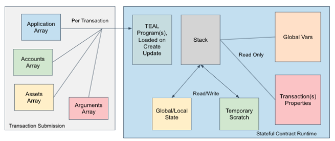

title: Smart contract details

Algorand smart contracts are pieces of logic that reside on the Algorand blockchain and are remotely callable. These contracts are primarily responsible for implementing the logic associated with a distributed application. Smart contracts are referred to as stateful smart contracts or applications in the Algorand documentation. Smart contracts can generate asset and payment transactions allowing them to function as Escrow accounts on the Algorand blockchain. Smart contracts can also store values on the blockchain. This storage can be global, local, or box storage. Local storage refers to storing values in an accounts balance record if that account participates in the contract. Global storage is data that is specifically stored on the blockchain for the contract globally. Box storage is also global and allows contracts to use larger segments of storage. Like smart signatures, smart contracts are written in Python using PyTeal or TEAL and can be deployed to the blockchain using either the `goal` command-line tool or the SDKs. The recommended approach for writing smart contracts is to use the Python SDK with the PyTeal library.  

See the [*PyTeal Documentation*](../../pyteal/index.md) for information on building smart contracts in Python.

See the [*TEAL Reference Guide*](../../avm/teal/specification.md) to understand how to write TEAL and the [*TEAL Opcodes*](../../avm/teal/opcodes.md) documentation that describes the opcodes available. This guide assumes that the reader is familiar with [TEAL](../../avm/teal/index.md).

!!! important "A note about PyTeal"
    Where possible, TEAL code snippets are accompanied by their counterparts in PyTeal. Here are a few things to be aware of when comparing across these two languages:
     
    - Each PyTeal code snippet ends with the action to compile the program and write it to a file so the user can view the underlying TEAL code.
    - Sometimes the compiled version of a PyTeal code snippet will differ slightly from the TEAL version. However, the resulting function should be equivalent for the particular area of focus in the documentation. In larger more complex programs, this may not always be the case.
    - When a TEAL code snippet includes comments as placeholders for code, the PyTeal example will often use a placeholder of `Seq([Return(Int(1))])` with a comment describing this as a placeholder. This allows the user to compile the program for learning purposes. However, returning 1 is a very permissive action and should be carefully updated when used in a production application.

# The lifecycle of a smart contract
Smart contracts are implemented using two programs:

* The `ApprovalProgram` is responsible for processing all application calls to the contract, with the exception of the clear call (described in the next bullet). This program is responsible for implementing most of the logic of an application. Like smart signatures, this program will succeed only if one nonzero value is left on the stack upon program completion or the `return` opcode is called with a positive value on the top of the stack.
* The `ClearStateProgram` is used to handle accounts using the clear call to remove the smart contract from their balance record. This program will pass or fail the same way the `ApprovalProgram` does. 

In either program, if a global, box, or local state variable is modified and the program fails, the state changes will not be applied. 

Having two programs allows an account to clear the contract from its state, whether the logic passes or not. When the clear call is made to the contract, whether the logic passes or fails, the contract will be removed from the account's balance record. Note the similarity to the CloseOut transaction call which can fail to remove the contract from the account, which is described below.

Calls to smart contracts are implemented using `ApplicationCall` transactions. These transaction types are as follows:

* NoOp - Generic application calls to execute the `ApprovalProgram`.
* OptIn - Accounts use this transaction to begin participating in a smart contract.  Participation enables local storage usage.
* DeleteApplication - Transaction to delete the application.
* UpdateApplication - Transaction to update TEAL Programs for a contract.
* CloseOut - Accounts use this transaction to close out their participation in the contract. This call can fail based on the TEAL logic, preventing the account from removing the contract from its balance record.
* ClearState - Similar to CloseOut, but the transaction will always clear a contract from the account’s balance record whether the program succeeds or fails.

The `ClearStateProgram` handles the `ClearState` transaction and the `ApprovalProgram` handles all other `ApplicationCall` transactions. These transaction types can be created with either `goal` or the SDKs. In the following sections, details on the individual capabilities of a smart contract will be explained.

<center></center>
<center>*Application Transaction Types*</center>

# Smart contract arrays
A set of arrays can be passed with any application transaction, which instructs the protocol to load additional data for use in the contract. These arrays are the *arguments* array, the *applications* array, the *assets* array, the *accounts* array, and the *boxes* array. These arrays are used to restrict how much of the ledger can be accessed in one specific call to the smart contract. This restriction is in place to maintaing blockchain performance. These arrays can be changed per application transaction (even within an atomic group).

The arguments array is used to pass standard arguments to the contract. The arguments array is limited to 16 arguments with a 2KB total size limit. See [Passing Arguments To Smart Contracts](#passing-arguments-to-smart-contracts) for more details on arguments.

The other arrays are used to load data from the blockchain:
* The application array is used to pass other smart contract IDs that can be used to read state for those specific contracts. 
* The assets array is used to pass a list of asset IDs that can be used to retrieve configuration and asset balance information. 
* The accounts array allows additional accounts to be passed to the contract for balance information and local state. Note that to access an account's asset balance, both the account and the asset ID must be specified in their respective arrays. Similarly, to access an account's local state for a specific application, both the account and the smart contract ID must be specified in their respective arrays.
* The boxes array defines which boxes can be manipulated in a particular call to the smart contract. The box array is an array of pairs: the first element of each pair is an integer specifying the index into the application array, and the second element is the key name of the box to be accessed.   

These four arrays (*applications*, *assets*, *accounts*, and *boxes*) are limited to eight total values combined, and of those, the accounts array can have no more than four values. The values passed within these arrays can change per Application Transaction.  The opcodes that make use of these arrays take an integer parameter as an index into these arrays. 

The accounts and applications arrays contain the transaction sender and current application ID in the 0th position of the respective array. This shifts the contents of these two arrays by one slot. The opcodes that use an index into these arrays also allow passing the actual value. For example, an address can be specified for an opcode that uses the accounts array. IDs can be specified for contracts and assets for an opcode that uses the applications or assets arrays, respectively. These opcodes will fail if the specified value does not exist in the corresponding array. The use of each of these arrays is detailed throughout this guide.

!! Note
  The boxes array cannot be accessed directly with an opcode like the other arrays.

Boxes function similar to the other arrays but differ is significant ways which are explained in detail in the [Boxes section of the documentation](#box-details).

<center></center>
<center>*Smart Contract Arrays*</center>

# Issuing Transactions from an Application 

When a smart contract is deployed to the Algorand blockchain it is assigned a unique identifier, called the app id. Additionally, every smart contract has a unique Algorand address that is generated from this specific ID. The address allows the smart contract to function as an escrow account. To see the specific address of the smart contract the `goal app info` command can be used.

```bash
% ./goal app info --app-id 1 -d data
Application ID:        1
Application account:   WCS6TVPJRBSARHLN2326LRU5BYVJZUKI2VJ53CAWKYYHDE455ZGKANWMGM
Creator:               VJG4SF5O4DUQDK7MQYHHSJ2HB5LEAB3OQMM2XCUM7OVQKWC7E4GSNCM4FQ
Approval hash:         IYRFKZVCHBQW3UNKEWRQPMCXSXH4TDF4K74EAH65UYLJ5R5JQGVZJ4FF2M
Clear hash:            P7GEWDXXW5IONRW6XRIRVPJCT2XXEQGOBGG65VJPBUOYZEJCBZWTPHS3VQ
Max global byteslices: 0
Max global integers:   1
Max local byteslices:  0
Max local integers:    0
```

The application address will be shown as the Application account. This address can also be retrieved with the SDKs or calculated by using the following code and the smart contract’s application id.

```bash
# app ID of 1’s address
python3 -c "import algosdk.encoding as e; print(e.encode_address(e.checksum(b'appID'+(1).to_bytes(8, 'big'))))"
WCS6TVPJRBSARHLN2326LRU5BYVJZUKI2VJ53CAWKYYHDE455ZGKANWMGM
```
## Inner transactions

To fund this account, any other account in the Algorand network can send algos to the specified account. In order for funds to leave the smart contract, the logic within the contract must submit an inner transaction. In addition, the smart contract’s logic must return true. A smart contract can issue up to a total of 256 inner transactions with one call. If any of these transactions fail, then the smart contract will also fail. Groups of transactions can also be made using inner transactions, which are primarily used when calling other smart contracts that will verify the calling groups transactions. Inner transactions support all the same transaction types as a regular account can make. To generate an inner transaction the `itxn_begin`, `itxn_field`, `itxn_next` and `itxn_submit` opcodes are used. The `itxn_begin` opcode signifies the beginning of an inner transaction. The `itxn_field` opcode is used to set specific transaction properties. The `itxn_next` opcode moves to the next transaction in the same group as the previous, and the `itxn_submit` opcode is used to submit the transaction or transaction group. As an example, the following TEAL generates a simple payment transaction.

=== "PyTeal"
    ```py
    #...
    InnerTxnBuilder.Begin(),
    InnerTxnBuilder.SetFields({
        TxnField.type_enum: TxnType.Payment,
        TxnField.amount: Int(5000),
        TxnField.receiver: Txn.sender()
    }),
    InnerTxnBuilder.Submit(),
    #...

    # The `Sender` for the above is implied to be Global.current_application_address(). 
    # If a different sender is needed, it'd have to be an account that has been rekeyed to 
    # the application address.
    ```

=== "TEAL"
    ```teal
    itxn_begin
    int pay
    itxn_field TypeEnum
    int 5000
    itxn_field Amount
    txn Sender
    itxn_field Receiver
    itxn_submit
    ```

In this example, the type is set to pay using the TypeEnum field, the amount is set to 5000 microalgos using the Amount field, and the receiver is set to the caller of the smart contract using the Receiver field. Fees for these transactions are paid by the smart contract and are set automatically to the minimum transaction fee. Inner transaction fees are eligible for [fee pooling](https://developer.algorand.org/docs/get-details/transactions/#fees) similar to any other transaction. This allows either the application call or any other transaction in a group of transactions to pay the fee for inner transactions. Inner transactions are evaluated during AVM execution, allowing changes to be visible within the contract. For example, if the ‘balance’ opcode is used before and after a ‘pay’ transaction is submitted, the balance change would be visible to the executing contract.

!!!note
    Inner transactions also have access to the Sender field. It is not required to set this field as all inner transactions default the sender to the contract address. If another account is rekeyed to the smart contract address, setting sender to the address that has been rekeyed allows the contract to spend from that account. The recipient of an inner transaction must be in the accounts array. Additionally, if the sender of an inner transaction is not the contract, the sender must also be in the accounts array.

!!!note
    Clear state programs do _not_ support creating inner transactions.  However, clear state programs _can_ be called by an inner transaction.

## Allowed transaction properties
Since TEAL 6, all transaction types can be used within inner transactions. If you're using TEAL 5 you will only be able to make payment and asset transfer transactions, with some properties such as `RekeyTo` not being allowed.

## Asset transfer
If a smart contract wishes to transfer an asset it holds or needs to opt into an asset this can be done with an asset transfer inner transaction.

=== "PyTeal"
    ```py
    #...
    InnerTxnBuilder.Begin(),
    InnerTxnBuilder.SetFields({
        TxnField.type_enum: TxnType.AssetTransfer,
        TxnField.asset_receiver: Txn.sender(),
        TxnField.asset_amount: Int(1000),
        TxnField.xfer_asset: Txn.assets[0], # Must be in the assets array sent as part of the application call
    }),
    InnerTxnBuilder.Submit(),
    #...
    ```

=== "TEAL"
    ```teal
    itxn_begin
    int axfer
    itxn_field TypeEnum
    txn Sender
    itxn_field AssetReceiver
    //Asset ID must be in the assets array
    txn Assets 0
    itxn_field XferAsset
    // send 10
    int 1000
    itxn_field AssetAmount
    itxn_submit
    ``` 

In this example, 1000 units of the asset are sent to the account calling the contract. Note that the asset must be in the assets array. If the smart contract is opting into an asset, the contract would send 0 units of the asset to itself. In this case, the receiver could be set to the `global CurrentApplicationAddress`. 

## Asset freeze
A smart contract can freeze any asset, where the smart contract is the freeze address. This can be done with the following TEAL.

=== "PyTeal"
    ```py
    #...
    InnerTxnBuilder.Begin(),
    InnerTxnBuilder.SetFields({
        TxnField.type_enum: TxnType.AssetFreeze,
        TxnField.freeze_asset: Txn.assets[0], 
        TxnField.freeze_asset_account: Txn.accounts[1],
        TxnField.freeze_asset_frozen: Int(1)
    }),
    InnerTxnBuilder.Submit(),
    #...
    ```

=== "TEAL"
    ```teal
    itxn_begin
    int afrz
    itxn_field TypeEnum
    //asset to be frozen
    txn Assets 0
    itxn_field FreezeAsset
    //account to freeze
    //first account in accounts array
    txn Accounts 1
    itxn_field FreezeAssetAccount
    //set frozen status to true
    int 1
    itxn_field FreezeAssetFrozen
    itxn_submit
    ```

## Asset revoke
A smart contract can revoke or clawback any asset where the smart contract address is specified as the asset clawback address. 

=== "PyTeal"
    ```py
    #...
    InnerTxnBuilder.Begin(),
    InnerTxnBuilder.SetFields({
        TxnField.type_enum: TxnType.AssetTransfer,
        TxnField.asset_receiver: Global.current_application_address(),  
        # AssetSender is _only_ used in the case of clawback, Sender is implied to be current_application_address
        TxnField.asset_sender: Txn.accounts[1],         
        TxnField.asset_amount: Int(1000)
    }),
    InnerTxnBuilder.Submit(),
    #...
    ```

=== "TEAL"
    ```teal
    itxn_begin
    int axfer
    itxn_field TypeEnum
    global CurrentApplicationAddress
    itxn_field AssetReceiver
    txn Assets 0
    itxn_field XferAsset
    // send 10
    int 1000
    itxn_field AssetAmount
    //first account in the accounts array
    txn Accounts 1
    itxn_field AssetSender
    itxn_submit
    ```

## Asset create
Assets can also be created by a smart contract. To create an asset with an inner transaction using the following TEAL.

=== "PyTeal"
    ```py
    #...
    InnerTxnBuilder.Begin(),
    InnerTxnBuilder.SetFields({
        TxnField.type_enum: TxnType.AssetConfig,
        TxnField.config_asset_total: Int(1000000),
        TxnField.config_asset_decimals: Int(3),
        TxnField.config_asset_unit_name: Bytes("oz"),
        TxnField.config_asset_name: Bytes("Gold"),
        TxnField.config_asset_url: Bytes("https://gold.rush"),
        TxnField.config_asset_manager: Global.current_application_address(),
        TxnField.config_asset_reserve: Global.current_application_address(),
        TxnField.config_asset_freeze: Global.current_application_address(),
        TxnField.config_asset_clawback: Global.current_application_address()
    }),
    InnerTxnBuilder.Submit(),
    # InnerTxn.created_asset_id() would represent the asset id that was just created
    #...
    ```
=== "TEAL"
    ```teal
    itxn_begin
    int acfg
    itxn_field TypeEnum
    int 1000000
    itxn_field ConfigAssetTotal
    int 3
    itxn_field ConfigAssetDecimals
    byte "oz"
    itxn_field ConfigAssetUnitName
    byte "Gold"
    itxn_field ConfigAssetName
    byte "https://gold.rush/"
    itxn_field ConfigAssetURL
    global CurrentApplicationAddress
    dup
    dup2
    itxn_field ConfigAssetManager
    itxn_field ConfigAssetReserve
    itxn_field ConfigAssetFreeze
    itxn_field ConfigAssetClawback
    itxn_submit
    itxn CreatedAssetID
    ```

In this example, a simple asset is created. Using the `itxn CreatedAssetID` opcode after the transaction is submitted allows the contract to get the asset id of the newly created asset.

##Asset configuration
As with all assets, the mutable addresses can be changed. For example to change the freeze address for an asset managed by the contract, the follow teal can be used.

=== "PyTeal"
    ```py
    #...
    InnerTxnBuilder.Begin(),
    InnerTxnBuilder.SetFields({
        TxnField.type_enum: TxnType.AssetConfig,
        TxnField.config_asset: Txn.assets[0],
        TxnField.config_asset_manager: Txn.sender(),
        TxnField.config_asset_reserve: Txn.sender(),
        TxnField.config_asset_freeze: Txn.sender(),
        TxnField.config_asset_clawback: Txn.sender()
    }),
    InnerTxnBuilder.Submit(),
    #...
    ```

=== "TEAL"
    ```teal
    itxn_begin
    int acfg
    itxn_field TypeEnum
    txn Sender
    itxn_field ConfigAssetFreeze
    global CurrentApplicationAddress
    dup
    dup
    itxn_field ConfigAssetManager
    itxn_field ConfigAssetReserve
    itxn_field ConfigAssetClawback
    //first asset in the assets array
    txn Assets 0
    itxn_field ConfigAsset
    itxn_submit
    ```

This example sets the freeze address to the sender of the application transaction. Note that when changing one address, all others must be reset or they will be cleared. Cleared addresses will be locked forever.

## Delete an asset
Assets managed by the contract can also be deleted. This can be done with the following TEAL.

=== "PyTeal"
    ```py
    #...
    InnerTxnBuilder.Begin(),
    InnerTxnBuilder.SetFields({
        TxnField.type_enum: TxnType.AssetConfig,
        TxnField.config_asset: Txn.assets[0]
    }),
    InnerTxnBuilder.Submit(),
    #...
    ```

=== "TEAL"
    ```teal
    itxn_begin
    int acfg
    itxn_field TypeEnum
    //first asset in the assets array
    txn Assets 0
    itxn_field ConfigAsset
    itxn_submit
    ```

## Grouped inner transaction

A smart contract can make inner transactions consisting of grouped transactions. This allows for creating groups of transactions which will be verified by other smart contracts. An example of a grouped inner transaction would be when the calling application is required to send a payment transaction and an application call together to another smart contract.

=== "PyTeal"
    ```py
    # This returns a `MaybeValue`, see pyteal docs
    addr = AppParam.address(Int(1234))

    #...
    InnerTxnBuilder.Begin(),
    InnerTxnBuilder.SetFields({
        TxnField.type_enum: TxnType.Payment,
        TxnField.receiver: addr.value(),
        TxnField.amount: Int(1000000)
    })
    InnerTxnBuilder.Next(), # This indicates we're moving to constructing the next txn in the group
    InnerTxnBuilder.SetFields({
        TxnField.type_enum: TxnType.ApplicationCall,
        TxnField.application_id: Int(1234),
        TxnField.on_completion: OnComplete.NoOp,
        TxnField.application_args: [Bytes("buy")]
    })
    InnerTxnBuilder.Submit()
    #...
    ```

=== "TEAL"
    ```teal
    // This imaginary scenario requires a buyer to pay 1 Algo whilst calling the
    // smart contract with the argument "buy". The imaginary smart contract could
    // then send us something in exchange.
    itxn_begin

    // Send a 1 Algo payment to the smart contract's address.
    int pay
    itxn_field TypeEnum
    int 1234
    app_params_get AppAddress
    itxn_field Receiver
    int 1000000
    itxn_field Amount

    // Call the smart contract within the same group with the argument "buy".
    itxn_next
    int appl
    itxn_field TypeEnum
    int 1234
    itxn_field ApplicationID
    int NoOp
    itxn_field OnCompletion
    byte "buy"
    itxn_field ApplicationArgs

    itxn_submit
    ```

All inner transactions will be stored as inner transactions within the outer application transaction. These can be accessed by getting the transaction id as normal and looking for the `inner-txns` header in the response.

# Contract To Contract Calls

With the release of TEAL 6 (AVM 1.1), Smart Contracts may issue inner transactions that invoke other Smart Contracts. This allows for composability across applications but comes with some limitations.

* An application may not call itself, even indirectly. This is referred to as `re-entrancy` and is explicitly forbidden. 
* An application may only call into other applications up to a stack depth of 8. In other words if app calls (`->`) look like 1->2->3->4->5->6->7->8, App 8 may _not_ call another application. This would violate the stack depth limit.
* An application may issue up to 256 inner transactions to increase its budget (max budget of 179.2k even for a group size of 1), but the max call budget is shared for all applications in the group. Meaning you can't have two apps calls in the same group that _both_ try to issue 256 inner app calls. 
* An application of program version 6 or above may _not_ call contracts with a program version 3 or below. This limitation protects an older application from unexpected behavior introduced in newer program versions.

## Application call
A smart contract can call other smart contracts using any of the `OnComplete` types. This allows a smart contract to create, opt in, close out, clear state, delete, or just call other smart contracts. To call an existing smart contract the following teal can be used.

=== "PyTeal"
    ```py
    #...
    InnerTxnBuilder.Begin(),
    InnerTxnBuilder.SetFields({
        TxnField.type_enum: TxnType.ApplicationCall,
        TxnField.application_id: Int(1234),
        TxnField.on_complete: OnComplete.NoOp,
    })
    InnerTxnBuilder.Submit()
    #...
    ```

=== "TEAL"
    ```teal
    itxn_begin
    int appl
    itxn_field TypeEnum
    int 1234
    itxn_field ApplicationID
    int NoOp
    itxn_field OnCompletion
    itxn_submit
    ```

## Composability

When writing smart contracts that call other applications or expect to be called via Inner Transactions, an important consideration is composability.

With the finalization of the [ABI](../ABI/index.md) an API may be defined for an application. This allows contracts to be written to take advantage of the ABI to provide structured calls to other applications. 

Additionally, when validating transactions, using relative position of transactions instead of absolute position will help to allow behavior to be composed. 

Since TEAL 6, all created assets and apps are available to be accessed by application calls in the same group which allows more dynamic behavior. For example an application can be created via Inner Transaction then funded immediately in the same transaction group since we have access to the created application id and address.   


# Smart Contract Storage 
Smart Contracts have three different types of storage: [local storage](#local-storage), [global storage](#global-storage), and [box storage](#box-storage). 

Global state and boxes are associated with the app itself, whereas local state is associated with each account that opts into the application. Global and local storage are Key/Value pairs that are limited to 128 bytes per pair. Boxes are keyed storage segments up to 32kb of data per box.

Each storage option’s properties are described below. 

## Global Storage

* Allocation: 
    * Can include between 0 and 64 key/value pairs for a total of 8K of memory to share among them.
    * The amount of global storage is allocated in k/v units, and determined at contract creation. This schema is immutable after creation. 
    * The contract creator address is responsible for funding the global storage (by an increase to their minimum balance requirement, see below). 
* Reading: 
    * Can be read by any app call that has specified app a’s ID in its foreign apps array.
    * Can be read on-chain using the k/v pairs defined (from off-chain, can be read using goal or APIs + SDKs). 
* Writing: 
    * Can only be written by app a. 
* Deletion: 
    * Is deleted when app a is deleted. Cannot otherwise be deallocated (though of course the contents can be cleared by app a, but this does not change the minimum balance requirement). 

## Local Storage

* Allocation: 
    * Is allocated when account x opts in to app a (submits a transaction to opt-in to app a).
    * Can include between 0 and 16 key/value pairs for a total of 2KB of memory to share among them. 
    * The amount of local storage is allocated in k/v units, and determined at contract creation. This cannot be edited later. 
    * The opted-in user address is responsible for funding the local storage (by an increase to their minimum balance). 
* Reading: 
    * Can be read by any app call that has app x in its foreign apps array and account x in its foreign accounts array. 
    * Can be read on-chain using the k/v pairs defined (from off-chain, can be read using goal and the SDKs). 
* Writing: 
    * Is editable only by app a, but is delete-able by app a or the user x (using a ClearState call, see below). 
* Deletion: 
    * Deleting an app does not affect its local storage. Accounts must clear out of app to recover minimum balance.
    * _Clear state_. Every Smart Contract on Algorand has two programs: the _approval_ and the _clear state_ program. An account holder can clear their local state for an app at any time (deleting their data and freeing up their locked minimum balance). The purpose of the clear state program is to allow the app to handle the clearing of that local state gracefully. 
    * Account x can request to clear its local state using a [close out transaction](https://developer.algorand.org/docs/get-details/transactions/#application-close-out-transaction). 
    * Account x can clear its local state for app a using a [clear state transaction](https://developer.algorand.org/docs/get-details/transactions/#application-clear-state-transaction), which will always succeed, even after app a is deleted. 


## Box Storage 

* Allocation: 
    * App a can allocate as many boxes as it needs, when it needs them.
    * App a allocates a box using the `box_create` opcode in its TEAL program, specifying the name and the size of the box being allocated. 
        * Boxes can be any size from 0 to 32K bytes. 
        * Box names must be at least 1 byte, at most 64 bytes, and must be unique within app a. 
    * The app account(the smart contract) is responsible for funding the box storage (with an increase to its minimum balance requirement, see below for details). 
    * A box name and app id must be referenced in the boxes array of the app call to be allocated. 
* Reading: 
    * App a is the only app that can read the contents of its boxes on-chain. This on-chain privacy is unique to box storage. Recall that everything can be read by anybody from off-chain using the algod or indexer APIs. 
    * To read box b from app a, the app call must include b in its boxes array. 
    * Read budget: Each box reference in the boxes array allows an app call to access 1K bytes of box state - 1K of “box read budget”. To read a box larger than 1K, multiple box references must be put in the boxes arrays. 
        * The box read budget is shared across the transaction group. 
        * The total box read budget must be larger than the sum of the sizes of all the individual boxes referenced (it is not possible to use this read budget for a part of a box - the whole box is read in).
    * Box data is unstructured. This is unique to box storage. 
    * A box is referenced by including its app ID and box name. 
* Writing: 
    * App a is the only app that can write the contents of its boxes.
    * As with reading, each box ref in the boxes array allows an app call to write 1kb of box state - 1kb of “box write budget”. 
* Deletion: 
    * App a is the only app that can delete its boxes. 
    * If an app is deleted, its boxes are not deleted. The boxes will not be modifiable but still can be queried using the SDKs. The minimum balance will also be locked. (the correct cleanup design is to look up the boxes from off-chain and call the app to delete all its boxes before deleting the app itself). 


# Manipulate global or local state in smart contract
Smart contracts can create, update, and delete values in global or local state. The number of values that can be written is limited based on how the contract was first created. See [Creating the Smart Contract](#creating-the-smart-contract) for details on configuring the initial global and local storage. State is represented with key-value pairs. The key is limited to 64 bytes. The key plus the value is limited to 128 bytes total. Using smaller keys to have more storage available for the value is possible. The keys are stored as byte slices (byte-array value) and the values are stored as either byte slices (byte-array value) or uint64s. The TEAL language provides several opcodes for facilitating reading and writing to state.

## Reading local state from other accounts
Local storage values are stored in the account's balance record. Any account that sends a transaction to the smart contract can have its local storage modified by the smart contract as long as the account has opted into the smart contract. In addition, any call to the smart contract can also reference up to four additional accounts which can also have their local storage manipulated for the current smart contract as long as the account has opted into the contract. These five accounts can also have their storage values for any smart contract on Algorand read by specifying the application id of the smart contract, if the additional contract is in the applications array for the transaction. This is a read-only operation and does not allow one smart contract to modify the local state of another smart contract. The additionally referenced accounts can be changed per smart contract call (transaction). The process for reading local state from another account is described in the following sections.

## Reading global state from other smart contracts
Global storage for the current contract can also be modified by the smart contract code. In addition, the global storage of any contract in the applications array can be read. This is a read-only operation. The global state can not be changed for other smart contracts. The external smart contracts can be changed per smart contract call (transaction). The process for reading global state from another smart contract is described in the following sections.

## Write to state
To write to either local or global state, the opcodes `app_global_put` and `app_local_put` should be used. These calls are similar but with local storage, you provide an additional account parameter. This determines what account should have its local storage modified. In addition to the sender of the transaction, any call to the smart contract can reference up to four additional accounts. Below is an example of doing a global write with TEAL.


=== "PyTeal"
    ```py
    program = App.globalPut(Bytes("Mykey"), Int(50))
    print(compileTeal(program, Mode.Application))
    ```

=== "TEAL"
    ```teal
    byte "Mykey"
    int 50
    app_global_put
    ```

To store a value in local storage, the following TEAL can be used.

=== "PyTeal"
    ```py
    program = App.localPut(Int(0), Bytes("MyLocalKey"), Int(50))
    print(compileTeal(program, Mode.Application))
    ```

=== "TEAL"
    ```teal
    int 0
    byte "MyLocalKey"
    int 50
    app_local_put
    ```


In this example, the `int 0` represents the sender of the transaction. This is a reference into the accounts array that is passed with the transaction. With `goal` you can pass additional accounts using the `--app-account` option. The address can be also be specified instead of the index. If using an address, it still must exist in the accounts array.

```
$ goal app call --app-account account1 --app-account account2
```

To store a value into account2, the TEAL would be as follows.

=== "PyTeal"
    ```python
    program = App.localPut(Int(2), Bytes("MyLocalKey"), Int(50))
    print(compileTeal(program, Mode.Application))
    ```

=== "TEAL"
    ```teal
    int 2
    byte “MyLocalKey”
    int 50
    app_local_put
    ```


Where 0 is the sender, 1 is the first additional account passed in and 2 is the second additional account passed with the application call.

!!! info
    Local storage writes are only allowed if the account has opted into the smart contract.

## Read from state
TEAL provides calls to read global and local state values for the current smart contract.  To read from local or global state TEAL provides the `app_local_get`, `app_global_get`, `app_local_get_ex` , and `app_global_get_ex` opcodes. The following TEAL code reads a value from global state for the current smart contract.


=== "PyTeal"
    ```py
    program = App.globalGet(Bytes("MyGlobalKey"))
    print(compileTeal(program, Mode.Application))
    ```

=== "TEAL"
    ```teal
    byte "MyGlobalKey"
    app_global_get
    ```


The following TEAL code reads the local state of the sender account for the specific call to the current smart contract.

=== "PyTeal"
    ```py
    program = App.localGet(Int(0), Bytes("MyLocalKey"))
    print(compileTeal(program, Mode.Application))
    ```

=== "TEAL"

    ```teal
    int 0
    byte "MyLocalKey"
    app_local_get
    ```


In this example, the `int 0` represents the sender of the transaction. This is a reference into the accounts array that is passed with the transaction. The address can be specified instead of the index as long as the account is in the accounts array. With `goal` you can pass additional accounts using the `--app-account` option. 

`int 0` represents the sender, 1 is the first additional account passed in and 2 is the second additional account passed with the application call. 

The `_ex` opcodes return two values to the stack. The first value is a 0 or a 1 indicating the value was returned successfully or not, and the second value on the stack contains the actual value. These calls allow local and global states to be read from other accounts and applications (smart contracts) as long as the account and the contract are in the accounts and applications arrays. To read a local storage value with the `app_local_get_ex` opcode the following TEAL should be used.

=== "PyTeal"
    ```py
    program = App.localGetEx(Int(0), Txn.application_id(), Bytes("MyAmountGiven"))
    print(compileTeal(program, Mode.Application))
    ```

=== "TEAL"
    ```teal
    int 0 // sender
    txn ApplicationID // current smart contract
    byte "MyAmountGiven"
    app_local_get_ex
    ```


!!! note
    The PyTeal code snippet preemptively stores the return values from `localGetEx` in scratch space for later reference. 

The `int 0` is the index into the accounts array. The actual address could also be specified as long as the account is in the accounts array. The `txn ApplicationID` line refers to the current application, but could be any application that exists on Algorand as long as the contract's ID is in the applications array. Instead of specifying the application ID, the index into the application array can be used as well. The top value on the stack will either return 0 or 1 depending on if the variable was found.  Most likely branching logic will be used after a call to the `_ex` opcode. The following example illustrates this concept.

=== "PyTeal"
    ```py
    get_amount_given = App.localGetEx(Int(0), Txn.application_id(), Bytes("MyAmountGiven"))

    # Change these to appropriate logic for new and previous givers.
    new_giver_logic = Seq(Return(Int(1)))

    previous_giver_logic = Seq(Return(Int(1))) 

    program = Seq(
        get_amount_given, 
        If(get_amount_given.hasValue(), previous_giver_logic, new_giver_logic),
    )

    print(compileTeal(program, Mode.Application))
    ```

=== "TEAL"
    ```teal
    int 0 // sender
    txn ApplicationID
    byte "MyAmountGiven"
    app_local_get_ex
    bz new-giver

    // logic to deal with an existing giver
    // stored value is on the top of the stack
    // return

    new-giver:

    // logic to deal with a new giver
    ```


The `app_global_get_ex` is used to read not only the global state of the current contract but any contract that is in the applications array. To access these foreign apps, they must be passed in with the application using the `--foreign-app` option. 

```bash
$ goal app call --foreign-app APP1ID --foreign-app APP2ID
```

To read from the global state with the `app_global_get_ex` opcode, use the following TEAL.

=== "PyTeal"
    ```py
    get_global_key = App.globalGetEx(Int(0), Bytes("MyGlobalKey"))

    # Update with appropriate logic for use case
    increment_existing = Seq(Return(Int(1)))

    program = Seq( 
        get_global_key, 
        If(get_global_key.hasValue(), increment_existing, Return(Int(1))),
    )

    print(compileTeal(program, Mode.Application))
    ```

=== "TEAL"
    ```teal
    int 0
    byte "MyGlobalKey"
    app_global_get_ex
    bnz increment_existing //found value
    ```


The `int 0` represents the current application and `int 1` would reference the first passed in foreign app. Likewise, `int 2` would represent the second passed in foreign application. The actual contract IDs can also be specified as long as the contract is in the contracts array. Similar to the `app_local_get_ex` opcode, generally, there will be branching logic testing whether the value was found or not. 

## Summary of global and Local state operations

| Context            | Write            | Read                | Delete           | Check If Exists     |
| ---                | ---              | ---                 | ---              | ---                 |
| Current App Global | `app_global_put` | `app_global_get`    | `app_global_del` | `app_global_get_ex` |
| Current App Local  | `app_local_put`  | `app_local_get`     | `app_local_del`  | `app_local_get_ex`  |
| Other App Global   |                  | `app_global_get_ex` |                  | `app_global_get_ex` |
| Other App Local    |                  | `app_local_get_ex`  |                  | `app_local_get_ex`  |

# Box Details
Boxes are useful in many scenarios:

* Applications that need larger or unbound contract storage.
* Applications that want to store data per user, but do not wish to require users to opt-in to the contract or need the account data to persist even after the user closes or clears out of the application.
* Applications that have dynamic storage requirements.
* Applications that require larger storage blocks that can not fit in the existing global state key-value pairs.
* Applications that require storing arbitrary maps or hash tables. 
  
The following sections cover the details of manipulating boxes within a smart contract. 

## Box Array 
The box array is an array of pairs: the first element of each pair is an integer specifying the index into the foreign application array, and the second element is the key name of the box to be accessed.

Each entry in the box array allows access to only 1kb of data. For example, if a box is sized to 4kb, the transaction must use four entries in this array. To claim an allotted entry a corresponding app Id and box name need to be added to the box ref array. If you need more than the 1kb associated with that specific box name, you can either specify the box ref entry more than once or, preferably, add “empty” box refs `[0,””]` into the array. If you specify 0 as the app Id the box ref is for the application being called. 

For example, suppose the contract needs to read “BoxA” which is 1.5kb, and “Box B” which is 2.5kb, this would require four entries in the box ref array and would look something like:

```py
boxes=[[0, "BoxA"],[0,"BoxB"], [0,""],[0,""]]
``` 

The required box I/O budget is based on the sizes of the boxes accessed, not the amount of data read or written. For example, if a contract accesses “Box A” with a size of 2kb and “Box B” with a size of 10 bytes, this requires both boxes be in the box reference array and one additional reference ( ceil((2kb + 10b) / 1kb), which can be an “empty” box reference. 

Access budgets are summed across multiple application calls in the same transaction group. For example in a group of two smart contract calls, there is room for 16 array entries (8 per app call), allowing access to 16kb of data. If an application needs to access a 16kb box named “Box A”, it will need to be grouped with one additional application call and the box reference array for each transaction in the group should look similar to this:

Transaction 0: [0,”Box A”],[0,””],[0,””],[0,””],[0,””],[0,””],[0,””],[0,””]
Transaction 1: [0,””],[0,””],[0,””],[0,””],[0,””],[0,””],[0,””],[0,””]

Box refs can be added to the boxes array using `goal` or any of the SDKs.

=== "Goal"
    ```goal
    goal app method --app-id=53 --method="add_member2()void" --box="53,str:BoxA" --from=CONP4XZSXVZYA7PGYH7426OCAROGQPBTWBUD2334KPEAZIHY7ZRR653AFY
    ```

=== "Python"
    ```py
    atc = AtomicTransactionComposer()
    atc.add_method_call(app_id, my_method, addr, sp, signer, method_args=[1,5], boxes=[[app_id, “key”]])
    ```

=== "JavaScript"
    ```js
    const atc = new AtomicTransactionComposer();
    atc.addMethodCall({
        appID: appId,
        method: myMethod,
        methodArgs: [1,5],
        boxes: [{ appIndex: appId, name: new Uint8Array(Buffer.from("key")) }],
        sender: acct.addr,
        suggestedParams: sp,
        signer: algosdk.makeBasicAccountTransactionSigner(acct),
    });
    ```

=== "Go"
    ```go
	var boxAtc = transaction.AtomicTransactionComposer{}
	err := boxAtc.AddMethodCall(transaction.AddMethodCallParams{
		AppID:           appId,
		Sender:          acct.Address,
		SuggestedParams: sp,
		OnComplete:      types.NoOpOC,
		Signer:          signer,
        Method:          method,
        BoxReferences:   types.AppBoxReference{AppID: appId, Name: []byte("key")},
		MethodArgs:      []interface{}{1,5},
	})
    // ...
    ```


=== "Beaker"
    ```py
    #Beaker framework
    result = app_client.call(
        Myapp.my_method,
    boxes=[[app_client.app_id, "key"]],
    )
    ```
## Creating a Box
The AVM supports two opcodes `box_create` and `box_put` that can be used to create a box. 
The `box_create` opcode takes two parameters, the name and the size in bytes for the created box. The `box_put` opcode takes two parameters as well. The first parameter is the name and the second is a byte array to write. Because the AVM limits any element on the stack to 4kb, `box_put` can only be used for boxes with length <= 4kb.

=== "TEAL"
    ```teal
    // 100 byte box created with box_create
    byte “Mykey”
    int 100
    box_create
    ….
    // create with a box_put
    byte "Mykey"
    byte “My data values”
    box_put
    ```

=== "PyTeal"
    ```py
    # 100 byte box created with box_create
    App.box_create(“MyKey”,Int(100))
    …
    # box created with box_put
    App.box_put(“MyKey”, “My data values”)
    ```

Box names must be unique within an application. If using `box_create`, and an existing box name is passed with a different size, the creation will fail. If an existing box name is used with the existing size, the call will return a 0 without modifying the box contents. When creating a new box the call will return a 1. When using `box_put` with an existing key name, the put will fail if the size of the second argument (data array) is different from the original box size. 

!!!info
    When creating a box, the key name to be created must be in the box ref array.

## Writing to a Box  
The AVM provides two opcodes, `box_put` and `box_replace`,  to write data to a box. The `box_put` opcode is described in the previous section. The `box_replace` opcode takes three parameters, the key name, the starting location and replacement bytes.

=== "TEAL"
    ```teal
    byte “MyKey” 
    int 10
    byte “best”
    box_replace
    ```
=== "PyTeal"
    ```py
    #Beaker Framework
        @external
        def replace_string(self, ky: abi.String, start: abi.Uint64, replacement: abi.String, *, output: abi.String):
            return Seq(
                App.box_replace(ky.get(), start.get(), replacement.get()),
                boxstr :=  App.box_get(ky.get()),
                Assert( boxstr.hasValue()),
                output.set(boxstr.value()),
            ) 

    ```

When using `box_replace`, the box size can not increase. This means if the replacement bytes, when added to the start byte location, exceed the upper bounds of the box, the call will fail. 

## Reading from a Box
The AVM provides two opcodes for reading the contents of a box, `box_get` and `box_extract`. The `box_get` opcode takes one parameter which is the key name for the box. It reads the entire contents of a box. The `box_get` opcode returns two values. The top-of-stack is an integer that has the value of 1 or 0. A value of 1 means that the box was found and read. A value of 0 means that the box was not found. The next stack element contains the bytes read if the box exists, else it contains an empty byte array. `box_get` fails if the box length exceeds 4kb.

=== "TEAL"
    ```teal
    byte “MyKey”
    box_get
    assert //verify that the read occurred and we have a value
    //box contents at the top of the stack
    ```

=== "PyTeal"
    ```py
            return Seq(
                App.box_put(Bytes("Cnt"), val.encode()),
                boxint :=  App.box_get(Bytes("Cnt")),
                Assert(boxint.hasValue()),
                output.decode(boxint.value()),
            )
    ```

Note that when using either opcode to read the contents of a box, the AVM is limited to reading no more than 4kb at a time. This is because the stack is limited to 4kb entries. For larger boxes, the `box_extract` opcode should be used to perform multiple reads to retrieve the entire contents.

The `box_extract` opcode requires three parameters: the box key name, the starting location, and the length to read. If the box is not found or if the read exceeds the boundaries of the box the opcode will fail. 


=== "TEAL"
    ```teal
    byte “BoxA”
    byte “this is a test of a very very very very long string”
    box_put
    byte “BoxA”
    int 5
    int 9
    box_extract
    byte “is a test”
    ==
    assert
    ```

=== "PyTeal"
    ```py
            return Seq(
                App.box_put(Bytes("BoxA"), Bytes("this is a test of a very very very very long string")),
                output.set(App.box_extract(Bytes("BoxA"), Int(5), Int(9))),
            ) 
    ```

## Getting a Box Length
The AVM offers the `box_len` opcode to retrieve the length of a box. This opcode can also be used to verify the existence of a particular box. The opcode takes the box key name and returns two unsigned integers (uint64). The top-of-stack is either a 0 or 1, where 1 indicates the existence of the box and 0 indicates the box does not exist. The next is the length of the box if it exists, else it is 0.

=== "TEAL"
    ```teal
    byte “BoxA”
    byte “this is a test of a very very very very long string”
    box_put
    byte “BoxA”
    box_len
    assert
    int 51
    ==
    assert
    ```

=== "PyTeal"
    ```py
            return Seq(
                App.box_put(Bytes("BoxA"), Bytes("this is a test of a very very very very long string")),
                bt := App.box_length(Bytes("BoxA")),
                Assert(bt.hasValue()),
                output.set(bt.value()),
            ) 

    ```

## Deleting a Box
The AVM offers the `box_del` opcode to delete a box. This opcode takes the box key name. The opcode returns one unsigned integer (uint64) with a value of 0 or 1. A value of 1 indicates the box existed and was deleted. A value of 0 indicates the box did not exist.


=== "TEAL"
    ```teal
    byte ”BoxA"
    byte “this is a test of a very very very very long string”
    box_put
    byte “BoxA”
    box_del
    bnz existed
    ``` 

=== "PyTeal"
    ```py
            return Seq(
                App.box_put(Bytes("BoxA"), Bytes("this is a test of a very very very very long string")),
                output.set(App.box_delete(Bytes("BoxA"))),
            ) 
    ```

!!!warning
    You must delete all boxes before deleting a contract. If this is not done, the minimum balance for that box is not recoverable.

## Example: Storing Named Tuples in a Box
If your contract is using the ABI and authored in PyTeaI, you might want to store a named tuple in a Box. It is preferable that the tuple only contain static data types, as that will allow easy indexing into the box. The following example creates a box for every address that calls the contract’s add_member method. This is an effective way of storing data for every user of the contract without having to have the user’s account opt-in to the contract.

=== "PyTeal"
    ```py
    # This example uses the Beaker framework

    from algosdk import *
    from pyteal import *
    from beaker import *


    class NamedTupleBox(Application):

        class MembershipRecord(abi.NamedTuple):
            role: abi.Field[abi.Uint8]
            voted: abi.Field[abi.Bool]

        
        @external
        def add_member(self, role: abi.Uint8, voted: abi.Bool,*, output: MembershipRecord):
            return Seq(
                output.set(role, voted),
                App.box_put(Txn.sender(), output.encode()),
            )

        @external
        def del_member(self,*, output: abi.Uint64):
            return Seq(
                output.set(App.box_delete(Txn.sender())),
            )     
            
    if __name__ == "__main__":
        accts = sandbox.get_accounts()
        acct = accts.pop()


        app_client = client.ApplicationClient(
            sandbox.get_algod_client(), NamedTupleBox(), signer=acct.signer
        )

        app_client.create()
        app_client.fund(100 * consts.algo)
        print("APP ID")
        print(app_client.app_id)
        print(acct.address)
        ls = acct.address.encode()

        result = app_client.call(
            NamedTupleBox.add_member,
            role=2,
            voted=False,
            boxes=[[app_client.app_id, encoding.decode_address(acct.address)]],
        )
        result = app_client.call(
            NamedTupleBox.del_member,
            boxes=[[app_client.app_id, encoding.decode_address(acct.address)]],
        )    

        print(result.return_value)
        NamedTupleBox().dump('./artifacts')
    ```
# Checking the transaction type in a smart Contract
The `ApplicationCall` transaction types defined in [The Lifecycle of a Smart Contract](#the-lifecycle-of-a-smart-contract) can be checked within the TEAL code by examining the `OnCompletion` transaction property. 

=== "PyTeal"
    ```py
    program = OnComplete.NoOp == Txn.on_completion()
    print(compileTeal(program, Mode.Application))
    ```

=== "TEAL"
    ```teal
    int NoOp 
    //or OptIn, UpdateApplication, DeleteApplication, CloseOut, ClearState 
    txn OnCompletion
    ==
    ```


# Passing arguments to smart contracts
Arguments can be passed to any of the supported application transaction calls, including create. The number and type can also be different for any subsequent calls to the smart contract. The `goal` CLI supports passing strings, ints, base64 encoded data, and addresses as parameters. To pass a parameter supply the `--app-arg` option to the call and supply the value according to the format shown below.

Argument Type | Example
------------ | ------------- 
String | `goal app call --app-arg "str:mystring".....` 
Integer | `goal app create --app-arg "int:5".....` 
Address | `goal app call --app-arg "addr:address-string".....`
Base64 | `goal app call --app-arg "b64:A==".....`

These parameters are loaded into the arguments array. TEAL opcodes are available to get the values within the array. The primary argument opcode is the `ApplicationArgs` opcode and can be used as shown below.

=== "PyTeal"
    ```py
    program = Txn.application_args[1] == Bytes("claim")
    print(compileTeal(program, Mode.Application))
    ```

=== "TEAL"
    ```teal
    txna ApplicationArgs 1
    byte "claim" 
    ==
    ```

This call gets the second passed in argument and compares it to the string "claim".

A global variable is also available to check the size of the transaction argument array. This size can be checked with a simple TEAL call.


=== "PyTeal"
    ```py
    program = Txn.application_args.length() == Int(4)
    print(compileTeal(program, Mode.Application))
    ```

=== "TEAL"
    ```teal
    txn NumAppArgs
    int 4
    ==
    ```

The above TEAL code will push a 0 on the top of the stack if the number of parameters in this specific transaction is anything other than 4, else it will push a 1 on the top of the stack. Internally all transaction parameters are stored as byte slices (byte-array value). Integers can be converted using the `btoi` opcode.

=== "PyTeal"
    ```py
    program = Btoi(Txn.application_args[0])
    print(compileTeal(program, Mode.Application))
    ```

=== "TEAL"
    ```teal
    txna ApplicationArgs 0
    btoi
    ```


!!! info
    Argument passing for smart contracts is very different from passing arguments to smart signatures. 

The total size of all parameters is limited to 2KB in size.

# Creating the smart contract
Before creating a smart contract, the code for the `ApprovalProgram` and the `ClearStateProgram` program should be written. The SDKs and the `goal` CLI tool can be used to create a smart contract application. To create the application with `goal` use a command similar to the following.

```bash
$ goal app create --creator [address]  --approval-prog [approval_program.teal] --clear-prog [clear_state_program.teal] --global-byteslices [number-of-global-byteslices] --global-ints [number-of-global-ints] --local-byteslices [number-of-local-byteslices] --local-ints [number-local-ints] --extra-pages [number of extra 2KB pages]
```

The creator is the account that is creating the application and this transaction is signed by this account. The approval program and the clear state program should also be provided. The number of global and local byte slices (byte-array value) and integers also needs to be specified. These represent the absolute on-chain amount of space that the smart contract will use. Once set, these values can never be changed. The key is limited to 64 bytes. The key plus the value is limited to 128 bytes total. When the smart contract is created the network will return a unique ApplicationID. This ID can then be used to make `ApplicationCall` transactions to the smart contract. The smart contract will also have a unique Algorand address that is generated from this ID. This address allows the contract to function as an escrow account. See [Using a smart contract as an escrow](#using-a-smart-contract-as-an-escrow) for more details on this capability. 

When creating a smart contract, there is a limit of 64 key-value pairs that can be used by the contract for global storage and 16 key-value pairs that can be used for local storage. When creating the smart contract the amount of storage can never be changed once the contract is created. Additionally, the minimum balance is raised for any account that participates in the contract. See [Minimum Balance Requirement for Smart Contracts](#minimum-balance-requirement-for-a-smart-contract) described below for more detail.

Smart contracts are limited to 2KB total for the compiled approval and clear programs. This size can be increased up to 3 additional 2KB pages, which would result in an 8KB limit for both programs. Note the size increases will also increase the minimum balance requirement for creating the application. To request additional pages, the setting (`extra-pages`) is available when creating the smart contract using `goal`. These extra pages can also be requested using the SDKs. This setting allows setting up to 3 additional 2KB pages.

# Opt into the smart contract
Before any account, including the creator of the smart contract, can begin to make Application Transaction calls that use local state, it must first opt into the smart contract. This prevents accounts from being spammed with smart contracts. To opt in, an `ApplicationCall` transaction of type `OptIn` needs to be signed and submitted by the account desiring to opt into the smart contract. This can be done with the `goal` CLI or the SDKs.

```bash
$ goal app optin  --app-id [ID-of-Contract] --from [ADDRESS]
```

When this transaction is submitted, the `ApprovalProgram` of the smart contract is called and if the call succeeds the account will be opted into the smart contract. The simplest TEAL program to handle this call would just put 1 on the stack and return. 

=== "PyTeal"
    ```py
    # just a placeholder; change this
    not_opting_in = Seq(Return(Int(0)))

    program = If(
        OnComplete.OptIn == Txn.on_completion(), 
        Return(Int(1)), 
        not_opting_in
    )

    print(compileTeal(program, Mode.Application))
    ```

=== "TEAL"

    ```teal
    int OptIn
    txn OnCompletion
    ==
    bz notoptingin
    int 1
    Return
    notoptingin:
    //...
    ```

Other contracts may have much more complex opt in logic. TEAL also provides an opcode to check whether an account has already opted into the contract.

=== "PyTeal"
    ```py
    program = App.optedIn(Int(0), Txn.application_id())
    print(compileTeal(program, Mode.Application))
    ```

=== "TEAL"
    ```teal
    int 0 
    txn ApplicationID
    app_opted_in
    ```

In the above example, the int 0 is a reference index into the accounts array, where 0 is the sender. A 1 would be the first account passed into the call and so on. The actual address may also be specified as long as it is in the accounts array. The `txn ApplicationID` refers to the current application ID, but technically any application ID could be used as long as its ID is in the applications array.

!!! info
    Applications that only use global state do not require accounts to opt in.

# Call the smart contract
Any account can make a call to the smart contract. These calls will be in the form of `ApplicationCall` transactions that can be submitted with `goal` or the SDKs. Depending on the individual type of transaction as described in [The Lifecycle of a Smart Contract](#the-lifecycle-of-a-smart-contract), either the `ApprovalProgram` or the `ClearStateProgram` will be called. Generally, individual calls will supply application arguments. See [Passing Arguments to a Smart Contract](#passing-arguments-to-smart-contracts) for details on passing arguments.

```bash
$ goal app call --app-id 1 --app-arg "str:myparam"  --from [ADDRESS]
```

The call must specify the intended contract using the `--app-id` option. Additionally, the `--from` option specifies the sender’s address. In this example, a string parameter is passed with this call. TEAL can use these parameters to make decisions on how to handle the call.


=== "PyTeal"
    ```py
    # placeholder; change this logic in both cases
    is_my_parm = Seq(Return(Int(1)))
    is_not_my_parm = Seq(Return(Int(1)))
    program = If(
        Bytes("myparm") == Txn.application_args[0], 
        is_my_parm, 
        is_not_my_parm
    )

    print(compileTeal(program, Mode.Application))
    ```

=== "Teal"

    ```teal
    byte "myparm" 
    txna ApplicationArgs 0
    ==
    bz not_my_parm
    //handle my_parm
    return
    not_my_parm:
    //handle not_my_parm
    ```

# Update smart contract
A smart contract’s programs can be updated at any time. This is done by an `ApplicationCall` transaction type of `UpdateApplication`. This operation can be done with `goal` or the SDKs and requires passing the new programs and specifying the application ID.

```bash
goal app update --app-id=[APPID] --from [ADDRESS]  --approval-prog [new_approval_program.teal]   --clear-prog [new_clear_state_program.teal]
```

The one caveat to this operation is that global or local state requirements for the smart contract can never be updated. Updating a smart contract's programs does not affect any values currently in state.

As stated earlier, anyone can update the program. If this is not desired and you want only the original creator to be able to update the programs, code must be added to your `ApprovalProgram` to handle this situation. This can be done by comparing the global `CreatorAddress` to the sender address.

=== "PyTeal"
    ```py 
    program = Assert(Global.creator_address() == Txn.sender())
    print(compileTeal(program, Mode.Application))
    ```

=== "TEAL"
    ```teal
    global CreatorAddress
    txn Sender
    ==
    assert
    ```


Or alternatively, the TEAL code can always return a 0 when an `UpdateApplication` application call is made to prevent anyone from ever updating the application code.

=== "PyTeal"
    ```py 
    # placeholder logic; change this
    is_not_update = Seq(Return(Int(1)))

    program = If(
        OnComplete.UpdateApplication == Txn.on_completion(), 
        Return(Int(0)), 
        is_not_update
    )

    print(compileTeal(program, Mode.Application))
    ```

=== "TEAL"
    ```teal
    int UpdateApplication
    txn OnCompletion
    ==
    bz not_update
    int 0
    return
    ```


# Delete smart contract
To delete a smart contract, an `ApplicationCall` transaction of type `DeleteApplication` must be submitted to the blockchain. The `ApprovalProgram` handles this transaction type and if the call returns true, the application will be deleted. This can be done using `goal` or the SDKs. 

```bash
$ goal app delete --app-id=[APPID] --from [ADDRESS]
```

When making this call the `--app-id` and the `--from` options are required. Anyone can delete a smart contract. If this is not desired, logic in the program must reject the call. Using a method described in [Update Smart Contract](#update-smart-contract) must be supplied. 

# Global values in smart contracts
Smart contracts have access to many global variables. These variables are set for the blockchain, like the minimum transaction fee (MinTxnFee). As another example of Global variable use, in the [Atomic Transfers and Transaction Properties](#atomic-transfers-and-transaction-properties) section of this guide, `GroupSize` is used to show how to get the number of transactions that are grouped within a smart contract call. Smart contracts also have access to the `LatestTimestamp` global which represents the latest confirmed block's Unix timestamp. This is not the current time, but the time when the last block was confirmed. This can be used to set times on when the contract is allowed to do certain things. For example, a contract may only allow accounts to opt in after a start date, which is set when the contract is created and stored in global storage.

=== "PyTeal"
    ```py 
    program = Global.latest_timestamp() >= App.globalGet(Bytes("StartDate"))
    print(compileTeal(program, Mode.Application))
    ```

=== "TEAL"
    ```teal
    global LatestTimestamp
    byte "StartDate"
    app_global_get
    >=
    ```

# Atomic transfers and transaction properties
The [TEAL opcodes](../../avm/teal/opcodes.md) documentation describes all transaction properties that are available within a TEAL program. These properties can be retrieved using TEAL.


=== "PyTeal"
    ```py 
    program = Txn.amount()
    print(compileTeal(program, Mode.Application))
    ```

=== "TEAL"
    ```teal
    txn Amount
    ```

In many common patterns, the smart contract will be combined with other Algorand technologies such as assets, atomic transfers, or smart signatures to build a complete application. In the case of atomic transfers, more than one transaction’s properties can be checked within the smart contract. The number of transactions can be checked using the `GroupSize` global property. If the value is greater than 1, then the call to the smart contract is grouped with more than one transaction.

=== "PyTeal"
    ```py 
    program = Global.group_size() == Int(2)
    print(compileTeal(program, Mode.Application))
    ```

=== "TEAL"
    ```teal
    global GroupSize
    int 2
    ==
    ```


The above TEAL will be true if there are two transactions submitted at once using an atomic transfer. To access the properties of a specific transaction in the atomic group use the `gtxn` opcode.

=== "PyTeal"
    ```py 
    program = Gtxn[1].type_enum() == TxnType.Payment
    print(compileTeal(program, Mode.Application))
    ```

=== "TEAL"
    ```teal
    gtxn 1 TypeEnum
    int pay
    ==
    ```


In the above example, the second transaction’s type is checked, where the `int pay` references a payment transaction. See the [opcodes](../../avm/teal/opcodes.md) documentation for all transaction types. Note that the `gtxn` call is a zero-based index into the atomic group of transactions. The `gtxns` opcode could also have been used to retrieve the index into the atomic group from the top of the stack instead of hard coding the index. If the TEAL program fails, all transactions in the group will fail.

If any transaction in a group of transactions is a call to a smart contract, the opcodes `gtxna` and `gtxnsa` can be used to access any of the transactions array values.

=== "PyTeal"
    ```py 
    program = Gtxn[Txn.group_index() - Int(1)].application_args[0]
    print(compileTeal(program, Mode.Application))
    ```

=== "TEAL"
    ```teal
    // get the first argument of the previous transaction
    // in a smart contract
    txn GroupIndex
    int 1
    -
    gtxnsa ApplicationArgs 0
    ```

# Using assets in smart contracts
Smart contract applications can work in conjunction with assets. In addition to normal asset transaction properties, such as asset amount, sender, and receiver, TEAL provides an opcode to interrogate an account’s asset balance and whether the asset is frozen. This opcode `asset_holding_get` can be used to retrieve an asset balance or check whether the asset is frozen for any account in the transaction accounts array. The asset must also be in the assets array.

=== "PyTeal"
    ```py
    asset_balance = AssetHolding.balance(Int(0), Int(2))
    program = Seq(
        asset_balance,
        If(
            asset_balance.hasValue(), 
            Return(Int(1)), 
            Return(Int(0))
        )
    )

    print(compileTeal(program, Mode.Application))
    ```

=== "TEAL"
    ```teal
    int 0
    int 2
    asset_holding_get AssetBalance
    bnz has_balance
    int 0 
    return
    has_balance:
    //balance value is now on top of the stack
    ```


This opcode takes two parameters. The first parameter represents an index into the accounts array, where `int 0` is the sender of the transaction’s address. If additional accounts are passed in using the `--app-account` `goal` option then higher index numbers would be used to retrieve values. The actual address can also be specified as long as is it is in the accounts array. The second parameter is the Asset ID of the asset to examine. This can be either an index into the assets array or the actual asset ID. The asset must be in the assets array for the call to be successful. In this example, the asset ID is 2. This opcode supports getting the asset balance and the frozen state of the asset for the specific account. To get the frozen state, replace `AssetBalance` above with `AssetFrozen`. This opcode also returns two values to the top of the stack. The first is a 0 or  1, where 0 means the asset balance was not found and 1 means an asset balance was found in the accounts balance record.

It is also possible to get an Asset’s configuration information within a smart contract if the asset ID is passed with the transaction in the assets array. This can be done with `goal` by supplying the `--foreign-asset` parameter. The value of the parameter should be the asset ID. To read the configuration, the `asset_params_get` opcode must be used. This opcode should be supplied with one parameter, which is the index into the assets array or the actual asset ID.

=== "PyTEAL"
    ```py
    program = AssetParam.total(Int(0))
    print(compileTeal(program, Mode.Application))
    ```

=== "TEAL"
    ```teal
    int 0
    asset_params_get AssetTotal
    ```


This call returns two values. The first is a 0 or 1 indicating if the parameter was found and the second contains the value of the parameter. See the [opcodes](../../avm/teal/opcodes.md) documentation for more details on what additional parameters can be read.

# Creating an asset or contract within a group of transactions
The Algorand Protocol assigns an identifier (ID) when creating an asset (ASA) or a smart contract. These IDs are used to refer to the asset or the contract later when either is used in a transaction or a call to the smart contract. Because these IDs are assigned when the asset or the contract is created, the ID is not available until after the creation transaction is fully executed. TEAL can retrieve these IDs, enabling a smart contract to store the asset ID or another smart contract ID in its state for later usage. 

The ID retrieval operation can be performed by using one of two opcodes (`gaid` and `gaids`). With the `gaid` opcode, the specific transaction to read must be passed to the command. The `gaids` opcode will use the last value on the stack as the transaction index.

```teal
// Get the created id of the asset created in the first tx
gaid 0
// Get the created id of the asset created in the second tx
int 1
gaids
```

# Sharing data between contracts
In addition to reading another contract's state, data can be passed between contracts. Algorand’s AVM gives smart contracts access to scratch space that can be used to temporarily store values, while the contract is executing. TEAL allows other contracts to read this scratch space. Scratch space can only be read by other transactions that the specific transaction is grouped with atomically. Grouped transactions execute in the order they are grouped, contracts can not read scratch space for transactions that occur after the current contract transaction. 

This operation can be performed by using one of two opcodes (`gload` and `gloads`). With the `gload` opcode, the specific transaction to read and the slot number must be passed to the command. The `gloads` opcode will use the last value on the stack as the transaction index and must be passed the slot number to read.

For example, with two grouped smart contracts the following code can be used.

Store an integer in scratch space in the first transaction.

```teal
int 777
store 10
```

In the second transaction read the stored value.

```teal
// read the first 
// transaction's 10th
// slot of scratch space
gload 0 10
```

# Reading a smart contracts state
In addition to being able to read the state of a smart contract using TEAL, these global and local values can be read externally with the SDKs and `goal`. These reads are not transactions and just query the current state of the contract. 

```bash
$ goal app read --app-id 1 --guess-format --global --from [ADDRESS]
```

In the above example, the global state of the smart contract with the application ID of 1 is returned. The `--guess-format` opt in the above example tries programmatically to display the properly formatted values of the state variables. To get the local state, replace `--global` with `--local` and note that this call will only return the local state of the `--from` account.

Here is an example output with 3 keys/values:

```json
{
  "Creator": {
    "tb": "FRYCPGH25DHCYQGXEB54NJ6LHQG6I2TWMUV2P3UWUU7RWP7BQ2BMBBDPD4",
    "tt": 1
  },
  "MyBytesKey": {
    "tb": "hello",
    "tt": 1
  },
  "MyUintKey": {
    "tt": 2,
    "ui": 50
  }
}
```

Interpretation:

* the keys are `Creator`, `MyBytesKey`, `MyUintKey`.
* the field `tt` is the type of the value: 1 for byte slices (byte-array value), 2 for uint.
* when `tt=1`, the value is in the field `tb`. Note that because of `--guess-format`, the value for `Creator` is automatically converted to an Algorand address with checksum (as opposed to a 32-byte public key.
* when `tt=2`, the value is in the field `ui`.


# Boilerplate smart Contract
As a way of getting started writing smart contracts, the following boilerplate template is supplied. The code provides labels or handling different `ApplicationCall` transactions and also prevents updating and deleting the smart contract.


=== "PyTEAL"
    ```py
    from pyteal import *
    # Handle each possible OnCompletion type. We don't have to worry about
    # handling ClearState, because the ClearStateProgram will execute in that
    # case, not the ApprovalProgram.
    def approval_program():
        handle_noop = Seq([
            Return(Int(1))
        ])

        handle_optin = Seq([
            Return(Int(1))
        ])

        handle_closeout = Seq([
            Return(Int(1))
        ])

        handle_updateapp = Err()

        handle_deleteapp = Err()

        program = Cond(
            [Txn.on_completion() == OnComplete.NoOp, handle_noop],
            [Txn.on_completion() == OnComplete.OptIn, handle_optin],
            [Txn.on_completion() == OnComplete.CloseOut, handle_closeout],
            [Txn.on_completion() == OnComplete.UpdateApplication, handle_updateapp],
            [Txn.on_completion() == OnComplete.DeleteApplication, handle_deleteapp]
        )
        return program

    with open('boilerplate_approval_pyteal.teal', 'w') as f:
        compiled = compileTeal(approval_program(), Mode.Application, version=5)
        f.write(compiled)
    ```

=== "TEAL"
    ```teal
    #pragma version 5

    // Handle each possible OnCompletion type. We don't have to worry about
    // handling ClearState, because the ClearStateProgram will execute in that
    // case, not the ApprovalProgram.

    txn OnCompletion
    int NoOp
    ==
    bnz handle_noop

    txn OnCompletion
    int OptIn
    ==
    bnz handle_optin

    txn OnCompletion
    int CloseOut
    ==
    bnz handle_closeout

    txn OnCompletion
    int UpdateApplication
    ==
    bnz handle_updateapp

    txn OnCompletion
    int DeleteApplication
    ==
    bnz handle_deleteapp

    // Unexpected OnCompletion value. Should be unreachable.
    err

    handle_noop:
    // Handle NoOp

    handle_optin:
    // Handle OptIn

    handle_closeout:
    // Handle CloseOut

    // By default, disallow updating or deleting the app. Add custom authorization
    // logic below to allow updating or deletion in certain circumstances.
    handle_updateapp:
    handle_deleteapp:
    err
    ```
# Minimum balance requirement for a smart contract
When creating or opting into a smart contract your minimum balance will be raised. The amount at which it is raised will depend on the amount of on-chain storage that is used. This minimum balance requirement is associated with the account that creates or opts into the smart contract.

Calculation for increase in min-balance during creation or opt-in is as follows:

=== "Application Create"

    ```
    100,000*(1+ExtraProgramPages) + (25,000+3,500)*schema.NumUint + (25,000+25,000)*schema.NumByteSlice
    ```

    In words:

    - 100,000 microAlgo base fee for each page requested. 
    - 25,000 + 3,500 = 28,500 for each Uint in the *Global State* schema
    - 25,000 + 25,000 = 50,000 for each byte-slice in the *Global State* schema

=== "Application Opt-In"

    ```
    100,000 + (25,000+3,500)*schema.NumUint + (25,000+25,000)*schema.NumByteSlice
    ```

    In words:

    - 100,000 microAlgo base fee of opt-in
    - 25,000 + 3,500 = 28,500 for each Uint in the *Local State* schema
    - 25,000 + 25,000 = 50,000 for each byte-slice in the *Local State* schema


!!! note 
    Global storage is actually stored in the creator account, so that account is responsible for the global storage minimum balance.  When an account opts-in, it is responsible for the minimum balance of local storage. 
## Example
Given a smart contract with 1 *global* key-value-pair of type byteslice and 1 *local* storage key-value pair of type integer and no Extra Pages. 


=== "Creator"

    The creator of the Application would have its minimum balance raised by *150,000 microAlgos*.
    ```
    100,000 + 50,000  = 150,000
    ```

=== "Account"

    The account opting into the Application would have minimum balance raised *128,500 microAlgos*.

    ```
    100,000 + 28,500 = 128,500
    ```

# Minimum Balance Requirement For Boxes
Boxes are created by a smart contract and raise the minimum balance requirement (MBR) that must be in the contract's ledger balance. This means that a contract that intends to use boxes, must be funded beforehand.

When a box with name `n` and size `s` is created, the MBR is raised by `2500 + 400 * (len(n)+s)` microAlgos. When the box is destroyed, the minimum balance requirement is decremented by the same amount.

Notice that the key (name) is included as part of the MBR calculation. 

For example, if a box is created with the name “BoxA” (a 4 byte long key) and with a size of 1024 bytes, the MBR for the app account increases by 413,700 microAlgos:

    (2500 per box) + (400 * (box size + key size))
    (2500) + (400 * (1024+4)) = 413,700 microAlgos 