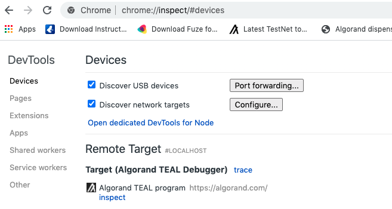
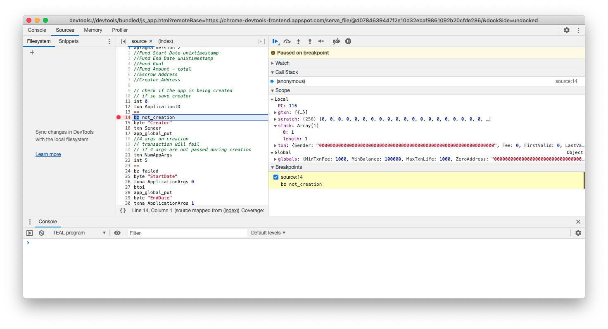
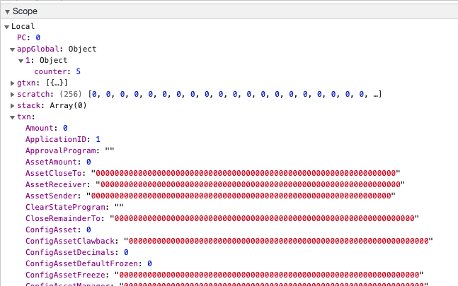

title: Debugging smart contracts

Since the release of go-algorand 3.15.0 the simulate endpoint for evaluating transactions has been made available to nodes. This feature allows users to submit a single transaction or a transaction group to the node, and be returned with the expected outcome (success or failure). In addition it can also supply a full or simple trace of the evaluated programs, along with changes to the stack, scratch space, and global and local states. Furthermore it can return a list of named resources which must be provided in the transaction if you choose not to include them during the simulation.

# Simulate

The simulate endpoint is the most recent addition when it comes to debugging smart contracts. Whether it's for helping with development, analysising existing deployed contracts, or even integrating it as part of the user experience someone has when interacting with a project, the simulate endpoint can be utilised for a variety of different workflows. Below we'll demonstrate a few of these use cases by interacting with the command-line interface as well as the RESTful API against a locally running node.

When using more advance features such as `--trace` the type of data that's returned can be a bit overwhelming if you've developed the smart contract in a higher level language. But if you start out by simply submitting your transactions and checking what the `"failure-message"` says in the response you should be able to figure out the most common issues.

You should also consider using these simulate responses with third-party tooling such as the community created [TEAL for VSCode](//marketplace.visualstudio.com/items?itemName=DragMZ.teal), which allows you to step through the TEAL smart contract and see the state of the AVM change after each instruction. Additionally there is [sim-stack-parser](//github.com/joe-p/sim-stack-parser), which will not only help visulise the stack, it will also map the compiled TEAL program back to the original PyTeal contract to further help with debugging.

## Command Line

Using the command line tool `goal` you can simply run a simulation against an individual or group transaction file. Select the file using the `--txfile` argument and a simulate response will be returned. This can be extremely useful when quickly prototyping ideas or learning how various TEAL opcodes work.

Example:
```sh
$ goal app create --creator VPUJC6ZJCKDEATYRUJRNS5EMOIQGPBXRYEOMAZGKBURUPFEZXKYQZ34LQQ --approval-prog demo.teal --clear-prog clear.teal --sign -o demo.txn
$ goal clerk simulate --txfile demo.txn
{
  "last-round": 555,
  "txn-groups": [
    {
      "app-budget-added": 700,
      "app-budget-consumed": 7,
      "txn-results": [
        {
          "app-budget-consumed": 7,
          "txn-result": {
            "application-index": 1005,
            "logs": [
              "VGhpcyBkZW1vIGlzIGRvaW5nIGEgdGhpbmc="
            ],
            "pool-error": "",
            "txn": {
              "sig": "jMBrEx/IkH0Ctirl2RZMamxnh7VSV/uiEEWUO6pAHz2ohg/WLUOLUc4l7ZEuLHKaDoJZtzJh5dEXHw/V3/xqCQ==",
              "txn": {
                "apap": "CYAaVGhpcyBkZW1vIGlzIGRvaW5nIGEgdGhpbmewgSiBAghEgQE=",
                "apsu": "CYEB",
                "fee": 1000,
                "fv": 552,
                "gh": "0OS+d50dm6lo1k0tW5sDLvog4EeAZX8KwisnNW2EMG8=",
                "lv": 1552,
                "note": "0EbOk27RDgs=",
                "snd": "VPUJC6ZJCKDEATYRUJRNS5EMOIQGPBXRYEOMAZGKBURUPFEZXKYQZ34LQQ",
                "type": "appl"
              }
            }
          }
        }
      ]
    }
  ],
  "version": 2
}
```

Should an error be raised, you'll be presented with information about what happened and which transaction of the group caused the failure. If you want a more technical breakdown of what happened during execution of your program you can enable tracing with the argument `--trace`, which will present you with a step-by-step trace of the program via the program counter (PC) value. Alternatively you can use `--full-trace` for yet more information such as stack manipulations.

## Direct API Endpoint

If you're looking for a more programmatic way to interface with simulate, the API endpoint is for you. This will also be how most tooling will interact with it.

Below is the same example as above, however there's an additional step we must do before we can simulate the transaction. We need to create a simulate request, which essentially just wraps the transaction(s) in a parent "txn-groups" array and includes any of the optional parameters such as `--allow-empty-signatures` if you don't have the private key to the account you're testing with. Once the simulate request has been created, we then call the API and pass it with the request.

!!! note
    You may be required to set the API token if your algod config doesn't have `DisableAPIToken` set to `true`. This can be achieved by adding the curl argument `-H 'X-Algo-API-Token: YOU_TOKEN_HERE'`

Example:
```sh
$ goal clerk simulate --txfile group.txn --request-only-out request.json
$ curl http://127.0.0.1:4001/v2/transactions/simulate --data @demo.json
{
  "last-round": 566,
  "txn-groups": [
    {
      "app-budget-added": 700,
      "app-budget-consumed": 7,
            "txn-results": [
        {
          "app-budget-consumed": 7,
          "txn-result": {
            "application-index": 1005,
            "logs": [
              "VGhpcyBkZW1vIGlzIGRvaW5nIGEgdGhpbmc="
            ],
            "pool-error": "",
            "txn": {
              "sig": "jMBrEx/IkH0Ctirl2RZMamxnh7VSV/uiEEWUO6pAHz2ohg/WLUOLUc4l7ZEuLHKaDoJZtzJh5dEXHw/V3/xqCQ==",
              "txn": {
                "apap": "CYAaVGhpcyBkZW1vIGlzIGRvaW5nIGEgdGhpbmewgSiBAghEgQE=",
                "apsu": "CYEB",
                "fee": 1000,
                "fv": 552,
                "gh": "0OS+d50dm6lo1k0tW5sDLvog4EeAZX8KwisnNW2EMG8=",
                "lv": 1552,
                "note": "0EbOk27RDgs=",
                "snd": "VPUJC6ZJCKDEATYRUJRNS5EMOIQGPBXRYEOMAZGKBURUPFEZXKYQZ34LQQ",
                "type": "appl"
              }
            }
          }
        }
      ]
    }
  ],
  "version": 2
}
```

## JavaScript SDK

To use the simulate endpoint within JavaScript the [js-algorand-sdk](//github.com/algorand/js-algorand-sdk) has some built-in features to help you. The most popular route will be using the AtomicTransactionComposer's `.simulate()` [method call](//algorand.github.io/js-algorand-sdk/classes/AtomicTransactionComposer.html#simulate). To learn more about the ATC please refer to [this section](../../atc.md).

The code below is a complete example that walks through the entire process of constructing a transaction, calling the simulate endpoint, and printing out the simulate response.

```js
import algosdk from 'algosdk';

const client = new algosdk.Algodv2(
	'a'.repeat(64),
	'http://127.0.0.1',
	4001,
);

const mn = 'abandon abandon abandon abandon abandon abandon abandon abandon abandon abandon abandon abandon abandon abandon abandon abandon abandon abandon abandon abandon abandon abandon abandon abandon invest';
const acct = algosdk.mnemonicToSecretKey(mn);
const signer = algosdk.makeBasicAccountTransactionSigner(acct);

const approval_b64 = "CTEYSIAgOM54YO9NPIFpGWulHHE7cVNZ0dbwigCRgyDrG94ypjJgFrCBAQ==";
const clear_b64 = "CYEB";

(async () => {
	const sp = await client.getTransactionParams().do();
	const txn = algosdk.makeApplicationCreateTxnFromObject({
		from: acct.addr,
		suggestedParams: sp,
		approvalProgram: new Uint8Array(Buffer.from(approval_b64, "base64")),
		clearProgram: new Uint8Array(Buffer.from(clear_b64, "base64")),
	});

	const atc = new algosdk.AtomicTransactionComposer;
	const tws = {
		txn: txn,
		signer: signer,
	};
	atc.addTransaction(tws);

	const simreq = new algosdk.modelsv2.SimulateRequest({
		allowEmptySignatures: true,
		allowUnnamedResources: true,
		execTraceConfig: new algosdk.modelsv2.SimulateTraceConfig({
			enable: true,
			scratchChange: true,
			stackChange: true,
			stateChange: true,
		}),
	});
	const simres = await atc.simulate(client, simreq);

	console.log(JSON.stringify(simres, null, 2));
})();
```

## Python SDK

To use the simulate endpoint within Python the [py-algorand-sdk](//github.com/algorand/py-algorand-sdk) has some built-in features to help you. The most popular route will be using the AtomicTransactionComposer's `.simulate()` [method call](//py-algorand-sdk.readthedocs.io/en/latest/algosdk/atomic_transaction_composer.html#algosdk.atomic_transaction_composer.AtomicTransactionComposer.simulate). To learn more about the ATC please refer to [this section](../../atc.md).

The code below is a complete example that walks through the entire process of constructing a transaction, calling the simulate endpoint, and printing out the simulate response.

```py
#!/usr/bin/env python3

import json
from base64 import b64decode

from algosdk.v2client.algod import AlgodClient
from algosdk.v2client.models import simulate_request, SimulateRequestTransactionGroup
from algosdk.transaction import ApplicationCreateTxn, OnComplete, StateSchema
from algosdk import account, mnemonic, atomic_transaction_composer

client = AlgodClient('a' * 64, "http://127.0.0.1:4001")

mn = 'abandon abandon abandon abandon abandon abandon abandon abandon abandon abandon abandon abandon abandon abandon abandon abandon abandon abandon abandon abandon abandon abandon abandon abandon invest';
sk = mnemonic.to_private_key(mn)
pk = account.address_from_private_key(sk)
signer = atomic_transaction_composer.AccountTransactionSigner(sk)

approval_b64 = "CTEYSIAgOM54YO9NPIFpGWulHHE7cVNZ0dbwigCRgyDrG94ypjJgFrCBAQ=="
clear_b64 = "CYEB"

sp = client.suggested_params()
txn = ApplicationCreateTxn(
    sender = pk,
    sp = sp,
    approval_program = b64decode(approval_b64),
    clear_program = b64decode(clear_b64),
    on_complete = OnComplete.NoOpOC,
    global_schema = StateSchema(0, 0),
    local_schema = StateSchema(0, 0),
    accounts = ["HDHHQYHPJU6IC2IZNOSRY4J3OFJVTUOW6CFABEMDEDVRXXRSUYZHZ2ZL4I"]
)

atc = atomic_transaction_composer.AtomicTransactionComposer()
tws = atomic_transaction_composer.TransactionWithSigner(txn = txn, signer = signer)
atc.add_transaction(tws)

simreq = simulate_request.SimulateRequest(
    txn_groups = SimulateRequestTransactionGroup(txns = []),
    allow_empty_signatures = True,
    exec_trace_config= simulate_request.SimulateTraceConfig(
        enable = True,
        stack_change = True,
        scratch_change = True,
    )
)
simres = atc.simulate(client)

print(json.dumps(simres.__dict__))
```

## Advanced Simulate Tracing

Once you're familiar with the basics of simulate you may be after more technical details about how your smart contract is operating within the AVM. This can be done by using the `--trace` and `--full-trace` arguments when creating the simulate request. Upon submitting the request to the node you'll be presented with an extra `"exec-trace"` element in the response. This new structure will detail the steps the AVM took during evaluation of the smart contract, and in the case of using `--full-trace` it will display manipulations to the stack, scratch space, and global and local states. Be aware that what it's stepping through is the lowest level of bytecode, so you will need to use additional tooling to map these traces back to a higher level language you may have written your smart contract in.

Below is an example smart contract which utilises the stack, scratch space, global and local state, and box storage. Giving you a very detailed simulate response of exactly what's being changed during evaluation of the contract. By using the `--allow-unnamed-resources` option, I am able to submit the transaction without providing the box name, and in the simulate response I am told what box name I must provide when submitting the transaction to the network. This is extremely useful when you have large complex transaction groups that share resources.

```sh
$ goal app create --creator WONFHT5BPHIAU5D4YZXGY2BLTQ5YOLUNRODZ4XQRG3RSQSB6ZVZ2I2F3AI --approval-prog full.teal --clear-prog clear.teal --global-ints 1 --local-ints 1 --on-completion optin -o full.txn
$ goal clerk simulate --txfile full.txn --allow-empty-signatures --full-trace --allow-unnamed-resources
{
  "eval-overrides": {
    "allow-empty-signatures": true,
    "allow-unnamed-resources": true
  },
  "exec-trace-config": {
    "enable": true,
    "scratch-change": true,
    "stack-change": true,
    "state-change": true
  },
  "last-round": 16938,
  "txn-groups": [
    {
      "app-budget-added": 700,
      "app-budget-consumed": 18,
      "txn-results": [
        {
          "app-budget-consumed": 18,
          "exec-trace": {
            "approval-program-hash": "EwlhQwuh35HJQ6lELdPi53mkqlJ1z/kMRGW1mdRTBWI=",
            "approval-program-trace": [
              {
                "pc": 1
              },
              {
                "pc": 13,
                "stack-additions": [
                  {
                    "type": 2,
                    "uint": 123
                  }
                ]
              },
              {
                "pc": 15,
                "scratch-changes": [
                  {
                    "new-value": {
                      "type": 2,
                      "uint": 123
                    },
                    "slot": 0
                  }
                ],
                "stack-pop-count": 1
              },
              {
                "pc": 17,
                "stack-additions": [
                  {
                    "bytes": "Z2xvYmFsX3ZhbHVl",
                    "type": 1
                  }
                ]
              },
              {
                "pc": 31,
                "stack-additions": [
                  {
                    "type": 2,
                    "uint": 123
                  }
                ]
              },
              {
                "pc": 33,
                "stack-pop-count": 2,
                "state-changes": [
                  {
                    "app-state-type": "g",
                    "key": "Z2xvYmFsX3ZhbHVl",
                    "new-value": {
                      "type": 2,
                      "uint": 123
                    },
                    "operation": "w"
                  }
                ]
              },
              {
                "pc": 34,
                "stack-additions": [
                  {
                    "bytes": "s5pTz6F50Ap0fMZubGgrnDuHLo2Lh55eETbjKEg+zXM=",
                    "type": 1
                  }
                ]
              },
              {
                "pc": 36,
                "stack-additions": [
                  {
                    "bytes": "bG9jYWxfdmFsdWU=",
                    "type": 1
                  }
                ]
              },
              {
                "pc": 49,
                "stack-additions": [
                  {
                    "type": 2,
                    "uint": 123
                  }
                ]
              },
              {
                "pc": 51,
                "stack-pop-count": 3,
                "state-changes": [
                  {
                    "account": "WONFHT5BPHIAU5D4YZXGY2BLTQ5YOLUNRODZ4XQRG3RSQSB6ZVZ2I2F3AI",
                    "app-state-type": "l",
                    "key": "bG9jYWxfdmFsdWU=",
                    "new-value": {
                      "type": 2,
                      "uint": 123
                    },
                    "operation": "w"
                  }
                ]
              },
              {
                "pc": 52,
                "stack-additions": [
                  {
                    "bytes": "Ym94X3ZhbHVl",
                    "type": 1
                  }
                ]
              },
              {
                "pc": 53,
                "stack-additions": [
                  {
                    "type": 2,
                    "uint": 123
                  }
                ]
              },
              {
                "pc": 55,
                "stack-additions": [
                  {
                    "type": 2,
                    "uint": 1
                  }
                ],
                "stack-pop-count": 2,
                "state-changes": [
                  {
                    "app-state-type": "b",
                    "key": "Ym94X3ZhbHVl",
                    "new-value": {
                      "bytes": "AAAAAAAAAAAAAAAAAAAAAAAAAAAAAAAAAAAAAAAAAAAAAAAAAAAAAAAAAAAAAAAAAAAAAAAAAAAAAAAAAAAAAAAAAAAAAAAAAAAAAAAAAAAAAAAAAAAAAAAAAAAAAAAAAAAAAAAAAAAAAAAAAAAAAAAAAAAAAAAAAAAA",
                      "type": 1
                    },
                    "operation": "w"
                  }
                ]
              },
              {
                "pc": 56,
                "stack-pop-count": 1
              },
              {
                "pc": 57,
                "stack-additions": [
                  {
                    "bytes": "Ym94X3ZhbHVl",
                    "type": 1
                  }
                ]
              },
              {
                "pc": 58,
                "stack-additions": [
                  {
                    "type": 2,
                    "uint": 1
                  }
                ],
                "stack-pop-count": 1,
                "state-changes": [
                  {
                    "app-state-type": "b",
                    "key": "Ym94X3ZhbHVl",
                    "operation": "d"
                  }
                ]
              },
              {
                "pc": 59,
                "stack-pop-count": 1
              },
              {
                "pc": 60,
                "stack-additions": [
                  {
                    "type": 2,
                    "uint": 1
                  }
                ]
              }
            ]
          },
          "txn-result": {
            "application-index": 1069,
            "global-state-delta": [
              {
                "key": "Z2xvYmFsX3ZhbHVl",
                "value": {
                  "action": 2,
                  "uint": 123
                }
              }
            ],
            "local-state-delta": [
              {
                "address": "WONFHT5BPHIAU5D4YZXGY2BLTQ5YOLUNRODZ4XQRG3RSQSB6ZVZ2I2F3AI",
                "delta": [
                  {
                    "key": "bG9jYWxfdmFsdWU=",
                    "value": {
                      "action": 2,
                      "uint": 123
                    }
                  }
                ]
              }
            ],
            "pool-error": "",
            "txn": {
              "txn": {
                "apan": 1,
                "apap": "CSYBCWJveF92YWx1ZYF7NQCADGdsb2JhbF92YWx1ZTQAZzEAgAtsb2NhbF92YWx1ZTQAZig0ALlEKLxEgQE=",
                "apgs": {
                  "nui": 1
                },
                "apls": {
                  "nui": 1
                },
                "apsu": "CYEB",
                "fee": 1000,
                "fv": 16936,
                "gh": "0OS+d50dm6lo1k0tW5sDLvog4EeAZX8KwisnNW2EMG8=",
                "lv": 17936,
                "note": "IRCmDp1ak60=",
                "snd": "WONFHT5BPHIAU5D4YZXGY2BLTQ5YOLUNRODZ4XQRG3RSQSB6ZVZ2I2F3AI",
                "type": "appl"
              }
            }
          }
        }
      ],
      "unnamed-resources-accessed": {
        "boxes": [
          {
            "app": 1069,
            "name": "Ym94X3ZhbHVl"
          }
        ]
      }
    }
  ],
  "version": 2
}
```

# Historical Debugging

Below are two ways debugging used to be achieved with Algorand smart contracts. Whilst it's still possible to use these techniques today, there are limitations associated with them and certain features haven't been updated to support the latest AVM capabilities.

!!! warning
    As of AVMv8, `dryrun` will no longer work with any contract that uses box storage. A new endpoint to replace `dryrun` along with a new tool to replace `tealdbg` is currently in development.

Smart contracts can be debugged using two different methods. The first is an interactive debugger that uses the `tealdbg` command-line tool to launch a debug session where the smart contract can be examined as the contract is being evaluated. The second method uses the `goal clerk dryrun-remote` command which outputs a line by line result of the evaluation of the smart contract.  These two methods are described below.

# Using the TEAL debugger
Algorand provides the `tealdbg` command-line tool to launch an interactive session to debug smart contracts. This tool is explained in the project’s [README](https://github.com/algorand/go-algorand/blob/master/cmd/tealdbg/README.md).

This debugger can debug local smart contracts or connect remotely to an on-chain smart contract. The examples below illustrate using the debugger locally, which will be the predominant use case for developers when they are developing smart contracts. For more information on the `tealdbg` utility and how you can use it remotely, see the project’s [README](https://github.com/algorand/go-algorand/blob/master/cmd/tealdbg/README.md) which covers in detail the different debugging options. The `tealdbg` command can also be called through a [sandbox](https://github.com/algorand/sandbox) with `./sandbox tealdbg {OPTIONS}`.

The debugger process supports both Chrome Developer Tools and a simple Web Frontend.

To launch the debugger locally, for use with the CDT, execute the following command from a terminal.

```
$ tealdbg debug program.teal
.
.
2020/08/25 14:05:38 CDT debugger listening on: ws://localhost:9392/091d04a69152223ae84c8b40271c3d62f8490ea9b795aae95868932163f89735
2020/08/25 14:05:38 Or open in Chrome:
2020/08/25 14:05:38 devtools://devtools/bundled/js_app.html?experiments=true&v8only=false&ws=localhost:9392/091d04a69152223ae84c8b40271c3d62f8490ea9b795aae95868932163f89735
```

This will launch the debugger process and return an endpoint that is listening for connections. This process can be connected to directly with the Chrome Developer Tools (CDT). The simplest way to do this is to enter `chrome://inspect/` into the address bar of the browser, click “Configure” to add “localhost:9392”, and select the Algorand TEAL Debugger in the Remote Target Section (click on the inspect link).

!!! note "A note about ports"
    You may have to pass a specific port to the tealdbg command line tool to prevent it from trying to use a port that is already being used. For example if you have the sandbox running and you'd like to run the tealdbg on the host machine.
    ```
     tealdbg debug program.teal --remote-debugging-port 9393
    ```


<center>*Configure CDT Remote Connection*</center>

This will launch the debugger and allow the smart contract to be inspected. The debugger provides standard debugger controls, like single-stepping, pausing, breakpoints etc.

!!! note "A note on viewing TEAL source"
    The TEAL source file may not open immediately but you can bring up a menu with the source files by pressing CTRL+P or CMD+P on mac 


<center>*TEAL Debugger*</center>

The Scope pane contains the current stack and is useful for determining what values the current line of code is processing. When a smart contract returns, if anything other than one positive value is left on the stack or the `return` opcode is used with a nonpositive value on the top of the stack, the program will fail. The Scope pane also displays the current transaction with all its properties, the current scratch space, global variables, and any state associated with the contract. If this transaction is part of an atomic transfer, all transactions will also be available in the Scope pane.

The debugging session runs in a mock version of the ledger so the context including; balance records of the accounts, application parameters, and assets used during program evaluation must be supplied.  Exactly what context is needed for a debug session will depend on the type of contract that is being debugged and what opcodes are used in the program. 

Most frequently, a [Dryrun Dump](#creating-a-dryrun-dump-file) file is used to pass all this context information in a single payload. 

It can be supplied directly by calling `tealdbg` with arguments including: 

    - Transaction(s) - Supply one or more transactions to the debug session.
    - Balance Records - Account balance records of accounts used in the contract. Needed when debugging smart contracts that make use of state. 
    - Latest Timestamp - Set the latest timestamp for debugging smart contracts that make use of time values.
    - Protocol - Set the protocol of consensus that the debug session uses when evaluating the contract.
    - Round - Set the current round for the debug session.
    Group Index - If using more than one transaction, the specific index that is being processed can be set.
    - Mode - The debugger can debug both smart signatures (Signature) and smart contracts (Application). The mode can be set to determine which type is being processed. By default, the debugger scans the program to determine the type of contract.
    - Application ID - Manually set the application ID of the current smart contract.
    - Program - Pass the program to debug

To learn more about setting individual context items, see the `tealdbg` [documentation](https://github.com/algorand/go-algorand/blob/master/cmd/tealdbg/README.md).

The context can also be read directly from an instance of the Indexer. See the `tealdbg` [documentation](https://github.com/algorand/go-algorand/blob/master/cmd/tealdbg/README.md) for more information.

## Creating a dryrun dump file

This file may be msgpack or json and can be created using goal or the SDKs

=== "Python"
    <!-- ===PYSDK_DEBUG_DRYRUN_DUMP=== -->
	```python
	sp = algod_client.suggested_params()
	
	atc = atomic_transaction_composer.AtomicTransactionComposer()
	atc.add_method_call(
	    app_id, my_method, acct1.address, sp, acct1.signer, method_args=[1, 2]
	)
	txns = atc.gather_signatures()
	
	drr = transaction.create_dryrun(algod_client, txns)
	
	# Write the file as binary result of msgpack encoding
	with open("dryrun.msgp", "wb") as f:
	    f.write(base64.b64decode(encoding.msgpack_encode(drr)))
	```
	[Snippet Source](https://github.com/algorand/py-algorand-sdk/blob/examples/examples/debug.py#L31-L44)
    <!-- ===PYSDK_DEBUG_DRYRUN_DUMP=== -->

=== "JavaScript"
    <!-- ===JSSDK_DEBUG_DRYRUN_DUMP=== -->
	```javascript
	const suggestedParams = await algodClient.getTransactionParams().do();
	
	const atc = new algosdk.AtomicTransactionComposer();
	atc.addMethodCall({
	  appID: appId,
	  method: contract.getMethodByName('sub'),
	  methodArgs: [1, 2],
	  sender: sender.addr,
	  signer: sender.signer,
	  suggestedParams,
	});
	
	const signedTxns = (await atc.gatherSignatures()).map((stxn) =>
	  algosdk.decodeSignedTransaction(stxn)
	);
	
	const dryrunRequest = await algosdk.createDryrun({
	  client: algodClient,
	  txns: signedTxns,
	});
	
	console.log('Dryrun:', dryrunRequest.get_obj_for_encoding());
	```
	[Snippet Source](https://github.com/algorand/js-algorand-sdk/blob/examples/examples/debug.ts#L24-L46)
    <!-- ===JSSDK_DEBUG_DRYRUN_DUMP=== -->

=== "Go"
    <!-- ===GOSDK_DEBUG_DRYRUN_DUMP=== -->
	```go
	var (
		args     [][]byte
		accounts []string
		apps     []uint64
		assets   []uint64
	)
	
	sp, err := algodClient.SuggestedParams().Do(context.Background())
	if err != nil {
		log.Fatalf("failed to get suggested params: %s", err)
	}
	
	appCallTxn, err := transaction.MakeApplicationNoOpTx(
		appID, args, accounts, apps, assets, sp, acct1.Address,
		nil, types.Digest{}, [32]byte{}, types.Address{},
	)
	if err != nil {
		log.Fatalf("Failed to create app call txn: %+v", err)
	}
	
	_, stxn, err := crypto.SignTransaction(acct1.PrivateKey, appCallTxn)
	if err != nil {
		log.Fatalf("Failed to sign app txn: %+v", err)
	}
	
	signedAppCallTxn := types.SignedTxn{}
	msgpack.Decode(stxn, &signedAppCallTxn)
	
	drr, err := transaction.CreateDryrun(algodClient, []types.SignedTxn{signedAppCallTxn}, nil, context.Background())
	if err != nil {
		log.Fatalf("Failed to create dryrun: %+v", err)
	}
	
	os.WriteFile("dryrun.msgp", msgpack.Encode(drr), 0666)
	```
	[Snippet Source](https://github.com/algorand/go-algorand-sdk/blob/examples/examples/debug/main.go#L27-L61)
    <!-- ===GOSDK_DEBUG_DRYRUN_DUMP=== -->

=== "Java"
    <!-- ===JAVASDK_DEBUG_DRYRUN_DUMP=== -->
	```java
	// Set up the transactions we'd like to dryrun
	AtomicTransactionComposer atc = new AtomicTransactionComposer();
	
	List<Object> methodArgs = new ArrayList<Object>();
	methodArgs.add(1);
	methodArgs.add(1);
	
	TransactionParametersResponse sp = algodClient.TransactionParams().execute().body();
	
	MethodCallTransactionBuilder<?> mctb = MethodCallTransactionBuilder.Builder();
	MethodCallParams mcp = mctb.applicationId(appId).signer(acct.getTransactionSigner())
	        .suggestedParams(sp)
	        .sender(acct.getAddress())
	        .method(contract.getMethodByName("add"))
	        .methodArguments(methodArgs)
	        .onComplete(Transaction.OnCompletion.NoOpOC)
	        .build();
	atc.addMethodCall(mcp);
	
	DryrunRequest drr = Utils.createDryrun(algodClient, atc.gatherSignatures(), "", 0L, 0L);
	
	FileOutputStream outfile = new FileOutputStream("my-dryrun.msgpack");
	outfile.write(Encoder.encodeToMsgPack(drr));
	outfile.close();
	```
	[Snippet Source](https://github.com/algorand/java-algorand-sdk/blob/examples/examples/src/main/java/com/algorand/examples/Debug.java#L36-L60)
    <!-- ===JAVASDK_DEBUG_DRYRUN_DUMP=== -->

=== "goal"
    <!-- ===GOAL_DEBUG_DRYRUN_DUMP=== -->
    ```sh

    $ goal app call --app-id {appid} --from {ACCOUNT} --out=dryrun.json --dryrun-dump
    # or if you already have a transaction file
    $ goal clerk dryrun --dryrun-dump -t transaction.txn -o dryrun.json

    ```
    <!-- ===GOAL_DEBUG_DRYRUN_DUMP=== -->

## Calling the debugger with context

```
$ tealdbg debug -d dryrun.msgp
```

!!! note "a note on supplying the Teal code"
    The `tealdbg` command does not require the Teal program above as the decompiled version is available in the dryrun-req dump file. In this example it is supplied for easier readability while in the debugger. Supplying the program will allow debugging the original source and not the decompiled version.

The scope panel will now have the proper context data for the debugging session.


<center>*TEAL Debugger Scope*</center>

One or more transactions that are stored in a file can be debugged by dumping the context data with the `goal clerk dryrun` command. For example, two smart contracts are grouped below and the context data is generated using the `dryrun-dump` option. The `tealdbg` command is then used to start the debugger.

```
#generate calls
$ goal app call --app-id 1  --app-arg "str:test1" --from {ACCOUNT} --out=unsginedtransaction1.tx  
$ goal app call --app-id 1  --app-arg "str:test2" --from {ACCOUNT} --out=unsginedtransaction2.tx

# atomically group them
$ cat unsginedtransaction1.tx unsginedtransaction2.tx  > combinedtransactions.tx
$ goal clerk group -i combinedtransactions.tx -o groupedtransactions.tx 
$ goal clerk split -i groupedtransactions.tx -o split.tx 

# sign individual transactions
$ goal clerk sign -i split-0.tx -o signout-0.tx
$ goal clerk sign -i split-1.tx -o signout-1.tx 

# concatenate the two signed transactions
$ cat signout-0.tx signout-1.tx  > signout.tx

# generate context debug file
$ goal clerk dryrun -t signout.tx --dryrun-dump  -o dryrun.json

# debug first transaction. Change index to 1 to debug second transaction
$ tealdbg debug program.teal -d dryrun.json --group-index 0
```

A similar flow may be implemented in any of the sdks, passing the list of transactions to the `create_dryrun` function will produce the DryrunDump object and either write the object out to a file as shown above or send it directly to the [/v2/teal/dryrun](../../../rest-apis/algod.md#post-v2tealdryrun) endpoint

Debugging a smart signature functions identically to the process described above except the state is not required. For example, a smart signature may act as an escrow account. The following call exports the transaction for debugging purposes. This call will not execute on the blockchain as it is not submitted to the network but is written to the output file.

```
$ goal clerk send -a=0 -c={ACCOUNT_1} --to={ACCOUNT_2} --from-program=stateless.teal --out=statelesstx.tx --dryrun-dump
```

This contract can then be debugged by using the following command.

```
$ tealdbg debug stateless.teal -d statelesstx.tx
```

The `tealdbg` utility has many more options for setting specific context items. For information on these capabilities, see the project’s [README](https://github.com/algorand/go-algorand/blob/master/cmd/tealdbg/README.md).


# Dryrun REST endpoint 

!!! important "enabling dryrun-remote"
    The dryrun REST API is only available on a node if it has been enabled in the node's configuration. This can be done using the following commands.

    ```
    $ algocfg set -p EnableDeveloperAPI -v true
    $ goal node restart
    ```

Using the [Dryrun](../../../rest-apis/algod.md#post-v2tealdryrun) REST endpoint to debug programs can be very helpful for debugging or even running unit tests.

The payload for [creating a dryrun request](#creating-a-dryrun-dump-file) has the same contents as the dryrun dump file. After Sending the Dryrun Request object to the server the response will contain evaluation results for all the transactions that invoked smart contracts including a Stack Trace, cost (as budget-*), logs (if successful) and errors encountered.


=== "Python"
    <!-- ===PYSDK_DEBUG_DRYRUN_SUBMIT=== -->
	```python
	# Create the dryrun request object
	dryrun_request = transaction.create_dryrun(algod_client, txns)
	
	# Pass dryrun request to algod server
	dryrun_result = algod_client.dryrun(dryrun_request)
	drr = dryrun_results.DryrunResponse(dryrun_result)
	
	for txn in drr.txns:
	    if txn.app_call_rejected():
	        print(txn.app_trace())
	```
	[Snippet Source](https://github.com/algorand/py-algorand-sdk/blob/examples/examples/debug.py#L48-L58)
    <!-- ===PYSDK_DEBUG_DRYRUN_SUBMIT=== -->

=== "JavaScript"
    <!-- ===JSSDK_DEBUG_DRYRUN_SUBMIT=== -->
	```javascript
	const dryrunResponse = await algodClient.dryrun(dryrunRequest).do();
	dryrunResponse.txns.forEach((txn) => {
	  console.log('Txn:', txn.txn);
	  console.log('Txn Results:', txn.txnresults);
	});
	```
	[Snippet Source](https://github.com/algorand/js-algorand-sdk/blob/examples/examples/debug.ts#L49-L54)
    <!-- ===JSSDK_DEBUG_DRYRUN_SUBMIT=== -->

=== "Go"
    <!-- ===GOSDK_DEBUG_DRYRUN_SUBMIT=== -->
	```go
	// Create the dryrun request object
	drReq, err := transaction.CreateDryrun(algodClient, []types.SignedTxn{signedAppCallTxn}, nil, context.Background())
	if err != nil {
		log.Fatalf("Failed to create dryrun: %+v", err)
	}
	
	// Pass dryrun request to algod server
	dryrunResponse, err := algodClient.TealDryrun(drReq).Do(context.Background())
	if err != nil {
		log.Fatalf("failed to dryrun request: %s", err)
	}
	
	// Inspect the response to check result
	for _, txn := range dryrunResponse.Txns {
		log.Printf("%+v", txn.AppCallTrace)
	}
	```
	[Snippet Source](https://github.com/algorand/go-algorand-sdk/blob/examples/examples/debug/main.go#L64-L80)
    <!-- ===GOSDK_DEBUG_DRYRUN_SUBMIT=== -->

=== "Java"
    <!-- ===JAVASDK_DEBUG_DRYRUN_SUBMIT=== -->
	```java
	Response<DryrunResponse> resp = algodClient.TealDryrun().request(drr).execute();
	DryrunResponse drResp = resp.body();
	DryrunTxnResult dryrunTxnResult = drResp.txns.get(0);
	System.out.println(dryrunTxnResult.appCallMessages);
	System.out.println(Utils.appTrace(dryrunTxnResult));
	```
	[Snippet Source](https://github.com/algorand/java-algorand-sdk/blob/examples/examples/src/main/java/com/algorand/examples/Debug.java#L63-L68)
    <!-- ===JAVASDK_DEBUG_DRYRUN_SUBMIT=== -->


=== "Shell"
    ```sh
    # With a dryrun object as dryrun.msgp 

    $ curl -XPOST "http://localhost:4001/v2/teal/dryrun" \
        -H "X-Algo-API-Token: aaaaaaaaaaaaaaaaaaaaaaaaaaaaaaaaaaaaaaaaaaaaaaaaaaaaaaaaaaaaaaaa" \
        --data-binary @dryrun.msgp

    ```

Example of DryrunResponse payload:

```js
{
	"error": "error string if failure occurred",
	"protocol-version": "",
    "txns":[
        {
            "app-call-messages":["string array of messages", "will contain reject if relevant"],
            "app-call-trace":[
                {
                    "line":1,
                    "pc":2,
                    "stack":[{ // Each stack value at this pc
                        "type":1 //1 is bytes, 2 is int
                        "bytes":"the bytes on the stack" 
                        "int":0 
                    }]
                },
                // ...
            ],
            "budget-consumed":1337,
            "budget-added":1400,

            // Disassembled program line by line.
            "disassembly":["disassembled", "program", "broken", "out", "by", "line"],

            // The changes to the global state ths program would have caused
            "global-delta": {},

            // The changes to local state this program would have caused
            "local-deltas":[{}],

            // Any messages caused by the logic sig evaluation
            "logic-sig-messages":[],

            // Any trace from a logic sig
            "logic-sig-trace":[],

            // Any logs from application call output
            "logs":["base64", "encoding", "of", "logged", "bytes"],
        }
    ]
}
```
