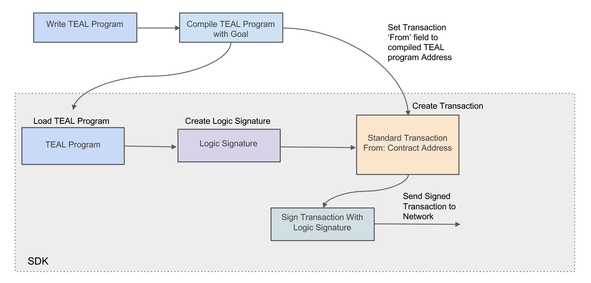
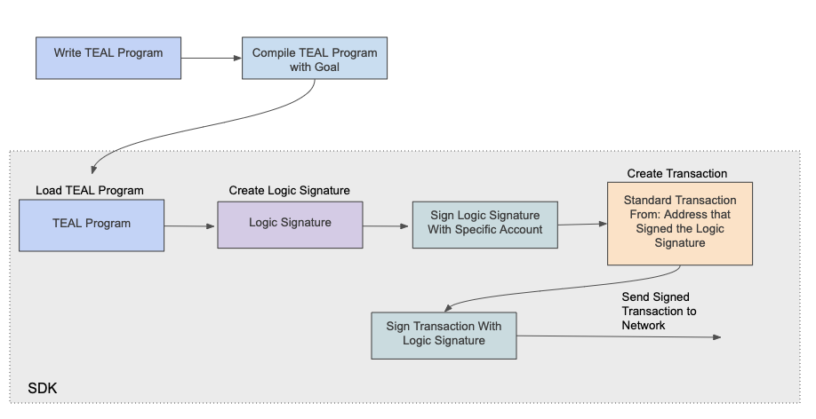

title: Interact with smart signatures

This guide covers using smart signatures with the Algorand SDKs. Smart signatures are also referred to as stateless smart contracts. Smart signatures can be used to create contract accounts or to handle account delegation which is described in the [Modes](/docs/get-details/dapps/smart-contracts/smartsigs/modes) documentation. In either case, the contracts are written in [Transaction Execution Approval Language (TEAL)](/docs/get-details/dapps/avm/teal/) or with Python using the [PyTeal](/docs/get-details/dapps/writing-contracts/pyteal) library.


# Compiling TEAL program from SDKs
Before a TEAL program can be used, it must be compiled. SDKs provide this capability. The examples in this section use a simple contract which contains one line of TEAL code, `int 1` . This will always return an approval for the transaction. So, any transactions that use this TEAL file will succeed. Never use this TEAL in a production application as it approves all transactions. 


To use the SDK compile command, the [config settings](/docs/run-a-node/reference/config) may need to be modified to set a value for `EnableDeveloperAPI`, which should be set to `true`. The default is false. If using the sandbox, the following modification is already made. If [running your own node](/docs/run-a-node/setup/install), you may see an error similar to "compile was not enabled in the configuration file by setting the EnableDeveloperAPI to true". Make the following modification to the `config.json` file located in the node’s data directory. First, if there is not a `config.json`, make a copy of the `config.json.example` file.

```
$ goal node stop -d data
$ cd data
$ cp config.json.example config.json
```

Then edit the config.json file and replace `false` on the line

`"EnableDeveloperAPI": false,`

with `true`

`"EnableDeveloperAPI": true,`

Restart the node.

```
$ goal node start -d data
$ goal node status -d data
```

The following TEAL code is used in the examples below.

`sample.teal`
```
// This code is meant for learning purposes only
// It should not be used in production
int 1
```

!!! info
    The samples on this page use a docker sandbox install.

=== "JavaScript"
    <!-- ===JSSDK_LSIG_COMPILE=== -->
	```javascript
	const smartSigSource = '#pragma version 8\nint 1\nreturn'; // approve everything
	const result = await client.compile(Buffer.from(smartSigSource)).do();
	
	// Hash is equivalent to the contract address
	console.log('Hash: ', result.hash);
	console.log('B64: ', result.result);
	const b64program = result.result;
	```
	[Snippet Source](https://github.com/algorand/js-algorand-sdk/blob/examples/examples/lsig.ts#L15-L22)
    <!-- ===JSSDK_LSIG_COMPILE=== -->

=== "Python"
    <!-- ===PYSDK_LSIG_COMPILE=== -->
	```python
	# read teal program
	data = open(lsig_src_path, "r").read()
	# compile teal program
	response = algod_client.compile(data)
	print("Response Result = ", response["result"])
	print("Response Hash = ", response["hash"])
	```
	[Snippet Source](https://github.com/algorand/py-algorand-sdk/blob/examples/examples/lsig.py#L12-L18)
    <!-- ===PYSDK_LSIG_COMPILE=== -->

=== "Java"
    <!-- ===JAVASDK_LSIG_COMPILE=== -->
	```java
	String tealsrc = Files.readString(Paths.get("lsig/simple.teal"));
	Response<CompileResponse> compileResp = algodClient.TealCompile().source(tealsrc.getBytes()).execute();
	System.out.printf("Program: %s\n", compileResp.body().result);
	System.out.printf("Address: %s\n", compileResp.body().hash);
	byte[] tealBinary = Encoder.decodeFromBase64(compileResp.body().result);
	```
	[Snippet Source](https://github.com/algorand/java-algorand-sdk/blob/examples/examples/src/main/java/com/algorand/examples/LSig.java#L98-L103)
    <!-- ===JAVASDK_LSIG_COMPILE=== -->

=== "Go"
    <!-- ===GOSDK_LSIG_COMPILE=== -->
	```go
	teal, err := ioutil.ReadFile("lsig/simple.teal")
	if err != nil {
		log.Fatalf("failed to read approval program: %s", err)
	}
	
	result, err := algodClient.TealCompile(teal).Do(context.Background())
	if err != nil {
		log.Fatalf("failed to compile program: %s", err)
	}
	
	lsigBinary, err := base64.StdEncoding.DecodeString(result.Result)
	if err != nil {
		log.Fatalf("failed to decode compiled program: %s", err)
	}
	```
	[Snippet Source](https://github.com/algorand/go-algorand-sdk/blob/examples/examples/lsig/main.go#L24-L38)
    <!-- ===GOSDK_LSIG_COMPILE=== -->

Once a TEAL program is compiled, the bytes of the program can be used as a parameter to the LogicSigAccount method. Most of the SDKs support the bytes encoded in base64 or hexadecimal format.

The binary bytes are used in the SDKs as shown below. If using the `goal` command-line tool to compile the TEAL code, these same bytes can be retrieved using the following commands. 


``` bash
//hexdump 
$ hexdump -C simple.teal.tok
//base64 format
$ cat simple.teal.tok | base64
ASABACI=
```

The response result from the TEAL `compile` command above is used to create the `program` variable. This variable can then be used as an input parameter to the function to make a logic signature.

=== "JavaScript"
    <!-- ===JSSDK_LSIG_INIT=== -->
	```javascript
	let smartSig = new algosdk.LogicSig(
	  new Uint8Array(Buffer.from(b64program, 'base64'))
	);
	```
	[Snippet Source](https://github.com/algorand/js-algorand-sdk/blob/examples/examples/lsig.ts#L25-L28)
    <!-- ===JSSDK_LSIG_INIT=== -->

=== "Python"
    <!-- ===PYSDK_LSIG_INIT=== -->
	```python
	program = base64.b64decode(compiled_program)
	lsig = transaction.LogicSigAccount(program)
	```
	[Snippet Source](https://github.com/algorand/py-algorand-sdk/blob/examples/examples/lsig.py#L25-L27)
    <!-- ===PYSDK_LSIG_INIT=== -->

=== "Java"
    <!-- ===JAVASDK_LSIG_INIT=== -->
	```java
	LogicSigAccount lsig = new LogicSigAccount(tealBinary, null);
	```
	[Snippet Source](https://github.com/algorand/java-algorand-sdk/blob/examples/examples/src/main/java/com/algorand/examples/LSig.java#L31-L32)
    <!-- ===JAVASDK_LSIG_INIT=== -->

=== "Go"
    <!-- ===GOSDK_LSIG_INIT=== -->
	```go
	lsig := crypto.LogicSigAccount{
		Lsig: types.LogicSig{Logic: lsigBinary, Args: nil},
	}
	```
	[Snippet Source](https://github.com/algorand/go-algorand-sdk/blob/examples/examples/lsig/main.go#L41-L44)
    <!-- ===GOSDK_LSIG_INIT=== -->

# Passing parameters using the SDKs
The SDKs require that parameters to a smart signature TEAL program be in byte arrays. This byte array is passed to the method that creates the logic signature. Currently, these parameters must be either unsigned integers or binary strings. If comparing a constant string in TEAL, the constant within the TEAL program must be encoded in hex or base64. See the TEAL tab below for a simple example of comparing the string argument used in the other examples. SDK native language functions can be used to encode the parameters to the TEAL program correctly. The example below illustrates both a string parameter and an integer.

!!! info
    The samples show setting parameters at the creation of the logic signature. These parameters can be changed at the time of submitting the transaction.

=== "JavaScript"
    <!-- ===JSSDK_LSIG_PASS_ARGS=== -->
	```javascript
	const args = [Buffer.from('This is an argument!')];
	smartSig = new algosdk.LogicSig(
	  new Uint8Array(Buffer.from(b64program, 'base64')),
	  args
	);
	```
	[Snippet Source](https://github.com/algorand/js-algorand-sdk/blob/examples/examples/lsig.ts#L31-L36)
    <!-- ===JSSDK_LSIG_PASS_ARGS=== -->

=== "Python"
    <!-- ===PYSDK_LSIG_PASS_ARGS=== -->
	```python
	# string parameter
	arg_str = "my string"
	arg1 = arg_str.encode()
	lsig = transaction.LogicSigAccount(compiled_program, args=[arg1])
	# OR integer parameter
	arg1 = (123).to_bytes(8, "big")
	lsig = transaction.LogicSigAccount(compiled_program, args=[arg1])
	```
	[Snippet Source](https://github.com/algorand/py-algorand-sdk/blob/examples/examples/lsig.py#L34-L41)
    <!-- ===PYSDK_LSIG_PASS_ARGS=== -->

=== "Java"
    <!-- ===JAVASDK_LSIG_PASS_ARGS=== -->
	```java
	List<byte[]> tealArgs = new ArrayList<byte[]>();
	// The arguments _must_ be byte arrays
	byte[] arg1 = Encoder.encodeUint64(123l);
	tealArgs.add(arg1);
	LogicSigAccount lsigWithArgs = new LogicSigAccount(tealBinaryWithArgs, tealArgs);
	```
	[Snippet Source](https://github.com/algorand/java-algorand-sdk/blob/examples/examples/src/main/java/com/algorand/examples/LSig.java#L36-L41)
    <!-- ===JAVASDK_LSIG_PASS_ARGS=== -->

=== "Go"
    <!-- ===GOSDK_LSIG_PASS_ARGS=== -->
	```go
	encodedArg := make([]byte, 8)
	binary.BigEndian.PutUint64(encodedArg, 123)
	
	lsigWithArgs := crypto.LogicSigAccount{
		Lsig: types.LogicSig{Logic: lsigBinary, Args: [][]byte{encodedArg}},
	}
	```
	[Snippet Source](https://github.com/algorand/go-algorand-sdk/blob/examples/examples/lsig/main.go#L48-L54)
    <!-- ===GOSDK_LSIG_PASS_ARGS=== -->


# Contract account SDK usage
Smart signatures can be used as contract accounts and allow TEAL logic to determine when outgoing account transactions are approved. The compiled TEAL program produces an Algorand Address, which is funded with Algos or Algorand Assets. As the receiver of a transaction, these accounts function as any other account. When the account is specified as the sender in a transaction, the TEAL logic is evaluated and determines if the transaction is approved. The [ASC1 Usage Modes](/docs/get-details/dapps/smart-contracts/smartsigs/modes) documentation explains ASC1 modes in more detail. In most cases, it is preferrable to use [smart contract](/docs/get-details/dapps/smart-contracts/apps/) escrow accounts over smart signatures as smart signatures require the logic to be supplied for every transaction.

Smart signature contract account transactions where the sender is set to the contract account, function much in the same way as normal Algorand transactions. The major difference is that instead of the transaction being signed with a private key, the transaction is signed with a [logic signature](/docs/get-details/dapps/smart-contracts/smartsigs/modes#logic-signatures). 

Contract Accounts are created by compiling the TEAL logic within the smart signature. Once the contract account is created, it can be used as any other address. To send tokens or assets from the account the transaction must be signed by a Logic Signature. From an SDK standpoint, the following process should be used.

* Load the Program Bytes into the SDK.
* Create a Logic Signature based on the program.
* Fund the contract address (as any other account the minimum balance is 0.1 ALGO).
* Create the Transaction.
* Set the `from` transaction property to the contract address.
* Sign the Transaction with the Logic Signature.
* Send the Transaction to the network.

<center></center>
<center>*Transaction From Contract Account*</center>

The following example illustrates compiling a TEAL program and signing a transaction with a created logic signature. 

=== "JavaScript"
    <!-- ===JSSDK_LSIG_SIGN_FULL=== -->
	```javascript
	const smartSigTxn = algosdk.makePaymentTxnWithSuggestedParamsFromObject({
	  from: smartSig.address(),
	  to: funder.addr,
	  amount: 0.1e6,
	  suggestedParams,
	});
	
	const signedSmartSigTxn = algosdk.signLogicSigTransactionObject(
	  smartSigTxn,
	  smartSig
	);
	
	await client.sendRawTransaction(signedSmartSigTxn.blob).do();
	await algosdk.waitForConfirmation(client, signedSmartSigTxn.txID, 3);
	```
	[Snippet Source](https://github.com/algorand/js-algorand-sdk/blob/examples/examples/lsig.ts#L55-L69)
    <!-- ===JSSDK_LSIG_SIGN_FULL=== -->

=== "Python"
    <!-- ===PYSDK_LSIG_SIGN_FULL=== -->
	```python
	# Create an algod client
	lsig_args_path = Path("lsig") / "sample_arg.teal"
	compiled_program = compile_lsig(lsig_args_path)
	program_binary = base64.b64decode(compiled_program)
	arg1 = (123).to_bytes(8, "big")
	lsig = transaction.LogicSigAccount(program_binary, args=[arg1])
	sender = lsig.address()
	# Get suggested parameters
	params = algod_client.suggested_params()
	# Build transaction
	amount = 10000
	# Create a transaction
	txn = transaction.PaymentTxn(sender, params, receiver, amount)
	# Create the LogicSigTransaction with contract account LogicSigAccount
	lstx = transaction.LogicSigTransaction(txn, lsig)
	
	# Send raw LogicSigTransaction to network
	txid = algod_client.send_transaction(lstx)
	print("Transaction ID: " + txid)
	# wait for confirmation
	confirmed_txn = transaction.wait_for_confirmation(algod_client, txid, 4)
	print(
	    "Result confirmed in round: {}".format(
	        confirmed_txn["confirmed-round"]
	    )
	)
	```
	[Snippet Source](https://github.com/algorand/py-algorand-sdk/blob/examples/examples/lsig.py#L66-L92)
    <!-- ===PYSDK_LSIG_SIGN_FULL=== -->

=== "Java"
    <!-- ===JAVASDK_LSIG_SIGN_FULL=== -->
	```java
	TransactionParametersResponse params = algodClient.TransactionParams().execute().body();
	// create a transaction
	Transaction txn = Transaction.PaymentTransactionBuilder()
	                .sender(lsig.getAddress())
	                .amount(100000)
	                .receiver(seedAcct.getAddress())
	                .suggestedParams(params)
	                .build();
	// create the LogicSigTransaction with contract account LogicSigAccount
	SignedTransaction stx = Account.signLogicsigTransaction(lsig.lsig, txn);
	// send raw LogicSigTransaction to network
	Response<PostTransactionsResponse> submitResult = algodClient.RawTransaction()
	                .rawtxn(Encoder.encodeToMsgPack(stx)).execute();
	String txid = submitResult.body().txId;
	// Wait for transaction confirmation
	PendingTransactionResponse pTrx = Utils.waitForConfirmation(algodClient, txid, 4);
	System.out.printf("Transaction %s confirmed in round %d\n", txid, pTrx.confirmedRound);
	```
	[Snippet Source](https://github.com/algorand/java-algorand-sdk/blob/examples/examples/src/main/java/com/algorand/examples/LSig.java#L54-L71)
    <!-- ===JAVASDK_LSIG_SIGN_FULL=== -->

=== "Go"
    <!-- ===GOSDK_LSIG_SIGN_FULL=== -->
	```go
	sp, err = algodClient.SuggestedParams().Do(context.Background())
	if err != nil {
		log.Fatalf("failed to get suggested params: %s", err)
	}
	
	lsigAddr, err := lsig.Address()
	if err != nil {
		log.Fatalf("failed to get lsig address: %s", err)
	}
	ptxn, err := transaction.MakePaymentTxn(lsigAddr.String(), seedAddr, 10000, nil, "", sp)
	if err != nil {
		log.Fatalf("failed to make transaction: %s", err)
	}
	txid, stxn, err := crypto.SignLogicSigAccountTransaction(lsig, ptxn)
	if err != nil {
		log.Fatalf("failed to sign transaction with lsig: %s", err)
	}
	_, err = algodClient.SendRawTransaction(stxn).Do(context.Background())
	if err != nil {
		log.Fatalf("failed to send transaction: %s", err)
	}
	
	payResult, err := transaction.WaitForConfirmation(algodClient, txid, 4, context.Background())
	if err != nil {
		log.Fatalf("failed while waiting for transaction: %s", err)
	}
	log.Printf("Lsig pay confirmed in round: %d", payResult.ConfirmedRound)
	```
	[Snippet Source](https://github.com/algorand/go-algorand-sdk/blob/examples/examples/lsig/main.go#L70-L97)
    <!-- ===GOSDK_LSIG_SIGN_FULL=== -->

# Account delegation SDK usage
Smart signatures allow TEAL logic to be used to delegate signature authority. This allows specific accounts or multi-signature accounts to sign logic that allows transactions from the account to be approved based on the TEAL logic. The [ASC1 Usage Modes](/docs/get-details/dapps/smart-contracts/smartsigs/modes) documentation explains ASC1 modes in more detail. 

Delegated transactions are special transactions where the `sender` signs the logic and the transaction is then signed with the [logic signature](/docs/get-details/dapps/smart-contracts/smartsigs/modes#logic-signature). In all other aspects, the transaction functions as any other transaction. 

Delegated Logic Signatures require that the logic signature be signed from a specific account or a multi-signature account. The TEAL program is first loaded, then a Logic Signature is created and then the Logic Signature is signed by a specific account or multi-signature account. The transaction is created as normal. The transaction is then signed with the Logic Signature. From an SDK standpoint, the following process should be used.

* Load the Program Bytes into the SDK.
* Create a Logic Signature based on the program.
* Sign The Logic Signature with a specific account
* Create the Transaction.
* Set the `from` transaction property to the Address that signed the logic.
* Sign the Transaction with the Logic Signature.
* Send the Transaction to the network.

<center></center>
<center>*Delegated Signature Transaction*</center>

The following example illustrates signing a transaction with a created logic signature that is signed by a specific account.

=== "JavaScript"
    <!-- ===JSSDK_LSIG_DELEGATE_FULL=== -->
	```javascript
	const userAccount = accounts[1];
	
	// sign sig with userAccount so the program can send transactions from userAccount
	smartSig.sign(userAccount.privateKey);
	
	const delegatedTxn = algosdk.makePaymentTxnWithSuggestedParamsFromObject({
	  from: userAccount.addr,
	  to: funder.addr,
	  amount: 0.1e6,
	  suggestedParams,
	});
	
	// use signLogicSigTransactionObject instead of the typical Transaction.signTxn function
	const signedDelegatedTxn = algosdk.signLogicSigTransactionObject(
	  delegatedTxn,
	  smartSig
	);
	
	await client.sendRawTransaction(signedDelegatedTxn.blob).do();
	await algosdk.waitForConfirmation(client, signedDelegatedTxn.txID, 3);
	```
	[Snippet Source](https://github.com/algorand/js-algorand-sdk/blob/examples/examples/lsig.ts#L72-L92)
    <!-- ===JSSDK_LSIG_DELEGATE_FULL=== -->

=== "Python"
    <!-- ===PYSDK_LSIG_DELEGATE_FULL=== -->
	```python
	lsig_args_path = Path("lsig") / "sample_arg.teal"
	compiled_program = compile_lsig(lsig_args_path)
	program_binary = base64.b64decode(compiled_program)
	arg1 = (123).to_bytes(8, "big")
	lsig = transaction.LogicSigAccount(program_binary, args=[arg1])
	
	# Sign the logic signature with an account sk
	lsig.sign(signer_acct.private_key)
	
	# Get suggested parameters
	params = algod_client.suggested_params()
	amount = 10000
	# Create a transaction where sender is the account that
	# is the delegating account
	txn = transaction.PaymentTxn(
	    signer_acct.address, params, receiver_acct.address, amount
	)
	
	# Create the LogicSigTransaction with contract account LogicSigAccount
	lstx = transaction.LogicSigTransaction(txn, lsig)
	
	# Send raw LogicSigTransaction to network
	txid = algod_client.send_transaction(lstx)
	print("Transaction ID: " + txid)
	
	confirmed_txn = transaction.wait_for_confirmation(algod_client, txid, 4)
	print(
	    "Result confirmed in round: {}".format(
	        confirmed_txn["confirmed-round"]
	    )
	)
	```
	[Snippet Source](https://github.com/algorand/py-algorand-sdk/blob/examples/examples/lsig.py#L103-L134)
    <!-- ===PYSDK_LSIG_DELEGATE_FULL=== -->

=== "Java"
    <!-- ===JAVASDK_LSIG_DELEGATE_FULL=== -->
	```java
	// account signs the logic, and now the logic may be passed instead
	// of a signature for a transaction
	LogicsigSignature delegateLsig = seedAcct.signLogicsig(lsigWithArgs.lsig);
	params = algodClient.TransactionParams().execute().body();
	// create a transaction where the sender is the signer of the lsig
	txn = Transaction.PaymentTransactionBuilder()
	                .sender(seedAcct.getAddress())
	                .amount(100000)
	                .receiver(delegateLsig.toAddress())
	                .suggestedParams(params)
	                .build();
	// Sign the transaction with the delegate lsig
	stx = Account.signLogicsigTransaction(delegateLsig, txn);
	// send raw LogicSigTransaction to network
	submitResult = algodClient.RawTransaction().rawtxn(Encoder.encodeToMsgPack(stx)).execute();
	txid = submitResult.body().txId;
	// Wait for transaction confirmation
	PendingTransactionResponse delegatResponse = Utils.waitForConfirmation(algodClient, txid, 4);
	System.out.printf("Transaction %s confirmed in round %d\n", txid, delegatResponse.confirmedRound);
	```
	[Snippet Source](https://github.com/algorand/java-algorand-sdk/blob/examples/examples/src/main/java/com/algorand/examples/LSig.java#L74-L93)
    <!-- ===JAVASDK_LSIG_DELEGATE_FULL=== -->

=== "Go"
    <!-- ===GOSDK_LSIG_DELEGATE_FULL=== -->
	```go
	// account signs the logic, and now the logic may be passed instead
	// of a signature for a transaction
	var args [][]byte
	delSig, err := crypto.MakeLogicSigAccountDelegated(lsigBinary, args, seedAcct.PrivateKey)
	if err != nil {
		log.Fatalf("failed to make delegate lsig: %s", err)
	}
	
	delSigPay, err := transaction.MakePaymentTxn(seedAddr, lsigAddr.String(), 10000, nil, "", sp)
	if err != nil {
		log.Fatalf("failed to make transaction: %s", err)
	}
	
	delTxId, delStxn, err := crypto.SignLogicSigAccountTransaction(delSig, delSigPay)
	if err != nil {
		log.Fatalf("failed to sign with delegate sig: %s", err)
	}
	
	_, err = algodClient.SendRawTransaction(delStxn).Do(context.Background())
	if err != nil {
		log.Fatalf("failed to send transaction: %s", err)
	}
	
	delPayResult, err := transaction.WaitForConfirmation(algodClient, delTxId, 4, context.Background())
	if err != nil {
		log.Fatalf("failed while waiting for transaction: %s", err)
	}
	
	log.Printf("Delegated Lsig pay confirmed in round: %d", delPayResult.ConfirmedRound)
	```
	[Snippet Source](https://github.com/algorand/go-algorand-sdk/blob/examples/examples/lsig/main.go#L100-L129)
    <!-- ===GOSDK_LSIG_DELEGATE_FULL=== -->