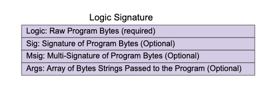
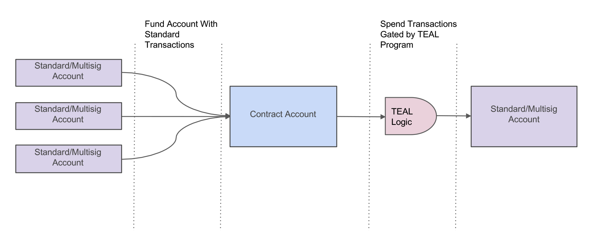
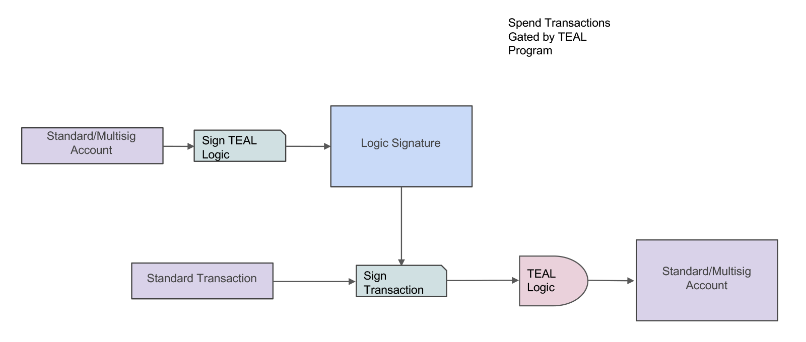

title: SmartSig details

**Algorand Smart Contracts (ASC1)**, provides both smart contracts and smart signatures. The intended use case for the contract will determine the appropriate type to use. Smart signatures are primarily used to delegate signature authority. Smart signatures can also be used as escrow or contract accounts, but in most cases it is preferrable to use a [smart contract](smart-contracts.md) when an escrow is required.

Most Algorand transactions are authorized by a [signature from a single account](../../transactions/signatures.md#single-signatures) or a [multisignature account](../../transactions/signatures#multisignatures). Algorand’s smart signatures allow for a third type of signature using a **Transaction Execution Approval Language (TEAL)** program, called a **logic signature (LogicSig)**. Smart signatures provide two modes for TEAL logic to operate as a LogicSig, to create a contract account that functions similar to an escrow or to delegate signature authority to another account. These two modes are discussed in detail in [Usage Modes](#modes-of-use).

These smart signatures can be written in [TEAL](../avm/teal/index.md) or in Python using the [PyTeal library](../pyteal/index.md). If written in Python the library will return the automatically generated TEAL to be used by either the SDKs or the `goal` command-line tool.  

To learn more about the TEAL language specification see the [TEAL Specification Reference](../avm/teal/specification.md). To get a high-level understanding of how TEAL is processed see the [TEAL Overview guide](../avm/teal).

To compile and use a TEAL program as a smart signature with `goal`, see [CLI smart signatures](walkthrough).

To start working with smart signatures with the SDKs, visit the [Interact with smart signatures](../frontend/smartsigs/) section.


# Modes of use


Smart signatures have two basic usage scenarios; as a [**contract account**](#contract-account) or as a [**delegated signature**](#delegated-approval). These modes are used to approve transactions in different ways which are described below. Both modes make use of Logic Signatures. While using smart signatures for contract accounts is possible, it is now possible to create a contract account using a [smart contract](smart-contracts.md).

## Logic signatures
Logic Signatures, referenced as LogicSig, are structures that contain the following four parts.


<center></center>
<center>*Logic Signature Structure*</center>

Before a LogicSig can be used with a transaction, it first must be a valid Logic Signature. The LogicSig is considered valid if one of the following scenarios is true.

> * Sig contains a valid Signature of the program from the account that is sending the Transaction
> * Msig contains a valid Multi-Signature of the program from the Multi-Signature account sending the Transaction
> * The hash of the program is equal to the Sender's Address
  

The first two cases are examples of delegation. An account owner can declare that on their behalf the signed logic can authorize transactions. These accounts can be either single or multi-signature accounts. Account delegation is described in further detail below.

The third case is an account wholly governed by the program. The program cannot be changed. Once Algos or assets have been sent to that account, Algos or assets only leave when there is a transaction that approves it. This usage case is considered a contract account which is described below.
## Contract account
For each unique compiled smart signature program there exists a single corresponding Algorand address, output by `goal clerk compile`. To use a TEAL program as a contract account, send Algos to its address to turn it into an account on Algorand with a balance. Outwardly, this account looks no different from any other Algorand account and anyone can send it Algos or Algorand Standard Assets to increase its balance.  The account differs in how it authenticates spends _from_ it, in that the logic determines if the transaction is approved. To spend from a contract account, create a transaction that will evaluate to True against the TEAL logic, then add the compiled TEAL code as its logic signature. It is worth noting that anyone can create and submit the transaction that spends from a contract account as long as they have the compiled TEAL contract to add as a logic signature.

<center></center>
<center>*TEAL Contract Account*</center>

## Delegated approval
Smart signatures can also be used to delegate signature authority, which means that a private key can sign a TEAL program and the resulting output can be used as a signature in transactions on behalf of the account associated with the private key. The owner of the delegated account can share this logic signature, allowing anyone to spend funds from his or her account according to the logic within the TEAL program.
For example, if Alice wants to set up a recurring payment with her utility company for up to 200 Algos every 50000 rounds, she creates a TEAL contract that encodes this logic, signs it with her private key, and gives it to the utility company. The utility company uses that logic signature in the transaction they submit every 50000 rounds to collect payment from Alice.
The logic signature can be produced from either a single or multi-signature account.

<center></center>
<center>*TEAL Delegated Signature*</center>


# CLI Examples


This guide covers working with the `goal` command-line tool with smart signatures.

TEAL programs can be written with any editor and are compiled using the `goal` command-line tool. They can also be built using python with the [PyTeal Library](../pyteal/index.md). The command-line tool provides the ability to use these compiled programs within transactions. 

## Simple TEAL example
The simplest program you can write in TEAL is probably the following:

```go
// simple.teal
// Do not use this in a real application
int 0
```
This simplistic example always returns false and should never be used in a real transaction. 

The following command illustrates compiling this program:

```
goal clerk compile simple.teal
// Compile output
simple.teal: 6Z3C3LDVWGMX23BMSYMANACQOSINPFIRF77H7N3AWJZYV6OH6GWTJKVMXY
```

The compilation returns an Algorand Address. This is the contract account address if the TEAL program is used as a contract account. If the TEAL program is intended to be used as a delegated signature, the logic should be signed with a private key. This is done using the `-s` option with the `goal clerk compile` command. The following example shows using goal to compile and sign the TEAL program in one operation.

```
goal clerk compile simple.teal -o mydelegatedsig.lsig -s -a C3MKH24QL3GHSD5CDQ47ZNQZMNZRX4MUTV6LVPAXMWAXMIISYSOWPGH674 -d ~/node/data
```

Logic is signed with a specific address specified with the `-a` option. If no default wallet is assigned, the `-w` option is used to specify the wallet that contains the account that is signing the logic.

The `-o` option specifies the name of the logic signature file. In this example, the file mydelegatedsig.lsig is created. This file can be shared to let others submit transactions with the authority of the original signer. When this logic signature is used in a transaction the logic will determine if the transaction is approved. The following example shows how the logic signature is used in a transaction with `goal`

```
goal clerk send -f C3MKH24QL3GHSD5CDQ47ZNQZMNZRX4MUTV6LVPAXMWAXMIISYSOWPGH674 -a 1000000 -t STF6TH6PKINM4CDIQHNSC7QEA4DM5OJKKSACAPWGTG776NWSQOMAYVGOQE -L mydelegatedsig.lsig -d ~/node/data
```
The `-f` option specifies the account that signed the logic signature and the -t option specifies the receiver of the transaction. The transaction fee is paid by the account that signed the logic signature. 

## Compiling TEAL options
Compiling a teal program using the `goal clerk compile` compiles and writes the binary raw bytes to a file with the same name as the source file with a `.tok` extension. Specifying the `-n` option will compile the TEAL program but not write out the binary. The console will display the compiled TEAL's address.

```
$ goal clerk compile -n simple.teal
simple.teal: KI4DJG2OOFJGUERJGSWCYGFZWDNEU2KWTU56VRJHITP62PLJ5VYMBFDBFE
```

In the example above without the `-n` option the binary is written to a file named simple.teal.tok. Supplying the `-o` option allows the binary to be written to a specific location and filename.

```
goal clerk compile  simple.teal -o /tmp/mytealbinary.tealc
```

The raw binary TEAL program can be disassembled using the `-D` option.

```
$ goal clerk compile -D /tmp/mytealbinary.tealc
// Terminal Output
// version 1
intcblock 0
intc_0
```

In the above examples, the TEAL program is compiled and can be used as a contract account as discussed in the [Usage Modes](modes) documentation. To use TEAL for account [delegation](modes#delegated-account), the program must be signed by an account or a multi-signature account. This can be done with `goal` using the `-s` option. The following will produce a LogicSig file.

```
goal clerk compile  simple.teal -o /tmp/simple.lsig -s -d ~/node/data
```

In the example above, the `-o` option is used to produce the logic signature file, which contains the raw program binary and the signature as discussed in the [Logic Signature](modes#logic-signatures) documentation. Using the `-a` option allows the TEAL program to be signed by a specific account.

```
goal clerk compile  simple.teal -o /tmp/simple.lsig -s -a LSJY4JD5J626BMJY2NMODBP64WDQP5OS4M6YF2F5BWQUS22I3YJYCXHHIA -d ~/node/data
```

A logic signature file can be disassembled in the same way as the standard binary.

```
goal clerk compile -D /tmp/simple.lsig
// Console Output
// version 1
intcblock 0
intc_0
LogicSig: {
  "sig": "45on5JUofgMjxL9e7IiPzCwutMHj3hFS1bKnCpxjgQ06dhikUgQSadqxcSOMKlcpN31W88hzkv3AeUUDLc4qAg=="
}
```

## Creating a multi-signature delegated logic sig
In the previous section, a logic signature was created using a single account. As discussed in the [Logic Signature](modes#logic-signatures) documentation, LogicSigs can also be created using a multi-signature account. For example, a three account multi-signature account with a threshold level of 2 can be created using the following command.

```
goal account multisig new -T 2 DFPKC2SJP3OTFVJFMCD356YB7BOT4SJZTGWLIPPFEWL3ZABUFLTOY6ILYE LSJY4JD5J626BMJY2NMODBP64WDQP5OS4M6YF2F5BWQUS22I3YJYCXHHIA YYKRMERAFXMXCDWMBNR6BUUWQXDCUR53FPUGXLUYS7VNASRTJW2ENQ7BMQ -d ~/node/data
```

This creates a multi-sig account that requires at least two signatures to authorize a transaction. To create a logic signature, any one of the three accounts can sign the logic and create a logic signature file. This is done using the `goal clerk multisig signprogram` command.

```
goal clerk multisig signprogram -p /tmp/simple.teal -a YYKRMERAFXMXCDWMBNR6BUUWQXDCUR53FPUGXLUYS7VNASRTJW2ENQ7BMQ -A 5DLEJBZHDG4XTIILEEJ6HSLG2YFGHNDAKIUAFASMFV234CJGEDQYMJ6LMI -o /tmp/simple.lsig -d ~/node/data
```

In the above example, the `-p` option specifies the TEAL program file. The TEAL program bytes can also be passed directly using the `-P` option. The `-a` option specifies which account is signing the logic and the `-A` specifies the multi-signature address. 

At this point the logic signature file only contains one signature and the threshold is set to two. This means that in order for the logic signature to be used, one of the two remaining accounts must also sign the logic signature file. This is done using the `-L` option with the `goal clerk multisig signprogram` command.

```
goal clerk multisig signprogram -L /tmp/simple.lsig -a LSJY4JD5J626BMJY2NMODBP64WDQP5OS4M6YF2F5BWQUS22I3YJYCXHHIA -A 5DLEJBZHDG4XTIILEEJ6HSLG2YFGHNDAKIUAFASMFV234CJGEDQYMJ6LMI -d ~/node/data
```

Decompiling the logic signature shows the number of current signatures.

```
$ goal clerk compile -D /tmp/simple.lsig
// Console Output
// version 1
intcblock 0
intc_0
LogicSig: {
  "msig": {
    "subsig": [
      {
        "pk": "YYKRMERAFXMXCDWMBNR6BUUWQXDCUR53FPUGXLUYS7VNASRTJW2ENQ7BMQ",
        "s": "h7/CyM7aiJnDnXOjyNeY2DlOZhqieaWafO0n2Hi4d9IfyFozjKQL9/kB2x7QQV+bPRTORdbYCXpL2x6c5razAw=="
      },
      {
        "pk": "LSJY4JD5J626BMJY2NMODBP64WDQP5OS4M6YF2F5BWQUS22I3YJYCXHHIA",
        "s": "/s/BsHGK+RThEmrc2Wre/VVBX6jtqcMS/pZQTA0iBE3S5d+D4BFeD2JXRSAW/oD78V9SlLXSfOYGAfEnianaDw=="
      }
    ],
    "thr": 2,
    "v": 1
  }
}
```
## Passing parameters to TEAL with goal
Parameters can be passed to a TEAL program using `goal`. The parameters must be passed as base64 encoded strings. For example, to pass “mystringargument” to a stateless TEAL program, the argument can be encoded using an `echo` command with base64. The `-w0` argument disables wrapping that defaults to 76 characters. 

```
$ echo -n mystringargument | base64 -w0
bXlzdHJpbmdhcmd1bWVudA==
```

The base64 encoded string is passed to the TEAL program using the `--argb64` option. The `goal` command line can be passed multiple parameters using the `--argb64` option multiple times. The parameter order is specific and will directly map to the TEAL parameters array.

```
goal clerk send -a 1000 -c closeaccountotaddress --to toaddr --from-program myteal.teal --argb64 "bXlzdHJpbmdhcmd1bWVudA==" -d ~/node/data
```

The example above also illustrates using the `--from-program` option. This option instructs the compiler to compile a specific TEAL program and set it as the sender of the transaction. Because the `-s` option is not used, this account must be a contract account.

Passing an integer to a TEAL program requires that it must be converted to a base64 encoded string as well when using `goal`. This can be done in many ways. The following example illustrates the conversion using a simple python command. 

``` python
$ python3 -c "import base64;print(base64.b64encode((123).to_bytes(8,'big')).decode('ascii'))"
```

The example above converts the integer value of 123 to a base64 encoded string. TEAL currently does not support negative numbers. 

Each SDK provides facilities for passing parameters as well. These processes are described in the [Interact with smart signatures](./frontend/smartsigs.md) Usage documentation.