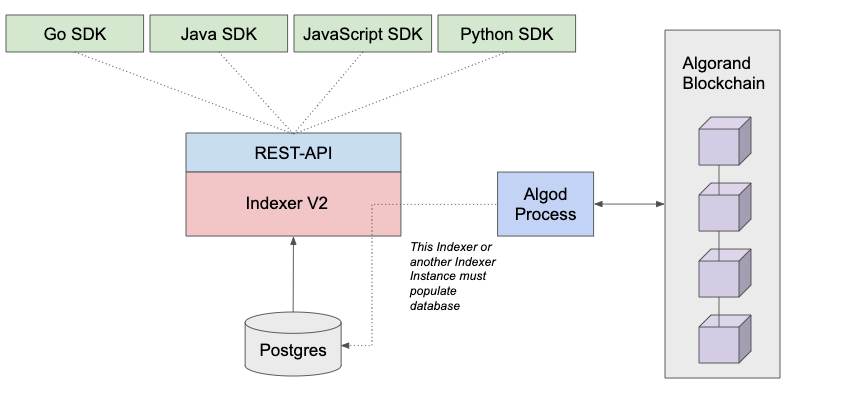

title: Indexer

This guide explains how to search the Algorand Blockchain using the Indexer. This Indexer is not part of the Algorand node and requires a separate binary download. See the [Indexer Install Guide](../run-a-node/setup/indexer.md) for instructions on installing and configuring the new Indexer.


<center>*Algorand V2 Indexer*</center>

The primary purpose of this Indexer is to provide a REST API interface of API calls to support searching the Algorand Blockchain. The Indexer REST APIs retrieve the blockchain data from a [PostgreSQL](https://www.postgresql.org/) compatible database that must be populated. This database is populated using the same indexer instance or a separate instance of the indexer which must connect to the algod process of a running Algorand node to read block data. This node must also be an Archival node to make searching the entire blockchain possible. 

The Indexer provides a set of REST API calls for searching blockchain Transactions, Accounts, Assets and Blocks. Each of these calls also provides several filter parameters to support refining searches. The latest Algorand native SDKs (Python, JavaScript, Go, and Java) provide similar functionality. These REST calls are based on the Open API specification and are described in the REST SDK reference documentation. 

See the full description of endpoints available in the [indexer docs](../rest-apis/indexer.md).

# SDK client instantiations

=== "JavaScript"
    <!-- ===JSSDK_INDEXER_CREATE_CLIENT=== -->
	```javascript
	const indexerToken = 'a'.repeat(64);
	const indexerServer = 'http://localhost';
	const indexerPort = 8980;
	
	const indexerClient = new algosdk.Indexer(
	  indexerToken,
	  indexerServer,
	  indexerPort
	);
	```
	[Snippet Source](https://github.com/algorand/js-algorand-sdk/blob/examples/examples/indexer.ts#L15-L24)
    <!-- ===JSSDK_INDEXER_CREATE_CLIENT=== -->

=== "Python"
    <!-- ===PYSDK_INDEXER_CREATE_CLIENT=== -->
	```python
	# instantiate indexer client
	indexer_host = "http://localhost:8980"
	indexer_token = "a" * 64
	indexer_client = indexer.IndexerClient(
	    indexer_token=indexer_token, indexer_address=indexer_host
	)
	```
	[Snippet Source](https://github.com/algorand/py-algorand-sdk/blob/examples/examples/indexer.py#L7-L13)
    <!-- ===PYSDK_INDEXER_CREATE_CLIENT=== -->

=== "Java"
    <!-- ===JAVASDK_INDEXER_CREATE_CLIENT=== -->
	```java
	String indexerHost = "http://localhost";
	int indexerPort = 8980;
	String indexerToken = "a".repeat(64);
	IndexerClient indexerClient = new IndexerClient(indexerHost, indexerPort, indexerToken);
	```
	[Snippet Source](https://github.com/algorand/java-algorand-sdk/blob/examples/examples/src/main/java/com/algorand/examples/IndexerExamples.java#L12-L16)
    <!-- ===JAVASDK_INDEXER_CREATE_CLIENT=== -->

=== "Go"
	<!-- ===GOSDK_INDEXER_CREATE_CLIENT=== -->
	```go
	// Create a new indexer client, configured to connect to out local sandbox
	var indexerAddress = "http://localhost:8980"
	var indexerToken = strings.Repeat("a", 64)
	indexerClient, _ := indexer.MakeClient(
		indexerAddress,
		indexerToken,
	)
	
	// Or, if necessary, pass alternate headers
	
	var indexerHeader common.Header
	indexerHeader.Key = "X-API-Key"
	indexerHeader.Value = indexerToken
	indexerClientWithHeaders, err := indexer.MakeClientWithHeaders(
		indexerAddress,
		indexerToken,
		[]*common.Header{&indexerHeader},
	)
	```
	[Snippet Source](https://github.com/algorand/go-algorand-sdk/blob/examples/examples/indexer/main.go#L15-L33)
	<!-- ===GOSDK_INDEXER_CREATE_CLIENT=== -->

!!! info 
    When using cURL be aware that the parameters may need to be URL encoded. The SDKs handle the encoding of parameter data. 

The indexer provides two primary ways to access information:

1) Lookup a single item (a single account, a single transaction, a single block)
   
2) Search for items that match a query (transactions for > 100A and between round N and M)

Each SDK provides methods for looking up or searching for transactions, assets, applications(smart contracts), and blocks. For a full list of method calls see the SDK docs:

-  [Python](https://py-algorand-sdk.readthedocs.io/en/latest/algosdk/v2client/indexer.html)
-  [JavaScript](https://algorand.github.io/js-algorand-sdk/classes/Indexer.html)
-  [Java](https://algorand.github.io/java-algorand-sdk/com/algorand/algosdk/v2/client/indexer/package-summary.html) 
-  [Go](https://pkg.go.dev/github.com/algorand/go-algorand-sdk/v2@v2.0.0/client/v2/indexer)

# Lookup
As an example, to get the details of a specific asset the indexer provides the `/assets/{asset-id}` REST call.  This call takes no parameters as the asset id is passed in the URL. This call returns the details of the asset and the round the results were calculated in. 

=== "JavaScript"
    <!-- ===JSSDK_INDEXER_LOOKUP_ASSET=== -->
	```javascript
	const indexer = getLocalIndexerClient();
	const indexerAssetInfo = await indexer.lookupAssetByID(assetIndex).do();
	console.log('Indexer Asset Info:', indexerAssetInfo);
	```
	[Snippet Source](https://github.com/algorand/js-algorand-sdk/blob/examples/examples/asa.ts#L54-L57)
    <!-- ===JSSDK_INDEXER_LOOKUP_ASSET=== -->

=== "Python"
    <!-- ===PYSDK_INDEXER_LOOKUP_ASSET=== -->
	```python
	# lookup a single asset
	# by passing include_all, we specify that we want to see deleted assets as well
	response = indexer_client.asset_info(asset_id, include_all=True)
	print(f"Asset Info: {json.dumps(response, indent=2,)}")
	```
	[Snippet Source](https://github.com/algorand/py-algorand-sdk/blob/examples/examples/indexer.py#L50-L54)
    <!-- ===PYSDK_INDEXER_LOOKUP_ASSET=== -->

=== "Java"
    <!-- ===JAVASDK_INDEXER_LOOKUP_ASSET=== -->
	```java
	Long asaId = 25l;
	Response<AssetResponse> assetResponse = indexerClient.lookupAssetByID(asaId).execute();
	Asset assetInfo = assetResponse.body().asset;
	System.out.printf("Name for %d: %s\n", asaId, assetInfo.params.name);
	```
	[Snippet Source](https://github.com/algorand/java-algorand-sdk/blob/examples/examples/src/main/java/com/algorand/examples/IndexerExamples.java#L19-L23)
    <!-- ===JAVASDK_INDEXER_LOOKUP_ASSET=== -->

=== "Go"
    <!-- ===GOSDK_INDEXER_LOOKUP_ASSET=== -->
	```go
	// query parameters
	var assetId uint64 = 2044572
	var minBalance uint64 = 50
	
	// Lookup accounts with minimum balance of asset
	assetResult, _ := indexerClient.
		LookupAssetBalances(assetId).
		CurrencyGreaterThan(minBalance).
		Do(context.Background())
	
	// Print the results
	assetJson, _ := json.MarshalIndent(assetResult, "", "\t")
	fmt.Printf(string(assetJson) + "\n")
	```
	[Snippet Source](https://github.com/algorand/go-algorand-sdk/blob/examples/examples/indexer/main.go#L55-L68)
    <!-- ===GOSDK_INDEXER_LOOKUP_ASSET=== -->

=== "cURL"
    <!-- ===CURL_INDEXER_LOOKUP_ASSET=== -->
	``` bash
    $ curl "localhost:8980/v2/assets/2044572" 
    ```
    <!-- ===CURL_INDEXER_LOOKUP_ASSET=== -->


# Search
Searching is similar to lookup with the ability to return multiple or filtered results. This example searches for transactions based on a few filters. 

=== "JavaScript"
    <!-- ===JSSDK_INDEXER_SEARCH_MIN_AMOUNT=== -->
	```javascript
	const transactionInfo = await indexerClient
	  .searchForTransactions()
	  .currencyGreaterThan(100)
	  .do();
	console.log(transactionInfo.transactions.map((t) => t.id));
	```
	[Snippet Source](https://github.com/algorand/js-algorand-sdk/blob/examples/examples/indexer.ts#L33-L38)
    <!-- ===JSSDK_INDEXER_SEARCH_MIN_AMOUNT=== -->

=== "Python"
    <!-- ===PYSDK_INDEXER_SEARCH_MIN_AMOUNT=== -->
	```python
	response = indexer_client.search_transactions(
	    min_amount=10, min_round=1000, max_round=1500
	)
	print(f"Transaction results: {json.dumps(response, indent=2)}")
	```
	[Snippet Source](https://github.com/algorand/py-algorand-sdk/blob/examples/examples/indexer.py#L57-L61)
    <!-- ===PYSDK_INDEXER_SEARCH_MIN_AMOUNT=== -->

=== "Java"
    <!-- ===JAVASDK_INDEXER_SEARCH_MIN_AMOUNT=== -->
	```java
	Response<TransactionsResponse> transactionSearchResult = indexerClient.searchForTransactions()
	        .minRound(10l).maxRound(500l).currencyGreaterThan(10l).execute();
	TransactionsResponse txResp = transactionSearchResult.body();
	System.out.printf("Found %d transactions that match criteria\n", txResp.transactions.size());
	```
	[Snippet Source](https://github.com/algorand/java-algorand-sdk/blob/examples/examples/src/main/java/com/algorand/examples/IndexerExamples.java#L26-L30)
    <!-- ===JAVASDK_INDEXER_SEARCH_MIN_AMOUNT=== -->

=== "Go"
    <!-- ===GOSDK_INDEXER_SEARCH_MIN_AMOUNT=== -->
	```go
	// query parameters
	var transactionMinAmount uint64 = 10
	
	// Query
	transactionResult, _ := indexerClient.
		SearchForTransactions().
		CurrencyGreaterThan(transactionMinAmount).
		Do(context.Background())
	
	// Print results
	transactionJson, _ := json.MarshalIndent(transactionResult, "", "\t")
	fmt.Printf(string(transactionJson) + "\n")
	```
	[Snippet Source](https://github.com/algorand/go-algorand-sdk/blob/examples/examples/indexer/main.go#L73-L85)
    <!-- ===GOSDK_INDEXER_SEARCH_MIN_AMOUNT=== -->

=== "cURL"
    <!-- ===CURL_INDEXER_SEARCH_MIN_AMOUNT=== -->
	```bash
    $ curl "localhost:8980/v2/transactions?currency-greater-than=10"
    ```
    <!-- ===CURL_INDEXER_SEARCH_MIN_AMOUNT=== -->

# Pagination

When searching large amounts of blockchain data often the results may be too large to process in one given operation. In fact, the indexer imposes hard limits on the number of results returned for specific searches.  The default limits for these searches are summarized in the table below.

| Search Type  | Maximum number of results per search  |
| ------------- | ------------- |
| API Resources Per Account | 1,000 |
| Transactions Search | 1,000 |
| Accounts Search | 100 |
| Assets Search | 100 |
| Balances Search | 1,000 |
| Applications Search | 100 |

When trying to find specific transactions, the Indexer supplies a pagination method that allows separating the results into several REST calls to return larger result sets. When used with the limit parameter the results for large data sets can be returned in expected result counts.

For example, adding a limit parameter of 5 to the previous call will cause only 5 results to be returned in each page. To get the next 5 transactions simply add the next-token as a parameter to the next REST call. The parameter is named `next` and this token is only good for the next 5 results.

=== "JavaScript"
    <!-- ===JSSDK_INDEXER_PAGINATE_RESULTS=== -->
	```javascript
	let nextToken = '';
	
	// nextToken will be undefined if we reached the last page
	while (nextToken !== undefined) {
	  // eslint-disable-next-line no-await-in-loop
	  const response = await indexerClient
	    .searchForTransactions()
	    .limit(5)
	    .currencyGreaterThan(10)
	    .nextToken(nextToken)
	    .do();
	
	  nextToken = response['next-token'];
	  const txns = response.transactions;
	  if (txns.length > 0)
	    console.log(`Transaction IDs: ${response.transactions.map((t) => t.id)}`);
	}
	```
	[Snippet Source](https://github.com/algorand/js-algorand-sdk/blob/examples/examples/indexer.ts#L41-L58)
    <!-- ===JSSDK_INDEXER_PAGINATE_RESULTS=== -->

=== "Python"
    <!-- ===PYSDK_INDEXER_PAGINATE_RESULTS=== -->
	```python
	
	nexttoken = ""
	has_results = True
	page = 0
	
	# loop using next_page to paginate until there are
	# no more transactions in the response
	while has_results:
	    response = indexer_client.search_transactions(
	        min_amount=10, min_round=1000, max_round=1500, next_page=nexttoken
	    )
	
	    has_results = len(response["transactions"]) > 0
	
	    if has_results:
	        nexttoken = response["next-token"]
	        print(f"Tranastion on page {page}: " + json.dumps(response, indent=2))
	
	    page += 1
	```
	[Snippet Source](https://github.com/algorand/py-algorand-sdk/blob/examples/examples/indexer.py#L64-L83)
    <!-- ===PYSDK_INDEXER_PAGINATE_RESULTS=== -->

=== "Java"
    <!-- ===JAVASDK_INDEXER_PAGINATE_RESULTS=== -->
	```java
	String nextToken = "";
	boolean hasResults = true;
	// Start with empty nextToken and while there are
	// results in the transaction results, query again with the next page
	while (hasResults) {
	    Response<TransactionsResponse> searchResults = indexerClient.searchForTransactions().minRound(1000l)
	            .maxRound(1500l).currencyGreaterThan(10l).next(nextToken).execute();
	    TransactionsResponse txnRes = searchResults.body();
	    //
	    // ... do something with transaction results
	    //
	    hasResults = txnRes.transactions.size() > 0;
	    nextToken = txnRes.nextToken;
	}
	```
	[Snippet Source](https://github.com/algorand/java-algorand-sdk/blob/examples/examples/src/main/java/com/algorand/examples/IndexerExamples.java#L33-L47)
    <!-- ===JAVASDK_INDEXER_PAGINATE_RESULTS=== -->

=== "Go"
    <!-- ===GOSDK_INDEXER_PAGINATE_RESULTS=== -->
	```go
	var nextToken = ""
	var numTx = 1
	var numPages = 1
	var pagedMinAmount uint64 = 10
	var limit uint64 = 1
	
	for numTx > 0 {
		// Query
		pagedResults, err := indexerClient.
			SearchForTransactions().
			CurrencyGreaterThan(pagedMinAmount).
			Limit(limit).
			NextToken(nextToken).
			Do(context.Background())
		if err != nil {
			return
		}
		pagedTransactions := pagedResults.Transactions
		numTx = len(pagedTransactions)
		nextToken = pagedResults.NextToken
	
		if numTx > 0 {
			// Print results
			pagedJson, err := json.MarshalIndent(pagedTransactions, "", "\t")
			if err != nil {
				return
			}
			fmt.Printf(string(pagedJson) + "\n")
			fmt.Println("End of page : ", numPages)
			fmt.Println("Transaction printed : ", len(pagedTransactions))
			fmt.Println("Next Token : ", nextToken)
			numPages++
		}
	}
	```
	[Snippet Source](https://github.com/algorand/go-algorand-sdk/blob/examples/examples/indexer/main.go#L88-L122)
    <!-- ===GOSDK_INDEXER_PAGINATE_RESULTS=== -->

=== "cURL"
    <!-- ===CURL_INDEXER_PAGINATE_RESULTS=== -->
	```bash
    $ curl "localhost:8980/v2/transactions?currency-greater-than=10&limit=5"
    # note the "next-token" field in the most recent results and supply the value to the "next" parameter
    $ curl "localhost:8979/v2/transactions?currency-greater-than=10&limit=5&next=cAoBAAAAAAAAAAAA"
    ```
    <!-- ===CURL_INDEXER_PAGINATE_RESULTS=== -->

Results showing "next-token"
```json
{
   "next-token" : "cAoBAAAAAAAAAAAA",
   "current-round" : 7050272,
   "transactions" : []
}
```

A new next token will be returned to get the next five. This token acts as a marker in the current result set and allows the next call to pick up where the last search ended. We note that the 'limit' parameter can also be used to specify a larger (rather than smaller) results set than the defaults above. These limits are shown in the following table and are per call, not the total result set.

| Search Type  | Search Limit with a limit parameter |
| ------------- | ------------- |
| Transaction Search | 10000 |
| Account Search | 1000 |
| Asset Search | 1000 |
| Asset Balance Search | 10000 |

The following REST calls support paginated results.

* `/accounts` - Search for specific accounts.
* `/accounts/{account-id}/transactions` - Search for transactions for a specific account.
* `/accounts/{account-id}/created-apps` - Search for created applications for a specific account.
* `/accounts/{account-id}/created-assets` - Search for created assets for a specific account.
* `/accounts/{account-id}/assets` - Search for assets on a specific account.
* `/accounts/{account-id}/apps-local-state` - Search for application local state for a specific account.
* `/assets` - Search Assets.
* `/assets/{asset-id}/balances` - Search Asset balances.
* `/assets/{asset-id}/transactions` - Search for Transactions with a specific Asset.
* `/transactions` - Search all transactions

# Note field searching
Every transaction has the ability to add up to a 1kb note in the note field. Several of the REST APIs provide the ability to search for a prefix that is present in the note field, meaning that the note starts with a specific string. This can be a very powerful way to quickly locate transactions that are specific to an application. The REST calls that support prefix searching are the following.

* `/accounts/{account-id}/transactions` - Search for a prefix for a specific accounts transactions.
* `/assets/{asset-id}/transactions` - Search for a prefix for a specific Asset Id.
* `/transactions` - Search all Transactions for a specific transaction note field prefix.

To search for a specific prefix use the `note-prefix` parameter. For the Javascript and direct REST API, the value needs to be base64 encoded to return results. (The other SDKs perform the base64 encoding for you.) For example, if the contents of the note field started with the string “showing prefix searches”, encoding the beginning of that sentence using python like the following:

``` bash
$ python3 -c "import base64;print(base64.b64encode('showing prefix'.encode()))"
```

This will return an encoded value of `c2hvd2luZyBwcmVmaXg=`.  This value can then be passed to the search. To search all transactions use the following command.

=== "JavaScript"
    <!-- ===JSSDK_INDEXER_PREFIX_SEARCH=== -->
	```javascript
	const txnsWithNotePrefix = await indexerClient
	  .searchForTransactions()
	  .notePrefix(Buffer.from('Hello'))
	  .do();
	console.log(
	  `Transactions with note prefix "Hello" ${JSON.stringify(
	    txnsWithNotePrefix,
	    undefined,
	    2
	  )}`
	);
	```
	[Snippet Source](https://github.com/algorand/js-algorand-sdk/blob/examples/examples/indexer.ts#L80-L91)
    <!-- ===JSSDK_INDEXER_PREFIX_SEARCH=== -->

=== "Python"
    <!-- ===PYSDK_INDEXER_PREFIX_SEARCH=== -->
	```python
	note_prefix = "showing prefix".encode()
	response = indexer_client.search_transactions(note_prefix=note_prefix)
	print(f"result: {json.dumps(response, indent=2)}")
	```
	[Snippet Source](https://github.com/algorand/py-algorand-sdk/blob/examples/examples/indexer.py#L86-L89)
    <!-- ===PYSDK_INDEXER_PREFIX_SEARCH=== -->

=== "Java"
    <!-- ===JAVASDK_INDEXER_PREFIX_SEARCH=== -->
	```java
	byte[] prefix = new String("showing prefix").getBytes();
	Response<TransactionsResponse> prefixResults = indexerClient.searchForTransactions().notePrefix(prefix)
	        .execute();
	// ...
	```
	[Snippet Source](https://github.com/algorand/java-algorand-sdk/blob/examples/examples/src/main/java/com/algorand/examples/IndexerExamples.java#L50-L54)
    <!-- ===JAVASDK_INDEXER_PREFIX_SEARCH=== -->

=== "Go"
    <!-- ===GOSDK_INDEXER_PREFIX_SEARCH=== -->
	```go
	// Parameters
	var notePrefix = "showing prefix"
	
	// Query
	prefixResult, _ := indexerClient.
		SearchForTransactions().
		NotePrefix([]byte(notePrefix)).
		Do(context.Background())
	
	// Print results
	prefixJson, _ := json.MarshalIndent(prefixResult, "", "\t")
	fmt.Printf(string(prefixJson) + "\n")
	```
	[Snippet Source](https://github.com/algorand/go-algorand-sdk/blob/examples/examples/indexer/main.go#L125-L137)
    <!-- ===GOSDK_INDEXER_PREFIX_SEARCH=== -->

=== "cURL"
    <!-- ===CURL_INDEXER_PREFIX_SEARCH=== -->
	```bash
    python3 -c "import base64;print(base64.b64encode('showing prefix'.encode()))"
    $ curl "localhost:8980/v2/transactions?note-prefix=c2hvd2luZyBwcmVmaXg=" | json_pp
    ```
    <!-- ===CURL_INDEXER_PREFIX_SEARCH=== -->