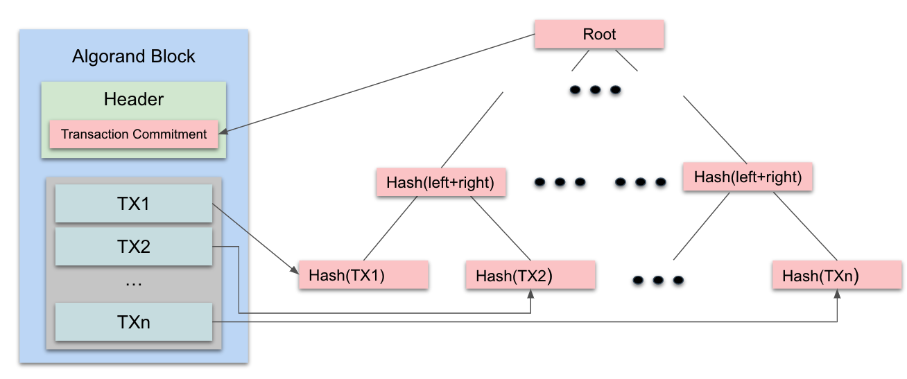
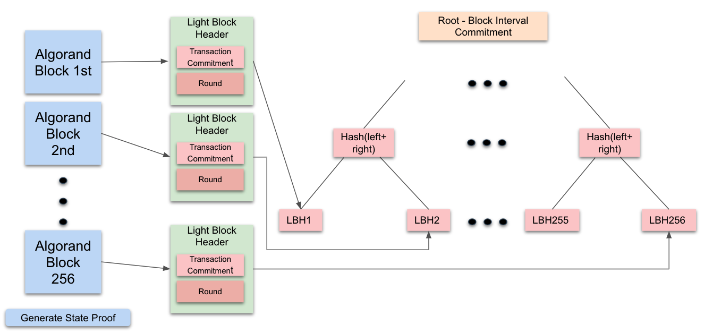

title: Algorand State Proofs Overview

A State Proof is a cryptographic proof of state changes that occur in a given set of blocks. While other interoperability solutions use intermediaries to “prove” blockchain activity, State Proofs are created and signed by the Algorand network itself. The same participants that reach consensus on new blocks sign a message attesting to a summary of recent Algorand transactions. These signatures are then compressed into a [compact certificate of collective knowledge](https://people.csail.mit.edu/nickolai/papers/micali-compactcert-eprint.pdf), also known as a State Proof.

After a State Proof is created, a State Proof transaction, which includes the State Proof and the message it proves, is created and sent to the Algorand network for validation. The transaction goes through [consensus](../algorand_consensus.md) like any other pending Algorand transaction: it gets validated by participation nodes, included in a block proposal, and written to the blockchain.

Each State Proof can be used to power lightweight services that verify Algorand transactions without running consensus or storing a copy of the Algorand ledger. These external services, or “Light Clients'', can efficiently verify proofs of Algorand state (either State Proofs or State Proof derived zk-SNARK proofs) in low-power environments like a smartphone, IoT device, or even inside a blockchain smart contract. For each verified State Proof, the Light Client can store the message’s transaction summary, giving it a light, verified history of Algorand state. Depending on its storage budget, a Light Client could store all State Proof history, giving it the ability to efficiently, cryptographically verify any Algorand transaction which occurred since the first State Proof was written on-chain.

Since Algorand users already trust the Algorand network’s ability to reach consensus on new blocks, we call these State Proof transactions, and the Light Clients they power, “trustless.” By providing simple interfaces to verify Algorand transactions, these Light Clients make it safer and easier to develop and use cross-chain products and services which want to leverage the state of the Algorand blockchain.

# How State Proofs are Generated
Each State Proof represents a collection of weighted signatures that attest to a specific message. In Algorand’s case, each State Proof message contains a commitment to all transactions that occurred over a period of 256 rounds, known as the State Proof Interval. Each proof convinces verifiers that participating accounts who jointly have a sufficient total portion of online Algorand stake have attested to this message, without seeing or verifying all of the signatures.

Every block that is processed on the Algorand chain has a header containing a commitment to all transactions in that block. This Transaction Commitment is the root of a tree with all transactions in that block as leaves. At the end of each State Proof Interval, nodes assemble the block interval commitment by using each of the 256 Transaction Commitments from this interval as leaves. This commitment is then included in the State Proofs message, which is signed by network participants.

The process for generating a State Proof for a specific block interval actually starts at the generation of the previous State Proof. For example, if a State Proof is being generated for round 768, the following steps will occur:

1. On round 512 (=768 - 256), every participating node would create a participation commitment for the top N online accounts, composed of their public state proof keys and relative online stake. When a node is elected to propose a block through consensus, it includes this commitment in the block header. 
2. On round 769, every participating node executes the following steps for each online account it manages:
   
    A. Build a Block Interval commitment tree based on all the blocks in the interval. This tree’s leaves are created using the transaction commitment from each of the blocks’ headers. This block interval will include rounds [513,...,768]. 

    B. Assemble a [message](https://github.com/algorand/go-algorand/blob/fd488f806dcbc2586f585155eea0180c30287f70/daemon/algod/api/server/v2/generated/types.go#L470) containing this Block Interval Commitment and some other metadata, sign the message, and propagate it to the network using the standard protocol gossip framework.

3. Relay nodes receive the signed messages and verify them. These signatures are accumulated based on the signer's weight and added to a Signature array. Once the relay node has sufficient signed weight accumulated, the relay node constructs a State Proof that contains a randomized sample of accumulated signatures which can convince a verifier that at least 30% of the top N accounts have signed the State Proof message.
4. After creating the proof, the relay node constructs a State Proof transaction, composed of the message and its corresponding proof, and submits it to the network. This transaction (first in wins) is processed with normal consensus. Participation nodes run the state proof verification algorithm to make sure that this State Proof is valid, using the expected signers from round 512’s on-chain participation commitment as reference. Once through consensus, the transaction is written to the blockchain.

For a deeper dive into the cryptography behind State Proofs, check out this [presentation](https://www.youtube.com/watch?v=gbk74npcs-g).

Note that each State Proof is linked together by a series of participation commitments indicating which accounts should produce signatures for the next State Proof, and their weights. These commitments form a chain linking the most recent proof written on-chain to the genesis State Proof from launch day. Since the set of participants is committed ahead of time, and each participants’ signature is produced using quantum-safe Falcon keys, we can have confidence that each verifiable State Proof was produced by actual network participants. This means that any State Proof verifier can have full confidence that the transactions committed to in each State Proof message are in fact legitimate, even in an age where powerful quantum computers attempt attacks. By producing quantum-safe proofs of the history of the blockchain, Algorand reaches its first milestone towards post-quantum security.

# Using State Proofs
State Proofs allow others to verify Algorand transactions while taking on minimal trust assumptions. Specifically, someone verifying Algorand transactions via a State Proof Light Client needs to trust the following:

1. The Algorand blockchain’s ability to reach consensus on valid transactions.
2. The first “participants” commitment that initialized the Light Client was obtained in a trustworthy way (this specifies the eligible voters for the genesis State Proof).
3. The State Proof verifier code inside the Light Client was implemented correctly.
4. Algorand’s new cryptographic primitives are secure ([Sumhash](https://github.com/algorand/go-sumhash/blob/master/cryptanalysis/merging-trees-ss.pdf), [Falcon](https://github.com/algorand/falcon)).
5. (Depending on the use case): The environment where the Algorand Light Client code is running is secure (e.g. another blockchain’s smart contract).

To verify an Algorand transaction outside of the Algorand blockchain, external processes need to understand the structure of how transactions are hashed into the Block Interval commitment. This is done using two commitment trees that are explained below.

## Transaction Commitment
A transaction commitment is created for every block that occurs on the Algorand blockchain. The root of this tree is stored in the block header.

The leaf nodes in this tree are sequenced in the same order as the transactions in the block.  

## Block Interval Commitment Tree
Once all of the blocks in a 256-round state proof interval have been certified on-chain, participating nodes generate a Block Interval commitment tree to attest to all transactions for the blocks in the period. The leaves of this block interval commitment are made of light block headers for each round contained within the interval. Each light block header contains the round number and the transaction commitment root for the given block.

Participating accounts add the root of this commitment tree to a State Proof message, sign the message with their State Proof keys, and then propagate it to the network. The root of this commitment tree can be used in conjunction with a set of transaction and block interval proofs to verify any transaction in this period.

The Algorand SDK provides clients that can make API calls to retrieve these commitment roots and proofs for verifying specific transactions. For more information on implementing a verifier or using the SDKs, continue reading on [How to Build an Algorand Light Client](light_client.md).
