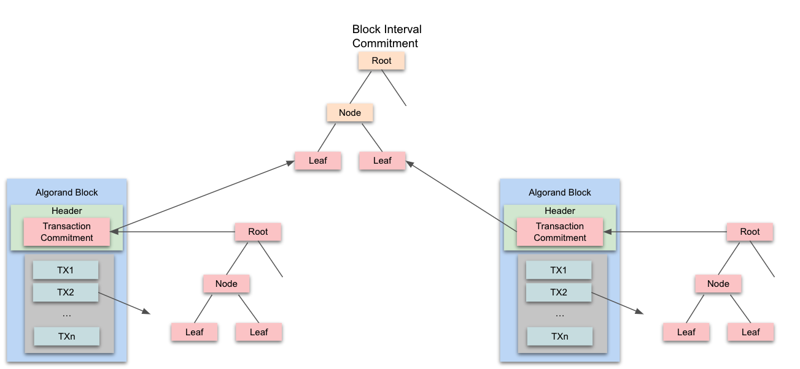
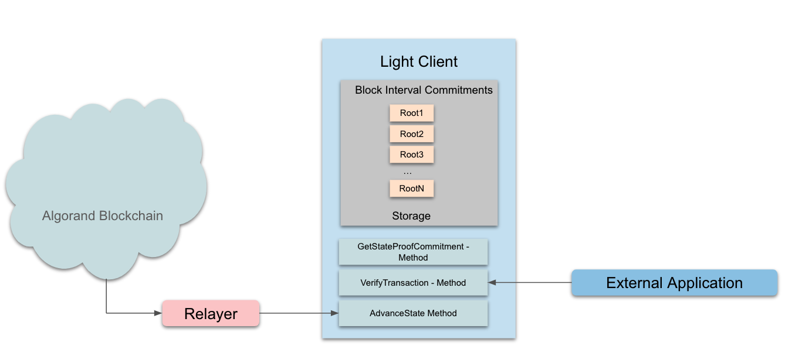

title: How To Build An Algorand Light Client - With State Proofs

# What is an Algorand Light Client?
An Algorand light client is a lightweight process that tracks the state of the Algorand network without trust in any intermediary. By cryptographically verifying a chain of proofs produced by the Algorand network itself, each light client can verify any given transaction on the network without running full node operations like consensus. Anyone can run an Algorand light client in any environment, providing a simple, secure interface to Algorand state in low power environments where running a full node is impractical or undesirable.

While State Proofs compress large amounts of Algorand state into a portable format (~600-900 KB), they are not designed to be verified inside blockchain smart contracts. The Algorand research team is currently building ultra-compact zk-SNARK proofs, which will be optimized for on-chain verification in fee-constrained environments like a blockchain smart contract. The rest of this article will focus on how to build a State Proof powered light client. We will discuss how to build a SNARK Proof powered light client as the cryptography work nears completion, although the key difference lies in the proof verification function used to advance the Light Client’s state.

Please note that Algorand light clients let you securely export Algorand state. In order to import state from another blockchain into Algorand, we’ll need to build a light client from that blockchain on Algorand. We will cover how to build other blockchain light clients on Algorand in a future article.

The cryptographic verification functions necessary to build a State Proof powered light client and to verify Algorand transactions are currently available as APIs in the go-algorand-sdk.

# Exporting Algorand State
State proofs use two primary Vector Commitment trees (similar to Merkle trees) to summarize blockchain activity.

1. A Transaction Commitment tree, which summarizes all transactions in a given block, is built into each block header by hashing each signed transaction in that block as tree leaves.
2. A Block Interval Commitment tree, which summarizes all block headers in a given state proof interval (256 rounds), is built once per interval. It is constructed with “light” block headers, which contain the block’s transaction commitment root and can be derived from the main block header, as tree leaves.

Each state proof “message” contains the root of the block interval commitment tree summarizing all transactions in that interval. After validating each state proof, a light client can store as many validated block interval commitments as it desires, creating a window of verified Algorand state. Requestors can then ask the Light Client to verify individual Algorand transactions which occurred in that interval - they simply need to provide proofs (retrieved from the Algorand SDKs) linking a specific transaction to a block interval commitment root.

<center>

</center>

Three new API endpoints to algod are available which are accessible via the Algorand SDKs to support State Proofs.

## GetTransactionProof(txnId, confirmedRound, hashType)
GetTransactionProof returns data that is used to verify that a specific transaction exists in a given transaction commitment tree. This function accepts a transaction ID, the round the transaction was confirmed in, and the hash function used to construct the commitment tree. This method will return a proof, the leaf index of the transaction, the depth of the tree, and the hash of the signed transaction that is being checked. These pieces of information should be all that a Light Client will need to verify a transaction is in the Transaction Commitment tree. Note that both the block interval commitment (inside the State Proof message) and the transaction commitment (inside the light block header) are constructed using SHA256, so you should use this hashType when verifying Algorand transactions on a Light Client. 

## GetLightBlockHeaderProof(round)
GetLightBlockHeaderProof returns data that is used to verify that a specific Light Block Header exists in the Block Interval tree. This call takes a round number as a parameter and returns a proof, the leaf index of the light block header, and the tree depth of the block interval tree. These pieces of information should be all that a Light Client needs to verify a Light Block Header exists in a Block Interval Tree. If the State Proof transaction has not been written to the ledger for a specific interval and this method is called for a round in that interval, the call will fail.

## GetStateProof(round)
GetStateProof is used to retrieve a State Proof for the interval that contains a specific round, which is passed as a parameter. The State Proof contains the signatures of the attested State Proof message and the actual message which contains the Block Interval Commitment root for the given round. Note that it is possible that this call will return an error if the chosen round does not have a specific State Proof written on chain yet. This call will be used by Light Clients to track the state of the Algorand Chain, which is described in the next section.

# Light Client PoC Overview
Algorand Light Clients should be built to answer one question: did a specific transaction occur on Algorand’s blockchain at a specified round. To accomplish this, each Light Client will verify State Proofs (or zk-SNARK proofs) in order to store block interval commitments. These verified commitments can be used to validate block interval roots re-computed by the transaction verifier via the proofs returned from the algod API.

The Light Client should have 2 interfaces: one to advance Algorand state by verifying incoming State Proofs, and another to verify specific Algorand transactions against previously-verified block interval commitments. Because State Proofs are not polled by the Light Client itself, external relayers should retrieve State Proofs and their associated messages from the Algorand SDKs as they become available and push them to the Light Client for verification. Similar to the State Proof chain, each Light Client forms a chain by verifying incoming State Proofs against a previously-verified participants’ commitment. Similar to how Proof of Stake blockchains are initialized, the Light Client will need to hard-code the initial participants commitment in order to verify the first State Proof written on-chain.

<center>

</center>

Algorand provides a proof of concept version of a light client which is located on [GitHub](https://github.com/algorand/light-client-poc). Please note that this PoC code is purely informational and does not reflect the ideal way to implement a Light Client. Each section of the Light Client proof of concept will be explained below.

## Oracle

```go
// Oracle is responsible for ingesting State Proofs in chronological order and saving their block interval commitments
// to form a window of verified Algorand history.
// It then allows, given a round, to retrieve the vector commitment root attesting to the interval to which the round
// belongs.
type Oracle struct {
   // BlockIntervalCommitmentHistory is a sliding window of verified block interval commitments. Given a round,
   // it returns the block interval commitment that contains the specified block.
   BlockIntervalCommitmentHistory *CommitmentHistory
   // VotersCommitment is the vector commitment root of the top N accounts to sign the next StateProof.
   VotersCommitment stateproofcrypto.GenericDigest
   // LnProvenWeight is an integer value representing the natural log of the proven weight with 16 bits of precision.
   // This value would be used to verify the next state proof.
   LnProvenWeight uint64
}

```

The Oracle exposes the following functions:

### InitializeOracle

```go

// InitializeOracle initializes the Oracle using trusted genesis data.
// Parameters:
// firstAttestedRound - the first round to which a state proof message attests.
// intervalSize - represents the number of rounds that occur between each state proof.
// genesisVotersCommitment - the initial genesisVotersCommitment commitment. Real values can be found in the Algorand developer portal.
// genesisLnProvenWeight - the initial LnProvenWeight. Real values can be found in the Algorand developer portal.
// capacity - the maximum number of commitments to hold before discarding the earliest commitment.
func InitializeOracle(firstAttestedRound uint64, intervalSize uint64, genesisVotersCommitment stateproofcrypto.GenericDigest,
   genesisLnProvenWeight uint64, capacity uint64) *Oracle {
   return &Oracle{
      // The BlockIntervalCommitmentHistory is initialized using the first attested round,
      // the interval size and its capacity.
      BlockIntervalCommitmentHistory: InitializeCommitmentHistory(firstAttestedRound, intervalSize, capacity),
      VotersCommitment:               genesisVotersCommitment,
      LnProvenWeight:                 genesisLnProvenWeight,
   }
}

```

### AdvanceState

```go
// AdvanceState receives a msgpacked state proof, provided by the Algorand node API, and a state proof message that the
// state proof attests to. It verifies the message using the proof given and the VotersCommitment and LnProvenWeight
// from the previous state proof message.
// If successful, it updates the Oracle's VotersCommitment and LnProvenWeight using their values from the new message,
// and saves the block header commitment to the history.
// This method should be called by a relay or some external process that is initiated when new Algorand state proofs are available.
// Parameters:
// stateProof - the decoded state proof, retrieved using the Algorand SDK.
// message - the message to which the state proof attests.
func (o *Oracle) AdvanceState(stateProof *stateproof.StateProof, message types.Message) error {
   // verifier is Algorand's implementation of the state proof verifier, exposed by the state proof verification library.
   // It uses the previous proven VotersCommitment and LnProvenWeight.
   verifier := stateproof.MkVerifierWithLnProvenWeight(o.VotersCommitment, o.LnProvenWeight)

   // We hash the state proof message using the Algorand SDK. The resulting hash is of the form
   // sha256("spm" || msgpack(stateProofMessage)).
   messageHash := stateproofcrypto.MessageHash(crypto.HashStateProofMessage(&message))

   // The newly formed verifier verifies the given message using the state proof.
   err := verifier.Verify(message.LastAttestedRound, messageHash, stateProof)
   if err != nil {
      // If the verification failed, for whatever reason, we return the error returned.
      return err
   }

   // Successful verification of the message means we can trust it, so we save the VotersCommitment
   // and the LnProvenWeight in the message, for verification of the next message.
   o.VotersCommitment = message.VotersCommitment
   o.LnProvenWeight = message.LnProvenWeight

   var commitmentDigest types.Digest
   copy(commitmentDigest[:], message.BlockHeadersCommitment)
   // We insert the BlockHeadersCommitment found in the message to our commitment history sliding window.
   // A side effect of this, if this commitment were to push our window over its capacity, would be deletion
   // of the earliest commitment.
   o.BlockIntervalCommitmentHistory.InsertCommitment(commitmentDigest)

   return nil
}
```

### GetStateProofCommitment

```go
// GetStateProofCommitment retrieves a saved commitment for a specific round.
// Parameters:
// round - the round to which a commitment will be retrieved.
func (o *Oracle) GetStateProofCommitment(round types.Round) (types.Digest, error) {
   // Receiving a commitment that should cover a round requires calculating the round's interval and retrieving the commitment
   // for that interval. See BlockIntervalCommitmentHistory.GetCommitment for more details.
   return o.BlockIntervalCommitmentHistory.GetCommitment(round)
}
```

## Transaction Verifier
The transaction verifier exposes the following interface:

### VerifyTransaction

```go

// VerifyTransaction receives a sha256 hashed transaction, a proof to compute the transaction's commitment, a proof
// to compute the commitment belonging to the light block header associated with the transaction's commitment,
// and an expected commitment to compare to. The function verifies that the computed commitment using the given proofs
// is identical to the provided commitment.
// Parameters:
// transactionHash - the result of invoking Sha256 on the canonical msgpack encoded transaction.
// transactionProofResponse - the response returned by an Algorand node when queried using GetTransactionProof.
// lightBlockHeaderProofResponse - the response returned by an Algorand node when queried using the GetLightBlockHeaderProof.
// confirmedRound - the round in which the given transaction was confirmed.
// genesisHash - the hash of the genesis block.
// seed - the sortition seed of the block associated with the light block header.
// blockIntervalCommitment - the commitment to compare to, provided by the Oracle.
func VerifyTransaction(transactionHash types.Digest, transactionProofResponse models.TransactionProofResponse,
   lightBlockHeaderProofResponse models.LightBlockHeaderProof, confirmedRound types.Round, genesisHash types.Digest, seed types.Seed, blockIntervalCommitment types.Digest) error {
   // Verifying attested vector commitment roots is currently exclusively supported with sha256 hashing, both for transactions
   // and light block headers.
   if transactionProofResponse.Hashtype != "sha256" {
      return ErrUnsupportedHashFunction
   }

   var stibHashDigest types.Digest
   copy(stibHashDigest[:], transactionProofResponse.Stibhash[:])

   // We first compute the leaf in the vector commitment that attests to the given transaction.
   transactionLeaf := computeTransactionLeaf(transactionHash, stibHashDigest)
   // We use the transactionLeaf and the given transactionProofResponse to compute the root of the vector commitment
   // that attests to the given transaction.
   transactionProofRoot, err := computeVectorCommitmentRoot(transactionLeaf, transactionProofResponse.Idx,
      transactionProofResponse.Proof, transactionProofResponse.Treedepth)

   if err != nil {
      return err
   }

   // We use our computed transaction vector commitment root, saved in transactionProofRoot, and the given data
   // to calculate the leaf in the vector commitment that attests to the light block headers.
   candidateLightBlockHeaderLeaf := computeLightBlockHeaderLeaf(confirmedRound, transactionProofRoot, genesisHash, seed)
   // We use the candidateLightBlockHeaderLeaf and the given lightBlockHeaderProofResponse to compute the root of the vector
   // commitment that attests to the candidateLightBlockHeaderLeaf.
   lightBlockHeaderProofRoot, err := computeVectorCommitmentRoot(candidateLightBlockHeaderLeaf, lightBlockHeaderProofResponse.Index, lightBlockHeaderProofResponse.Proof,
      lightBlockHeaderProofResponse.Treedepth)

   if err != nil {
      return err
   }

   // We verify that the given commitment, provided by the Oracle, is identical to the computed commitment
   if bytes.Equal(lightBlockHeaderProofRoot[:], blockIntervalCommitment[:]) != true {
      return ErrRootMismatch
   }
   return nil
}
```

Transaction verification uses several utility functions. In depth understanding of the following functions is required:

### computeVectorCommitmentRoot

```go
// computeVectorCommitmentRoot takes a vector commitment leaf, its index, a proof, and a tree depth. it calculates
// the vector commitment root using the provided data. This is done by computing internal nodes using the proof,
// starting from the leaf, until we reach the root. This function uses sha256 - it cannot be used correctly with leaves
// and proofs created using a different hash function.
// Parameters:
// leaf - the node we start computing the vector commitment root from.
// leafIndex - the leaf's index.
// proof - the proof to use in computing the vector commitment root. It holds hashed sibling nodes for each internal node
// calculated.
// treeDepth - the length of the path from the leaf to the root.
func computeVectorCommitmentRoot(leaf types.Digest, leafIndex uint64, proof []byte, treeDepth uint64) (types.Digest, error) {
  // An empty proof is only possible when the leaf received is already the root, which means that the treeDepth
  // must be 0. In this case, the result is the leaf itself.
  if len(proof) == 0 && treeDepth == 0 {
     return leaf, nil
  }

  nodeHashSize := uint64(sha256.New().Size())
  // The proof must hold exactly treeDepth node hashes to allow us to compute enough nodes to reach the root.
  if treeDepth*nodeHashSize != uint64(len(proof)) {
     return types.Digest{}, ErrProofLengthTreeDepthMismatch
  }

  // See comments on getVectorCommitmentPositions for more details on the contents of the positions variable.
  positions, err := getVectorCommitmentPositions(leafIndex, treeDepth)
  if err != nil {
     return types.Digest{}, err
  }

  // We start climbing from the leaf.
  currentNode := leaf
  // When distanceFromLeaf equals treeDepth, currentNode will contain the computed root.
  for distanceFromLeaf := uint64(0); distanceFromLeaf < treeDepth; distanceFromLeaf++ {
     siblingIndexInProof := distanceFromLeaf * nodeHashSize
     // siblingHash is the next node to append to our current node, retrieved from the proof.
     siblingHash := proof[siblingIndexInProof : siblingIndexInProof+nodeHashSize]

     // Vector commitment nodes are of the form Sha256("MA" || left child || right child). To calculate the internal node,
     // we have to use the positions array to determine if our current node is the left or right child.
     // Positions[distanceFromLeaf] is the position of the current node at height distanceFromLeaf.
     nodeDomainSeparator := []byte(transactionverificationtypes.MerkleArrayNode)
     internalNodeData := nodeDomainSeparator
     switch positions[distanceFromLeaf] {
     case leftChild:
        internalNodeData = append(internalNodeData, currentNode[:]...)
        internalNodeData = append(internalNodeData, siblingHash[:]...)
     case rightChild:
        internalNodeData = append(internalNodeData, siblingHash[:]...)
        internalNodeData = append(internalNodeData, currentNode[:]...)
     default:
        return types.Digest{}, ErrInvalidPosition
     }

     currentNode = sha256.Sum256(internalNodeData)
  }

  return currentNode, nil
}
```

### getVectorCommitmentPositions

```go

// getVectorCommitmentPositions maps a depth and a vector commitment index to the "positions" of the nodes
// on the leaf-to-root path, with 0/1 denoting left/right (respectively). It does so by expressing the index in binary
// using exactly depth bits, starting from the most-significant bit.
// For example, leafDepth=4 and index=5 maps to the array [0,1,0,1] -- indicating that the leaf is a left child,
// the leaf's parent is a right child, etc.
// Parameters:
// index - the leaf's index in the vector commitment tree.
// depth - the length of the path from the leaf to the root.
func getVectorCommitmentPositions(index uint64, depth uint64) ([]NodePosition, error) {
   // A depth of 0 is only valid when the proof's length is also 0. Since the calling function checks for the situation
   // where both values are 0, depth of 0 must be invalid.
   if depth == 0 {
      return []NodePosition{}, ErrInvalidTreeDepth
   }

   // Since each bit of the index is mapped to an element in the resulting positions array,
   // the index must contain a number of bits amounting to the depth parameter, which means it must be smaller than 2 ^ depth.
   if index >= 1<<depth {
      return []NodePosition{}, ErrIndexDepthMismatch
   }

   // The resulting array should contain a number of positions equal to the depth of the tree -
   // the length of the path between the root and the leaves - as that is the amounts of nodes traversed when calculating
   // the vector commitment root.
   directions := make([]NodePosition, depth)

   // We iterate on the resulting array starting from the end, to allow us to extract LSBs, yet have the eventual result
   // be equivalent to extracting MSBs.
   for i := len(directions) - 1; i >= 0; i-- {
      // We take index's current LSB, translate it to a node position and place it in index i.
      directions[i] = NodePosition(index & 1)
      // We shift the index to the right, to prepare for the extracting of the next LSB.
      index >>= 1
   }

   return directions, nil
}
```

## Main
Tying it all together

```go
// A light client is composed of two modules:
// 1. An oracle, in charge of maintaining Algorand's state as verified with state proofs. For more details, see oracle.go.
// 2. A transaction verifier, in charge of verifying Algorand transaction occurrence by interfacing with the oracle. For more
// details, see transactionVerifier.go.
// This main function aims to demonstrate the interface between these two modules. In an actual
// light client, they can be entirely separate processes/smart contracts.
// The oracle should receive Algorand data from an off chain relayer, and the transaction verifier should receive
// transaction occurrence queries from third parties. For the purposes of this PoC, they're two separate go packages, and
// both the relayer and other third parties have been replaced with example committed data.
func main() {
  // This is the genesis data, required for initializing the oracle. This data can either be queried from the
  // blockchain itself, or found in the developer's portal.
  genesisVotersCommitment, genesisVotersLnProvenWeight, err := encodedassets.GetParsedGenesisData("encodedassets/genesis/")
  if err != nil {
     fmt.Printf("Failed to parse genesis assets: %s\n", err)
     return
  }

  // This is data required for verifying a transaction. In a real light client, this data should come from a
  // third party. The third party is responsible for querying Algorand to get most of this data.
  genesisHash, round, seed, transactionHash, transactionProofResponse, lightBlockHeaderProofResponse, err :=
     encodedassets.GetParsedTransactionVerificationData("encodedassets/transactionverification/")
  if err != nil {
     fmt.Printf("Failed to parse assets needed for transaction verification: %s\n", err)
     return
  }

  // This is data required for advancing the oracle's state. In a real light client, this data should come from a relayer.
  stateProofMessage, stateProof, err :=
     encodedassets.GetParsedStateProofAdvancmentData("encodedassets/stateproofverification/")
  if err != nil {
     fmt.Printf("Failed to parse assets needed for oracle state advancement: %s\n", err)
     return
  }

  // In a real light client, intervalSize and firstAttestedRound should be hardcoded, and retrieved from the Algorand
  // consensus and from the Algorand blockchain respectively.
  intervalSize := uint64(8)
  firstAttestedRound := uint64(9)

  // We initialize the oracle using the parsed genesis data and a hard coded capacity.
  oracleInstance := oracle.InitializeOracle(firstAttestedRound, intervalSize, genesisVotersCommitment, genesisVotersLnProvenWeight, 1000)

  // We advance the oracle's state using the state proof and the state proof message. The oracle verifies the message
  // using the state proof. See the documentation in oracle.go for more details.
  err = oracleInstance.AdvanceState(stateProof, stateProofMessage)
  if err != nil {
     fmt.Printf("Failed to advance oracle state: %s\n", err)
     return
  }

  // After advancing the oracle's state, we retrieve the block interval commitment containing the given transaction's round from the oracle.
  desiredTransactionCommitment, err := oracleInstance.GetStateProofCommitment(round)
  if err != nil {
     fmt.Printf("Failed to retrieve commitment interval for round %d: %s\n", round, err)
     return
  }

  // We then verify the transaction's occurrence using the data provided for transaction verification,
  // along with the block interval commitment this transaction belongs to.
  err = transactionverifier.VerifyTransaction(transactionHash, transactionProofResponse,
     lightBlockHeaderProofResponse, round, genesisHash, seed, desiredTransactionCommitment)

  if err != nil {
     fmt.Printf("Transaction verification failed: %s\n", err)
     return
  }
}
```
