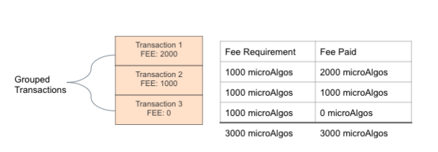

title: Structure

This section looks at how transactions are constructed, and in particular, how to _read and understand_ the underlying transaction composition after it has been created. To learn how to _create_ those same transactions visit the corresponding feature guide that is linked in each of the examples below. It is the hope that the combination of these guides will aid in developing a comprehensive understanding of how transactions work on Algorand. 

At the end of this section are several useful transaction-related how-tos.

!!! tip
	When you are given a transaction to sign, understanding its underlying representation will help you verify that the details of the transaction are correct.

# Quick start videos

If you prefer videos, take a look at this playlist to learn about Algorand Transactions Overview. There are 2 videos about 10 minutes each. 

<iframe width="100%" style="aspect-ratio:16/9" src="https://www.youtube-nocookie.com/embed/V-tuqNx8GRI" title="YouTube video player" frameborder="0" allow="accelerometer; autoplay; clipboard-write; encrypted-media; gyroscope; picture-in-picture; web-share" allowfullscreen></iframe>

# Transaction Types
There are [seven transaction types](https://github.com/algorand/go-algorand/blob/master/protocol/txntype.go) in the Algorand Protocol: 

- [Payment](#payment-transaction)
- [Key Registration](#key-registration-transaction)
- [Asset Configuration](#asset-configuration-transaction)
- [Asset Freeze](#asset-freeze-transaction)
- [Asset Transfer](#asset-transfer-transaction)
- [Application Call](#application-call-transaction)
- [State Proof](#state-proof-transaction)


These seven transaction types can be specified in particular ways that result in more granular perceived transaction types. As an example, a transaction to [create an asset](../atomic_transfers#creating-an-asset) and [destroy an asset](../atomic_transfers#destroying-an-asset) use the same underlying `AssetConfigTx` type. Distinguishing these two transactions requires knowing which combination of `AssetConfigTx` fields and values result in one versus the other. This guide will help explain those differences.  Fortunately, the SDKs provide intuitive methods to create these more granular transaction types without having to necessarily worry about the underlying structure. However, if you are signing a pre-made transaction, correctly interpreting the underlying structure is critical. 

Note that all of the transactions shown in this guide are not yet authorized and would fail if submitted to the network. The next section will explain how to [authorize transactions](signatures) before sending them to the network.

# Transaction Walkthroughs
The following sections describe the seven types of Algorand transactions through example transactions that represent common use cases. Each transaction is displayed using the `goal clerk inspect` command which takes a signed or unsigned transaction file (msgpack-encoded) as input and outputs a human-readable json object. 

## Payment Transaction

A `PaymentTx` sends Algos (the Algorand blockchain's native currency) from one account to another.

[_Payment Transaction Fields Reference_](transactions#payment-transaction)


### Send 5 Algos
Here is an example transaction that sends 5 Algos from one account to another on MainNet. 

```json
{
  "txn": {
    "amt": 5000000,
    "fee": 1000,
    "fv": 6000000,
    "gen": "mainnet-v1.0",
    "gh": "wGHE2Pwdvd7S12BL5FaOP20EGYesN73ktiC1qzkkit8=",
    "lv": 6001000,
    "note": "SGVsbG8gV29ybGQ=",
    "rcv": "GD64YIY3TWGDMCNPP553DZPPR6LDUSFQOIJVFDPPXWEG3FVOJCCDBBHU5A",
    "snd": "EW64GC6F24M7NDSC5R3ES4YUVE3ZXXNMARJHDCCCLIHZU6TBEOC7XRSBG4",
    "type": "pay"
  }
}
```
The `"type": "pay"` signals that this is a payment transaction. 

This transaction transfers 5 Algos (shown as 5000000 microAlgos) from the account represented by the address starting with `"EW64GC..."` to the account with the address starting with `"GD64YI..."`. The sender address (`"EW64GC..."`) will pay a fee of `1000` microAlgos, which is also the minimum fee. An optional note is included in this transaction, which corresponds to the base64-encoded bytes for `"Hello World"`. Note that the base64 representation is a by product of the output of the `goal clerk inspect` command. 

This transaction is valid on MainNet, as per the genesis hash value which corresponds to [MainNet's genesis hash](../algorand-networks/mainnet#genesis-hash). The genesis ID is also provided for human-readability and also matches [MainNet](../algorand-networks/mainnet#genesis-id). Be sure to validate against the genesis hash value since it is unique to the specific network. The genesis ID is not; anyone could spin up a private network and call it `"mainnet-v1.0"` if desired. This transaction is valid if submitted between rounds 6000000 and 6001000.

**Related How-To**

- [Create a Payment Transaction Using Python](../../sdks/python/#build-first-transaction). 
- [Create a Payment Transaction Using JavScript](../../sdks/javascript/#build-first-transaction). 
- [Create a Payment Transaction Using Java](../../sdks/java/#build-first-transaction). 
- [Create a Payment Transaction Using Go](../../sdks/go/#build-transaction). 
### Close an Account

Closing an account means removing it from the Algorand ledger. Since there is a minimum balance requirement for every account on Algorand, the only way to completely remove it is to use the [Close Remainder To](transactions#closeremainderto) field as in the transaction below.

```json
{
  "txn": {
    "close": "EW64GC6F24M7NDSC5R3ES4YUVE3ZXXNMARJHDCCCLIHZU6TBEOC7XRSBG4",
    "fee": 1000,
    "fv": 4695599,
    "gen": "testnet-v1.0",
    "gh": "SGO1GKSzyE7IEPItTxCByw9x8FmnrCDexi9/cOUJOiI=",
    "lv": 4696599,
    "rcv": "EW64GC6F24M7NDSC5R3ES4YUVE3ZXXNMARJHDCCCLIHZU6TBEOC7XRSBG4",
    "snd": "SYGHTA2DR5DYFWJE6D4T34P4AWGCG7JTNMY4VI6EDUVRMX7NG4KTA2WMDA",
    "type": "pay"
  }
}
```
In this transaction, after the fee and the transaction `"amt"` are paid to the [receiver](transactions#receiver) from the [sender](transactions#closeremainderto) account (`"SYGHTA..."`), the remaining balance is transferred to the [closeto](transactions#closeremainderto) account (`"EW64GC..."`). Note that there is an implicit `"amt"` of 0 Algos when none is specified.

!!! info
    If you have asset holdings, you must first close out those asset holdings before you can close out the Algorand account completely. Close out your asset holdings by specifying an [Asset Close Remainder To](transactions#closeassetto) address within an Asset Transfer transaction.

!!! warning
    Using the `--close-to` parameter on any transaction from a _rekeyed account_ will remove the **auth-addr** field, thus reverting signing authority to the original address. The `--close-to` parameter should be used with caution by keyholder(s) of **auth-addr** as the effects remove their authority to access this account thereafter.

## Key Registration Transaction
The purpose of a `KeyRegistrationTx` is to register an account either `online` or `offline` to participate (i.e. vote) in Algorand Consensus. 

An account that is marked `online` does not necessarily mean it is participating in consensus. The process of registering an account online involves first generating a participation key *prior* to issuing a KeyReg transaction. It is important to follow the steps in the [Participate in Consensus section](../../run-a-node/participate/index.md) for a full overview participation and to ensure that you follow good network behavior. 

[_Key Registration Transaction Fields Reference_](transactions#key-registration-transaction)

### Register account online 
This is an example of an **online** key registration transaction. 

```json
{
  "txn": {
    "fee": 2000,
    "fv": 6002000,
    "gh": "SGO1GKSzyE7IEPItTxCByw9x8FmnrCDexi9/cOUJOiI=",
    "lv": 6003000,
    "selkey": "X84ReKTmp+yfgmMCbbokVqeFFFrKQeFZKEXG89SXwm4=",
    "snd": "EW64GC6F24M7NDSC5R3ES4YUVE3ZXXNMARJHDCCCLIHZU6TBEOC7XRSBG4",
    "type": "keyreg",
    "votefst": 6000000,
    "votekd": 1730,
    "votekey": "eXq34wzh2UIxCZaI1leALKyAvSz/+XOe0wqdHagM+bw=",
    "votelst": 9000000
  }
}
```
What distinguishes this as a key registration transaction is `"type": "keyreg"` and what distinguishes it as an _online_ key registration is the existence of the participation key-related fields, namely `"votekey"`, `"selkey"`, `"votekd"`, `"votefst"`, and `"votelst"`. The values for these fields are obtained by dumping the participation key info on the node where the participation key lives. The [sender](transactions#sender) (`"EW64GC..."`) will pay a fee of `2000` microAlgos and its account state will change to `online` after this transaction is confirmed by the network. The transaction is valid between rounds 6002000 and 6003000 on [TestNet](../algorand-networks/testnet).

**Related How-To**

- [Generate a Participation Key](../../run-a-node/participate/generate_keys.md)
- [Register an Account Online](../../run-a-node/participate/online.md) 

### Register account offline

Here is an example of an **offline** key registration transaction.

```json
{
  "txn": {
    "fee": 1000,
    "fv": 7000000,
    "gh": "SGO1GKSzyE7IEPItTxCByw9x8FmnrCDexi9/cOUJOiI=",
    "lv": 7001000,
    "snd": "EW64GC6F24M7NDSC5R3ES4YUVE3ZXXNMARJHDCCCLIHZU6TBEOC7XRSBG4",
    "type": "keyreg"
  }
}
```
What distinguishes this from an _online_ transaction is that it does _not_ contain any participation key-related fields, since the account will no longer need a participation key if the transaction is confirmed. The [sender](transactions#sender) (`"EW64GC..."`) will pay a fee of `2000` microAlgos and its account state will change to `offline` after this transaction is confirmed by the network. This transaction is valid between rounds 7,000,000 (`"fv"`) and 7,001,000 (`"lv"`) on [TestNet](../algorand-networks/testnet#genesis-hash) as per the [Genesis Hash](#genesis-hash) (`"gh"`) value.

**Related How-To**

- [Register an Account Offline](../../run-a-node/participate/offline.md) 

## Asset Configuration Transaction
An `AssetConfigTx` is used to create an asset, modify certain parameters of an asset, or destroy an asset. 

[_Asset Configuration Transaction Fields Reference_](transactions#asset-configuration-transaction)

### Create an Asset

Here is an example asset creation transaction:

```json
{
  "txn": {
    "apar": {
      "am": "gXHjtDdtVpY7IKwJYsJWdCSrnUyRsX4jr3ihzQ2U9CQ=",
      "an": "My New Coin",
      "au": "developer.algorand.org",
      "c": "EW64GC6F24M7NDSC5R3ES4YUVE3ZXXNMARJHDCCCLIHZU6TBEOC7XRSBG4",
      "dc": 2,
      "f": "EW64GC6F24M7NDSC5R3ES4YUVE3ZXXNMARJHDCCCLIHZU6TBEOC7XRSBG4",
      "m": "EW64GC6F24M7NDSC5R3ES4YUVE3ZXXNMARJHDCCCLIHZU6TBEOC7XRSBG4",
      "r": "EW64GC6F24M7NDSC5R3ES4YUVE3ZXXNMARJHDCCCLIHZU6TBEOC7XRSBG4",
      "t": 50000000,
      "un": "MNC"
    },
    "fee": 1000,
    "fv": 6000000,
    "gh": "SGO1GKSzyE7IEPItTxCByw9x8FmnrCDexi9/cOUJOiI=",
    "lv": 6001000,
    "snd": "EW64GC6F24M7NDSC5R3ES4YUVE3ZXXNMARJHDCCCLIHZU6TBEOC7XRSBG4",
    "type": "acfg"
  }
}
```
The `"type": "acfg"` distinguishes this as an Asset Configuration transaction. What makes this uniquely an **asset creation** transaction is that _no_ [asset ID (`"caid"`)](transactions#configasset) is specified and there exists an [asset parameters](transactions#asset-parameters) struct that includes all the initial configurations for the asset. The asset is [named](transactions#assetname) (`an`) "My New Coin". the [unitname](transactions#unitname) (`"un"`) is "MNC". There are 50,000,000 [total](transactions#total) base units of this asset. Combine this with the [decimals](transactions#decimals) (`"dc"`) value set to 2, means that there are 500,000.00 of this asset. There is an [asset URL](transactions#asseturl) (`"au"`) specified which points to [developer.algorand.org](https://developer.algorand.org/) and a base64-encoded [metadata hash](transactions#metadatahash) (`"am"`). This specific value corresponds to the SHA512/256 hash of the string "My New Coin Certificate of Value". The [manager](transactions#manageraddr) (`"m"`), [freeze](transactions#freezeaddr) (`"f"`), [clawback](transactions#clawbackaddr) (`"c"`), and [reserve](transactions#reserveaddr) (`"r"`) are the same as the sender. The [sender](transactions#sender) is also the [creator](transactions#creator).

This transaction is valid between rounds 6000000 (`"fv"`) and 6001000 (`"lv"`) on [TestNet](../algorand-networks/testnet#genesis-hash) as per the [Genesis Hash](transactions#genesishash) (`"gh"`) value.

**Related How-To**

- [Create an Asset](../asa#creating-an-asset)

### Reconfigure an Asset
A **Reconfiguration Transaction** is issued by the asset manager to change the configuration of an already created asset.

Here is what an example reconfiguration transaction that changes the manager address for the asset with the Id `168103` that was [created above](#create-an-asset).  

```json
{
  "txn": {
    "apar": {
      "c": "EW64GC6F24M7NDSC5R3ES4YUVE3ZXXNMARJHDCCCLIHZU6TBEOC7XRSBG4",
      "f": "EW64GC6F24M7NDSC5R3ES4YUVE3ZXXNMARJHDCCCLIHZU6TBEOC7XRSBG4",
      "m": "QC7XT7QU7X6IHNRJZBR67RBMKCAPH67PCSX4LYH4QKVSQ7DQZ32PG5HSVQ",
      "r": "EW64GC6F24M7NDSC5R3ES4YUVE3ZXXNMARJHDCCCLIHZU6TBEOC7XRSBG4"
    },
    "caid": 168103,
    "fee": 1000,
    "fv": 6002000,
    "gh": "SGO1GKSzyE7IEPItTxCByw9x8FmnrCDexi9/cOUJOiI=",
    "lv": 6003000,
    "snd": "EW64GC6F24M7NDSC5R3ES4YUVE3ZXXNMARJHDCCCLIHZU6TBEOC7XRSBG4",
    "type": "acfg"
  }
}
```
What distinguishes this from an asset creation transaction is the inclusion of the **asset id** to be changed. The only fields that can be reconfigured are the [manager](transactions#manageraddr), [freeze](transactions#freezeaddr), [clawback](transactions#clawbackaddr), and [reserve](transactions#reserveaddr) addresses. All of them must be specified even if they do not change. 

!!! warning
	The protocol interprets unspecified addresses in an `AssetConfigTx` as an explicit action to set those values to null for the asset. Once set to `null`, this action cannot be undone.

Upon confirmation, this transaction will change the manager of the asset from `"EW64GC..."` to `"QC7XT7..."`.
This transaction is valid on [TestNet](../algorand-networks/testnet#genesis-hash) between rounds 6002000 and 6003000. A fee of `1000` microAlgos will be paid by the sender if confirmed. 

**Related How-To**

- [Modifying an Asset](../asa#modifying-an-asset)

### Destroy an Asset

A **Destroy Transaction** is issued to remove an asset from the Algorand ledger. To destroy an existing asset on Algorand, the original `creator` must be in possession of all units of the asset and the `manager` must send and therefore authorize the transaction. 

Here is what an example transaction destroy transaction looks like:

```json
{
  "txn": {
    "caid": 168103,
    "fee": 1000,
    "fv": 7000000,
    "gh": "SGO1GKSzyE7IEPItTxCByw9x8FmnrCDexi9/cOUJOiI=",
    "lv": 7001000,
    "snd": "EW64GC6F24M7NDSC5R3ES4YUVE3ZXXNMARJHDCCCLIHZU6TBEOC7XRSBG4",
    "type": "acfg"
  }
}
```

This transaction differentiates itself from an **Asset Creation** transaction in that it contains an **asset ID** (`caid`) pointing to the asset to be destroyed. It differentiates itself from an **Asset Reconfiguration** transaction by the *lack* of any asset parameters. 

**Related How-To**

- [Destroying an Asset](../asa#destroying-an-asset)

## Asset Transfer Transaction
An Asset Transfer Transaction is used to opt-in to receive a specific type of Algorand Standard Asset, transfer an Algorand Standard asset, or revoke an Algorand Standard Asset from a specific account.

[_Asset Transfer Transaction Fields Reference_](transactions#asset-transfer-transaction)

### Opt-in to an Asset
Here is an example of an opt-in transaction:

```json
{
  "txn": {
    "arcv": "QC7XT7QU7X6IHNRJZBR67RBMKCAPH67PCSX4LYH4QKVSQ7DQZ32PG5HSVQ",
    "fee": 1000,
    "fv": 6631154,
    "gh": "SGO1GKSzyE7IEPItTxCByw9x8FmnrCDexi9/cOUJOiI=",
    "lv": 6632154,
    "snd": "QC7XT7QU7X6IHNRJZBR67RBMKCAPH67PCSX4LYH4QKVSQ7DQZ32PG5HSVQ",
    "type": "axfer",
    "xaid": 168103
  }
}
```

The `"type": "axfer"` distinguishes this as an asset transfer transaction. The fields used in the transaction are the same as any other asset transfer. What distinguishes it as an opt-in transaction is in how those fields are specified and the sender account's asset holdings state prior to sending the transaction. In particular, the address `"QC7XT7...` is both the [sender](transactions#sender) and [asset receiver](transactions#assetreceiver) and it is assumed that the sender does not yet possess any of the desired asset identified with the [asset ID](transactions#xferasset) `168103`. The asset amount is not specified in this example. This transaction is valid on TestNet between rounds 6631154 and 6632154.

**Related How-To**

- [Receiving an Asset](../asa#receiving-an-asset)
  
### Transfer an Asset

Here is an example of an asset transfer transaction. 

```json
{
  "txn": {
    "aamt": 1000000,
    "arcv": "QC7XT7QU7X6IHNRJZBR67RBMKCAPH67PCSX4LYH4QKVSQ7DQZ32PG5HSVQ",
    "fee": 3000,
    "fv": 7631196,
    "gh": "SGO1GKSzyE7IEPItTxCByw9x8FmnrCDexi9/cOUJOiI=",
    "lv": 7632196,
    "snd": "EW64GC6F24M7NDSC5R3ES4YUVE3ZXXNMARJHDCCCLIHZU6TBEOC7XRSBG4",
    "type": "axfer",
    "xaid": 168103
  }
}
```

An asset transfer transaction assumes that the asset receiver has already [opted-in](#opt-in-to-an-asset). The account represented by address `"EW64GC6..."` sends 1 million base units (or 10,000.00 units) of asset `168103` between rounds 7631196 and 7632196 on TestNet. `"EW64GC6..."` pays a fee of 3000 microAlgos.

!!! tip
	If you are displaying asset amounts to users, be sure to include the asset's `"decimal"` configuration for easier readability. 

**Related How-To**

- [Transferring an Asset](../asa#transferring-an-asset)

### Revoke an Asset

Here is an example of the clawback account revoking assets from another account.

```json
{
  "txn": {
    "aamt": 500000,
    "arcv": "EW64GC6F24M7NDSC5R3ES4YUVE3ZXXNMARJHDCCCLIHZU6TBEOC7XRSBG4",
    "asnd": "QC7XT7QU7X6IHNRJZBR67RBMKCAPH67PCSX4LYH4QKVSQ7DQZ32PG5HSVQ",
    "fee": 1000,
    "fv": 7687457,
    "gh": "SGO1GKSzyE7IEPItTxCByw9x8FmnrCDexi9/cOUJOiI=",
    "lv": 7688457,
    "snd": "EW64GC6F24M7NDSC5R3ES4YUVE3ZXXNMARJHDCCCLIHZU6TBEOC7XRSBG4",
    "type": "axfer",
    "xaid": 168103
  }
}
```

The existence of an [asset sender](transactions#assetsender) tells us that this transaction is utilizing the clawback workflow. During a clawback, the clawback address (`"EW64GC..."`) sends the transactions and therefore authorizes it and pays the `1000` microAlgo fee. The [asset sender](transactions#assetsender) (`"QC7XT7..."`) is the address of the account from which the assets will be revoked. In this case, 5 million base units (5,000.00 units) of asset `168103` will be revoked from `"QC7XT7..."` and transferred to `"EW64GC..."`.

**Related How-To**

- [Revoking an Asset](../asa#revoking-an-asset)

## Asset Freeze Transaction
An Asset Freeze Transaction is issued by the Freeze Address and results in the asset receiver address losing or being granted the ability to send or receive the frozen asset.

### Freeze an Asset

```json
{
  "txn": {
    "afrz": true,
    "fadd": "QC7XT7QU7X6IHNRJZBR67RBMKCAPH67PCSX4LYH4QKVSQ7DQZ32PG5HSVQ",
    "faid": 168103,
    "fee": 1000,
    "fv": 7687793,
    "gh": "SGO1GKSzyE7IEPItTxCByw9x8FmnrCDexi9/cOUJOiI=",
    "lv": 7688793,
    "snd": "EW64GC6F24M7NDSC5R3ES4YUVE3ZXXNMARJHDCCCLIHZU6TBEOC7XRSBG4",
    "type": "afrz"
  }
}
```
An asset freeze transaction is identified by `"type": "afrz"`. In this example, the [freeze manager](transactions#freezeaddr) `"EW64GC..."` (i.e. the sender) freezes the asset `168103` for the account represented by address `"QC7XT7..."`. To unfreeze the asset, the [`"afrz"`](transactions#assetfrozen) field is set to `false`.

### See also
- [Freezing an Asset](../asa#freezing-an-asset)


## Application Call Transaction

An Application Call Transaction is submitted to the network with an AppId and an OnComplete method. The AppId specifies which App to call and the OnComplete method is used in the contract to determine what branch of logic to execute.

Application Call transactions may include other fields needed by the logic such as:

*ApplicationArgs* - To pass arbitrary arguments to an application (or in the future to call an ABI method)

*Accounts* - To pass accounts that may require some balance checking or opt-in status

*ForeignApps* - To pass apps and allow state access to an external application (or in the future to call an ABI method)

*ForeignAssets* - To pass ASAs for parameter checking

*Boxes* - To pass references to Application Boxes so the AVM can access the contents

Details for smart contract authoring can be found on the [Smart Contract Details](../dapps/smart-contracts/apps) page.


### Application Create Transaction
When an application is to be created, the OnComplete method is set to NoOp, no AppId is set, and the Approval/Clear programs and Schema are passed.  The approval program may do additional checking during setup by checking that the AppId == 0.

```json
{
  "txn": {
    "apap": "BYEB",
    "apgs": {
      "nbs": 1,
      "nui": 1
    },
    "apls": {
      "nbs": 1,
      "nui": 1
    },
    "apsu": "BYEB",
    "fee": 1000,
    "fv": 12774,
    "gh": "ALXYc8IX90hlq7olIdloOUZjWfbnA3Ix1N5vLn81zI8=",
    "lv": 13774,
    "note": "poeVkF5j4MU=",
    "snd": "FOZF4CMXLU2KDWJ5QARE3J2U7XELSXL7MWGNWUHD7OPKGQAI4GPSMGNLCE",
    "type": "appl"
  }
}
```

- The Approval program (`apap`) and Clear program (`apsu`) are set to `#pragma version 5; int 1`
- The Apps global and local state both have bytes/ints set to 1
- The OnComplete (`apan`) is set to NoOp (0 value so it is omitted from output)

Assuming all the balance and signature checks pass, this will create an Application with a new AppId and subsequent calls.


### Application Update Transaction

An Application Update transaction may be submitted and approved assuming the logic of the Approval program allows it. This is done by specifying the AppId to update and passing the new logic for Approval and Clear programs.


```json
{
  "txn": {
    "apan": 4,
    "apap": "BYEB",
    "apid": 51,
    "apsu": "BYEB",
    "fee": 1000,
    "fv": 12973,
    "gh": "ALXYc8IX90hlq7olIdloOUZjWfbnA3Ix1N5vLn81zI8=",
    "lv": 13973,
    "note": "ATFKEwKGqLk=",
    "snd": "FOZF4CMXLU2KDWJ5QARE3J2U7XELSXL7MWGNWUHD7OPKGQAI4GPSMGNLCE",
    "type": "appl"
  }
}
```

- The AppId (`apid`) is set to the app being updated (51 here)
- The OnComplete (`apan`) is set to UpdateApplication (4)

### Application Delete Transaction
An application may be deleted as long as the logic in the Approval Program allows for it.

```json
{
  "txn": {
    "apan": 5,
    "apid": 51,
    "fee": 1000,
    "fv": 13555,
    "gh": "ALXYc8IX90hlq7olIdloOUZjWfbnA3Ix1N5vLn81zI8=",
    "lv": 14555,
    "note": "V/RAbQ57DnI=",
    "snd": "FOZF4CMXLU2KDWJ5QARE3J2U7XELSXL7MWGNWUHD7OPKGQAI4GPSMGNLCE",
    "type": "appl"
  }
}
```

- The AppId (`apid`) is set to the app being deleted (51 here)
- The OnComplete (`apan`) is set to DeleteApplication (5)


### Application Opt-In Transaction
An Application Opt-In transaction must be submitted by an account in order for the local state for that account to be used. If no local state is required, this transaction is not necessary for a given account. 


```json
{
  "txn": {
    "apan": 1,
    "apid": 51,
    "fee": 1000,
    "fv": 13010,
    "gh": "ALXYc8IX90hlq7olIdloOUZjWfbnA3Ix1N5vLn81zI8=",
    "lv": 14010,
    "note": "SEQpWAYkzoU=",
    "snd": "LNTMAFSF43V7RQ7FBBRAWPXYZPVEBGKPNUELHHRFMCAWSARPFUYD2A623I",
    "type": "appl"
  }
}
```

- The AppId (`apid`) is set to the app being opted into (51 here)
- The OnComplete (`apan`) is set to OptIn (1) 


### Application Close Out Transaction
An Application Close Out transaction is used when an account wants to opt out of a contract gracefully and remove its local state from its balance record.  This transaction _may_ fail according to the logic in the Approval program.

```json
{
  "txn": {
    "apan": 2,
    "apid": 51,
    "fee": 1000,
    "fv": 13166,
    "gh": "ALXYc8IX90hlq7olIdloOUZjWfbnA3Ix1N5vLn81zI8=",
    "lv": 14166,
    "note": "HFL7S60gOdM=",
    "snd": "LNTMAFSF43V7RQ7FBBRAWPXYZPVEBGKPNUELHHRFMCAWSARPFUYD2A623I",
    "type": "appl"
  }
}
```

- The AppId (`apid`) is set to the app being closed out of (51 here)
- The OnComplete (`apan`) is set to CloseOut (2)


### Application Clear State Transaction
An Application Clear State transaction is used to force removal of the local state from the balance record of the sender. Given a well formed transaction this method will _always_ succeed. The Clear program is used by the application to perform any book keeping necessary to remove the Account from it's records.

```json
{
  "txn": {
    "apan": 3,
    "apid": 51,
    "fee": 1000,
    "fv": 13231,
    "gh": "ALXYc8IX90hlq7olIdloOUZjWfbnA3Ix1N5vLn81zI8=",
    "lv": 14231,
    "note": "U93ZQy24zJ0=",
    "snd": "LNTMAFSF43V7RQ7FBBRAWPXYZPVEBGKPNUELHHRFMCAWSARPFUYD2A623I",
    "type": "appl"
  }
}
```

- The AppId (`apid`) is set to the app being cleared (51 here)
- The OnComplete (`apan`) is set to ClearState (3)

### Application NoOp Transaction

Application NoOp Transactions make up a majority of the Application Call methods in practice.  The logic in a smart contract will often branch to appropriate logic given the contents of the ApplicationArgs array passed.

```json
{
  "txn": {
    "apaa": [
      "ZG9jcw==",
      "AAAAAAAAAAE="
    ],
    "apas": [
      16
    ],
    "apat": [
      "4RLXQGPZVVRSXQF4VKZ74I6BCUD7TUVROOUBCVRKY37LQSHXORZV4KCAP4"
    ],
    "apfa": [
      10
    ],
    "apbx":[
      {"i":51, "n": "Y29vbF9ib3g="}
    ],
    "apid": 51,
    "fee": 1000,
    "fv": 13376,
    "gh": "ALXYc8IX90hlq7olIdloOUZjWfbnA3Ix1N5vLn81zI8=",
    "lv": 14376,
    "note": "vQXvgqySYPY=",
    "snd": "LNTMAFSF43V7RQ7FBBRAWPXYZPVEBGKPNUELHHRFMCAWSARPFUYD2A623I",
    "type": "appl"
  }
}
```

- The AppId (`apid`) is set to the app being called (51 here)
- The ApplicationArgs (`apaa`) contains to the string "docs" and the integer 1
- The Accounts (`apat`) contains the address "4RLXQGPZVVRSXQF4VKZ74I6BCUD7TUVROOUBCVRKY37LQSHXORZV4KCAP4"
- The ForeignAssets (`apas`) contains the ASA id 16 
- The ForeignApps (`apfa`) contains the AppId 10
- The Boxes (`apbx`) contains a reference to the box named "cool_box", owned by app id 51
- The OnComplete (`apan`) is set to NoOp (0 value so omitted from the output)

# State Proof Transaction

A State Proof Transaction is a transaction that's submitted to the network during the consensus process. These types of transactions are not submitted by individuals, nor can a Smart Contract issue inner state proof transactions.

```json
{
  "txn": {
    "txn": {
      "fv": 24192139,
      "gh": "wGHE2Pwdvd7S12BL5FaOP20EGYesN73ktiC1qzkkit8=",
      "lv": 24193139,
      "snd": "XM6FEYVJ2XDU2IBH4OT6VZGW75YM63CM4TC6AV6BD3JZXFJUIICYTVB5EU",
      "sp": { },
      "spmsg": {
        "P": 2230170,
        "b": "8LkpbqSqlWcsfUr9EgpxBmrTDqQBg2tcubN7cpcFRM8=",
        "f": 24191745,
        "l": 24192000,
        "v": "drLLvXcg+sOqAhYIjqatF68QP7TeR0B/NljKtOtDit7Hv5Hk7gB9BgI5Ijz+tkmDkRoblcchwYDJ1RKzbapMAw=="
      },
      "type": "stpf"
    }
  }
}
```

# Sending a Transaction in the Future

Algorand transactions are valid for a specific round range and the range maximum is 1000 rounds. If you plan to submit the transaction right away, specifying this round range is trivial. However, when the transaction requires offline signing or you plan to make frequent transactions from that account, it may be beneficial to specify a future round range or ranges that are more convenient. You can sign these transactions in a single secure session, and then submit them to the network when the valid round range is reached.

!!! tip
	For recurring transactions, Algorand Smart Contracts can be a more secure option. Read the corresponding [guide](../dapps/smart-contracts/guidelines/) to learn more.

Calculating the round range requires you to know the **current round**, the **average block time**, and the **target submission time**. 

## Current Round

To retrieve the **current round** check the latest round passed for the network where you plan to submit the transaction/s. Check existing [block explorers](https://developer.algorand.org/ecosystem-projects/#block-explorers) or get this info from your node's REST endpoint or `goal`. See [Check Node Status and Version](../../clis/goal/node/status/).

## Average Block Time

This refers to the number of seconds it takes, on average, for a block to be committed on the Algorand blockchain. This number is not dynamically available through the Algorand developer tools, but at the time of writing this, blocks are confirmed in less than 4 seconds on Algorand so you can use a rough estimate of 3.7 seconds if precision is not critical. It is highly recommended that you validate this number against your own analytics or check our [Community Projects](https://developer.algorand.org/ecosystem-projects/) for other projects that may provide this information since the average shown above may be out of date at the time of reading this.

## Target Submission Time

This is the clock time at which you are targeting to send the transaction.

## Calculation
Calculate the delta between the target submission time and the current time in seconds. Divide that time by the average seconds per block to get the number of blocks spanning that time period. Add that number to the current round to get the first valid round for your transaction. Add 1000 to the first valid round to get the last valid round.

Keep in mind that these block times are estimations and it is not possible to be exactly precise for a given target time. Also, the longer out you project a round range, the wider the potential drift of round against clock time given natural variability in block times (i.e. 3.7 is just the average now but may vary during certain time periods).

# Fees

Fees for transactions on Algorand are set as a function of network congestion and based on the size in bytes of the transaction.  Every transaction must at least cover the minimum fee (1000µA or 0.001A). 

For a transaction serialized to bytes (`txn_in_bytes`) and current congestion based fee per byte (`fee_per_byte`) the fee can be computed as follows:

```py
fee = max(current_fee_per_byte*len(txn_in_bytes), min_fee)
```

If the network *is not* congested, the fee per byte will be 0 and the minimum fee for a transaction is used. 

If network *is* congested the fee per byte will be non zero and for a given transaction will be the product of the size in bytes of the transaction and the current fee per byte. If the product is less than the min fee, the min fee is used. 

Note that fees are independent of the type of transaction (payment, ASA transfer, application call, ...) and a fortiori independent of the complexity of the smart contract code in case of application calls.
Only the size of the serialized transaction matters.

# Setting a fee 

There are two primary ways to set fees on a transaction.

## Suggested Fee

The SDK provides a method to get the suggested parameters from an the algod REST server, including the [**suggested fee** per byte (`fee`)](../../rest-apis/algod/#get-v2transactionsparams) which can be used to set the total fee for a transaction. This value is multiplied by the estimated size of the transaction in bytes to determine the total transaction fee. If the result is less than the minimum fee, the minimum fee is used instead. 

When using the SDK to build a transaction, if the suggested parameters are passed to one of the helper methods, the fee for the transaction will be set based on the above computation.

## Flat Fee
You can also manually set a **flat fee**. If you choose this method, make sure that your fee covers at least the [minimum transaction fee (`min-fee`)](../../rest-apis/algod/#get-v2transactionsparams), which can be obtained from the suggested parameters method call in each of the SDKs or as a constant in the SDK.  

Flat fees may be useful for:

- Applications that want to guarantee showing a specific rounded fee to users 
- Transactions that are meant to be sent in the future where the network traffic conditions are unknown
- Transactions that are not urgent and may be retried later if they are rejected


# Pooled transaction fees

The Algorand protocol supports pooled fees, where one transaction can pay the fees of other transactions within the same atomic group. 

For atomic transactions, the fees set on all transactions in the group are summed. This sum is compared against the protocol determined expected fee for the group and may proceed as long as the sum of the fees is at least the required fee for the group.

<center></center>
<center>*Atomic Pooled Fees*</center>

!!! note
    [Smart Contract Inner transactions](../dapps/smart-contracts/apps/#inner-transactions) may have their fees covered by the outer transactions but they may not cover outer transaction fees. This limitation that only outer transactions may cover the inner transactions is true in the case of nested smart contract inner transactions as well (for example, if Smart Contract A is called, which then calls Smart Contract B, which then calls Smart Contract C. Then C's fee can not cover the call for B, which can not cover the call to A).


An example of setting a pooled fee on a group of two transactions:

=== "JavaScript"
    <!-- ===JSSDK_TRANSACTION_FEE_OVERRIDE=== -->
	```javascript
	const sp = await client.getTransactionParams().do();
	sp.fee = 2 * minFee;
	sp.flatFee = true;
	```
	[Snippet Source](https://github.com/algorand/js-algorand-sdk/blob/examples/examples/atomics.ts#L57-L60)
    <!-- ===JSSDK_TRANSACTION_FEE_OVERRIDE=== -->

=== "Python"
	<!-- ===PYSDK_TRANSACTION_FEE_OVERRIDE=== -->
	```python
	suggested_params = algod_client.suggested_params()
	suggested_params.fee = 2 * suggested_params.min_fee
	# Important to set flat_fee = True here or the fee will be
	# treated as fee-per-byte of the encoded transaction
	suggested_params.flat_fee = True
	```
	[Snippet Source](https://github.com/algorand/py-algorand-sdk/blob/examples/examples/overview.py#L69-L74)
	<!-- ===PYSDK_TRANSACTION_FEE_OVERRIDE=== -->

=== "Go"
  	<!-- ===GOSDK_TRANSACTION_FEE_OVERRIDE=== -->
	```go
	// by using fee pooling and setting our fee to 2x min tx fee
	// we can cover the fee for another transaction in the group
	sp.Fee = 2 * transaction.MinTxnFee
	sp.FlatFee = true
	// ...
	```
	[Snippet Source](https://github.com/algorand/go-algorand-sdk/blob/examples/examples/overview/main.go#L105-L110)
  	<!-- ===GOSDK_TRANSACTION_FEE_OVERRIDE=== -->

=== "Java"
  	<!-- ===JAVASDK_TRANSACTION_FEE_OVERRIDE=== -->
	```java
	BigInteger nullFee = null;
	Transaction feeOverrideTxn = Transaction.PaymentTransactionBuilder()
	        .sender(acct.getAddress())
	        .receiver(acct2.getAddress())
	        .suggestedParams(suggestedParams.body())
	        // since suggestedParams sets a fee, we have to `null` it out
	        // or trying to set flatFee will fail with both set
	        .fee(nullFee)
	        // override the fee given by suggested params to set a flat
	        // fee of 2x minfee to cover another transaction in the same group
	        .flatFee(2 * suggestedParams.body().minFee).build();
	```
	[Snippet Source](https://github.com/algorand/java-algorand-sdk/blob/examples/examples/src/main/java/com/algorand/examples/Overview.java#L56-L67)
  	<!-- ===JAVASDK_TRANSACTION_FEE_OVERRIDE=== -->

Here we're directly setting the fee to be 2x the min fee since we want to cover both transactions. 

# Setting First and Last Valid

Unless you have specific security concerns, generally the maximum default range of 1000 rounds is acceptable. This will give you an ample window of validity time to submit your transaction. 

One occasion where the maximum range may not be appropriate is when you want to be sure transaction fee is low and the network conditions may change before the transaction is submitted.  In this case, a lower valid round range can limit potentially submitting the transaction during a window of higher congestion.