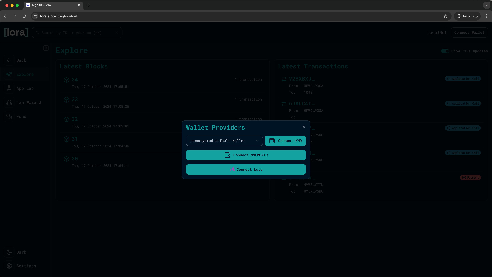

title: AlgoKit Quick Start Guide

AlgoKit is a simple, one-stop tool for developers to quickly and easily build and launch secure, automated, production-ready decentralized applications on the Algorand protocol -- now also featuring native support for Python! This empowers developers to write Algorand apps in regular Python, one of the world's most popular programming languages.

In addition, AlgoKit features:

- A library of smart contract templates to kickstart your  build
- All necessary application infrastructure running locally
- Toolchain integrations for languages you love, like Python and TypeScript
- A simplified frontend design experience

## Prerequisites

- [Python 3.12](https://www.python.org/downloads/) or higher
- [PipX](https://pypa.github.io/pipx/#on-linux-install-via-pip-requires-pip-190-or-later)
- [Git](https://github.com/git-guides/install-git#install-git)
- [Docker](https://docker.com/download/)
- [VSCode](https://code.visualstudio.com/download) (recommended)

## Install AlgoKit

=== "Windows"
    !!! Note
        This method will install the most recent python3 version [via winget](https://learn.microsoft.com/en-us/windows/package-manager/winget/). If you already have python 3.12+ installed, you may you may prefer to use `pipx install algokit` as explained within the pipx on any OS section so you can control the python version used.

    - Ensure prerequisites are installed
        - [Git](https://github.com/git-guides/install-git#install-git-on-windows) (or `winget install git.git`)
        - [Docker](https://docs.docker.com/desktop/install/windows-install/) (or `winget install docker.dockerdesktop`)

            !!! Info
                See [our LocalNet documentation](https://github.com/algorandfoundation/algokit-cli/blob/main/docs/features/localnet.md#prerequisites) for more tips on installing Docker on Windows

    - Install Python3 using WinGet
        - Install python: `winget install python.python.3.12`
        - Restart the terminal to ensure Python and pip are available on the path

            !!! Info
                Windows has a feature called **App Execution Aliases** that provides redirects for the Python command that guide users to the Windows Store. unfortunately these aliases can prevent normal execution of Python if Python is installed via other means, to disable them search for **Manage app execution aliases** from the start menu, and then turn off entries listed as **App Installer python.exe** or **App Installer python3.exe**.

        - Install pipx:
            ```
            pip install --user pipx
            python -m pipx ensurepath
            ```
        - Restart the terminal to ensure pipx is available on the path
        - Install AlgoKit via pipx: `pipx install algokit`
        - If you used AlgoKit before, update it with pipx: `pipx upgrade algokit`
        - Restart the terminal to ensure AlgoKit is available on the path

=== "macOS"
    !!! Note
        This method will install the latest Python3 release as a dependency via Homebrew. If you already have Python 3.10+ installed, you may prefer to use `pipx install algokit` as explained within the OS agnostic tab so you can control the python version used.

    - Ensure prerequisites are installed

        - [Homebrew](https://docs.brew.sh/Installation)
        - [Git](https://github.com/git-guides/install-git#install-git-on-mac) (should already be available if `brew` is installed)
        - [Docker](https://docs.docker.com/desktop/install/mac-install/), (or `brew install --cask docker`)

            !!! Info
                Docker requires MacOS 11+

    - Install using Homebrew `brew install algorandfoundation/tap/algokit`
    - Restart the terminal to ensure AlgoKit is available on the path


=== "Linux"
    - Ensure prerequisites are installed

        - [Python 3.12+](https://www.python.org/downloads/)

            !!! Info
                There is probably a better way to install Python than to download it directly, e.g. your local Linux package manager

        - [pipx](https://pypa.github.io/pipx/#on-linux-install-via-pip-requires-pip-190-or-later)
        - [Git](https://github.com/git-guides/install-git#install-git-on-linux)
        - [Docker](https://docs.docker.com/desktop/install/linux-install/)
    - Continue with step 2 in the following section to install via `pipx` on any OS

=== "OS agnostic"
    To install AlgoKit, run the following command from a terminal.

    ```shell
    pipx install algokit
    ```

    If you used AlgoKit before, update it with pipx: `pipx upgrade algokit`

    After the installation completes, **restart the terminal**.

Additional AlgoKit videos are available on the [@AlgoDevs YouTube channel](https://youtube.com/@AlgoDevs).

## Verify the Installation

To verify AlgoKit Installed correctly run the following.

```shell
algokit --version
```

Output similar to the following should be displayed:

```shell
algokit, version 2.0.0
```

## Start a LocalNet

AlgoKit supports using a [local version of the Algorand blockchain](../../get-details/algokit/features/localnet/). To start an instance of this LocalNet run the following command from the terminal:

```shell
algokit localnet start
```

This should start an instance of the LocalNet within docker. If you open the Docker Desktop application you should something similar to the following:


## Create an AlgoKit project

Now that AlgoKit is installed, you can rapidly create a new project to get started quickly. This can be done by running:

```shell
algokit init
```

This will launch a guided menu system to create a specific project tailored to your needs. You will first be prompted to select a specific template. The templates are basic starter applications for various Algorand development scenarios. To read more about templates checkout AlgoKit detailed documentation. For this guide, we will use the Python smart contract starter template. Select the following options:
1. `Smart Contracts`
2. `Python`
3. name of your project: `DEMO`
4. Template preset: select `Starter`.
5. Contract deployment code: select `Python`
6. algokit project bootstrap: `Y`
7. git repository: `Y`

Once finished, (if you have it installed) VS Code should automatically be opened with the initialized project and you will be prompted to install appropriate VS Code extensions. This starter app will contain one smart contract (built with [Algorand Python](https://algorandfoundation.github.io/puya/) named `contract.py`, in the `hello_world` folder, with one method (`hello`) that takes a `String` and returns a `String`.


## Run the Demo Application

Once the starter project is created, you will notice in the `smart_contracts/hello_world` folder a file named `deploy_config.py` which is a simple example of using AlgoKit to deploy and make a call to the `contract.py` smart contract on the LocalNet instance started earlier.


By hitting F5 you will deploy the `HelloWorld` smart contract and then call it passing the parameter `name` with a value of `world`. You can edit this parameter in the `deploy_config.py` file and it will:

1. Start LocalNet
2. Build the smart contract
3. Deploy and call the smart contract (`contract.py`)

If you would like to manually build and deploy the `HelloWorld` smart contract run the following AlgoKit commands:

```shell
algokit project run build
algokit project deploy 
```

This should produce something similar to the following in the VSCode terminal.

```shell
HelloWorld not found in PDEEWXLITMAPDMDYGP4XUV2EUJVPNZVKR7OUSSFZ63U4XNL2Y25FN5PYN4 account, deploying app.
HelloWorld (v1.0) deployed successfully, with app id 1002.
Called hello on HelloWorld (1002) with name=world, received: Hello, world
```

The App ID of of the deployed contract and its Algorand address is displayed, followed by the message returned from the smart contract call (`Hello, world`).

At this point you have deployed a simple contract to an Algorand network and called it successfully!

Additionally, you can find the native TEAL smart contract code and the appropriate smart contract manifest JSON files have been output to the `artifacts` folder.


These files can be used by tools like [Lora](https://lora.algokit.io/localnet), [goal](https://developer.algorand.org/docs/clis/goal/goal/), etc. to deploy your smart contract to the various Algorand networks.

## Using Lora

Lora is a web-based user interface that let's you visualize accounts, transactions, assets and applications on an Algorand network and also provides ability to deploy and call smart contracts. This works for TestNet, MainNet and also LocalNet. While AlgoKit surfaces both a programming interface and a command line interface for interacting with Algorand, it also allows you to quickly open Lora so you can see what's happening visually.

Lora can be launched from AlgoKit by running the following command from the terminal.

```shell
algokit explore
```

By default it will open Lora and point to LocalNet (It will be displayed as `LocalNet` in the upper right hand corner), but you can pass in parameters to point it to TestNet and MainNet too.

This command will launch your default web browser and load the Lora web application.

**Note:** If you are using Safari, then it won't work against LocalNet and you will need to open it in a different browser.


### Create / Connect  local account for testing

To issue commands against the LocalNet network you need an account with ALGO in it. Lora gives you three options for connecting to a local wallet: `Connect KMD`, `Connect MNEMONIC`, and `Connect Lute`

- `Connect KMD`: Lora will automatically import KMD wallet.

- `Connect MNEMONIC`: You can manually input a MNEMONIC for an account you own. 

- `Connect Lute`: You can create local accounts from [Lute](https://lute.app/) and connect to them.

In this guide, we will use the KMD wallet.

Select `Connect wallet` located at top right hand side of the webpage and you will be prompted with the three wallet choices. Choose the `Connect KMD` option. This will prompt you to enter the KMD password. If this is your first time building on Algorand, you do not have a KMD password so leave it blank and click `OK`. This will connect the KMD account to Lora so you can use that account for signing transactions from the Lora user interface.



### Deploy the Hello World application

1. To deploy your smart contract application, select the `App Lab` menu and click on the `Create` button. 


2. Click `Deploy new` and `Select an ARC-32 JSON app spec file` to browse to the artifacts created in the previous section of this guide. Select the `HelloWorld.arc32.json` manifest file. 


3. This will load the specific manifest file for the Hello World sample application. Click `Next`.


4. You can change the `Name` and the `Version` of your app. We will keep it as it is. Click `Next`.


5. Click the `() Call` button. Then build and add the create transaction by clicking `Add`.


6. Click `Deploy` and sign the transaction by clicking `OK` in the KMD pop up to deploy the smart contract to the local Algorand network.


7. You should now see the deployed `HelloWorld` contract on the `App Lab` page. 


8. Now click on the `App ID` inside of the `HelloWorld` card to go to the `Application` page.


10. Inside the `ABI Methods` section, you should see the `hello` method. Click on the drop down and the `Call` button. You will be prompted with a popup allowing you to enter the parameter for the `hello` method and call it. 


11. Enter a string in the `value` input and click on `Add`. 


12. You should now see the transaction you just built on the `Application` page. Click `Send` and sign the transaction with your KMD wallet to execute the transaction.


13. You should now see the `Send Result` showing you the details about the transaction you just executed!


1.  You can also click on `Transaction ID` to go to the `Transaction` page and see the full detail of the transaction.


You have now successfully deployed and executed a smart contract method call using Lora!

## Next steps

- To learn more about AlgoKit and what you can do with it, checkout the [AlgoKit documentation](../index.md).
- To learn more about Python on Algorand, take a look at the [Python documentation](https://algorandfoundation.github.io/puya/).
- More information on Algorand smart contracts is also available in the [smart contract documentation](https://developer.algorand.org/docs/get-details/dapps/smart-contracts/).
