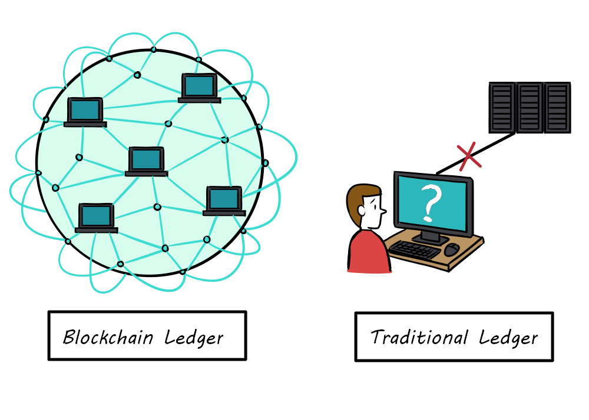
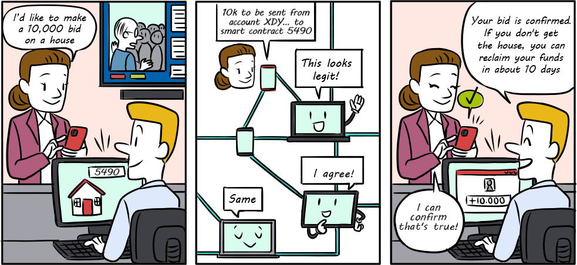
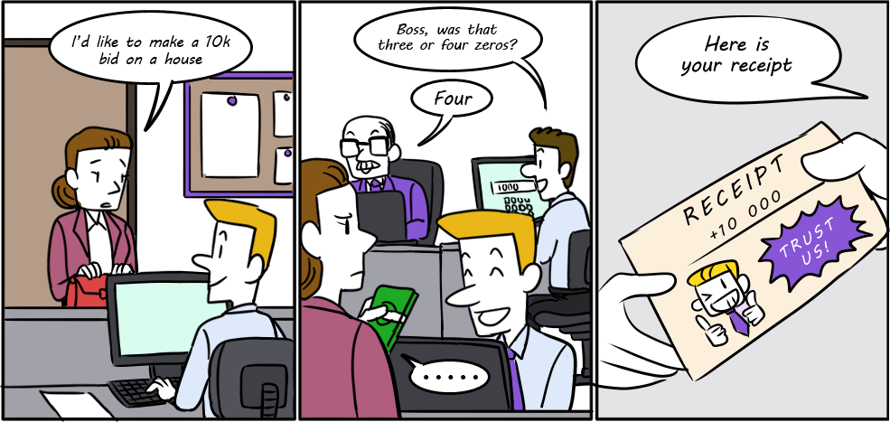
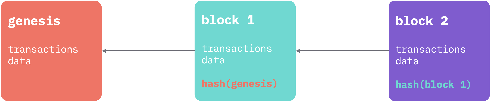
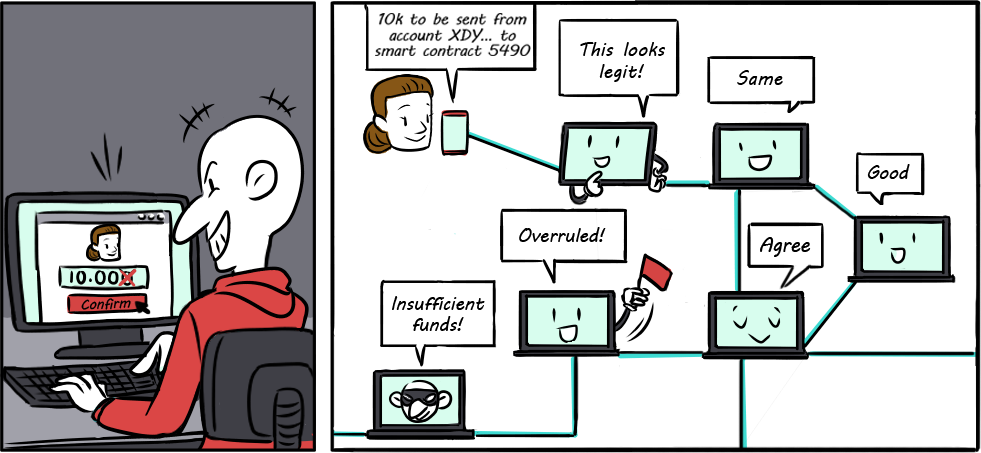
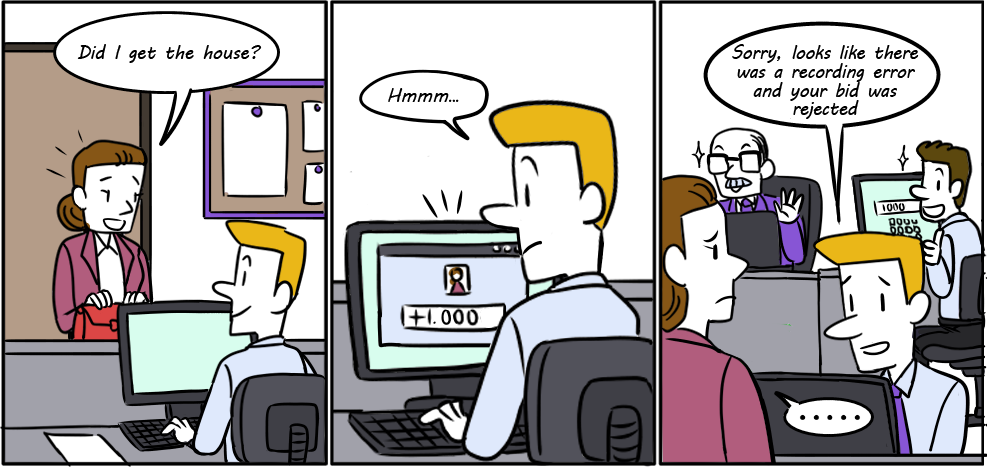
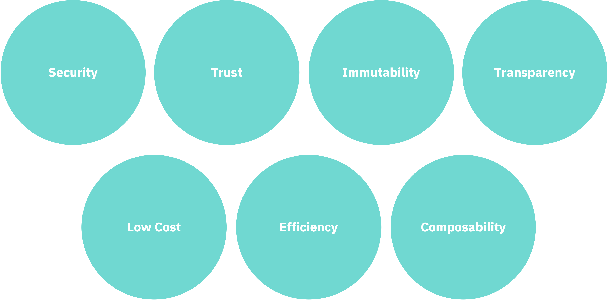
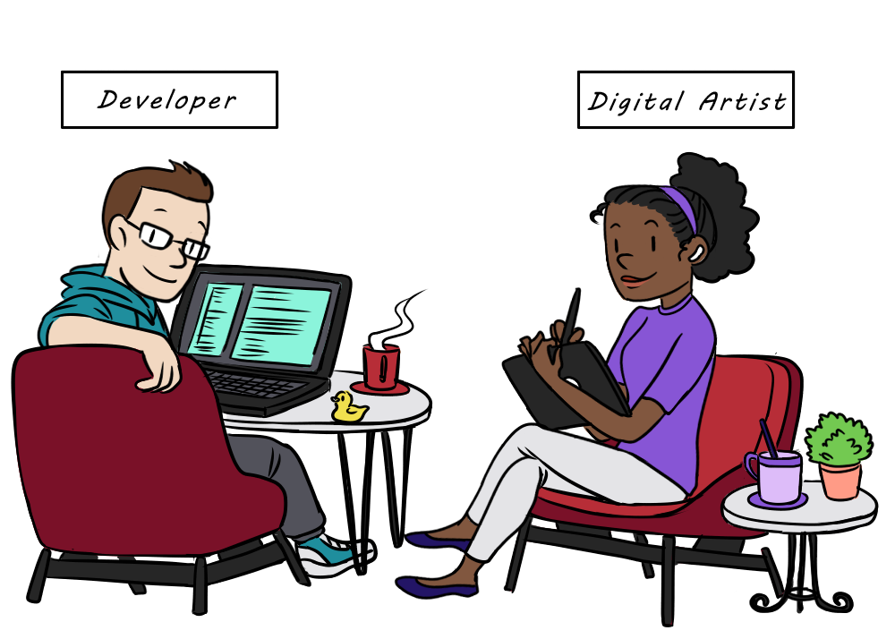

title: What is a blockchain? 

{: style="width:500px" align=center }

A blockchain is a public ledger (or file) of transactional data, distributed across multiple computers (“nodes”) in a network. All of these nodes work together, using the same set of software and rules, to verify transactions to add to the finalized ledger. 

{: style="width:500px" align=center }
<figcaption style="font-size:12px">A woman places a bid on a house using software built on top of a decentralized blockchain.</figcaption>

Compare this to a traditional ledger of transactional data that may live in a single database on a few computers that only certain people have access to.

{: width='500px' }
<figcaption style="font-size:12px">A woman places a bid on a house using a private agency.</figcaption>

The “block” part of “blockchain” refers to a set of transactions that are proposed and verified by the other nodes and eventually added to the ledger. The “chain” part, refers to the fact that each block of transactions also contains proof (a cryptographic hash) of what was in the previous block. This pattern of capturing the previous block’s data in the current block continues all the way back to the start of the network (the genesis block) creating a publicly verifiable and tamperproof record of all transactions, ever. 

{: width='500px' }

Practically, this means that if you try to change even a single record, anywhere in the history of a blockchain, it will be evident and rejected by the network nodes. 

{: width='500px' }
<figcaption style="font-size:12px">A malicious user attempts to change a past blockchain record, unsuccessfully.</figcaption>

Compare this to a traditional ledger where a change in a database is entrusted to a limited group and can easily be manipulated either through malicious intent or simply error. 

{: width='500px' }
<figcaption style="font-size:12px">Example of how a centralized system could unintentionally disqualify user participation.</figcaption>

But how do blocks get added to the chain in the first place? Each node runs software that instructs them how to verify transactions and add new blocks to the chain. These instructions are collectively referred to as the “consensus protocol”.  The nature of these instructions are one of the main distinguishing factors of different blockchains. We will learn more about Algorand’s consensus protocol and how it differs from others’ later in this guide. 

# How will blockchain benefit my application?

_Blockchain, at its core, is a technology that innovates on how we transfer value._ So, if your application exchanges value in some way, blockchain may be a candidate technology to bring your application to the next level. 

But before jumping in, it is important to understand specifically how it might benefit your application so that you can design a system that targets those benefits and doesn’t add unnecessary complexity to other parts of your application. This usually maps to thinking about which components to put “on-chain” versus “off-chain”.

Below are some of the characteristics of blockchains that make them attractive technologies for value-based applications. 

Not all of these may be important to your application or some may be more important than others, so a good first question to ask is: 

> “Which of these characteristics is an important property for my use case?” 

If you choose at least one, then ask:
 
> “Is that property lacking or insufficient in my current application design?” 

If the answer to the second question is “yes” to any or all of the properties you chose, then you’re in the right place.

For example, sending a payment across borders through a bank often takes days and is expensive since there are many intermediaries who are involved to ensure that the value is transferred securely. High costs and overall poor efficiency are the characteristics that stand out in this scenario and that blockchain could improve. That’s not to say that the other characteristics aren’t important. For example, we don’t want lower costs at the expense of security, but if security mattered alone we might say that the current process is good enough (assuming you trust the bank who is making the transfer). In this scenario, blockchain improves deficiencies in the system without making a tradeoff elsewhere.

# Alice and Bob's auction

Meet Alice and Bob. Alice is a talented artist, looking to grow her fanbase and her value as an artist. Bob is a developer and Alice’s good friend. He wants to help her out. 

{: width='500px' }

Alice usually sells her artwork through personal connections and sometimes by advertising on social media. One of her digital art pieces sells for $100, on average, using her current sale techniques. She thinks she could make a lot more if she were able to scale and reach a wider audience. Alice considers the important properties for her use case:

1. **Efficiency** - Alice spends lots of time trying to find a buyer and ultimately doesn’t reach a wide enough audience.
2. **Trust/Transparency** - Alice wants to reach a wider audience, but she is still building her reputation and needs a way for both herself and potential buyers to know that they aren’t getting scammed.
3. **Cost** - The best option for scaling now is to use an e-commerce site, but she knows she’ll have to give up a good chunk of what she makes on fees (minimum 5% and up to 15-20%). 

We named 4 properties of blockchain that could help Alice and her use case. Alice and Bob brainstorm together considering Alice’s main goals and the properties she wants to optimize for. They come up with the following idea:

They plan to tokenize Alice’s artwork as an NFT on the blockchain. This gives them the entry point into blockchain technology and the ability to program what they want to do next. Then, build an auction dapp on the blockchain that will allow Alice to sell her artwork for a price set by the market. The auction will be programmed on the blockchain for everyone to see and independently verify. Alice can guarantee to her buyers that they will not be scammed and vice versa without needing to be personally acquainted (trust/transparency). Since they are removing the need for a third-party to guarantee trade, they can substantially cut down fees and Alice can make more money (low cost). Alice can focus on advertising her work to as broad of an audience as she wants through her social media accounts or elsewhere without needing to meet individually and build trust with potential buyers (efficiency).

Now that we know the basics of blockchain. Let’s learn more about the Algorand blockchain.

