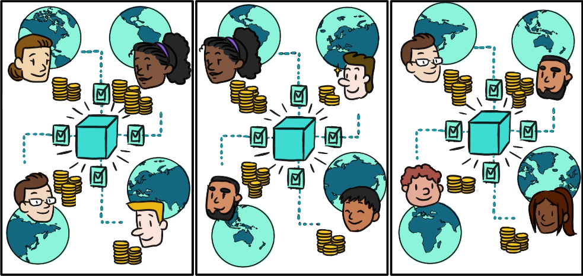
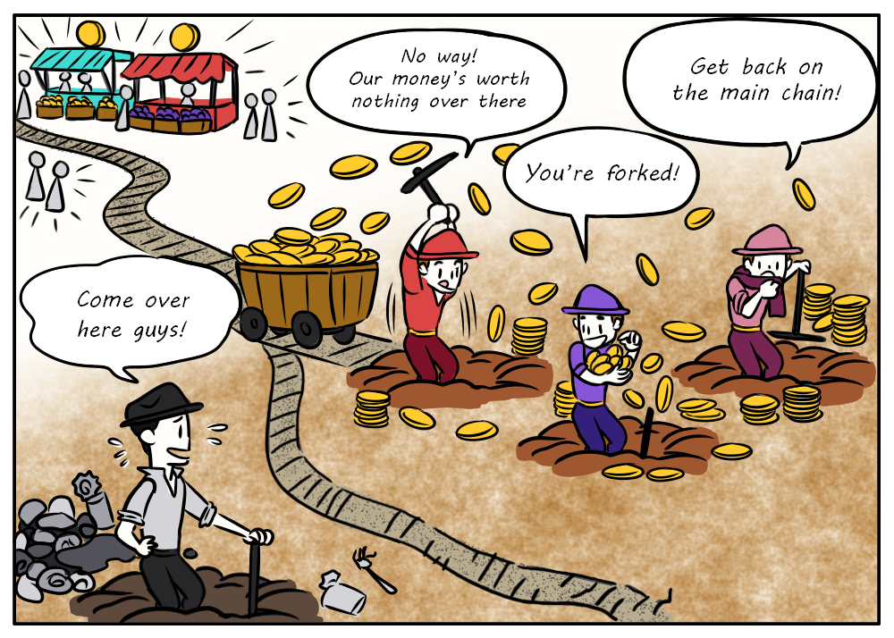

title: Why Algorand?

So far, we’ve discussed blockchain technology and the benefits it brings to applications that transfer value. But we made some assumptions about the type of blockchain we’re dealing with when we formed these definitions. In reality, not all blockchains are created equal, and not all of them can provide the same degree of benefit.  

_As a developer, it’s important to do your research and choose a blockchain that you can rely on for all the properties that a blockchain promises._ 

In this section we will outline some of the main categories to evaluate against when choosing a blockchain and we’ll explain how Algorand fares in each of these categories. We are confident that by the end, you’ll determine that the Algorand blockchain is the best place to build your application!

# Quick start videos

If you prefer videos, take a look at this 4 minute video where Algorand's CTO John Woods Introduces Algorand's Latest Developer Video Series and the Pure Proof of Stake Consensus. 

<iframe width="100%" style="aspect-ratio:16/9" src="https://www.youtube-nocookie.com/embed/DWC2Ocz7NEw" title="YouTube video player" frameborder="0" allow="accelerometer; autoplay; clipboard-write; encrypted-media; gyroscope; picture-in-picture; web-share" allowfullscreen></iframe>

# Our founding principles

Algorand was founded by Silvio Micali, a Turing award winner, co-inventor of zero-knowledge proofs, and a world-renowned leader in the field of cryptography and information security. He founded Algorand with a vision to democratize finance and deliver on the blockchain promise. 

# The consensus protocol

The problem with many blockchains is they sacrifice at least one of the key properties of **security**, **scalability**, and **decentralization**, known as the blockchain trilemma. Silvio and his team solved the blockchain trilemma by inventing a new **Pure Proof of Stake (PPoS)** consensus protocol, which is the protocol that the Algorand blockchain uses.

Algorand’s consensus protocol works by selecting a block proposer and a set of voting committees at each block round, to propose a block and validate the proposal, respectively. The proposer and committees are randomly chosen from the pool of all token holders (the accounts that hold algos), and the likelihood of being chosen is proportional to the account’s stake in the network (i.e. how many algos it has relative to the whole). There are a bunch of really cool cryptographic algorithms that go into this process, with fancy names like “verifiable random functions” and “cryptographic sortition” to ensure that the vote is fair, no one can collude, and that the overall system is highly secure. We won’t get into the details in this guide, but we highly recommend checking out some of these resources:

* [Silvio explains how Algorand consensus works at a meetup](https://www.youtube.com/watch?v=NykZ-ZSKkxM){: target="_blank" } in Milan (video, simple, longer but worth it).
* Silvio describes [Algorand’s core technology in a nutshell](https://medium.com/algorand/algorands-core-technology-in-a-nutshell-e2b824e03c77){: target="_blank"} (blog post, simple, worth it).
* A [simple, introductory video](https://www.youtube.com/watch?v=gACVKaNqxPs){: target="_blank" } on Algorand’s consensus protocol (video, simple, short)
* [Docs on Algorand consensus](../../get-details/algorand_consensus.md){: target="_blank" } (technical, medium-length, somewhere in between the simple video above and the full whitepaper)
* [The official Algorand whitepaper](https://algorandcom.cdn.prismic.io/algorandcom%2Fece77f38-75b3-44de-bc7f-805f0e53a8d9_theoretical.pdf){: target="_blank" } (very technical, detailed)

# Proof-of-stake versus proof-of-work

Most blockchains these days fall into the general categories of **proof-of-stake** or **proof-of-work**. 

Simply put, a **proof-of-stake** blockchain gives users who have more stake (who hold more of the underlying currency in the system) more influence in proposing and validating new blocks, usually through some sort of voting mechanism.

{: width='500px' }
<figcaption style="font-size:12px">Concept drawing of the voting procedure in proof-of-stake protocols.</figcaption>

In **proof-of-work**, nodes race to solve a challenging cryptographic puzzle and serve up their solution alongside a new block proposal (this is referred to as “mining” and these nodes are called “miners”). The winner is rewarded with some of the underlying currency of the system and their block becomes part of the chain. 

{: width='500px' }
<figcaption style="font-size:12px">Concept drawing of block miners in proof-of-work protocols.</figcaption>

Because proof-of-work requires solving a cryptographic puzzle before anyone else, compute power plays a significant part in the strategy to win. This has led to many debates around energy consumption and its effects on the climate. 

Most proof-of-stake protocols, including Algorand’s, do not require large amounts of energy to produce a block. 

# The native currency

Each blockchain has its own native currency that plays a critical role in incentivizing good network behavior. Algorand’s native currency is called the Algo. 

If you hold Algos, you can register to participate in consensus, which means that you will participate in the process of proposing and voting on new blocks. 

The Algo also acts as a utility token. When you’re building an application, you need algos to pay transaction fees and to serve as minimum balance deposits if you want to store data on the blockchain. The cost of these fees and minimum balances is very low, fractions of a penny in most cases.

# Fees
Fees are calculated based on the size of the transaction and a user can choose to augment a fee to help prioritize acceptance into a block when network traffic is high and blocks are consistently full. There is no concept of gas fees on Algorand. 

The minimum fee for a transaction is only 1,000 microAlgos or 0.001 Algos. 

# Openness
Earlier, we compared a blockchain ledger that is distributed, to a traditional ledger that is owned by a single entity. Technically, a blockchain ledger could be owned and operated by just a few entities, but this wouldn’t be a very good blockchain since such a centralized set of nodes could easily manipulate the state of the blockchain.

Algorand is completely open and permissionless. Anyone, anywhere in the world, who owns Algos can participate in consensus.

# Decentralization
Similarly, if all the people who are running nodes are the same company or set of companies then we find ourselves in a similar situation where we aren’t much better off than just having a central database controlled by a select few. 

On Algorand, since the protocol is open and permissionless, nodes can and do exist all over the world.

> See the [Algorand Metrics Dashboard](https://metrics.algorand.org/){: target="_blank" } for a view on node decentralization.

# Transparency

How do you know that anything that we are telling you here is true? You can check for yourself. All of the code for the core protocol is open source. Anyone can review it and contribute to it.

> [The Algorand source code](https://github.com/algorand/go-algorand){: target="_blank" }

# Forking (or lack of)
Forking is when a blockchain diverges into two separate paths. Sometimes this forking is intentional, like when a significant part of the community wants to change the fundamentals of the protocol. Other times this forking is accidental and occurs when two miners find a block at almost the same time. Eventually, one of the paths will be abandoned, which means that all transactions that occurred since that fork on the abandoned path (the orphaned chain) will be invalid. This has important implications for transaction finality, which we’ll talk about in a bit. 

Since Algorand is pure proof-of-stake and uses a voting mechanism to validate blocks, forking is impossible. In a worst case scenario, if the committee is taking longer to reach agreement, the blockchain will slow down or temporarily stall. 

# Performance
The speed at which blocks are produced, the amount of transactions that can fit into a block, and when those transactions are considered final are important factors to consider when choosing a blockchain. For Algorand, performance is and will always be a key focus area for the core development team.

## Throughput
You want to choose a blockchain that can scale and handle high throughput so that your users don’t experience long wait times when interacting with your application.

On Algorand, blocks are produced every 2.85 seconds and can hold up to 25,000 transactions, which results in a throughput of over 10,000 transactions per second (10,000 TPS). 

## Finality
In proof-of-work blockchains, since forking is a possibility, transactions can’t be considered final until a certain amount of time passes and the likelihood of the transaction being on an orphaned chain is practically zero. This means that the actual throughput of this type of blockchain is caveated by a delay in finality. Downstream processes in an application must take this into account to avoid compounding issues if a transaction ends up being invalid.

As we mentioned earlier, Algorand does not have forking so transactions are final as soon as they are confirmed in a block. A throughput of 10,000 TPS then actually means 10,000 _finalized_ transactions per second.

# Core features
Algorand makes it easy to tokenize, transfer, and program conditions on any instrument of value. Create fungible and nonfungible tokens with a single transaction (no smart contract code required). Or program sophisticated decentralized applications (dApps) with Algorand smart contracts.

# Developer tools
Developers can write smart contracts in Python and can use one of four SDKs (Python, JavaScript, Golang, Java) to connect to on-chain assets or applications.

# The team & ecosystem
The Algorand protocol is completely open source, so why can’t anyone just go create a copy and create another Algorand-like blockchain? Well they absolutely can, but then they’ll have to convince everyone why the new one is better. As we’ve seen, the technology is a critical component to a blockchain, but so is the ecosystem built around it. 

Algorand has some of the best researchers and developers in the world actively developing and improving Algorand’s core protocol. The Algorand Foundation invests heavily in strategy around governance and growth of the ecosystem to promote long-term value for all algo holders. This part is not easy to replicate.

# Governance
The Algorand Foundation, a non-profit organization that launched the Algorand MainNet, governs the Algorand network and is committed to continuing to decentralize it and put more decision-making into the hands of the Algorand community at large.

> Visit the [Algorand Foundation website](https://algorand.foundation/governance){: target="_blank" } for more information.

