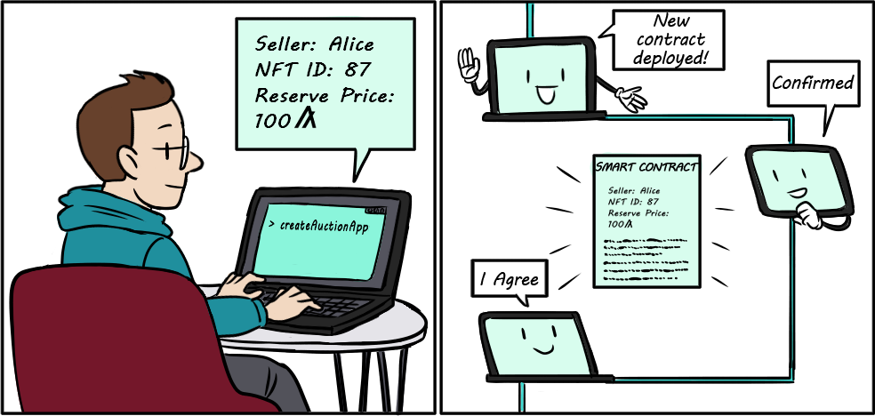
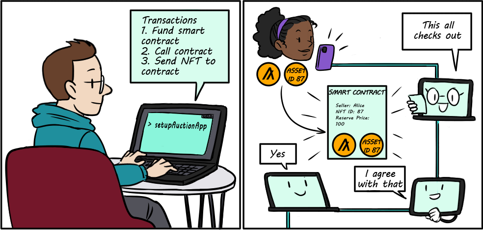
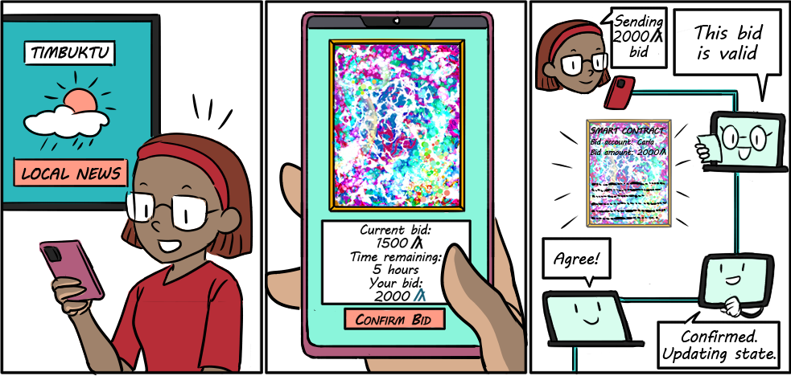
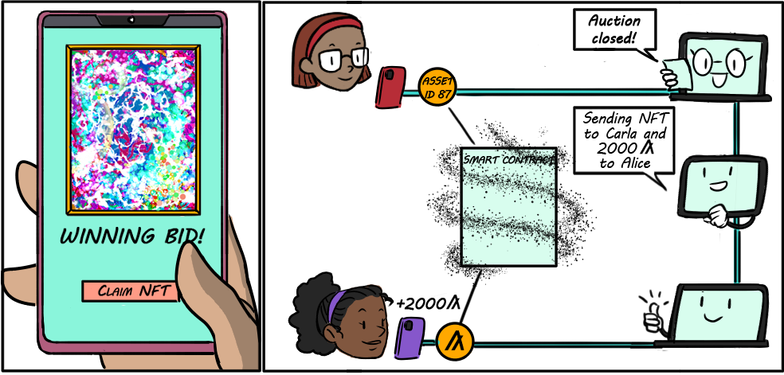

title: Build with Python

Alice and Bob have settled on their design and are ready to kick-off development of their Algorand-powered NFT auction dApp! This guide will take you through the steps to build the dApp, which includes setting up a development environment, writing the smart contract code, deploying it, and writing the functions to interact with it.

A few tips before getting started. The goal of this guide is to get you up and running with a working prototype that represents a real use case, as quickly as possible. We use a hands-on example to teach you basic design principles and best practices for building dApps with Python on Algorand. This guide does not cover all the details of the smart contract code. This is intentional so that you can focus on solidifying higher-level concepts that will be the foundation for building any dApp on Algorand. So don’t worry if you don’t understand what everything does in the smart contract. This is expected! After you feel comfortable with the basics, you can head over to the detailed PyTeal documentation and work on becoming an expert in the PyTeal smart contract language.

Let’s get started. 

# How this is organized

This guide is organized into two sections. The first section helps you launch the dApp and run a mock auction. The second section provides an overview of the different components of the auction application.

All of the code for this guide is [located here](https://github.com/algorand/auction-demo){: target="_blank"}. Clone the repo and follow along!

#Launching the application
Algorand provides a docker instance for running a node, which is the fastest way to set up your dApp’s connection point to the blockchain. Make sure you have docker installed, then run this code to launch a sandbox node with a private network, i.e. your own local blockchain that runs the Algorand protocol.

<center>
{: style="width:200px"}
<figcaption style="font-size:12px">Sandbox node to the rescue!</figcaption>
</center>

 
 
##Clone the auction demo application
The auction app requires Python 3.6 or higher. Clone the repository using the following commands.
 
```bash
git clone https://github.com/algorand/auction-demo
cd auction-demo
```

##Install Sandbox
 
This command will clone down the [sandbox](https://github.com/algorand/sandbox) repository to `./_sandbox` and start some docker containers. 

```bash
./sandbox up
```

[`Watch Video`](https://youtu.be/ku2hFalMWmA?t=23){target=_blank}   
[`More Information`](https://developer.algorand.org/articles/introducing-sandbox-20/){target=_blank} 

!!!note
    The above command will default to the `release` configuration. Other configurations that are compatible with this demo are `beta`, `nightly` and `dev`. This is because the app requires an unencrypted-default-wallet to sign transactions.

    If the sandbox fails to start please follow setup directions [here](https://github.com/algorand/sandbox#algorand-sandbox).


## Setup environment and run tests
Install the required dependencies for the project. We recommend using a Python virtual environment to do this. The following commands will activate the virtual environment and then install all dependencies, including PyTeal and the Algorand Python SDK. 

Setup Python environment (one time).

```bash
python3 -m venv venv
```

Activate `venv`.


=== "bash"
    ```bash
    . venv/bin/activate
    ```

=== "fish"
    ```bash 
    . venv/bin/activate.fish 
    ```

Now install all requirements.

```bash
pip3 install -r requirements.txt
```

Run the `example.py` file. This will run a simple 30-second auction.

```bash
python3 example.py 
```

```text
#output 
Alice is generating temporary accounts...
Alice is generating an example NFT...
The NFT ID is: 17
Alice is creating auction smart contract that lasts 30 seconds to auction off NFT...
Alice is setting up and funding NFT auction...
Alice's algo balance:  99998100  algos
The smart contract now holds the following: {0: 202000, 17: 1}
Carla wants to bid on NFT, her algo balance:  100000100  algos
Carla is placing bid for:  1000000  algos
Carla is opting into NFT with id: 17
Alice is closing out the auction....
The smart contract now holds the following: {0: 0}
Carla's NFT balance: 1  for NFT ID:  17
Alice's balances after auction:  {0: 101197100, 17: 0}  Algos
Carla's balances after auction:  {0: 98997100, 17: 1}  Algos
```

Optionally Run tests.

```bash
pytest
```

This will run through all the tests in the `operations_test.py` file and will take a little over six minutes to execute.

Congrats! You’re already up and running. 

Whenever you're finished testing, you can use the following command to shutdown sandbox.

```bash
./sandbox down
```

Now let’s dig into the code.

# Application overview
The auction demo application uses a smart contract to auction off a non-fungible token. The smart contract covers four basic methods that are used to achieve this functionality. 

The first method creates the smart contract and initializes the auction state on the blockchain, which includes the auction creator’s account, the specific NFT ID to auction, the NFT seller’s account, the start and end times of the auction, the reserve amount for the auction, and the minimum bid increment. 

<center>
{: style="width:500px" align=center }
<figcaption style="font-size:12px">Create the auction: Bob deploys the auction contract to MainNet.</figcaption>
</center>

The second method completes the auction set up by funding the smart contract with a small amount of algos (to fulfill minimum balance requirements and to pay transaction fees) and by moving the NFT into the smart contract.

<center>
{: style="width:500px" align=center }
<figcaption style="font-size:12px">Setup the auction: Alice sends Algos and her NFT to the contract.</figcaption>
</center>

The third method constructs the bid scenario. This involves the potential buyer sending the bid in algos to the smart contract. If the bid is successful, the contract will hold the algos. Bidding is only allowed between the beginning and end times of the auction. If the bid supplants a previous bid, the contract automatically refunds the previous higher bidder’s algos. 

<center>
{: style="width:500px" align=center }
<figcaption style="font-size:12px">Bid in the auction: Carla bids on Alice's NFT.</figcaption>
</center>

The fourth and final method of the contract allows the auction to be closed out, which will either award the NFT to the highest bidder and transfer the algos to the seller or return the NFT to the seller and close out any remaining algos to the seller.

<center>
{: style="width:500px" align=center }
<figcaption style="font-size:12px">Close out the auction: Carla receives the NFT and Alice gets paid 2000 Algos.</figcaption>
</center>

Smart contracts live on the blockchain and are remotely callable by a special transaction type called an application transaction. The simplest way to develop smart contracts is to use the PyTeal library with the Algorand Python SDK. Use PyTeal to write the smart contract logic that will be stored (the on-chain value transfer logic).  Use the SDK to deploy the smart contract and then to create the application transactions that will interact with the smart contract (the off-chain logic and smart contract triggers). 

The auction demo code separates the smart contract code and the SDK operations into two separate files. `contracts.py` contains all the logic for the smart contract and `operations.py` contains the SDK code to deploy the smart contract and communicate with it once deployed.  These two files represent the bulk of the entire application. 

Let’s first take a look at the smart contract code.

# The smart contract
The `contracts.py` file contains the smart contract code and is written with the PyTeal library. In this example, a new smart contract is deployed for each new auction. And as we described in the overview, every auction needs to support creating, setting up, placing a bid, and closing out an auction. In a bit, we’ll take you through where each of these scenarios is represented in the code.

Smart contracts on Algorand are actually composed of two separate “programs”. The first is the **approval program** and the second is the **clear program**. You’ll see that most of the code lives in the approval program, so we don’t worry too much about the clear program right now. We’ll cover it in detail in the smart contract details section. 

Let’s move on to the top-level routing code for the approval program of the smart contract. 

```python
    program = Cond(
        [Txn.application_id() == Int(0), on_create],
        [Txn.on_completion() == OnComplete.NoOp, on_call],
        [
            Txn.on_completion() == OnComplete.DeleteApplication,
            on_delete,
        ],
        [
            Or(
                Txn.on_completion() == OnComplete.OptIn,
                Txn.on_completion() == OnComplete.CloseOut,
                Txn.on_completion() == OnComplete.UpdateApplication,
            ),
            Reject(),
        ],
    )
```   

This code handles each type of application transaction that could be sent to the approval program. The `OnComplete` values distinguish these types. However, you may have noticed that the first line stands out from the rest. When a smart contract is first created, its application ID will always equal zero. The first line utilizes this fact to route to the auction creation logic, assigned to the `on_create` variable. 

Let’s visit the creation code next.

## Create auction

```python
    on_create_start_time = Btoi(Txn.application_args[2])
    on_create_end_time = Btoi(Txn.application_args[3])
    on_create = Seq(
        App.globalPut(seller_key, Txn.application_args[0]),
        App.globalPut(nft_id_key, Btoi(Txn.application_args[1])),
        App.globalPut(start_time_key, on_create_start_time),
        App.globalPut(end_time_key, on_create_end_time),
        App.globalPut(reserve_amount_key, Btoi(Txn.application_args[4])),
        App.globalPut(min_bid_increment_key, Btoi(Txn.application_args[5])),
        App.globalPut(lead_bid_account_key, Global.zero_address()),
        Assert(
            And(
                Global.latest_timestamp() < on_create_start_time,
                on_create_start_time < on_create_end_time
            )
        ),
        Approve(),
    )
```

This code takes all the parameters for the auction and stores them in the on-chain global state of the smart contract. It also verifies that the start and end times have not already passed. 

The next conditional in our main program routing code is for a `NoOp` call. The `NoOp` application transaction is just a generic smart contract call that can include arguments, like strings that may trigger further conditions. In this contract, we can supply a `NoOp` call with either the “setup” or “bid” argument, which will further route to the appropriate logic for each of those scenarios. This next layer routing is displayed within the `on_call` variable.

```Python
    on_call_method = Txn.application_args[0]
    on_call = Cond(
        [on_call_method == Bytes("setup"), on_setup],
        [on_call_method == Bytes("bid"), on_bid],
    )
```

## Setup the auction

Let’s follow the “setup” path to the `on_setup` code.

```Python
    on_setup = Seq(
        Assert(Global.latest_timestamp() < App.globalGet(start_time_key)),
        # opt into NFT asset -- because you can't opt in if you're already opted in, this is what
        # we'll use to make sure the contract has been set up
        InnerTxnBuilder.Begin(),
        InnerTxnBuilder.SetFields(
            {
                TxnField.type_enum: TxnType.AssetTransfer,
                TxnField.xfer_asset: App.globalGet(nft_id_key),
                TxnField.asset_receiver: Global.current_application_address(),
            }
        ),
        InnerTxnBuilder.Submit(),
        Approve(),
    )
```
This code verifies that the start time has not passed and uses a smart contract transaction to opt the smart contract into the NFT that will be auctioned. It is important to note that this transaction will be grouped with two other transactions - one payment transaction to fund the smart contract with a algos to cover minimum balance requirements and transaction fees, the application transaction that triggers the setup, and an asset transfer transaction that will move the NFT from the seller’s account to the smart contract.

## Bid in the auction
Back to the auction! Let’s now check out the `on_bid` scenario which will be evaluated if a user supplied “bid” with a `NoOp` application transaction. 

```Python
    on_bid_txn_index = Txn.group_index() - Int(1)
    on_bid_nft_holding = AssetHolding.balance(
        Global.current_application_address(), App.globalGet(nft_id_key)
    )
    on_bid = Seq(
        on_bid_nft_holding,
        Assert(
            And(
                # the auction has been set up
                on_bid_nft_holding.hasValue(),
                on_bid_nft_holding.value() > Int(0),
                # the auction has started
                App.globalGet(start_time_key) <= Global.latest_timestamp(),
                # the auction has not ended
                Global.latest_timestamp() < App.globalGet(end_time_key),
                # the actual bid payment is before the app call
                Gtxn[on_bid_txn_index].type_enum() == TxnType.Payment,
                Gtxn[on_bid_txn_index].sender() == Txn.sender(),
                Gtxn[on_bid_txn_index].receiver()
                == Global.current_application_address(),
                Gtxn[on_bid_txn_index].amount() >= Global.min_txn_fee(),
            )
        ),
        If(
            Gtxn[on_bid_txn_index].amount()
            >= App.globalGet(lead_bid_amount_key) + App.globalGet(min_bid_increment_key)
        ).Then(
            Seq(
                If(App.globalGet(lead_bid_account_key) != Global.zero_address()).Then(
                    repayPreviousLeadBidder(
                        App.globalGet(lead_bid_account_key),
                        App.globalGet(lead_bid_amount_key),
                    )
                ),
                App.globalPut(lead_bid_amount_key, Gtxn[on_bid_txn_index].amount()),
                App.globalPut(lead_bid_account_key, Gtxn[on_bid_txn_index].sender()),
                App.globalPut(num_bids_key, App.globalGet(num_bids_key) + Int(1)),
                Approve(),
            )
        ),
        Reject(),
    )
```

Here we check to see if the bid is higher than the current bid leader (stored in the contract state on-chain). If this is a new bidder and the corresponding new bid exceeds the prior one, then the smart contract issues a transaction to refund the previous highest bidder. This code also verifies that the auction is still active and that the bidder submitted a payment transaction (their bid) with the application transaction to the smart contract.

## Close out the auction
The auction is closed out by using a `DeleteApplication` application transaction. This type of transaction will try to delete the smart contract after evaluating the logic in the  `on_delete`variable.

```Python
    on_delete = Seq(
        If(Global.latest_timestamp() < App.globalGet(start_time_key)).Then(
            Seq(
                # the auction has not yet started, it's ok to delete
                Assert(
                    Or(
                        # sender must either be the seller or the auction creator
                        Txn.sender() == App.globalGet(seller_key),
                        Txn.sender() == Global.creator_address(),
                    )
                ),
                # if the auction contract account has opted into the nft, close it out
                closeNFTTo(App.globalGet(nft_id_key), App.globalGet(seller_key)),
                # if the auction contract still has funds, send them all to the seller
                closeAccountTo(App.globalGet(seller_key)),
                Approve(),
            )
        ),
        If(App.globalGet(end_time_key) <= Global.latest_timestamp()).Then(
            Seq(
                # the auction has ended, pay out assets
                If(App.globalGet(lead_bid_account_key) != Global.zero_address())
                .Then(
                    If(
                        App.globalGet(lead_bid_amount_key)
                        >= App.globalGet(reserve_amount_key)
                    )
                    .Then(
                        # the auction was successful: send lead bid account the nft
                        closeNFTTo(
                            App.globalGet(nft_id_key),
                            App.globalGet(lead_bid_account_key),
                        )
                    )
                    .Else(
                        Seq(
                            # the auction was not successful because the reserve was not met: return
                            # the nft to the seller and repay the lead bidder
                            closeNFTTo(
                                App.globalGet(nft_id_key), App.globalGet(seller_key)
                            ),
                            repayPreviousLeadBidder(
                                App.globalGet(lead_bid_account_key),
                                App.globalGet(lead_bid_amount_key),
                            ),
                        )
                    )
                )
                .Else(
                    # the auction was not successful because no bids were placed: return the nft to the seller
                    closeNFTTo(App.globalGet(nft_id_key), App.globalGet(seller_key))
                ),
                # send remaining funds to the seller
                closeAccountTo(App.globalGet(seller_key)),
                Approve(),
            )
        ),
        Reject(),
    )
```

This code is relatively long because it has to handle several possible close out scenarios. The first is the case where the auction is deleted before it even starts. In this case, the smart contract sends the NFT and all the algos back to the seller. In the case where the auction is completed and the reserve is met, the smart contract will send the NFT to the winning bidder and send all algos to the seller. If the reserve is not met, the smart contract will refund the highest bidder’s algos and send the NFT back to the seller. If the auction has no bids the NFT and algos are refunded to the seller. Any account can close out the auction.

Remember, it’s okay if you don’t understand every detail in this contract now. You can come back to it later once you get the basics down. The full source code for the auction contract is available [in the auction repository](https://github.com/algorand/auction-demo/blob/main/auction/contracts.py). 

# Deploy and communicate with the smart contract
We just learned how the smart contract program secures the critical value transfer scenarios that occur in the context of the auction (e.g. sending bids, closing it out). Now let’s learn how to deploy it to the blockchain and communicate with it. The `operations.py` file uses Algorand Python SDK to construct the appropriate transactions. It contains a method for each of the four scenarios that the auction application supports. The first scenario is to deploy and create the auction contract and is defined in the `createAuctionApp` function.

```Python
def createAuctionApp(
    client: AlgodClient,
    sender: Account,
    seller: str,
    nftID: int,
    startTime: int,
    endTime: int,
    reserve: int,
    minBidIncrement: int,
) -> int:
    """Create a new auction.

    Args:
        client: An algod client.
        sender: The account that will create the auction application.
        seller: The address of the seller that currently holds the NFT being
            auctioned.
        nftID: The ID of the NFT being auctioned.
        startTime: A UNIX timestamp representing the start time of the auction.
            This must be greater than the current UNIX timestamp.
        endTime: A UNIX timestamp representing the end time of the auction. This
            must be greater than startTime.
        reserve: The reserve amount of the auction. If the auction ends without
            a bid that is equal to or greater than this amount, the auction will
            fail, meaning the bid amount will be refunded to the lead bidder and
            the NFT will return to the seller.
        minBidIncrement: The minimum different required between a new bid and
            the current leading bid.

    Returns:
        The ID of the newly created auction app.
    """
    approval, clear = getContracts(client)

    globalSchema = transaction.StateSchema(num_uints=7, num_byte_slices=2)
    localSchema = transaction.StateSchema(num_uints=0, num_byte_slices=0)

    app_args = [
        encoding.decode_address(seller),
        nftID.to_bytes(8, "big"),
        startTime.to_bytes(8, "big"),
        endTime.to_bytes(8, "big"),
        reserve.to_bytes(8, "big"),
        minBidIncrement.to_bytes(8, "big"),
    ]

    txn = transaction.ApplicationCreateTxn(
        sender=sender.getAddress(),
        on_complete=transaction.OnComplete.NoOpOC,
        approval_program=approval,
        clear_program=clear,
        global_schema=globalSchema,
        local_schema=localSchema,
        app_args=app_args,
        sp=client.suggested_params(),
    )

    signedTxn = txn.sign(sender.getPrivateKey())

    client.send_transaction(signedTxn)

    response = waitForTransaction(client, signedTxn.get_txid())
    assert response.applicationIndex is not None and response.applicationIndex > 0
    return response.applicationIndex
```
This function is where the parameters for the auction (reserve price, NFT ID, etc.) are configured and the smart contract is deployed. It uses the `ApplicationCreateTxn`, which passes the compiled version of the smart contract to the blockchain. Once deployed the smart contract will be assigned a unique ID and a unique Algorand address.

Next is the `setupAuctionApp` function, which is used to fund the smart contract with a small amount of algos to support fees and the minimum balance requirement for an Algorand account, an application transaction telling the smart contract to set up the auction, and an asset transfer transaction of the NFT to the smart contract.

```Python
def setupAuctionApp(
    client: AlgodClient,
    appID: int,
    funder: Account,
    nftHolder: Account,
    nftID: int,
    nftAmount: int,
) -> None:
    """Finish setting up an auction.

    This operation funds the app auction escrow account, opts that account into
    the NFT, and sends the NFT to the escrow account, all in one atomic
    transaction group. The auction must not have started yet.

    The escrow account requires a total of 0.203 Algos for funding. See the code
    below for a breakdown of this amount.

    Args:
        client: An algod client.
        appID: The app ID of the auction.
        funder: The account providing the funding for the escrow account.
        nftHolder: The account holding the NFT.
        nftID: The NFT ID.
        nftAmount: The NFT amount being auctioned. Some NFTs has a total supply
            of 1, while others are fractional NFTs with a greater total supply,
            so use a value that makes sense for the NFT being auctioned.
    """
    appAddr = getAppAddress(appID)

    suggestedParams = client.suggested_params()

    fundingAmount = (
        # min account balance
        100_000
        # additional min balance to opt into NFT
        + 100_000
        # 3 * min txn fee
        + 3 * 1_000
    )

    fundAppTxn = transaction.PaymentTxn(
        sender=funder.getAddress(),
        receiver=appAddr,
        amt=fundingAmount,
        sp=suggestedParams,
    )

    setupTxn = transaction.ApplicationCallTxn(
        sender=funder.getAddress(),
        index=appID,
        on_complete=transaction.OnComplete.NoOpOC,
        app_args=[b"setup"],
        foreign_assets=[nftID],
        sp=suggestedParams,
    )

    fundNftTxn = transaction.AssetTransferTxn(
        sender=nftHolder.getAddress(),
        receiver=appAddr,
        index=nftID,
        amt=nftAmount,
        sp=suggestedParams,
    )

    transaction.assign_group_id([fundAppTxn, setupTxn, fundNftTxn])

    signedFundAppTxn = fundAppTxn.sign(funder.getPrivateKey())
    signedSetupTxn = setupTxn.sign(funder.getPrivateKey())
    signedFundNftTxn = fundNftTxn.sign(nftHolder.getPrivateKey())

    client.send_transactions([signedFundAppTxn, signedSetupTxn, signedFundNftTxn])

    waitForTransaction(client, signedFundAppTxn.get_txid())
```
 
These three transactions are grouped together and submitted to the blockchain. 

The `placeBid` function is used to place a bid on a specific NFT using the auction application. This function generates two transactions. A payment transaction from the bidder to the smart contract and an application transaction to the smart contract declaring the bid.

```Python
def placeBid(client: AlgodClient, appID: int, bidder: Account, bidAmount: int) -> None:
    """Place a bid on an active auction.

    Args:
        client: An Algod client.
        appID: The app ID of the auction.
        bidder: The account providing the bid.
        bidAmount: The amount of the bid.
    """
    appAddr = getAppAddress(appID)
    appGlobalState = getAppGlobalState(client, appID)

    nftID = appGlobalState[b"nft_id"]

    if any(appGlobalState[b"bid_account"]):
        # if "bid_account" is not the zero address
        prevBidLeader = encoding.encode_address(appGlobalState[b"bid_account"])
    else:
        prevBidLeader = None

    suggestedParams = client.suggested_params()

    payTxn = transaction.PaymentTxn(
        sender=bidder.getAddress(),
        receiver=appAddr,
        amt=bidAmount,
        sp=suggestedParams,
    )

    appCallTxn = transaction.ApplicationCallTxn(
        sender=bidder.getAddress(),
        index=appID,
        on_complete=transaction.OnComplete.NoOpOC,
        app_args=[b"bid"],
        foreign_assets=[nftID],
        # must include the previous lead bidder here to the app can refund that bidder's payment
        accounts=[prevBidLeader] if prevBidLeader is not None else [],
        sp=suggestedParams,
    )

    transaction.assign_group_id([payTxn, appCallTxn])

    signedPayTxn = payTxn.sign(bidder.getPrivateKey())
    signedAppCallTxn = appCallTxn.sign(bidder.getPrivateKey())

    client.send_transactions([signedPayTxn, signedAppCallTxn])

    waitForTransaction(client, appCallTxn.get_txid())
```

These two transactions are grouped together. Grouping transactions, also called atomic transfers, is a very powerful feature on Algorand. We won’t get into the details here, but check out the Atomic Transfer section later to learn more. 

The `closeAuction` function is used to close out the auction. This function can be called by any account. 

```Python
def closeAuction(client: AlgodClient, appID: int, closer: Account):
    """Close an auction.

    This action can only happen before an auction has begun, in which case it is
    cancelled, or after an auction has ended.

    If called after the auction has ended and the auction was successful, the
    NFT is transferred to the winning bidder and the auction proceeds are
    transferred to the seller. If the auction was not successful, the NFT and
    all funds are transferred to the seller.

    Args:
        client: An Algod client.
        appID: The app ID of the auction.
        closer: The account initiating the close transaction. This must be
            either the seller or auction creator if you wish to close the
            auction before it starts. Otherwise, this can be any account.
    """
    appGlobalState = getAppGlobalState(client, appID)

    nftID = appGlobalState[b"nft_id"]

    accounts: List[str] = [encoding.encode_address(appGlobalState[b"seller"])]

    if any(appGlobalState[b"bid_account"]):
        # if "bid_account" is not the zero address
        accounts.append(encoding.encode_address(appGlobalState[b"bid_account"]))

    deleteTxn = transaction.ApplicationDeleteTxn(
        sender=closer.getAddress(),
        index=appID,
        accounts=accounts,
        foreign_assets=[nftID],
        sp=client.suggested_params(),
    )
    signedDeleteTxn = deleteTxn.sign(closer.getPrivateKey())

    client.send_transaction(signedDeleteTxn)

    waitForTransaction(client, signedDeleteTxn.get_txid())
```

This method issues a delete application transaction using the `ApplicationDeleteTxn` function. 


The full source for `operations.py` is available in the [auction repository](https://github.com/algorand/auction-demo/blob/main/auction/operations.py){: target="_blank}.

Congratulations! You successfully completed the guide to launch Alice’s auction dApp on Algorand. Now that you know the fundamentals. You can jump further into the details of [smart contract development](../../get-details/dapps/smart-contracts/apps/index.md) and [PyTeal](../../get-details/dapps/pyteal/index.md) or you can first continue onto the [tokenization section](../tokenization/nft.md) where you’ll learn how to create NFTs, FTs, and security tokens. 
