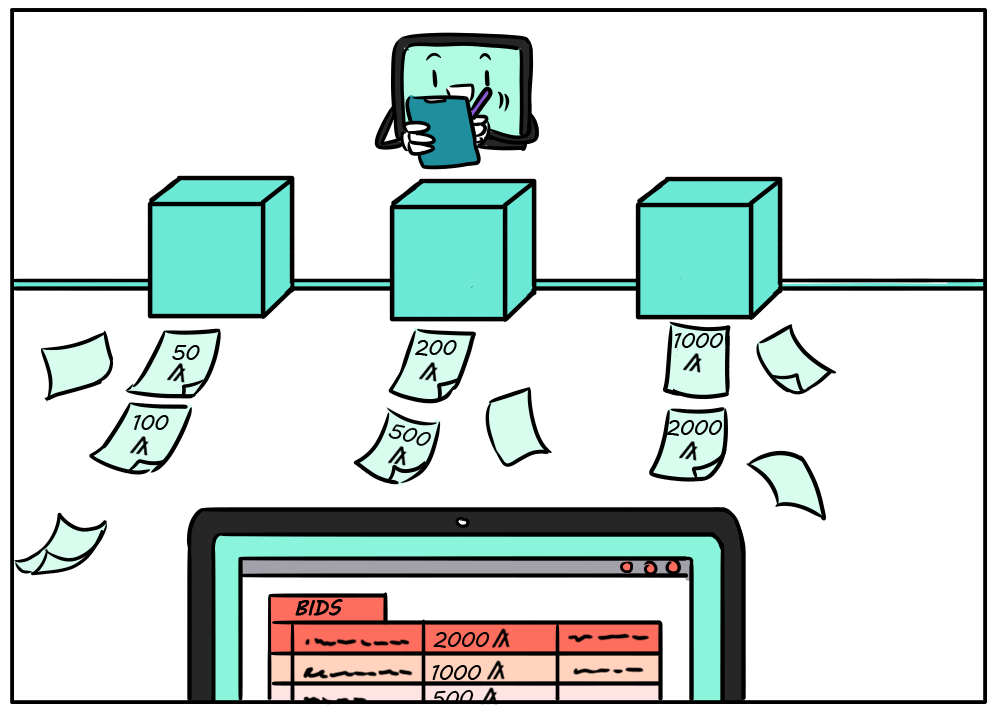

title: Search on-chain data

We started this journey learning about the open, permissionless Algorand blockchain and how it can improve the way we transact across borders, industries, and peoples. Now we have a publicly verifiable (and growing) database of transactions and code. How do we go about filtering and surfacing the data that matters most to our use case or application?

{: style="width:500px" align=center }
<figcaption style="font-size:12px">Finding and displaying bids from an auction</figcaption>

In this last section of our getting started guide, we’ll introduce a tool called the **indexer**. The indexer is a postgres database that organizes past block data into user-friendly tables, optimized for commonly needed queries. The indexer comes with its own API and SDK wrappers.

Let’s jump right in with a few examples. In the following code replits, we’ll learn how to 1) retrieve the balance of all accounts that hold a specific ASA, 2) search for an ASA by name, 3) search for an ASA by ID, and 4) find all transactions that involve sending a specific ASA above a specific amount and from a particular account.

* [JS - Run code](https://replit.com/@Algorand/ASAIndexerJS#index.js){: target="_blank"}

We hope these examples give you a little taste of what is possible with the indexer. If you want to learn more, check out some of the detailed resources below.

# More indexer resources

* [Detailed guide on how to use the indexer](../../get-details/indexer.md)
* [Install the indexer](../../run-a-node/setup/indexer.md)

This concludes our getting started content. If you are looking to dive deeper on some of the features that were introduced, head on over to the “Get details” section of the docs. You will also discover some other layer-1 features that we did not cover here, like multisignature accounts, atomic transfers, and rekeying.

Happy coding!
