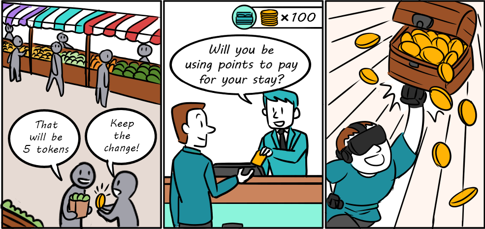

title: Create a fungible token

# What are fungible tokens?
Fungible tokens, or FTs for short, are a type of asset split into multiple units that are fundamentally the same and interchangeable one-to-one with each other. Algos are fungible, but since they are also a utility token for the Algorand network, they are implemented differently from the types of fungible tokens we’ll talk about in this guide.

{: style="width:500px" align=center }
<figcaption style="font-size:12px">Examples of fungible token use cases: local currencies, travel program loyalty points, in-game tokens.</figcaption>

Loyalty programs that offer reward points that can be traded in for merchandise or services are considered fungible. Fiat currencies are fungible and can be represented on the blockchain as stablecoins (a token that maintains a steady value usually by having backed reserves or through some stabilization algorithms) or by direct issuance on the blockchain (central bank digital currencies). Tokenized shares in real estate, a company, or a fund are usually fungible too.

Tokenizing a fungible asset is an onramp to all the benefits of a blockchain ecosystem that we learned about in the first section of this getting started guide (security, trust, immutability, efficiency, low costs, composability).

# How to create fungible tokens
Fungible tokens, like NFTs, are implemented as Algorand Standard Assets (ASAs). Also like NFTs, you do not need to write smart contract code. You just need to specify a few parameters to identify it as an FT (e.g. total count is greater than 1) and attach metadata so that potential owners have the information they need to validate the integrity of the asset. See Algorand Request for Comments for standards used by the Algorand community to properly format properties of an FT.

This asset creation transaction can be created using any of [Algorands SDKs](../../sdks/index.md). Code demonstrating creating an Asset is available in the [ASA documentation](../../get-details/asa.md#creating-an-asset).

# Other fungible token resources 

- Detailed documentation on [Algorand Standard Assets (ASAs)](../../../get-details/asa/){: target="blank"} and related [transaction types](../../../get-details/transactions/#asset-configuration-transaction){: target="blank"}.

