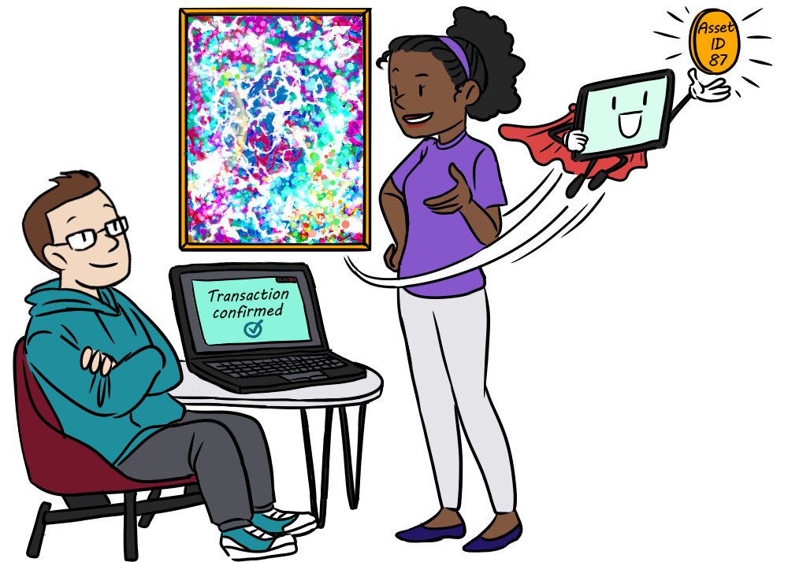

title: Create an NFT

# What are NFTs?

Non-fungible tokens, or NFTs for short, are unique assets represented on the blockchain. Digital art and collectibles are types of NFTs that you may have heard about, but they only scratch the surface of what is possible. 

{: style="width:500px" align=center }
<figcaption style="font-size:12px">Examples of NFT use cases: Tokenizing the rights to a song to facilitate royalty payments, in-game collectibles, or special edition brand merchandise.</figcaption>

If Alice wants to use blockchain to help her scale and grow her art business, because it provides important properties that she cannot achieve otherwise (trust, transparency, efficiency, low costs). The first step for her is to represent her unique art pieces on-chain as NFTs. Let's go ahead and learn how to create an NFT on Algorand.

# How to create NFTs
NFTs are created using Algorand Standard Assets (ASAs), which are built into the protocol and created using a special type of transaction. This is distinct from some other blockchains where a smart contract is necessary to represent assets. You just need to specify a few parameters to identify it as an NFT and link to the metadata so that potential owners have the information they need to validate the integrity of the asset. For instance, you need to set the total amount of units you want to create for this asset to 1 and set the number of decimals to 0. This ensures you create precisely one unit of your ASA and can't divide the newly minted asset. See [Algorand Request for Comments](https://arc.algorand.foundation/) for standards used by the Algorand community to properly format properties of an NFT.

This asset creation transaction can be created using any of [Algorands SDKs](../../sdks/index.md). Code demonstrating creating an Asset is available in the [ASA documentation](../../get-details/asa.md#creating-an-asset).

{: style="width:500px"}
<figcaption style="font-size:12px">Alice tokenizes her art piece as an NFT on Algorand.</figcaption>

**Composability**

ASAs can be composed with other features on Algorand (like smart contracts) and with applications built on top of Algorand. What makes this possible is the combination of the standard representation of an NFT on the Algorand blockchain, both as an ASA and specifically as a unique ASA, and the openness and permissionless nature of the Algorand blockchain. 

# Fractional NFTS

A fractional NFT is a unique asset that has been divided into multiple, equal shares. When NFTs are selling for millions of dollars, this may be one way to lower the bar for entry and reach more potential buyers who would not have been able to invest in the whole NFT. The other side of the coin (pun intended) is that by increasing your pool of potential buyers, you may see the value of your NFT increase. Need a compelling example? In September 2021, the owner of a meme Doge NFT who paid 4 million dollars for it, fractionalized it and then auctioned off a portion of those fractional shares at a price that revalued their asset at 225 million USD[^1].

[^1]: [https://www.theblockcrypto.com/linked/116464/fractionalized-doge-nft-valued-at-225-million-after-sushiswap-auction](https://www.theblockcrypto.com/linked/116464/fractionalized-doge-nft-valued-at-225-million-after-sushiswap-auction){: target="_blank"}

Maybe Alice should think about fractionalizing her artwork for her next auction!
 
To create a fractional NFT, the total units must be a power of 10, greater than 1, and the number of decimals must be equal to the logarithm in base 10 of the total number of units. The fractional NFT standard is defined as part of [ARC-0003](https://github.com/algorandfoundation/ARCs/blob/main/ARCs/arc-0003.md){: target="_blank"}. 
# More NFT Resources

- Learn more about NFTs from Algorand's Chief Product Officer: [The Enduring Value of NFTs on Algorand: A Critical Role in the Future of Finance](https://www.algorand.com/resources/blog/the-enduring-value-of-nfts-on-algorand){: target="blank"}
- Detailed documentation on [Algorand Standard Assets (ASAs)](../../../get-details/asa/){: target="blank"} and related [transaction types](../../../get-details/transactions/#asset-configuration-transaction){: target="blank"}.
