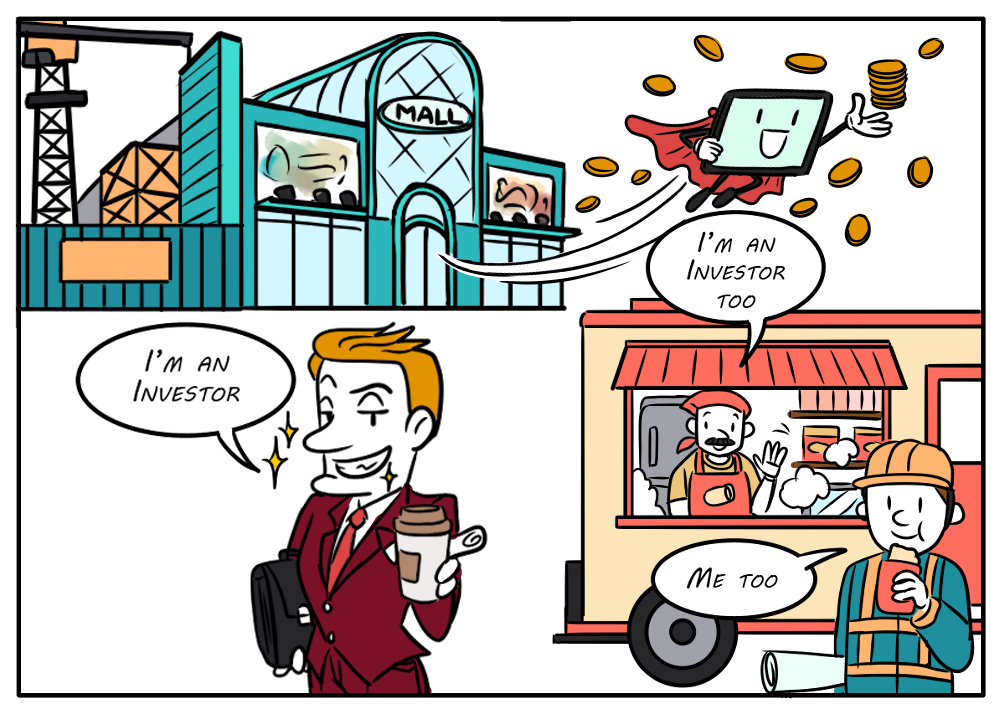

title: Create a security token

!!! warning "Important"
    This guide is meant to demonstrate what is _technically_ possible on Algorand. It should **_not_** be used to determine if something is considered a security. Many of these features are applicable outside of regulatory use cases.

# What are security tokens?

Security tokens, or restricted assets, are assets that require certain centralized control mechanisms. For example, if the asset you’re issuing is a U.S. security, you may need ways to comply with Know-Your-Customer (KYC) and Anti-Money Laundering (AML) regulations and this may take the form of having the ability to freeze or clawback those tokens in the case of fraud. 

Having centralized control mechanisms on an asset may sound contradictory to everything we have talked about so far. Why use a decentralized blockchain if you want to exert some type of centralized control over an asset? To answer that question, revisit the [blockchain basics section](../../basics/what_is_blockchain/#how-will-blockchain-benefit-my-application) and remember that there are many properties (like **low costs**, **efficiency**, and **composability**) that offer significant improvements for some legacy systems.

<center>
{: style="width:500px" align=center }
<figcaption style="font-size:12px">Tokenization can lower the bar for entry and bring new investment opportunities to more people.</figcaption>
</center>

So how can we solve for this use case without encroaching on the promise of decentralization for the rest of the ecosystem? Algorand does this by offering several _optional-to-use_ configuration settings on Algorand Standard Assets (ASAs). Specifically, when you create an ASA, you can specify a manager, reserve, freeze, and clawback address, OR you can leave any or all of them blank, which the protocol will interpret as immutable from that point forward.  Embedding this configuration option within the broader decentralized and transparent Algorand ecosystem, offers users a choice to stick with assets that have no central control mechanisms, or to trust a specific issuer knowing exactly the type of control they have over the asset.

# How to create security tokens
Creating security tokens is the same as creating NFTs or FTs, with the extra configuration settings specified. 

=== "Python"
    ```python
    txn = AssetConfigTxn(sender=account['pk'],
                        sp=params,
                        total=10000,                // Security tokens are typically fungible
                        default_frozen=False,
                        unit_name="RESTRICT",
                        asset_name="restricted@arc3",
                        manager=account['pk'],      // Address able to change mutable asset data
                        reserve=account['pk'],      // Address where non-minted assets will reside
                        freeze=account['pk'],       // Address able un/freeze the asset
                        clawback=account['pk'],     // Address able to remove asset from account
                        url="https://path/to/my/fractional/asset/metadata.json",
                        metadata_hash=json_metadata_hash,
                        decimals=2)                 // Security tokens typically have some precision
    ```

=== "JavaScript"
    ```javascript   
    const creator = alice.addr;
    const defaultFrozen = false;
    const unitName = "RESTRICT";
    const assetName = "restricted@arc3";
    const url = "https://path/to/my/fractional/asset/metadata.json";   
    const total = 10000; // Security tokens are typically fungible
    const decimals = 2;  // Security tokens typically have some precision     
    const managerAddr = account.addr;  // Address able to change mutable asset data
    const reserveAddr = account.addr;  // Address where non-minted assets will reside
    const freezeAddr = account.addr;   // Address able un/freeze the asset 
    const clawbackAddr = account.addr; // Address able to remove asset from account
    const txn = algosdk.makeAssetCreateTxnWithSuggestedParamsFromObject({
        creator,
        total,
        decimals,
        assetName,
        unitName,
        assetURL: url,
        assetMetadataHash: metadata,
        defaultFrozen,
        freeze: freezeAddr,
        manager: managerAddr,
        clawback: clawbackAddr,
        reserve: reserveAddr,
        suggestedParams: params,
    });
    ```

=== "Java"
    ```java
        String creator = aliceAccount.getAddress().toString();
        boolean defaultFrozen = false;
        String unitName = "RESTRICT";
        String assetName = "restricted@arc3";
        String url = "https://path/to/my/fractional/asset/metadata.json";
        BigInteger assetTotal = BigInteger.valueOf(10000); // Security tokens are typically fungible
        Integer decimals = 2;                              // Security tokens typically have some precision
        Address manager = account.getAddress();            // Address able to change mutable asset data
        Address reserve = account.getAddress();            // Address where non-minted assets will reside
        Address freeze = account.getAddress();             // Address able un/freeze the asset
        Address clawback = account.getAddress();           // Address able to remove asset from account
        Transaction tx = Transaction.AssetCreateTransactionBuilder()
                .sender(alice.getAddress().toString())
                .assetTotal(assetTotal)
                .assetDecimals(decimals)
                .assetUnitName(unitName)
                .assetName(assetName)
                .url(url)
                .metadataHash(assetMetadataHash)
                .manager(manager)
                .reserve(reserve)
                .freeze(freeze)
                .defaultFrozen(defaultFrozen)
                .clawback(clawback)
                .suggestedParams(params).build();
    ```

=== "Go"
    ```go
    creator := account.Address.String()
	  assetName := "restricted@arc3"
	  unitName := "RESTRICT"
	  assetURL := "https://path/to/my/fractional/asset/metadata.json"
	  assetMetadataHash := metadataHash
	  totalIssuance := uint64(10000)       // Security tokens are typically fungible
	  decimals := uint32(2)                // Security tokens typically have some precision
	  manager := account.Address.String()  // Address able to change mutable asset data
	  reserve := account.Address.String()  // Address where non-minted assets will reside
	  freeze := account.Address.String()   // Address able un/freeze the asset
	  clawback := account.Address.String() // Address able to remove asset from account
	  defaultFrozen := false
	  note := []byte(nil)

      txn, err := transaction.MakeAssetCreateTxn(
		creator, note, txParams, totalIssuance, decimals,
		defaultFrozen, manager, reserve, freeze, clawback,
		unitName, assetName, assetURL, assetMetadataHash)
    ```

To give some additional background information, here's a short explanation of each of the properties:

- Manager address: The manager account is the only account that can authorize transactions to [re-configure](https://developer.algorand.org/docs/get-details/asa/#modifying-an-asset) or [destroy](https://developer.algorand.org/docs/get-details/asa/#destroying-an-asset) an asset.
- Reserve address: Specifying a reserve account signifies that non-minted assets will reside in that account instead of the default creator account. Assets transferred from this account are "minted" units of the asset. If you specify a new reserve address, you must make sure the new account has opted into the asset and then issue a transaction to transfer all assets to the new reserve.
- Freeze address: The freeze account is allowed to freeze or unfreeze the asset holdings for a specific account. When an account is frozen it cannot send or receive the frozen asset.
- Clawback address: The clawback address represents an account that is allowed to transfer assets from and to any asset holder (assuming they have opted-in). Use this if you need the option to revoke assets from an account (like if they breach certain contractual obligations tied to holding the asset).

You can find more information about immutable and mutable asset parameters in the [asset docs](https://developer.algorand.org/docs/get-details/asa/#asset-parameters).

Run the accompanying code in your favorite SDK to see an example of using the freeze and clawback capabilities.

=== "Python"
    [Run code](https://replit.com/@Algorand/CreateSecurityTokenPython#main.py){: target="_blank"}

=== "JavaScript"
    [Run code](https://replit.com/@Algorand/ASASecurityTokensJS#main.js){: target="_blank"}

=== "Java"
    [Run code](https://replit.com/@Algorand/ASASecurityTokensJava#Main.java){: target="_blank"}

=== "Go"
    [Run code](https://replit.com/@Algorand/createSecurityTokenGo#main.go){: target="_blank"}


