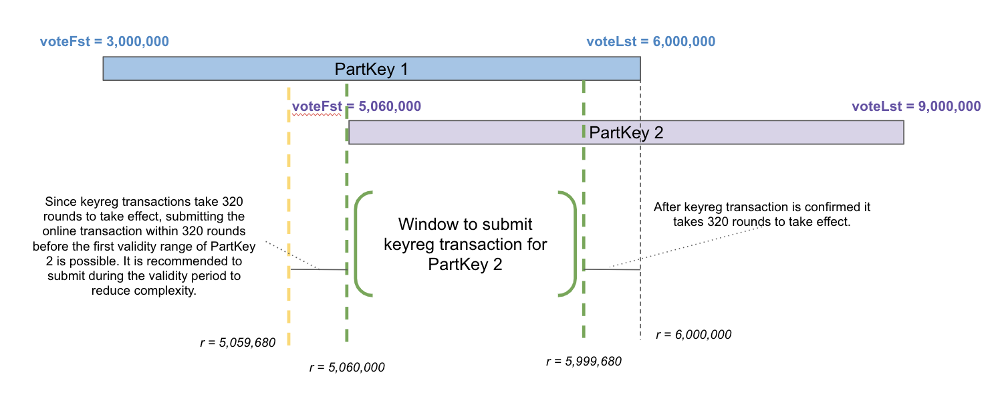

title: Renew participation keys

The process of renewing a participation key is simply creating a new participation key and registering it online before the previous key expires.

You can renew a participation key anytime before it expires, and we recommend to do it at least two weeks (about 268,800 rounds) in advance so as not to risk [having an account marked as online that is not participating](./index.md#ensure-that-online-accounts-are-participating).

The validity ranges of participation keys can overlap. For any account, at any time, at most one participation key is registered, namely the one included in the latest online key registration transaction for this account. 


# Step-by-Step
1. [Create a new participation key](./generate_keys.md) with a first voting round that is less than the last voting round of the current participation key. It should leave enough time to carry out this whole process (e.g. 40,000 rounds).
2. Once the network reaches the first voting round for the new key, [submit an online key registration transaction for the new participation key](./online.md).
3. Wait at least 320 rounds to [validate that the node is participating](./online.md#check-that-the-node-is-participating).
4. Once participation is confirmed, it is safe to [delete the old participation key](#removing-old-keys).

<center>  </center>
<center>*Example key rotation window* </center>

!!! info
	`goal` supplies single commands to renew all participation keys on a node ([`goal account renewallpartkeys`](../../../clis/goal/account/renewallpartkeys)) or renew the participation key for a specific account ([`goal account renewpartkey`](../../../clis/goal/account/renewpartkey)). It is recommended that you only use these for testing purposes or for very low-stake accounts, since both of them require your private keys to be online.

# Removing Old Keys

When a participation key is no longer in use, you can remove it by running the following goal command with the participation ID of the key you want to remove.

```bash
$ goal account deletepartkey --partkeyid IWBP2447JQIT54XWOZ7XKWOBVITS2AEIBOEZXDACX5Q6DZ4Z7VHA
```
Make sure to identify the correct key (i.e. make sure it is _not_ the currently registered key) before deleting.
